## Docker部署
Docker相关的环境配置可以在Windows下载最新版的Docker Desktop，是可以符合要求的
其他不需要配置什么
https://inlong.apache.org/zh-CN/download/
在此页面中下载InLong Binary File -> \[BIN] 
然后需要在两处进行修改：
1.docker > docker-compose > docker-compose.yml
修改mysql配置中的本机端口3306->3307
因为本地安装了mysql了，把3306给占了，这里不改会冲突
2.conf > inlong.conf
如果进入页面后报http error，可以修改此处的local_ip为本机ip
本机ip查看方式
打开控制台 -> 输入命令ipconfig ->  查看无线局域网适配器WLAN下的IPv4地址
## 简单测试
修改完代码后编译当前文件（太多文件的话把这个模块整个打包吧）
在lib文件下找到对应的jar包，到里面去把对应的class文件替换了
再把docker里面的也给更新一下
```
docker cp "D:\apache-inlong-2.3.0\lib\manager-service-2.3.0.jar" manager:/opt/inlong-manager/lib/manager-service-2.3.0.jar
```
然后重启对应容器再打开就可以进行前后端联调测试了
## 提交PR
1.Fork
2.Git配置
```
// 将代码克隆到本地
git clone https://github.com/<your_github_name>/inlong.git

// 将apache/inlong添加为本地仓库的远程分支upstream
cd  inlong
git remote add upstream https://github.com/apache/inlong.git

// 检查远程仓库设置
git remote -v
origin    https://github.com/<your_github_name>/inlong.git (fetch)
origin    https://github.com/<your_github_name>/inlong.git(push)
upstream  https://github.com/apache/inlong.git (fetch)
upstream  https://github.com/apache/inlong.git (push)
```
3.提交代码
```
// 获取upstream仓库代码，并更新本地master分支代码为最新
git fetch upstream  
git pull upstream master

// 新建分支
git checkout -b INLONG-XYZ
// 如果处理的是自己新创的issue XYZ就填这个issue的编号就行 
// 其他就看看最新的编号是什么递增一下

// 修改完代码并格式化
mvn spotless:check
mvn spotless:apply

// 提交代码到远程分支
git commit -a -m "[INLONG-XYZ][Component] commit msg"
git push origin INLONG-XYZ
// Component使用InLong组件名称进行替换，比如Manager、Sort、DataProxy...
```
接着到自己fork的那个仓库，找到最新提交的分支，点击最右边的... -> new pull request
过程中的issue和pr的创建都按模版填对应的内容就好了
## Issues And Prs
### Issue \#12100 -> Pr \#12101
**Issue Description**
Fix incorrect spelling: "seperated" → "separated" in multiple files. 
Example:
- File: OceanBaseBinlogSource.java (Line 66)
  Wrong: "List of DBs to be collected, seperated by ',', supporting regular expressions"
  Correct: "List of DBs to be collected, separated by ',', supporting regular expressions"
**Component**
Many
**Work**
Fix incorrect spelling: "seperated" → "separated" in multiple files
**PR Status**
Pull request successfully merged and closed
### Issue \#12102 -> Pr \#12103
**Issue Description**
Bug Fix
- Incorrect logic : It used isNotBlank which caused the program to error out when the input was actually valid.
- The fix : Changed isNotBlank to isBlank.
```java
// Before
if (StringUtils.isNotBlank(input)) {
    System.err.println("input cannot be empty, for example: inlongGroupId:test_group");
    return;
}
// After
if (StringUtils.isBlank(input)) {
    System.err.println("input cannot be empty, for example: inlongGroupId:test_group");
    return;
}
```
**Component**
Manager
**Work**
Change the method "isNotBlank" -> "isBlank"
**PR Status**
Open
### Issue \#12104 -> Pr \#12105
**Issue Description**
When deleting the data flow group, the related data in the tables schedule_config and inlong_stream did not perform the logical deletion correctly.
Create a data flow group
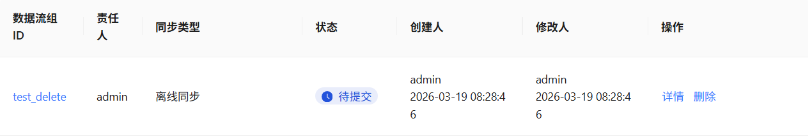
Relevant data
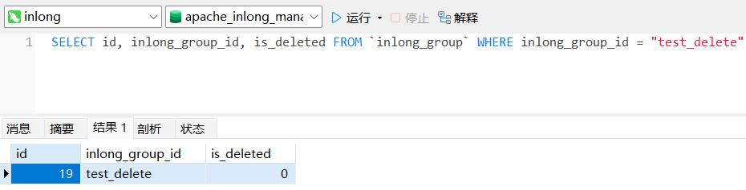
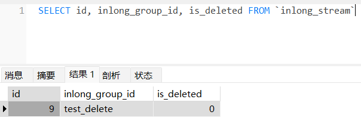
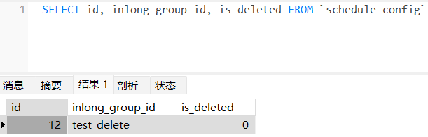
Delete this data flow group
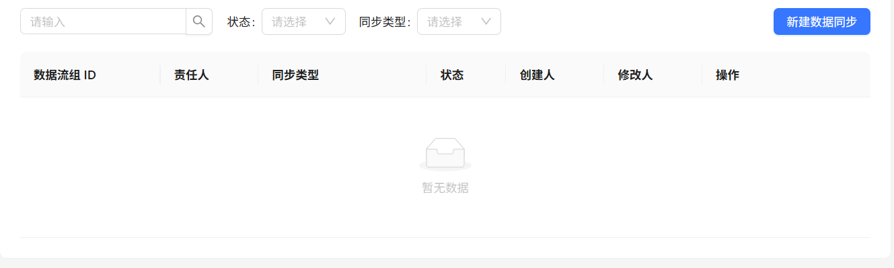
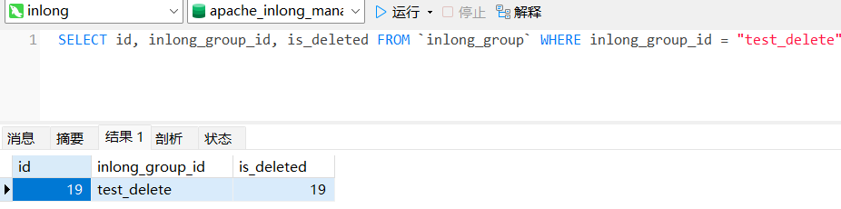
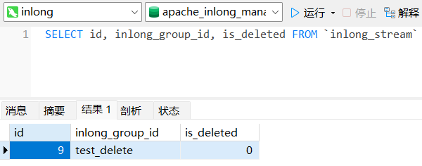
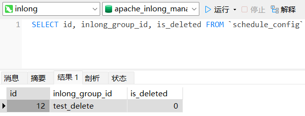
It can be seen that the relevant data under the "schedule_config" and "inlong_stream" tables have not correctly performed logical deletion, because the "is_deleted" field of the relevant data was not updated.
This issue will cause problems when creating a data flow group with the same name again after deleting an existing data flow group.This is also the situation in which I discovered this problem.

I think the main problem lies in InlongGroupServiceImpl.delete(...).
The deletion process is roughly as follows:
InlongGroupController.delete(...)
->InlongGroupProcessService.deleteProcess(...)
->InlongGroupProcessService.invokeDeleteProcess(...)
->workflowService.start(ProcessName.DELETE_GROUP_PROCESS, ...);
This workflow will create and invoke UpdateGroupListener and updateGroupCompleteListener (The UpdateGroupFailedListener will only be invoked when the pre-deletion operation fails).
In the UpdateGroupListener, the status of the group was updated.
```java
case DELETE:  
    groupService.updateStatus(groupId, GroupStatus.CONFIG_DELETING.getCode(), operator);
```
After the pre-deletion operation is completed, the updateGroupCompleteListener deletes the relevant information and updates the status.
```java
case DELETE:  
    // delete process completed, then delete the group info  
    groupService.delete(groupId, operator);
```
There are certain issues with the groupService.delete(...) .
```java
if (GroupStatus.allowedDeleteSubInfos(GroupStatus.forCode(entity.getStatus()))) {  
    streamService.logicDeleteAll(groupId, operator);  
}

public static boolean allowedDeleteSubInfos(GroupStatus status) {  
    return status == GroupStatus.TO_BE_SUBMIT  
            || status == GroupStatus.APPROVE_REJECTED  
            || status == GroupStatus.CONFIG_DELETED;  
}
```
At this point, the status of the group is CONFIG_DELETING, which is not within the permitted states. Therefore, the streamService.logicDeleteAll(...) method will not be executed.

Then the status of InlongGroupEntity was updated.
```java
entity.setIsDeleted(entity.getId());  
entity.setStatus(GroupStatus.CONFIG_DELETED.getCode());  
entity.setModifier(operator);  
int rowCount = groupMapper.updateByIdentifierSelective(entity);  
if (rowCount != InlongConstants.AFFECTED_ONE_ROW) {  
    LOGGER.error("inlong group has already updated for groupId={} curVersion={}", groupId, entity.getVersion());  
    throw new BusinessException(ErrorCodeEnum.CONFIG_EXPIRED);  
}
```
However, this update operation should be carried out after the completion of the latter two deletion operations.
```java
// logically delete the associated extension info  
groupExtMapper.logicDeleteAllByGroupId(groupId);  
  
// remove schedule  
if (DATASYNC_OFFLINE_MODE.equals(entity.getInlongGroupMode())) {  
    try {  
        scheduleOperator.deleteByGroupIdOpt(entity.getInlongGroupId(), operator);  
    } catch (Exception e) {  
        LOGGER.warn("failed to delete schedule info for groupId={}, error msg: {}", groupId, e.getMessage());  
    }  
}
```
Because the corresponding SQL for groupExtMapper.logicDeleteAllByGroupId(...) is as follows
```sql
<update id="logicDeleteAllByGroupId">  
    update inlong_group_ext  
    set is_deleted = id    where inlong_group_id = #{groupId, jdbcType=VARCHAR}      
    and is_deleted = 0
</update>
```
scheduleOperator.deleteByGroupIdOpt(...) will eventually call ScheduleServiceImpl.deleteByGroupId(...). The SQL statement used to query the relevant scheduleEntity is as follows:
```sql
<select id="selectByGroupId" parameterType="java.lang.String" resultMap="BaseResultMap">  
    select  
    <include refid="Base_Column_List"/>  
    from schedule_config  
    where inlong_group_id = #{inlongGroupId,jdbcType=VARCHAR}    
    and is_deleted = 0
</select>
```
Both of the above SQL statements require that is_deleted = 0, but this value has already been updated earlier.
**Component**
Manager
**Work**
1. Change the status of the group to "GroupStatus.CONFIG_DELETED" in advance
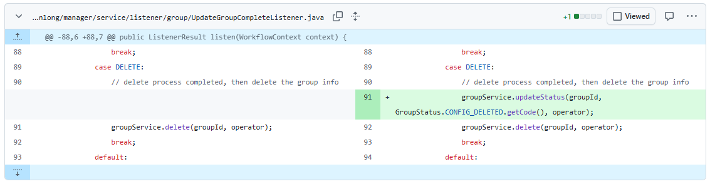
2. Move the update operation of the data stream group after the last two deletion operations
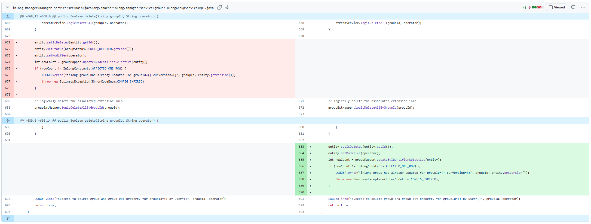
3. Test
Create a data flow group
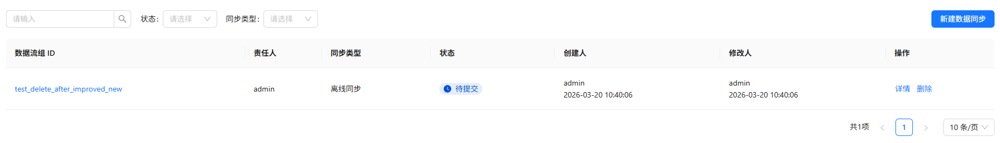
Relevant data
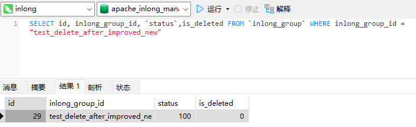
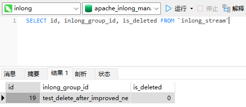
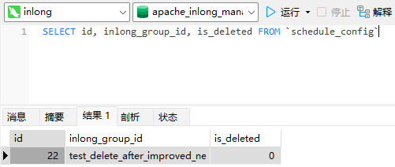
After deletion
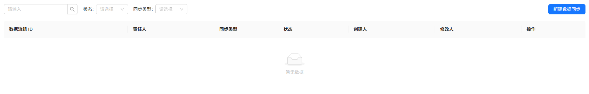
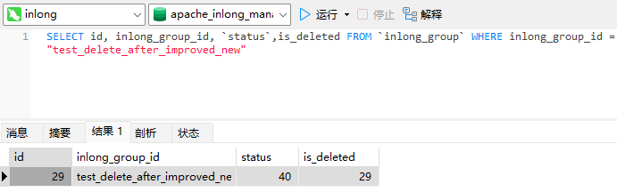
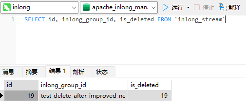
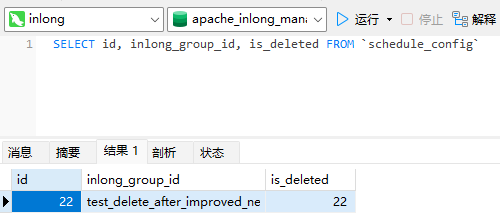
The "is_deleted" field of the relevant data can be correctly modified.
**PR Status**
Open
### Issue \#xxxxx -> Pr \#xxxxx
**Issue Description**
**Component**
**Work**
**PR Status**
## 学习