## Docker部署
Docker相关的环境配置可以在Windows下载最新版的Docker Desktop，是可以符合要求的
其他不需要配置什么
https://inlong.apache.org/zh-CN/download/
在此页面中下载InLong Binary File -> \[BIN] 
然后需要在两处进行修改：
1.docker > docker-compose > docker-compose.yml
修改mysql配置中的本机端口3306->3307
因为本地安装了mysql了，把3306给占了，这里不改会冲突
2.conf > inlong.conf
如果进入页面后报http error，可以修改此处的local_ip为本机ip
本机ip查看方式
打开控制台 -> 输入命令ipconfig ->  查看无线局域网适配器WLAN下的IPv4地址
## 简单测试
修改完代码后编译当前文件（太多文件的话把这个模块整个打包吧）
在lib文件下找到对应的jar包，到里面去把对应的class文件替换了
再把docker里面的也给更新一下
```
docker cp "D:\apache-inlong-2.3.0\lib\manager-service-2.3.0.jar" manager:/opt/inlong-manager/lib/manager-service-2.3.0.jar
```
然后重启对应容器再打开就可以进行前后端联调测试了
## 提交PR
1.Fork
2.Git配置
```
// 将代码克隆到本地
git clone https://github.com/<your_github_name>/inlong.git

// 将apache/inlong添加为本地仓库的远程分支upstream
cd  inlong
git remote add upstream https://github.com/apache/inlong.git

// 检查远程仓库设置
git remote -v
origin    https://github.com/<your_github_name>/inlong.git (fetch)
origin    https://github.com/<your_github_name>/inlong.git(push)
upstream  https://github.com/apache/inlong.git (fetch)
upstream  https://github.com/apache/inlong.git (push)
```
3.提交代码
```
// 获取upstream仓库代码，并更新本地master分支代码为最新
git fetch upstream  
git pull upstream master

// 新建分支
git checkout -b INLONG-XYZ
// 如果处理的是自己新创的issue XYZ就填这个issue的编号就行 
// 其他就看看最新的编号是什么递增一下

// 修改完代码并格式化
mvn spotless:check
mvn spotless:apply

// 提交代码到远程分支
git commit -a -m "[INLONG-XYZ][Component] commit msg"
git push origin INLONG-XYZ
// Component使用InLong组件名称进行替换，比如Manager、Sort、DataProxy...
```
接着到自己fork的那个仓库，找到最新提交的分支，点击最右边的... -> new pull request
过程中的issue和pr的创建都按模版填对应的内容就好了
## Issues And Prs
### Issue \#12100 -> Pr \#12101
**Issue Description**
Fix incorrect spelling: "seperated" → "separated" in multiple files. 
Example:
- File: OceanBaseBinlogSource.java (Line 66)
  Wrong: "List of DBs to be collected, seperated by ',', supporting regular expressions"
  Correct: "List of DBs to be collected, separated by ',', supporting regular expressions"
**Component**
Many
**Work**
Fix incorrect spelling: "seperated" → "separated" in multiple files
**PR Status**
Pull request successfully merged and closed
### Issue \#12102 -> Pr \#12103
**Issue Description**
Bug Fix
- Incorrect logic : It used isNotBlank which caused the program to error out when the input was actually valid.
- The fix : Changed isNotBlank to isBlank.
```java
// Before
if (StringUtils.isNotBlank(input)) {
    System.err.println("input cannot be empty, for example: inlongGroupId:test_group");
    return;
}
// After
if (StringUtils.isBlank(input)) {
    System.err.println("input cannot be empty, for example: inlongGroupId:test_group");
    return;
}
```
**Component**
Manager
**Work**
Change the method "isNotBlank" -> "isBlank"
**PR Status**
Open
### Issue \#12104 -> Pr \#12105
**Issue Description**
When deleting the data flow group, the related data in the tables schedule_config and inlong_stream did not perform the logical deletion correctly.
Create a data flow group
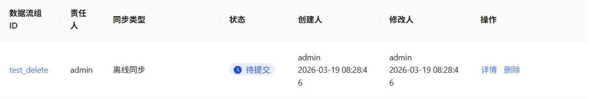
Relevant data
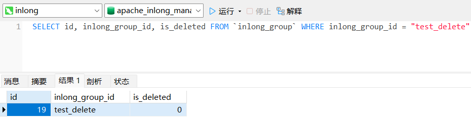
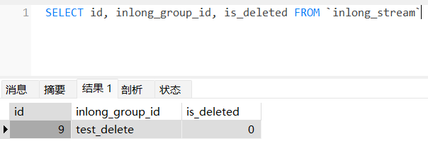
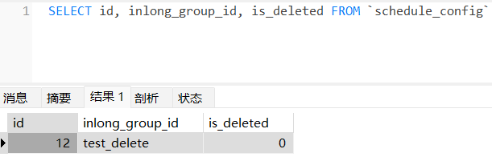
Delete this data flow group
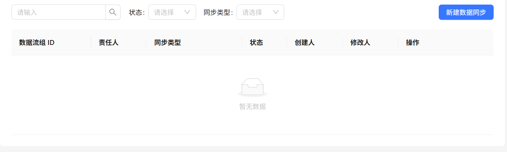
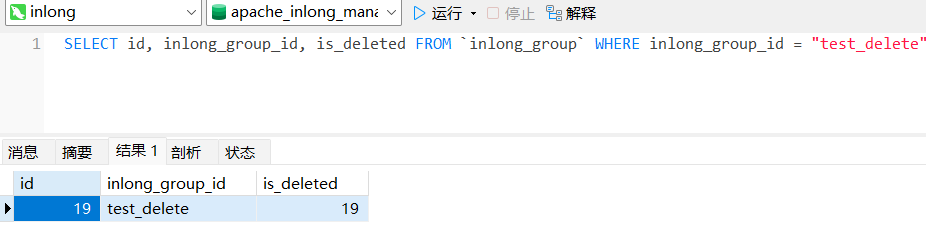
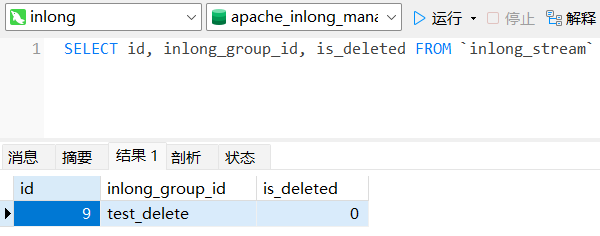
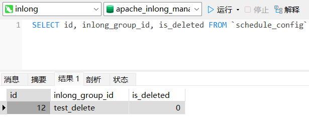
It can be seen that the relevant data under the "schedule_config" and "inlong_stream" tables have not correctly performed logical deletion, because the "is_deleted" field of the relevant data was not updated.
This issue will cause problems when creating a data flow group with the same name again after deleting an existing data flow group.This is also the situation in which I discovered this problem.

I think the main problem lies in InlongGroupServiceImpl.delete(...).
The deletion process is roughly as follows:
InlongGroupController.delete(...)
->InlongGroupProcessService.deleteProcess(...)
->InlongGroupProcessService.invokeDeleteProcess(...)
->workflowService.start(ProcessName.DELETE_GROUP_PROCESS, ...);
This workflow will create and invoke UpdateGroupListener and updateGroupCompleteListener (The UpdateGroupFailedListener will only be invoked when the pre-deletion operation fails).
In the UpdateGroupListener, the status of the group was updated.
```java
case DELETE:  
    groupService.updateStatus(groupId, GroupStatus.CONFIG_DELETING.getCode(), operator);
```
After the pre-deletion operation is completed, the updateGroupCompleteListener deletes the relevant information and updates the status.
```java
case DELETE:  
    // delete process completed, then delete the group info  
    groupService.delete(groupId, operator);
```
There are certain issues with the groupService.delete(...) .
```java
if (GroupStatus.allowedDeleteSubInfos(GroupStatus.forCode(entity.getStatus()))) {  
    streamService.logicDeleteAll(groupId, operator);  
}

public static boolean allowedDeleteSubInfos(GroupStatus status) {  
    return status == GroupStatus.TO_BE_SUBMIT  
            || status == GroupStatus.APPROVE_REJECTED  
            || status == GroupStatus.CONFIG_DELETED;  
}
```
At this point, the status of the group is CONFIG_DELETING, which is not within the permitted states. Therefore, the streamService.logicDeleteAll(...) method will not be executed.

Then the status of InlongGroupEntity was updated.
```java
entity.setIsDeleted(entity.getId());  
entity.setStatus(GroupStatus.CONFIG_DELETED.getCode());  
entity.setModifier(operator);  
int rowCount = groupMapper.updateByIdentifierSelective(entity);  
if (rowCount != InlongConstants.AFFECTED_ONE_ROW) {  
    LOGGER.error("inlong group has already updated for groupId={} curVersion={}", groupId, entity.getVersion());  
    throw new BusinessException(ErrorCodeEnum.CONFIG_EXPIRED);  
}
```
However, this update operation should be carried out after the completion of the latter two deletion operations.
```java
// logically delete the associated extension info  
groupExtMapper.logicDeleteAllByGroupId(groupId);  
  
// remove schedule  
if (DATASYNC_OFFLINE_MODE.equals(entity.getInlongGroupMode())) {  
    try {  
        scheduleOperator.deleteByGroupIdOpt(entity.getInlongGroupId(), operator);  
    } catch (Exception e) {  
        LOGGER.warn("failed to delete schedule info for groupId={}, error msg: {}", groupId, e.getMessage());  
    }  
}
```
Because the corresponding SQL for groupExtMapper.logicDeleteAllByGroupId(...) is as follows
```sql
<update id="logicDeleteAllByGroupId">  
    update inlong_group_ext  
    set is_deleted = id    where inlong_group_id = #{groupId, jdbcType=VARCHAR}      
    and is_deleted = 0
</update>
```
scheduleOperator.deleteByGroupIdOpt(...) will eventually call ScheduleServiceImpl.deleteByGroupId(...). The SQL statement used to query the relevant scheduleEntity is as follows:
```sql
<select id="selectByGroupId" parameterType="java.lang.String" resultMap="BaseResultMap">  
    select  
    <include refid="Base_Column_List"/>  
    from schedule_config  
    where inlong_group_id = #{inlongGroupId,jdbcType=VARCHAR}    
    and is_deleted = 0
</select>
```
Both of the above SQL statements require that is_deleted = 0, but this value has already been updated earlier.
**Component**
Manager
**Work**
1. Change the status of the group to "GroupStatus.CONFIG_DELETED" in advance
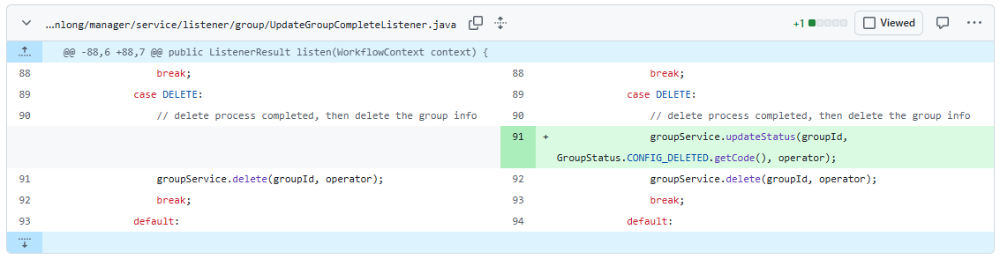
2. Move the update operation of the data stream group after the last two deletion operations
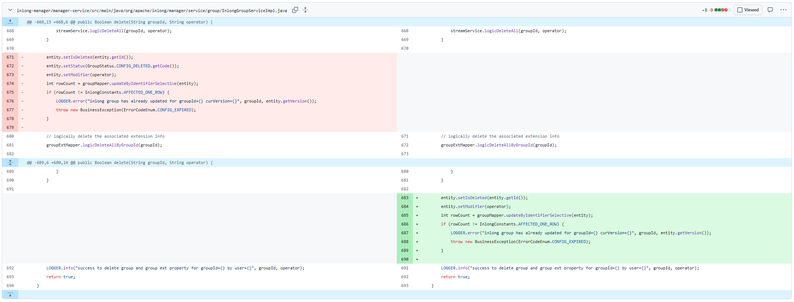
3. Test
Create a data flow group
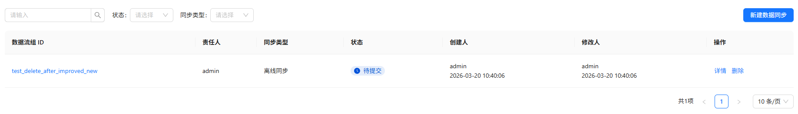
Relevant data
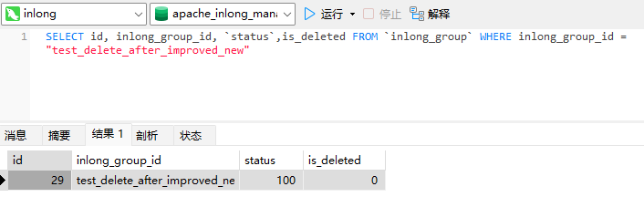
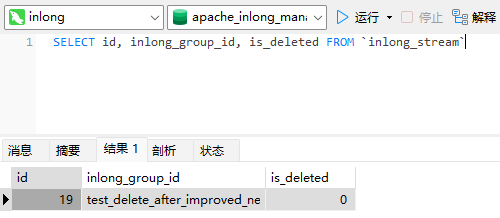
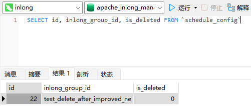
After deletion

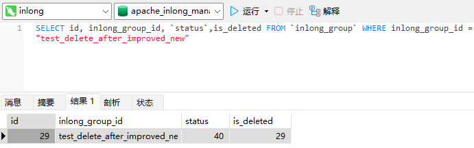
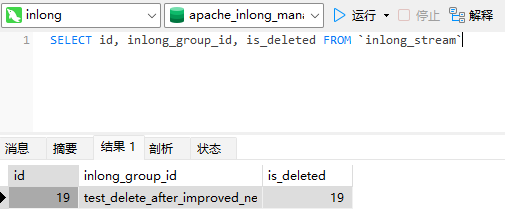
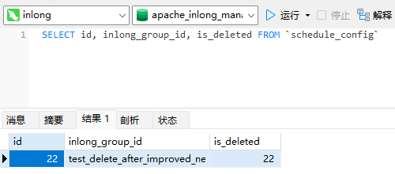
The "is_deleted" field of the relevant data can be correctly modified.
**PR Status**
Open
### Issue \#12106 -> Pr \#12107
**Issue Description**
When creating an access in the data access module, you can select the corresponding MQ type to create a data flow group.
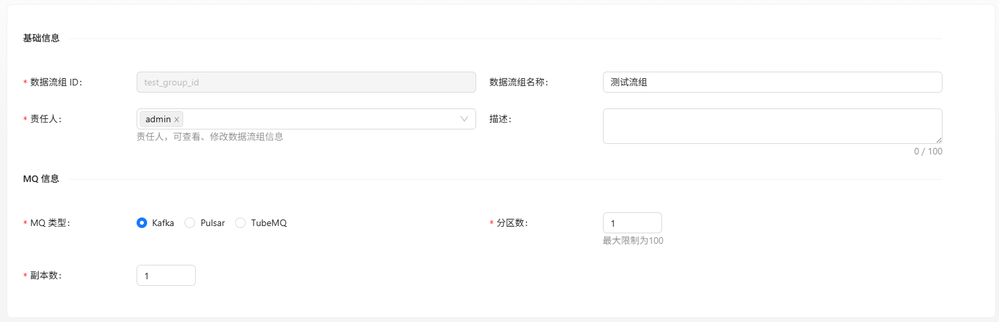
Even without a corresponding MQ cluster, new connections can still be established and submitted for approval. However, issues may arise when deleting because there is no corresponding MQ cluster.
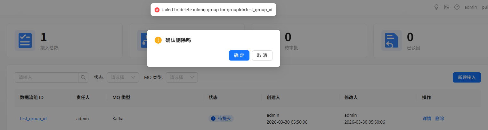
The reasons are as follows
Deletion process
InlongGroupController.delete(...)
-> InlongGroupProcessService.deleteProcess(String groupId, String operator)
-> InlongGroupProcessService.invokeDeleteProcess(...)
-> workflowService.start(ProcessName.DELETE_GROUP_PROCESS, operator, form)
The workflow will call DeleteGroupWorkflowDefinition.defineProcess(), which includes the DeleteMQ task in the deletion process.
This task will execute QueueResourceListener.listen(...)
In the DELETE case, it calls queueOperator.deleteQueueForGroup(groupInfo, operator);
This method has different implementations for different MQs.
In Kafka
```java
ClusterInfo clusterInfo = clusterService.getOne(groupInfo.getInlongClusterTag(), null, ClusterType.KAFKA);

@Override  
public ClusterInfo getOne(String clusterTag, String name, String type) {  
    List<InlongClusterEntity> entityList = clusterMapper.selectByKey(clusterTag, name, type);  
    if (CollectionUtils.isEmpty(entityList)) {  
        throw new BusinessException(String.format("cluster not found by tag=%s, name=%s, type=%s",  
                clusterTag, name, type));  
    }  
  
    InlongClusterEntity entity = entityList.get(0);  
    InlongClusterOperator instance = clusterOperatorFactory.getInstance(entity.getType());  
    ClusterInfo result = instance.getFromEntity(entity);  
    LOGGER.debug("success to get inlong cluster by tag={}, name={}, type={}", clusterTag, name, type);  
    return result;  
}
```
An exception will be thrown if no cluster of the corresponding type is found.
In the log
```
[ ] 2026-03-30 05:53:58.572 -ERROR [http-nio-8083-exec-10] a.i.m.w.e.LogableEventListener:88 - execute listener WorkflowEventLogEntity(id=null, processId=48, processName=DELETE_GROUP_PROCESS, processDisplayName=Delete Group, inlongGroupId=test_group_id, taskId=130, elementName=DeleteMQ, elementDisplayName=Group-DeleteMQ, eventType=TaskEvent, event=COMPLETE, listener=QueueResourceListener, startTime=Mon Mar 30 05:53:58 UTC 2026, endTime=null, status=-1, async=0, ip=172.18.0.7, remark=null, exception=cluster not found by tag=null, name=null, type=KAFKA) error:
org.apache.inlong.manager.common.exceptions.BusinessException: cluster not found by tag=null, name=null, type=KAFKA
at org.apache.inlong.manager.service.cluster.InlongClusterServiceImpl.getOne(InlongClusterServiceImpl.java:545) ~[manager-service-2.3.0.jar:2.3.0]
```
In Pulsar
```java
List<ClusterInfo> clusterInfos = clusterService.listByTagAndType(clusterTag, ClusterType.PULSAR);

@Override  
public List<ClusterInfo> listByTagAndType(String clusterTag, String clusterType) {  
    List<InlongClusterEntity> clusterEntities = clusterMapper.selectByKey(clusterTag, null, clusterType);  
    if (CollectionUtils.isEmpty(clusterEntities)) {  
        throw new BusinessException(String.format("cannot find any cluster by tag %s and type %s",  
                clusterTag, clusterType));  
    }  
  
    List<ClusterInfo> clusterInfos = clusterEntities.stream()  
            .map(entity -> {  
                InlongClusterOperator operator = clusterOperatorFactory.getInstance(entity.getType());  
                return operator.getFromEntity(entity);  
            })  
            .collect(Collectors.toList());  
  
    LOGGER.debug("success to list inlong cluster by tag={}", clusterTag);  
    return clusterInfos;  
}
```
The TubeMQ deletion process has not been implemented yet, so no exception will be triggered.
**Component**
Manager
**Work**
1. Before saving the connection, verify if there is a corresponding cluster.
2. Test
Adding data access when there is no corresponding MQ cluster
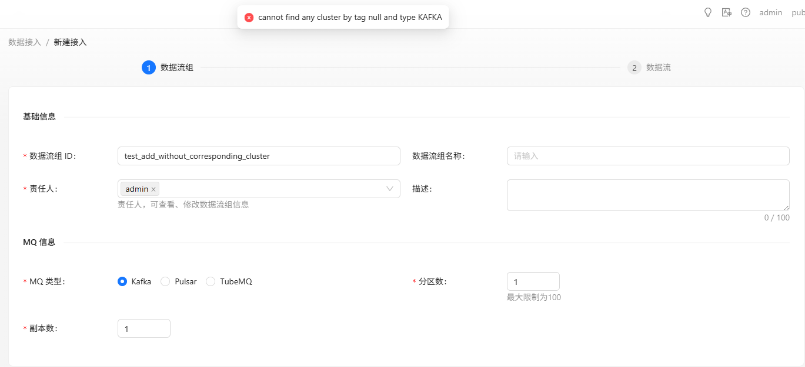
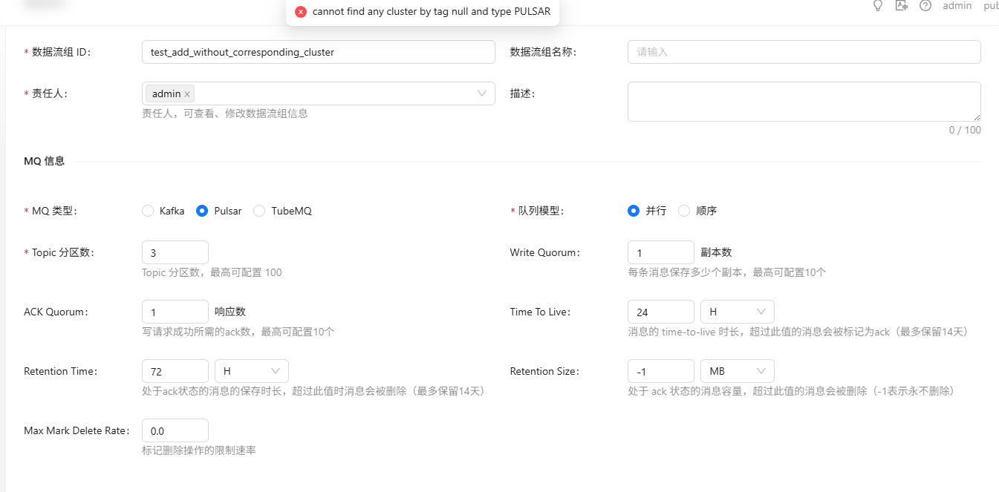
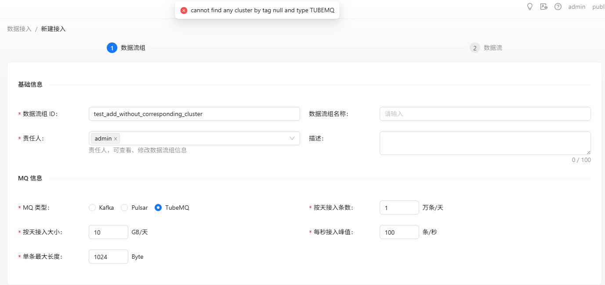
Can intercept the creation operation

After creating the corresponding MQ cluster
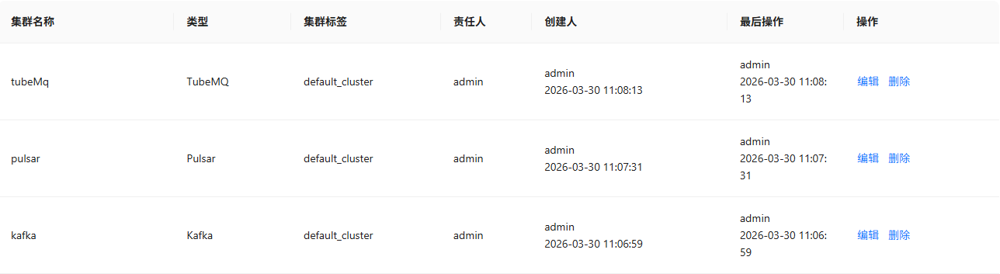
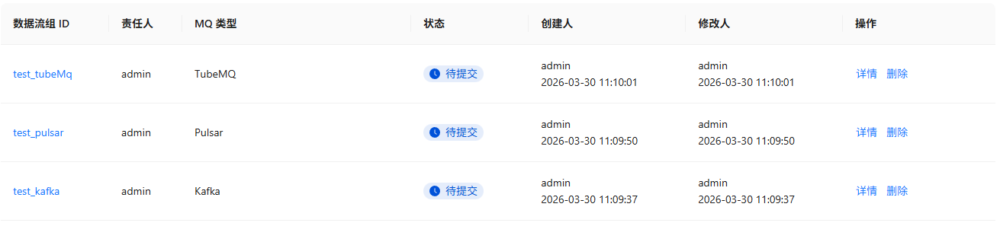

Success in creation
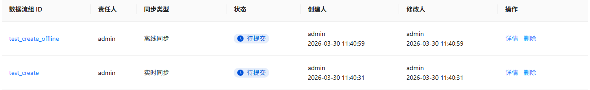
And it will not affect the creation of data flow groups during data synchronization.
**PR Status**
Open
### Issue \#xxxxx -> Pr \#xxxxx
**Issue Description**
**Component**
**Work**
**PR Status**
## 学习