## API补充
数组排序
```java
Arrays.sort(数组, (o1, o2) -> {
	// o1,o2的比较规则，想让o1排前面就返回负数，o2排前面就返回整数
	// 下面是o1,o2为二维数组，然后按区间开头升序排序为例
	return o1[0] - o2[0];
})
// 补充，如果前面的数太小，后面的太大，可能会反向溢出为正数，这时候可以用下面这个
return Integer.compare(point1[0], point2[0]);
// 这个函数左小返回负，右小返回正
```
给数组里的所有元素填充一样的数值
```java
Arrays.fill(数组,值);
```
队列
```java
Queue<String> queue = new LinkedList<String>();
queue.offer("a");// 添加元素
queue.poll();// 删除并返回队列的头部元素
queue.peek();返回队列的头部元素
```
## Easy
### 160.相交链表
题目：
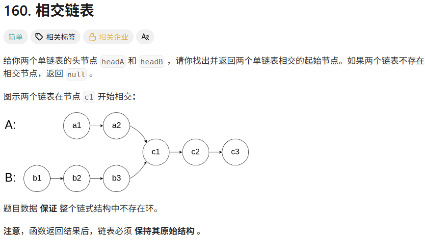
时空：时间99.31%，空间11.09%
思路：链表A和链表B一长一短，相交部分长度<=任意一个链表的长度<=长的那个链表的长度，所以相交点一定不会在长出来的那部分，所以可以把长链表长出来的那部分先跳过，接下来一个个节点往后比，比到相同的节点就是相交节点。比到最后还没有就返回null。
代码：
```java
/**

 * Definition for singly-linked list.

 * public class ListNode {

 *     int val;

 *     ListNode next;

 *     ListNode(int x) {

 *         val = x;

 *         next = null;

 *     }

 * }

 */

public class Solution {

    public ListNode getIntersectionNode(ListNode headA, ListNode headB) {

        ListNode currA = headA;

        int lengthA = 1;

        while(currA != null){

            currA = currA.next;

            lengthA++;

        }

        ListNode currB = headB;

        int lengthB = 1;

        while(currB != null){

            currB = currB.next;

            lengthB++;

        }

        currA = headA;

        currB = headB;

        if (lengthA >= lengthB) {

            int diff = lengthA - lengthB;

            for(int i = 0;i < diff;i++){

                currA = currA.next;

            }

        } else {

            int diff = lengthB - lengthA;

            for(int i = 0;i < diff;i++){

                currB = currB.next;

            }

        }

        while(currA != currB){

            currA = currA.next;

            currB = currB.next;

        }

        return currA;

    }

}
```
## Mid
### 2.两数相加
题目：
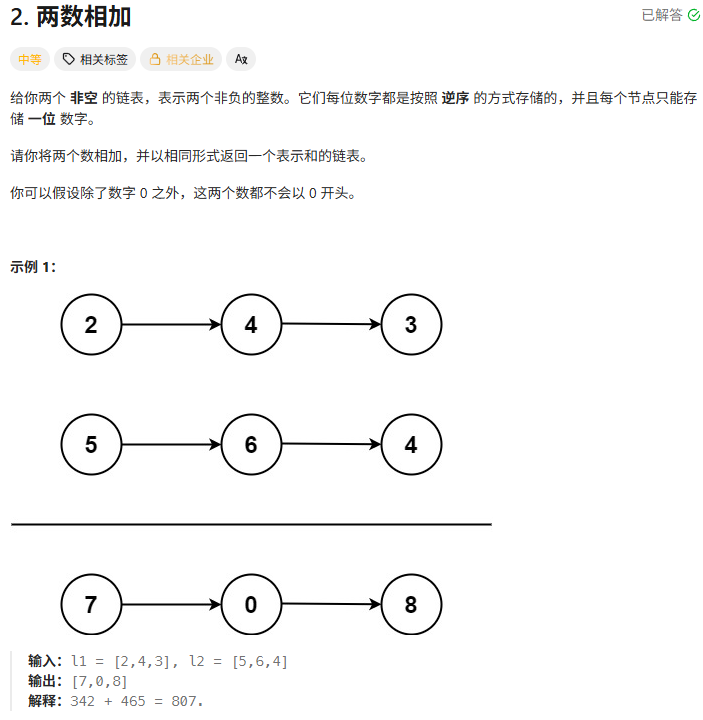
时空：时间100.00%，空间8.88%
思路：就是模拟算加法的过程，两个链表是按逆序存储的，其实就是个位 -> 高位，而加法的计算刚好也是个位 -> 高位，所以顺着链表一位位加着走就好了，就是要多考虑一个进位的问题。
代码：
```java
/**

 * Definition for singly-linked list.

 * public class ListNode {

 *     int val;

 *     ListNode next;

 *     ListNode() {}

 *     ListNode(int val) { this.val = val; }

 *     ListNode(int val, ListNode next) { this.val = val; this.next = next; }

 * }

 */

class Solution {

    public ListNode addTwoNumbers(ListNode l1, ListNode l2) {

        ListNode head = new ListNode();

        int flag = 0; // 进位

        ListNode curr1 = l1;

        ListNode curr2 = l2;

        ListNode curr = head;

        while(curr1 != null || curr2 != null || flag != 0){

            int now = flag; // 计算当前位的值

            if (curr1 != null) {

                now += curr1.val;

                curr1 = curr1.next;

            }

            if (curr2 != null) {

                now += curr2.val;

                curr2 = curr2.next;

            }

            if (now > 9) {

                flag = 1;

                now -= 10;

            } else flag = 0;

            curr.next = new ListNode(now);

            curr = curr.next;

        }

        return head.next;

    }

}
```
### 3.无重复字符的最长子串
题目：
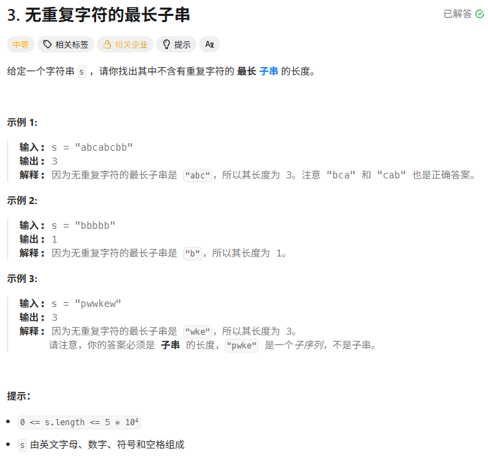
时空：时间82.88%，空间66.42%
思路：核心是滑动窗口，外层循环不断的扩展右边界，尽量在无重复字符的情况下达到最长，如果有重复的字符出现了，那么收缩左边界直到把这个重复的字符移出去，然后再继续扩展右边界（这样相当于把每个末尾是right的最长子串找到了，其中的最长就是答案）。然后记住出现过的字符得用哈希表，因为s是由英文字母、数字、符号和空格多种字符组成的，如果只是小写/大写字母的话可以用大小为26的布尔数组代替。
代码：
```java
class Solution {

    public int lengthOfLongestSubstring(String s) {

        int sl = s.length();

        int left = 0;

        Set<Character> mark = new HashSet<>();

        int max = 0;

        for(int right = 0;right < sl;right++){

            char now = s.charAt(right); // 待加入窗口的字符

            // 这个字符如果使用过，那就移动左边界直到把上一个这个字符给排出去

            if(mark.contains(now)){

                while(s.charAt(left) != now){

                    mark.remove(s.charAt(left));

                    left++;

                }

                // 当前这个left对应的就是上一个这个字符，可以不用从HashSet中移出去

                // 毕竟等等还要加进来

                left++;

            } else {

                mark.add(now);

            }

            max = Math.max(max, right - left + 1);

        }

        return max;

    }

}
```
### 5.最长回文子串
题目：
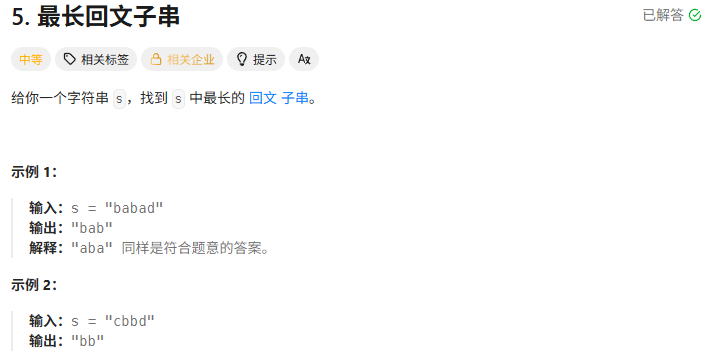
时空：时间86.25%，空间85.33%
思路：中心扩展法，它的核心想法是这样的，如果一个子串是回文串，那么如果这个子串的左右两边的字符再相等，那么这个回文串就可以扩展。这样找回文串的效率会高。扩展的话是从中心扩展的，所以第一步是要找出所有中心，这些中心往外扩展得到的字符串就是全集了（有些不可能的提前排除了就是）
代码：
```java
class Solution {

    public String longestPalindrome(String s) {

        int sl = s.length();

        int resLeft = 0;

        int resRight = 0;

        for(int i = 0;i < 2 * sl;i++){

            int left = i / 2;

            int right = left + i % 2;

            while(left >= 0 && right < sl && s.charAt(left) == s.charAt(right)){

                if (right - left > resRight - resLeft) {

                    resRight = right;

                    resLeft = left;

                }

                left--;

                right++;

            }

        }

        return s.substring(resLeft, resRight + 1);

    }

}
```
### 11.盛最多水的容器
题目：
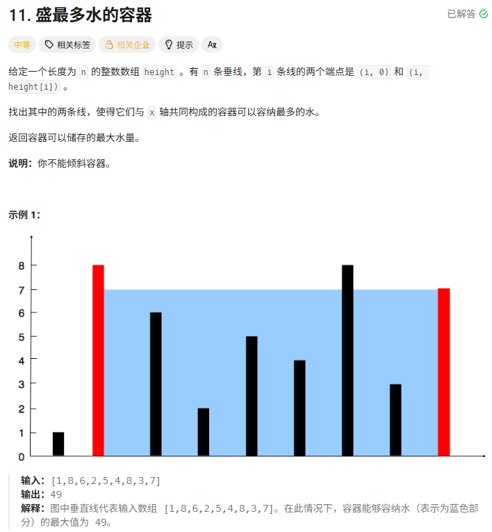
时空：时间94.32%，空间96.58%
思路：想找两条线，让其中能容纳的水最多（水 = 短边高 * 中间距离），可以从最外面的两条线开始找，每次只收缩短边。收缩的时候中间距离变小了，如果收缩的是长边，那么短边高肯定不会变大，那么这样缩总的体积一定是变小的，这些情况是可以不用考虑的，就排除了很多不可能是最大的情况了这样。这样就是全集-不可能的情况，可以得到正确结果。
代码：
```java
class Solution {

    public int maxArea(int[] height) {

        int n = height.length;

        int left = 0;

        int right = n - 1;

        int max = 0;

        while(left < right){

            int w = right - left;

            int h = 0;

            if (height[left] <= height[right]) {

                h = height[left];

                left++;

            } else {

                h = height[right];

                right--;

            }

            max = Math.max(max, h * w);

        }

        return max;

    }

}
```
### 15.三数之和
题目：
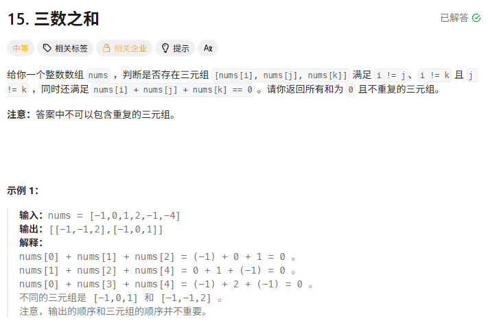
时空：时间42.34%，空间68.14%
思路：首先对nums数组进行排序，排序完之后在找和为0的组合和去重都非常方便。找的话是先固定一个开头的数，然后搞个双指针在数组中找剩下的两个数，双指针分别指向剩余部分的头尾，它们分别是剩下最小的数和最大的数。之后去求三数之和，如果大于0，要调小点，右指针往左移。小于0同理。等于0就存储答案并且去重就行。
代码：
```java
class Solution {

    public List<List<Integer>> threeSum(int[] nums) {

        Arrays.sort(nums);

        int n = nums.length;

        List<List<Integer>> res = new ArrayList<>();

        for(int i = 0;i < n - 2;i++){

            // 去重1

            if(i > 0 && nums[i] == nums[i - 1]){

                continue;

            }

            int j = i + 1;

            int k = n - 1;

            while(j < k){

                int sum = nums[i] + nums[j] + nums[k];

                if(sum == 0){

                    res.add(Arrays.asList(nums[i], nums[j], nums[k]));

                    // 去重2

                    k--;

                    j++;

                    while(k > 0 && nums[k] == nums[k + 1]) k--;

                    while(j < n && nums[j] == nums[j - 1]) j++;

                } else if (sum < 0) {

                    j++;

                } else {

                    k--;

                }

            }

        }

        return res;

    }

}
```
### 17.电话号码的字母组合
题目：
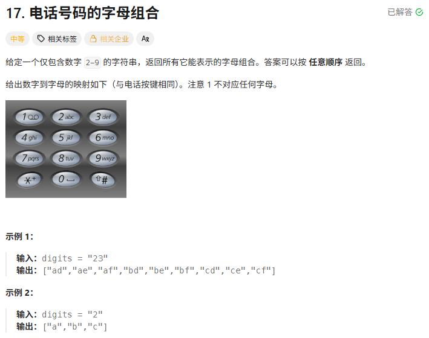
时空：时间53.14%，空间81.32%
思路：就是组合问题（不同数字对应的字母之间的组合），用回溯做，多个map把每个按钮和对应的字符记录一下就是。
代码：
```java
class Solution {

  

    private List<String> res;

  

    public List<String> letterCombinations(String digits) {

        res = new ArrayList<>();

        Map<Character, char[]> queryChars = new HashMap<>();

        queryChars.put('2', new char[]{'a', 'b', 'c'});

        queryChars.put('3', new char[]{'d', 'e', 'f'});

        queryChars.put('4', new char[]{'g', 'h', 'i'});

        queryChars.put('5', new char[]{'j', 'k', 'l'});

        queryChars.put('6', new char[]{'m', 'n', 'o'});

        queryChars.put('7', new char[]{'p', 'q', 'r', 's'});

        queryChars.put('8', new char[]{'t', 'u', 'v'});

        queryChars.put('9', new char[]{'w', 'x', 'y', 'z'});

        backTracking(new StringBuilder(), queryChars, digits);

        return res;

    }

  

    private void backTracking(StringBuilder temp, Map<Character, char[]> queryChars, String digits){

        int tl = temp.length();

        if(tl == digits.length()){

            res.add(temp.toString());

            return;

        }

        char[] chars = queryChars.get(digits.charAt(tl));

        for(int i = 0;i < chars.length;i++){

            temp.append(chars[i]);

            backTracking(temp, queryChars, digits);

            temp.deleteCharAt(tl);

        }

    }

}
```
### 19.删除链表的倒数第N个结点
题目：
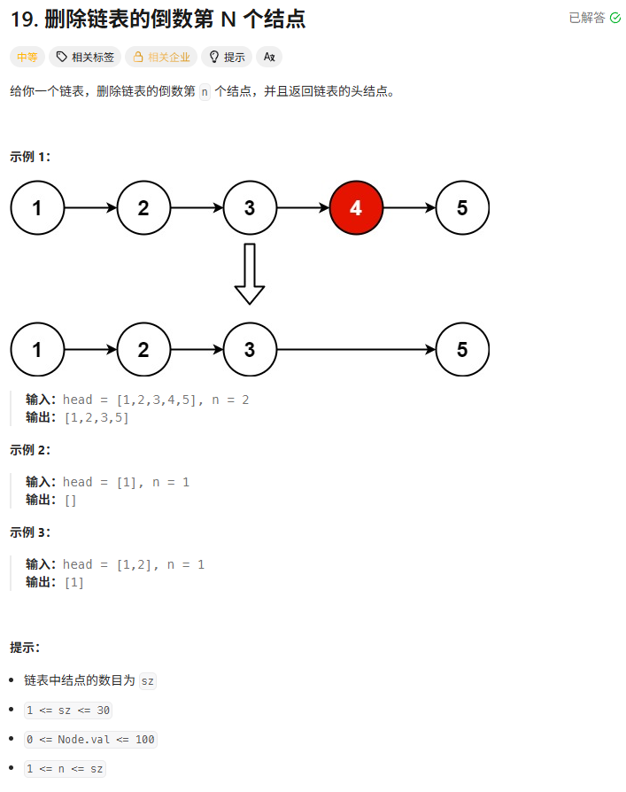
时空：时间100.00%，空间8.99%
思路：快慢指针，让快指针先走n步，然后快慢指针一起走，快指针为null时，慢指针就位于倒数第n个结点，然后执行删除操作就好了。
代码：
```java
/**

 * Definition for singly-linked list.

 * public class ListNode {

 *     int val;

 *     ListNode next;

 *     ListNode() {}

 *     ListNode(int val) { this.val = val; }

 *     ListNode(int val, ListNode next) { this.val = val; this.next = next; }

 * }

 */

class Solution {

    public ListNode removeNthFromEnd(ListNode head, int n) {

        ListNode fast = head;

        ListNode slow = head;

        ListNode pre = null;

        for(int i = 0;i < n;i++){

            fast = fast.next;

        }

        while(fast != null){

            fast = fast.next;

            pre = slow;

            slow = slow.next;

        }

        if(pre == null) return head.next;

        pre.next = slow.next;

        return head;

    }

}
```
### 22.括号生成
题目：
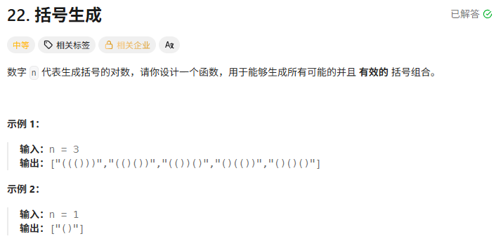
时空：时间100.00%，空间25.99%
思路：也是回溯问题，在每一轮尝试放左括号或者右括号，然后注意右括号只有在数量小于左括号数量时才能放，这样能保证括号组合一定是有效的。
代码：
```java
class Solution {

  

    private List<String> res;

  

    public List<String> generateParenthesis(int n) {

        res = new ArrayList<>();

        backTracking(n, 0, 0, new StringBuilder());

        return res;

    }

  

    private void backTracking(int n, int left, int right, StringBuilder temp){

        if(left == n && right == n){

            res.add(temp.toString());

            return;

        }

        if(left < n){

            temp.append("(");

            backTracking(n, left + 1, right, temp);

            temp.deleteCharAt(temp.length() - 1);

        }

        if(right < left){

            temp.append(")");

            backTracking(n, left, right + 1, temp);

            temp.deleteCharAt(temp.length() - 1);

        }

    }

}
```
### 31.下一个排列
题目：
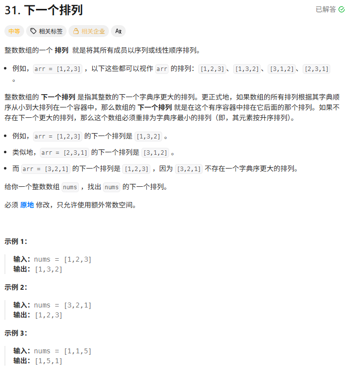
时空：时间100.00%，空间30.41%
思路：和注解写的一样，从后往前找到第一个升序对，记住它们的位置，把升序对中小的那个数（nums\[i\]），用后面第一个比他大的数进行交换，然后此时后面还是仍然是降序排序，倒序一下变成升序就可以得到下一个排列了。解释一下，在没找到升序对之前，后面都是降序排序，那么降序排序就是最大的了，怎么调也不可能最大，所以找到升序对才能通过操作把当前数变大。然后想变大一定是把后面的某个数和升序对中的那个小数进行交换，因为后面还是升序嘛，不会操作后面的。而我们要求的变大是最小程度的变大，那么就把后面的比升序对中小数大的第一个数交换过来就可以，这时候再把后面调成升序，就是最小程度的变大了。
代码：
```java
class Solution {

    public void nextPermutation(int[] nums) {

        int n = nums.length;

        int i = n - 2;

        int j = n - 1;

        // 从后往前找到第一个升序对，记住它们的位置

        while(j > 0){

            if(nums[j] > nums[i]){

                break;

            }

            i--;

            j--;

        }

        if(j == 0){

            reverse(nums, 0, n - 1);

            return;

        }

        // 把升序对中小的那个数（nums[i]），用后面第一个比他大的数进行交换

        // 然后此时后面还是仍然是降序排序，倒序一下变成升序就可以得到下一个排列了

        for(int k = n - 1;k > i;k--){

            if(nums[k] > nums[i]){

                int temp = nums[k];

                nums[k] = nums[i];

                nums[i] = temp;

                break;

            }

        }

        // 把j-末尾倒序成升序

        reverse(nums, j, n - 1);

    }

  

    private void reverse(int[] nums, int left, int right){

        while(left < right){

            int temp = nums[left];

            nums[left] = nums[right];

            nums[right] = temp;

            left++;

            right--;

        }

    }

}
```
### 33.搜索旋转排序数组
题目：
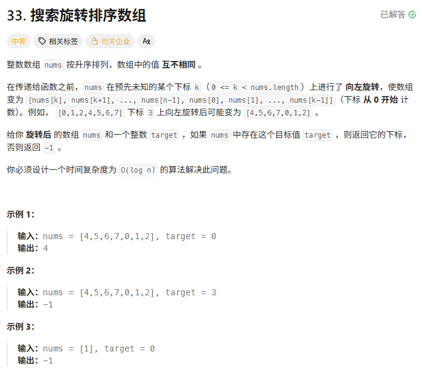
时空：时间100.00%， 空间98.66%
思路：这个数组旋转了一下，不过不管怎么旋转，总有一半会是有序的（通过区间边界值大小可以判断），可以利用有序的这一半排除一半的选择，可以说是小改的二分法。
代码：
```java
class Solution {

    public int search(int[] nums, int target) {

        int n = nums.length;

        int left = 0;

        int right = n - 1;

        while(left <= right){

            int mid = (left + right) / 2;

            if (nums[mid] == target) return mid;

            if (nums[left] <= nums[mid]){

                // 左边有序

                if (target > nums[mid] || target < nums[left]) left = mid + 1;// 不在左

                else right = mid - 1;// 在左边

            } else {

                // 右边有序

                if (target > nums[right] || target < nums[mid]) right = mid - 1;// 不在右

                else left = mid + 1;// 在右边

            }

        }

        return -1;

    }

}
```
### 34.在排序数组中查找元素的第一个和最后一个位置
题目：
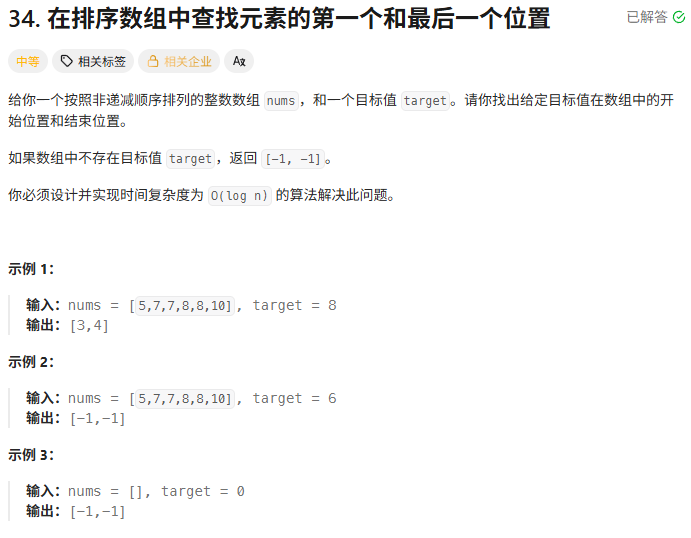
时空：时间100.00%，空间36.01%
思路：先用二分法找到其中一个目标元素，然后再元素两边扩展去找第一个和最后一个
代码：
```java
class Solution {

    public int[] searchRange(int[] nums, int target) {

        int n = nums.length;

        int left = 0;

        int right = n - 1;

        int index = -1;

        while(left <= right){

            int mid = (left + right) / 2;

            if (nums[mid] == target) {

                index = mid;

                break;

            } else if (target > nums[mid]) {

                left = mid + 1;

            } else {

                right = mid -  1;

            }

        }

        if (index == -1) return new int[]{-1, -1};

        left = index;

        while(left >= 0 && nums[left] == target){

            left--;

        }

        right = index;

        while(right < n && nums[right] == target){

            right++;

        }

        return new int[]{left + 1, right - 1};

    }

}
```
### 39.组合总和
题目：
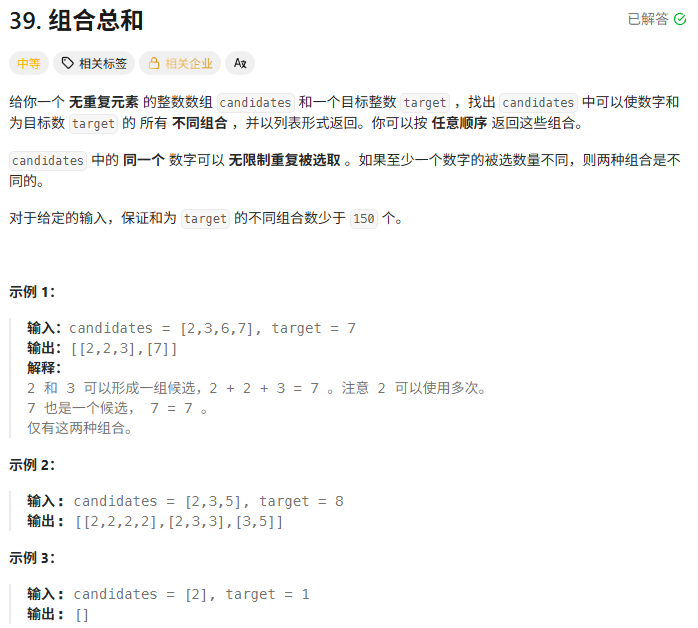
时空：时间75.74%，空间24.29%
思路：比较关键的是去重，就是通过代码中的begin字段实现的，它的意思是，比如第一个数字是1，那么等到跳过这个1往后走的时候，其实已经把包含1的所有可能都找到了，后面就不用再考虑1了。
代码：
```java
class Solution {

  

    List<List<Integer>> res;

  

    public List<List<Integer>> combinationSum(int[] candidates, int target) {

        res = new ArrayList<>();

        Arrays.sort(candidates);

        backTracking(candidates, target, 0, new ArrayList<>(), 0);

        return res;

    }

  

    private void backTracking(int[] candidates, int target, int sum, List<Integer> temp,

    int begin){

        if (sum == target) {

            res.add(new ArrayList<>(temp));

            return;

        }

  

        for(int i = begin;i < candidates.length;i++){

            if (sum + candidates[i] <= target) {

                temp.add(candidates[i]);

                backTracking(candidates, target, sum + candidates[i], temp, i);

                temp.remove(temp.size() - 1);

            } else break;

        }

    }

}
```
### 46.全排列
题目：
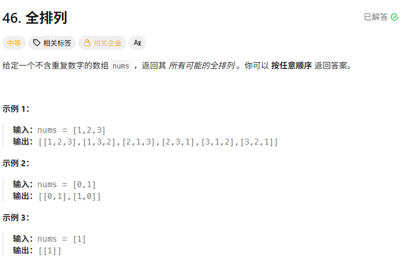
时空：时间96.79%，空间21.59%
思路：每轮选没用过的数加入进去就可以，用过的数标记一下，回溯的时候取消标记尝试其他排列，这样就可以全排列了。
代码：
```java
class Solution {

  

    private List<List<Integer>> res;

  

    public List<List<Integer>> permute(int[] nums) {

        res = new ArrayList<>();

        backTracking(nums, new ArrayList<>());

        return res;

    }

  

    private void backTracking(int[] nums, List<Integer> temp){

        if (temp.size() == nums.length) {

            res.add(new ArrayList<>(temp));

            return;

        }

        for(int i = 0;i < nums.length;i++){

            if(nums[i] > -11){

                temp.add(nums[i]);

                int num = nums[i];

                nums[i] = -20;

                backTracking(nums, temp);

                temp.remove(temp.size() - 1);

                nums[i] = num;

            }

        }

    }

}
```
### 48.旋转图像
题目：
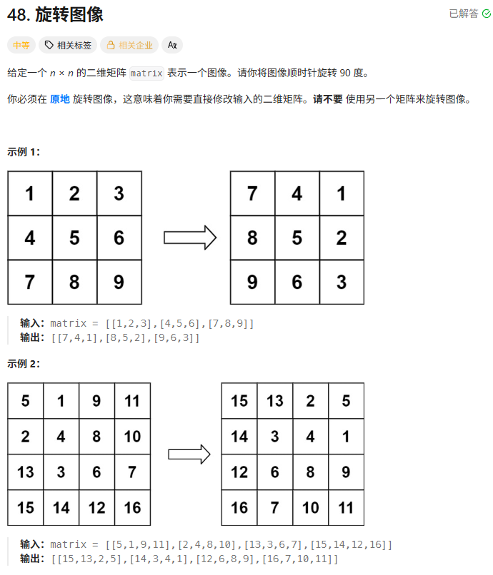
时空：时间100.00%，空间53.81%
思路：转置 + 横向翻转一下就好了  类似矩阵旋转的都应该想一下能不能用这样的组合实现旋转
代码：
```java
class Solution {

    public void rotate(int[][] matrix) {

        int n = matrix.length;

        // 转置

        for(int i = 0;i < n;i++){

            for(int j = i + 1;j < n;j++){

                int temp = matrix[i][j];

                matrix[i][j] = matrix[j][i];

                matrix[j][i] = temp;

            }

        }

  

        // 横向翻转

        for(int i = 0;i < n;i++){

            for(int j = 0;j < n / 2;j++){

                int temp = matrix[i][j];

                matrix[i][j] = matrix[i][n - 1- j];

                matrix[i][n - 1- j] = temp;

            }

        }

    }

}
```
### 49.字母异位词分组
题目：
时空：时间97.85%，空间99.97%
思路：把每个单词里面的字母排序（字符串->数组->对数组进行排序->转回字符串）之后，异位词得到的结果是一样的，以这个为准进行分组。
代码：
```java
class Solution {

    public List<List<String>> groupAnagrams(String[] strs) {

        Map<String, List<String>> tool = new HashMap<>();

        for(String s:strs){

            char[] temp = s.toCharArray();

            Arrays.sort(temp);

            String sorted = new String(temp);

            if(!tool.containsKey(sorted)){

                tool.put(sorted, new ArrayList<>());

            }

            tool.get(sorted).add(s);

        }

        List<List<String>> res = new ArrayList<>();

        tool.forEach((k, v) -> {

            res.add(v);

        });

        return res;

    }

}
```
### 53.最大子数组和
题目：
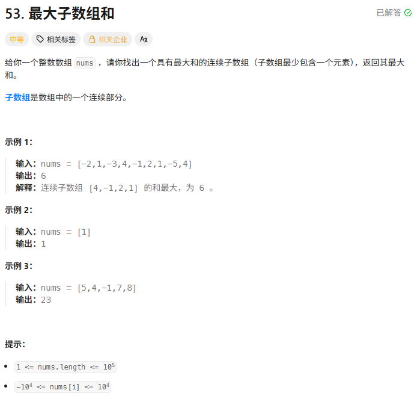
时空：时间100.00%，空间57.99%
思路：动态规划，用dp\[i]表示以i为结尾的子数组的最大和，那么容易得到
```java
dp[i] = Math.max(dp[i - 1] + nums[i], nums[i]) 
```
（要么前面的累积有用，加上来，要么没用）
那么dp\[i]中的最大值就是所求了
这个代码可以稍微简化一下，就是用curr来表示当前的dp\[i]，每次用curr更新最大值就好了，不用记住每一个dp\[i]最后再比个最大值
代码：
```java
class Solution {

    public int maxSubArray(int[] nums) {

        int max = nums[0];

        int curr = nums[0];

        for(int i = 1;i < nums.length;i++){

            curr = Math.max(nums[i], curr + nums[i]);

            max = Math.max(curr, max);

        }

        return max;

    }

}
```
### 55.跳跃游戏
题目：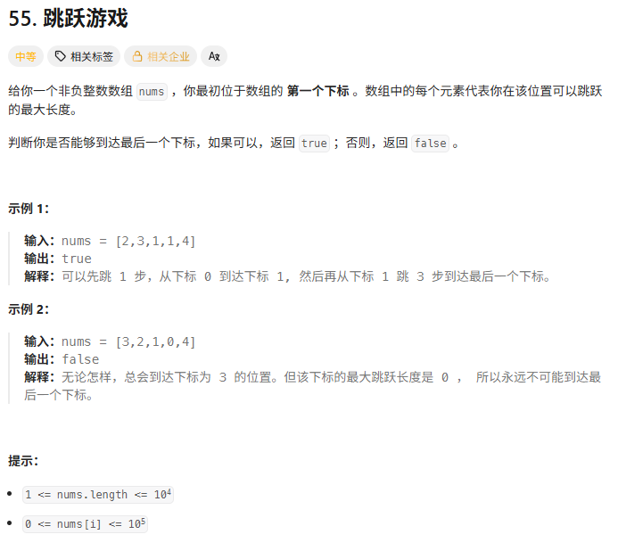
时空：时间94.96%，空间86.96%
思路：用一个变量canReach表示当前可以跳到的最远位置，每到一个位置进行更新就可以了。到一个位置，那么就能到这个位置 + 这个位置能跳跃的最大长度，不过可能没前面更新的远，取个最大值就行。
代码：
```java
class Solution {

    public boolean canJump(int[] nums) {

        int n = nums.length;

        int canReach = 0;

        int i = 0;

        while(canReach >= i){

            if(canReach >= n - 1) return true;

            canReach = Math.max(canReach, i + nums[i]);

            i++;

        }

        return canReach >= n - 1;

    }

}
```
### 56.合并区间
题目：
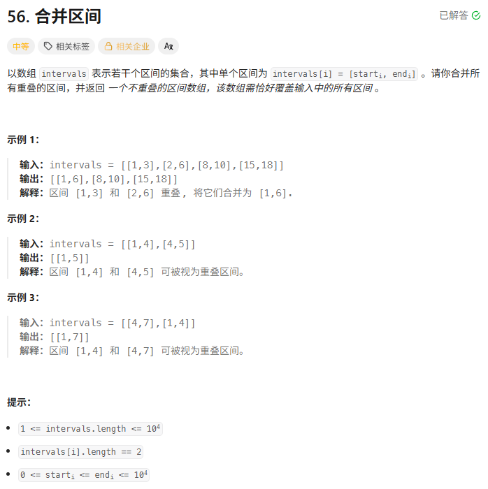
时空：时69.25%，空间80.49%
思路：先把各区间按照区间的开头升序排序。begin、end表示当前区间，然后往后遍历，如果下一个区间的开头在这个区间内，那么就可以合并，这时候主要是更新end。如果下一个区间的开头大于当前区间的末尾，那么就不可以合并，把当前区间存一下然后把下一个区间更新为当前区间即可。
代码：
```java
class Solution {

    public int[][] merge(int[][] intervals) {

        // 按区间开头升序排序，后面会好处理一些

        Arrays.sort(intervals, (interval1, interval2) -> {

            return interval1[0] - interval2[0];

        });

        List<int[]> memory = new ArrayList<>();

        int begin = intervals[0][0];

        int end = intervals[0][1];

        for (int i = 1;i < intervals.length;i++) {

            int currBegin = intervals[i][0];

            int currEnd = intervals[i][1];

            if (currBegin >= begin && currBegin <= end){

                end = Math.max(end, currEnd);

            } else if(currBegin > end){

                memory.add(new int[]{begin, end});

                begin = currBegin;

                end = currEnd;

            }

        }

        memory.add(new int[]{begin, end});

        int[][] res = new int[memory.size()][2];

        for(int i = 0;i < memory.size();i++){

            res[i] = memory.get(i);

        }

        return res;

    }

}
```
### 62.不同路径
题目：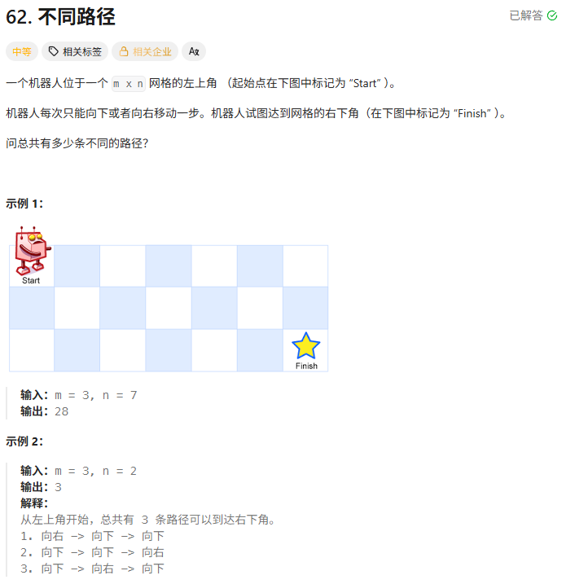
时空：时间100.00%，空间49.49%
思路：机器人每次只能向下或者向右移动一步，这意味着当前格只能从上面一个或者左边一个格子过来，那么到达这个格子的路径数就等于到达上面一个格子的路径数 + 到达左边一个格子的路径数。用动态规划做。
代码：
```java
class Solution {

    public int uniquePaths(int m, int n) {

        int[][] dp = new int[m][n];

        for(int i = 0;i < m;i++){

            dp[i][0] = 1;

        }

        for(int j = 0;j < n;j++){

            dp[0][j] = 1;

        }

        for(int i = 1;i < m;i++){

            for(int j = 1;j < n;j++){

                dp[i][j] = dp[i - 1][j] + dp[i][j - 1];

            }

        }

        return dp[m - 1][n - 1];

    }

}
```
### 64.最小路径和
题目：
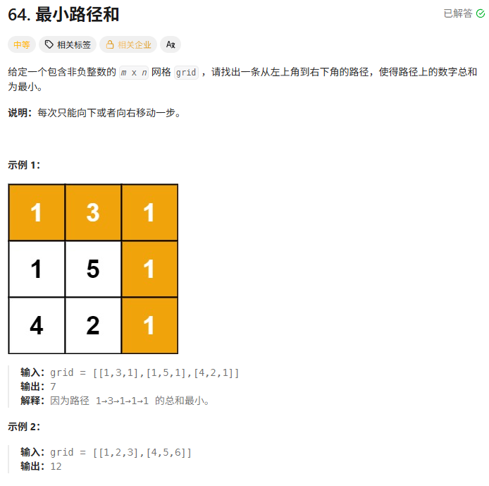
时空：时间87.86%，空间49.23%
思路：动态规划，每个格子只能从左边或者上边过来，那么到达这个格子的最小路径和就是到左边的最小路径和和到上边的最小路径和的较小值，在加上当前格子上的数。据此一直更新dp即可。
代码：
```java
class Solution {

    public int minPathSum(int[][] grid) {

        int h = grid.length;

        int w = grid[0].length;

        int[][] dp = new int[h][w];

        dp[0][0] = grid[0][0];

        for(int i = 1;i < h;i++){

            dp[i][0] =  dp[i - 1][0] + grid[i][0];

        }

        for(int j = 1;j < w;j++){

            dp[0][j] =  dp[0][j - 1] + grid[0][j];

        }

        for(int i = 1;i < h;i++){

            for(int j = 1;j < w;j++){

                dp[i][j] = Math.min(dp[i - 1][j], dp[i][j - 1]) + grid[i][j];

            }

        }

        return dp[h - 1][w - 1];

    }

}
```
### 72.编辑距离
题目：
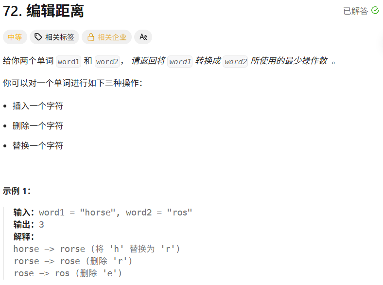
时空：时间74.81%，空间75.55%
思路：动态规划，word1 -> word2所需的最少操作可由，word1的子串 -> word2的子串所需的最少操作数递推而来。关键是这个递推关系，设dp\[i]\[j]表示 word1的前i个字符-> word2的前j个字符所需的最少操作数。这里是根据最后一步做什么操作来划分的。
最后一步做的是插入操作
通过插入操作可以对齐的话，那么目前word1的前i个字符已经和word2的前j - 1个字符一样了，插入一个word2的第j个字符就可以了。
```
dp[i][j] = dp[i][j - 1] + 1;
```
最后一步做的是删除操作
通过删除操作可以对齐的话，那么目前word1的前i - 1个字符已经和word2的前j个字符一样了，把word1的第i个字符删了就可以了。
```
dp[i][j] = d[i - 1][j] + 1;
```
最后一步做的是替换操作
通过替换操作可以对齐的话，那么目前word1的前i - 1个字符已经和word2的前j - 1个字符一样了，把word1的最后一个字符换成word2的第j个字符就可以了。
```
dp[i][j] = d[i - 1][j - 1] + 1;
```
不过如果word1的第i个字符和word2的第j个字符是一样的话，那么前面对好了之后不用做操作就可以对齐了，但是这样可能不如其他方式来的步数少，可以再比较一下。
```
dp[i][j] = dp[i - 1][j - 1];
```
从各种情况中找一个最小的就行了
代码：
```java
class Solution {

    public int minDistance(String word1, String word2) {

        int l1 = word1.length();

        int l2 = word2.length();

        int[][] dp = new int[l1 + 1][l2 + 1]; // dp[i][j]表示 word1的前i个字符

        //-> word2的前j个字符所需的最少操作数

        // 边界条件

        // dp[0][0] = 0;

        for(int i = 1;i <= l1;i++){

            dp[i][0] = i;

        }

        for(int j = 1;j <= l2;j++){

            dp[0][j] = j;

        }

        for(int i = 1;i <= l1;i++){

            for(int j = 1;j <= l2;j++){

                dp[i][j] = Math.min(Math.min(dp[i][j - 1], dp[i - 1][j]), dp[i - 1][j - 1]) + 1;

                if(word1.charAt(i - 1) == word2.charAt(j - 1)){

                    dp[i][j] = Math.min(dp[i][j], dp[i - 1][j - 1]);

                }

            }

        }

        return dp[l1][l2];

    }

}
```
### 75.颜色分类
题目：
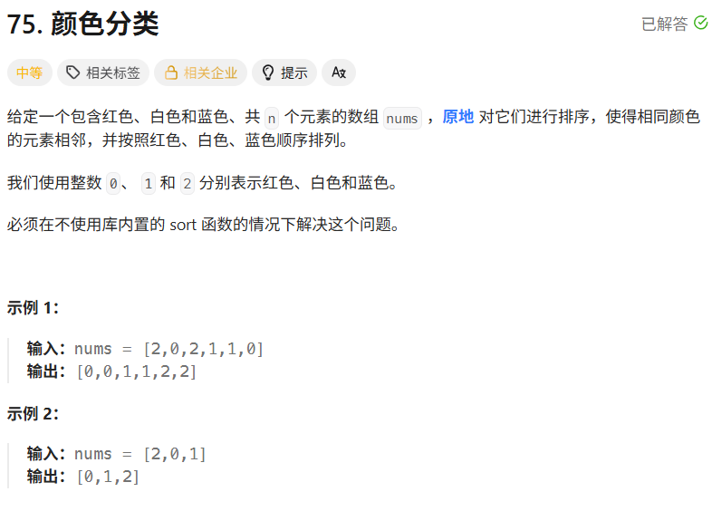
时空：时间100.00%，空间89.19%
思路：顺着遍历数组，遇到0就换到前面去，遇到2就换到后面去，换的话借助双指针实现。然后注意两个地方，不需要遍历到最后，到后面2已经放好的位置就可以停了。然后把2换到后面去的过程中，后面可能换过来一个还需要操作的数，要在原地停留一下。
代码：
```java
class Solution {

    public void sortColors(int[] nums) {

        int n = nums.length;

        int zeroPos = 0;

        int twoPos = n - 1;

        for(int i = 0;i <= twoPos;i++){

            if (nums[i] == 0) {

                nums[i] = 1;

                nums[zeroPos] = 0;

                zeroPos++;

            } else if (nums[i] == 2) {

                nums[i] = nums[twoPos];

                nums[twoPos] = 2;

                twoPos--;

                i--;

            }

        }

    }

}
```
### 78.子集
题目：
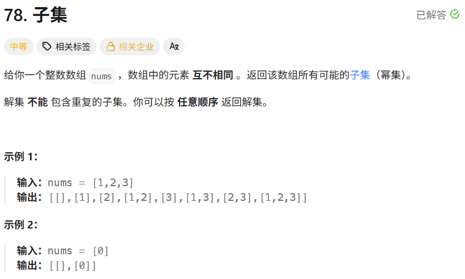
时空：时间100.00%，空间44.84%
思路：核心是回溯，不过它走的每一步都是所求，要放到结果集合里。然后比较关键的是这个begin参数吧，它指定了下一轮可以选的数，为什么传的是i + 1呢，i是这一轮放进去的数嘛，从这次往深层走的过程中看，就是前面用过的数不再用了，然后从同层的for循环后面的数来看就是，比如前面放的是1，那么前面已经把包含1的所有子集都找到了，后面是不用找了，所以传的仍然是i + 1。
代码：
```java
class Solution {

  

    List<List<Integer>> res;

  

    public List<List<Integer>> subsets(int[] nums) {

        res = new ArrayList<>();

        backTracking(nums, new ArrayList<>(), 0);

        res.add(new ArrayList<>()); // 空集

        return res;

    }

  

    private void backTracking(int[] nums, List<Integer> temp, int begin){

        if(temp.size() == nums.length) return;

  

        for(int i = begin;i < nums.length;i++){

            temp.add(nums[i]);

            res.add(new ArrayList<>(temp));

            backTracking(nums, temp, i + 1);

            temp.remove(temp.size() - 1);

        }

    }

}
```
### 79.单词搜索
题目：
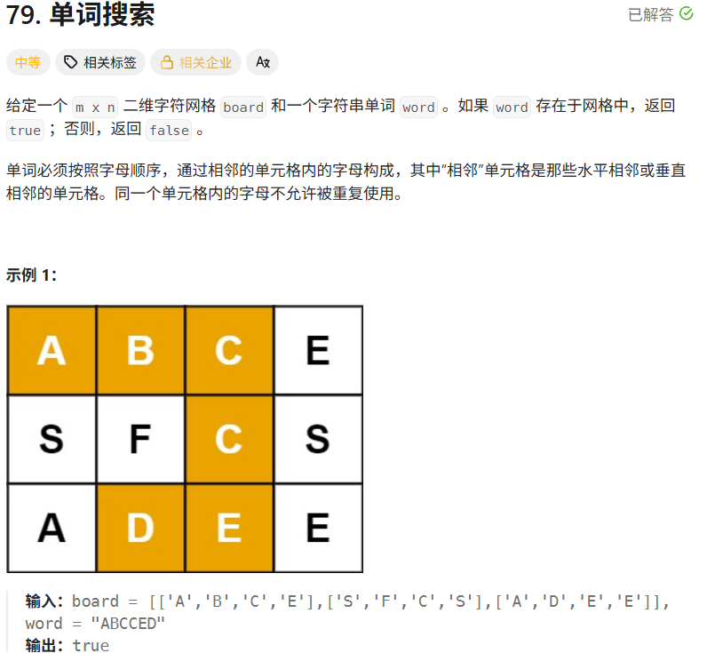
时空：时间70.63%，空间77.61%
思路：从一个入口进入（每个入口都需要尝试一下），尝试走不同路径（上下左右），到一个格子比较当前字符和所需字符是否一样（而不是走完了再去比较字符串是否相等，这样的做法可以剪枝，同时减少很多不必要的字符串操作），这里比较的话，是借助length实现的，length表示当前已经找了多少个匹配上的字符了，那么length索引的就是下一个要找的字符嘛，和当前字符比较成功，就往下走，length达到和目标字符串一样的长度的时候就找完了，可以返回true了。
代码：
```java
class Solution {

  

    private boolean res;

  

    public boolean exist(char[][] board, String word) {

        res = false;

        for(int i = 0;i < board.length;i++){

            for(int j = 0;j < board[0].length;j++){

                if(res) return res;

                backTracking(board, word, 0, i, j);

            }

        }

        return res;

    }

  

    private void backTracking(char[][] board, String word, int length, int i, int j){

        if(res) return;

        if(length == word.length()){

            res = true;

            return;

        }

  

        if(i < 0 || i >= board.length || j < 0 || j >= board[0].length) return;

  

        if(board[i][j] == '0') return;

  

        if(board[i][j] != word.charAt(length)) return;

  

        char temp = board[i][j];

        board[i][j] = '0';

        backTracking(board, word, length + 1, i - 1, j);

        backTracking(board, word, length + 1, i + 1, j);

        backTracking(board, word, length + 1, i, j - 1);

        backTracking(board, word, length + 1, i, j + 1);

        board[i][j] = temp;

    }

}
```
### 96.不同的二叉搜索树
题目：
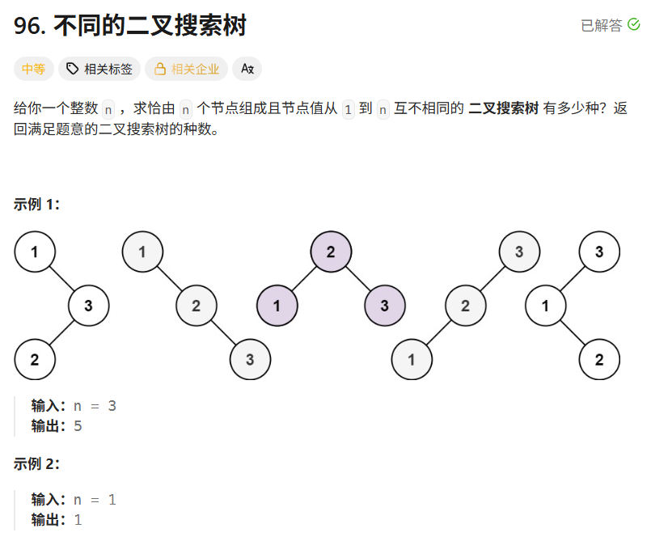
时空：时间100.00%，空间45.12%
思路：动态规划，设dp\[i]为i个结点构成的二叉搜索树的种类，记f(i,j)表示共有i个结点，然后以其中节点值为j的节点为顶点的二叉树种类。那么f(i,j) = dp\[j - 1] \*dp\[i - j - 1]（左子树种类 \* 右子树种类）。然后j取遍1-i然后加起来就可以了。
代码：
```java
class Solution {

    public int numTrees(int n) {

        if (n == 0) return 0;

        if (n == 1) return 1;

        int[] dp = new int[n + 1];

        dp[1] = 1;

        for(int i = 2;i <= n;i++){

            int sum = 0;

            // 子节点全在一边的时候记得特殊处理一下，不然 * 个0变成0了

            sum += 2 * dp[i - 1];

            for(int j = 1;j < i;j++){

                sum += dp[j - 1] * dp[i - j];

            }

            dp[i] = sum;

        }

        return dp[n];

    }

}
```
### 98.验证二叉搜索树
题目：
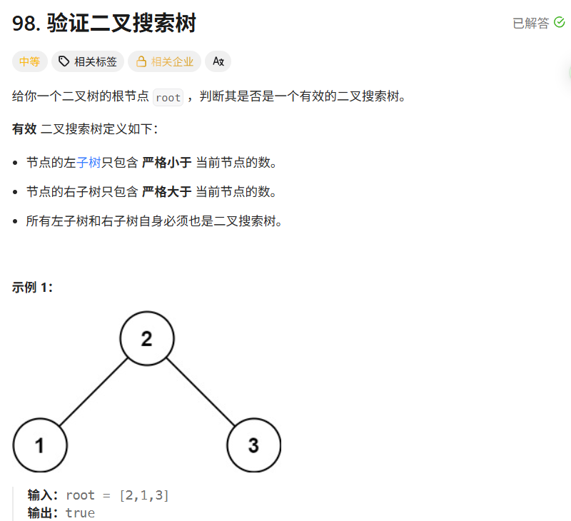
时空：时间100.00%，空间99.83%
思路：性质：节点的左子树只包含严格小于当前节点的数，右子树只包含严格大于当前节点的数。那么一个节点如果位于某个节点的左子树，那么它的值就一定要小于这个节点，位于右子树同理。那么一个节点可能既是某个节点的左子树，也同时是另外一个节点的右子树（当然也可能是左子树），那么这个节点的值就会被限定在一个范围内，看看每个节点符不符合要求就行了。
代码：
```java
/**

 * Definition for a binary tree node.

 * public class TreeNode {

 *     int val;

 *     TreeNode left;

 *     TreeNode right;

 *     TreeNode() {}

 *     TreeNode(int val) { this.val = val; }

 *     TreeNode(int val, TreeNode left, TreeNode right) {

 *         this.val = val;

 *         this.left = left;

 *         this.right = right;

 *     }

 * }

 */

class Solution {

  

    private boolean res;

  

    public boolean isValidBST(TreeNode root) {

        res = true;

        // 一开始对节点应该是没限制的，用最大的值限制，题目中的节点值的范围用Integer限制包不住，用Long

        judge(root, Long.MIN_VALUE, Long.MAX_VALUE);

        return res;

    }

  

    private void judge(TreeNode root, Long min, Long max){

        if (!res) return;

        if (root == null) return;

        if (root.val <= min || root.val >= max) {

            res = false;

            return;

        }

        judge(root.left, min, Math.min(max, root.val));

        judge(root.right, Math.max(min, root.val), max);

    }

}
```
### 102.二叉树的层序遍历
题目：
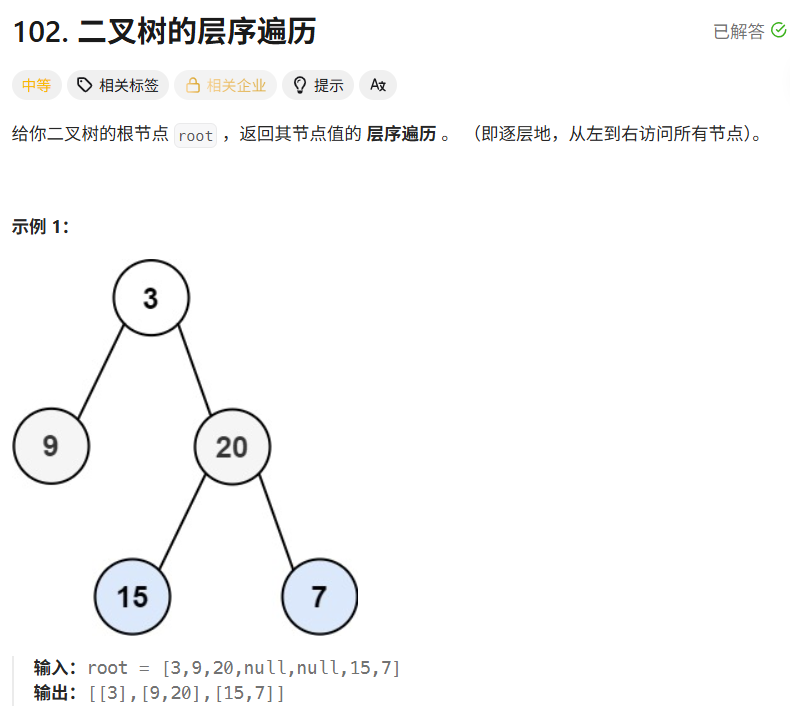
时空：时间99.99%，空间10.97%
思路：没啥好说的，基础
代码：
```java
/**

 * Definition for a binary tree node.

 * public class TreeNode {

 *     int val;

 *     TreeNode left;

 *     TreeNode right;

 *     TreeNode() {}

 *     TreeNode(int val) { this.val = val; }

 *     TreeNode(int val, TreeNode left, TreeNode right) {

 *         this.val = val;

 *         this.left = left;

 *         this.right = right;

 *     }

 * }

 */

class Solution {

    public List<List<Integer>> levelOrder(TreeNode root) {

        List<List<Integer>> res = new ArrayList<>();

        if(root == null) return res;

        Queue<TreeNode> queue = new LinkedList<>();

        queue.offer(root);

        while(!queue.isEmpty()){

            int currLayerSize = queue.size();

            List<Integer> temp = new ArrayList<>();

            for(int i = 0;i < currLayerSize;i++){

                TreeNode node = queue.poll();

                temp.add(node.val);

                if(node.left != null) queue.add(node.left);

                if(node.right != null )queue.add(node.right);

            }

            res.add(temp);

        }

        return res;

    }

}
```
### 105.从前序与中序遍历序列构造二叉树
题目：
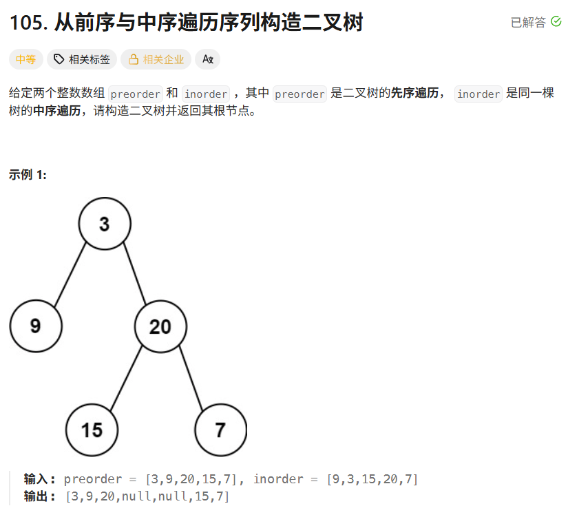
补一个条件：二叉树中每个节点值都不同
时空：时间99.11%，空间77.46%
思路：从前序遍历可以找到二叉树的根节点，然后知道了根节点，在中序遍历中就可以找到左右子树，得到其节点个数。然后再递归的构造左右子树就可以了。
代码：
```java
/**

 * Definition for a binary tree node.

 * public class TreeNode {

 *     int val;

 *     TreeNode left;

 *     TreeNode right;

 *     TreeNode() {}

 *     TreeNode(int val) { this.val = val; }

 *     TreeNode(int val, TreeNode left, TreeNode right) {

 *         this.val = val;

 *         this.left = left;

 *         this.right = right;

 *     }

 * }

 */

class Solution {

    public TreeNode buildTree(int[] preorder, int[] inorder) {

        Map<Integer, Integer> queryIndex = new HashMap<>();

        int n = inorder.length;

        for(int i = 0;i < n;i++){

            queryIndex.put(inorder[i], i);

        }

        return buildTreeInRange(preorder, 0, n, inorder, 0, n, queryIndex);

    }

  

    private TreeNode buildTreeInRange(int[] preorder, int pBegin, int pEnd,

    int[] inorder, int iBegin, int iEnd, Map<Integer, Integer> queryIndex){

        // 加一个pBegin >= inorder.length 防止溢出（构建左子树时传的pBegin + 1，而且后面还要用）

        if(pBegin > pEnd || iBegin > iEnd || pBegin >= inorder.length) return null;

        int rootVal = preorder[pBegin];

        int indexInInorder = queryIndex.get(rootVal);

        int leftSize = indexInInorder - iBegin;

        TreeNode node = new TreeNode(rootVal);

        node.left = buildTreeInRange(preorder, pBegin + 1, pBegin + leftSize

        , inorder, iBegin, indexInInorder - 1, queryIndex);

        node.right = buildTreeInRange(preorder, pBegin + leftSize + 1, pEnd

        , inorder, indexInInorder + 1, iEnd, queryIndex);

        return node;

    }

}
```
### 114.二叉树展开为链表
题目：
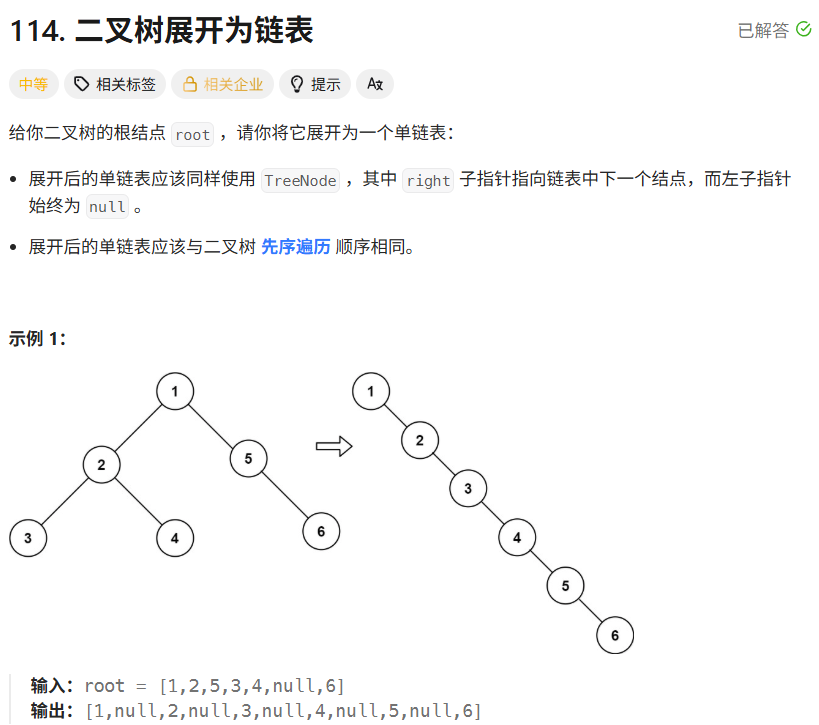
时空：时间100.00%，空间31.45%
思路：先把左右子树分别展开，然后把左子树接到右边，再把右子树节点接到原来这个左子树的最右边就行了。
代码：
```java
/**

 * Definition for a binary tree node.

 * public class TreeNode {

 *     int val;

 *     TreeNode left;

 *     TreeNode right;

 *     TreeNode() {}

 *     TreeNode(int val) { this.val = val; }

 *     TreeNode(int val, TreeNode left, TreeNode right) {

 *         this.val = val;

 *         this.left = left;

 *         this.right = right;

 *     }

 * }

 */

class Solution {

    public void flatten(TreeNode root) {

        function(root);

    }

  

    public TreeNode function(TreeNode root) {

        if(root == null) return null;

        // 右子树为空

        if(root.right == null){

            // 展开左子树，然后接到右边

            root.right = function(root.left);

            root.left = null;

            return root;

        }

        // 左子树为空

        if(root.left == null){

            root.right = function(root.right);

            return root;

        }

        // 都不为空

        // 展开右子树

        TreeNode temp = function(root.right);

        // 展开左子树，然后接到右边

        root.right = function(root.left);

        root.left = null;

        // 把右子树接到之前左子树的最右边

        TreeNode curr = root.right;

        while(curr.right != null) curr = curr.right;

        curr.right = temp;

        return root;

    }

}
```
### 128.最长连续序列
题目：
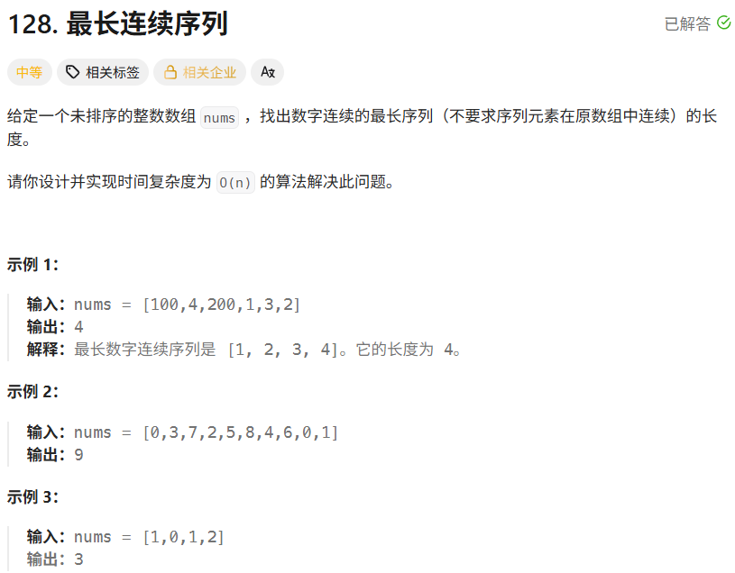
时空：时间86.70%，空间37.87%
思路：用一个HashSet把每个数字都存一下，然后可以这样找连续序列，对于每个数，找有没有比它大1的数，有的话就继续找，没有了之后记录连续的长度，更新最大值。然后如果有比它小1的数，可以跳过，因为后面小1的那个数会来找它的，它的长度肯定是更长的。
代码：
```java
class Solution {

    public int longestConsecutive(int[] nums) {

        int n = nums.length;

        int max = 0;

        Set<Integer> memory = new HashSet<>();

        for(int i = 0;i < n;i++){  

            memory.add(nums[i]);

        }

        for(Integer num:memory){

            if(memory.contains(num - 1)) continue;

            int curr = num;

            while(memory.contains(curr)){

                curr++;

            }

            max = Math.max(max, curr - num);

        }

        return max;

    }

}
```
### 139.单词拆分
题目：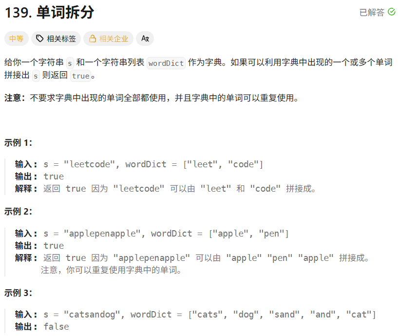
时空：时间62.84%，空间18.17%
思路：动态规划，
代码：
```java
class Solution {

    public boolean wordBreak(String s, List<String> wordDict) {

        int sl = s.length();

        boolean[] dp = new boolean[sl + 1];// dp[i]表示s的前i个字符能不能用字典中的单词拼出来

        dp[0] = true;

        for(int i = 1;i <= sl;i++){

            for(int j = 0;j < i;j++){

                if(dp[j] && wordDict.contains(s.substring(j, i))){

                    dp[i] = true;

                    break;

                }

            }

        }

        return dp[sl];

    }

}
```
### x.xx
题目：
时空：
思路：
代码：
```java

```