## 高频SQL50题(基础版)
### 查询
#### 1757.可回收且低脂的产品
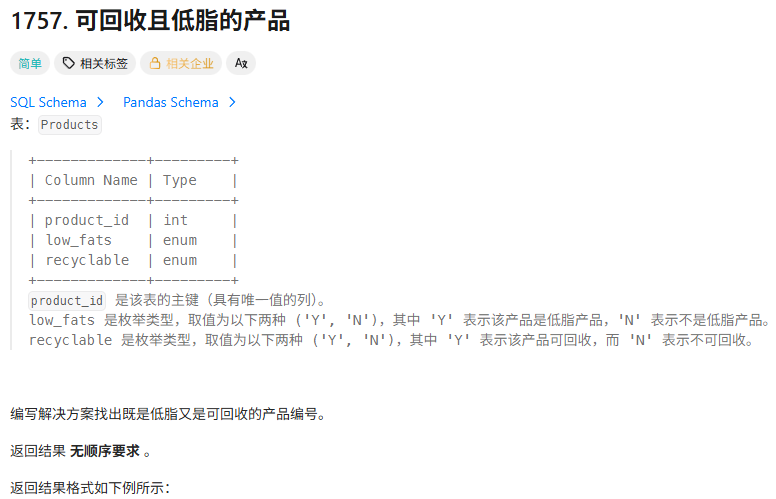
```
SELECT product_id FROM Products WHERE low_fats = 'Y' AND recyclable = 'Y'
```
#### 584.寻找用户推荐人
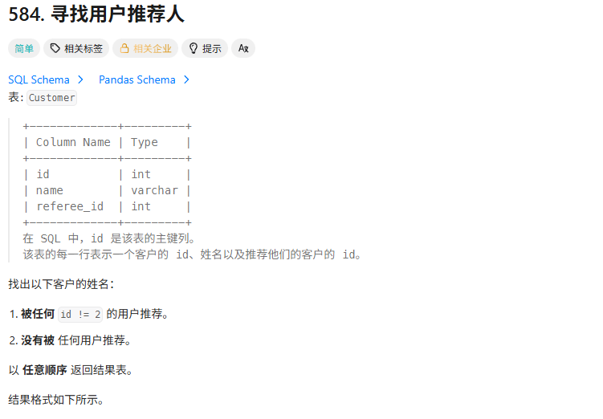
```
# 对空值的判断是IS / IS NOT NULL
 SELECT name FROM Customer WHERE referee_id != 2 or referee_id IS NULL
```
#### 595.大的国家
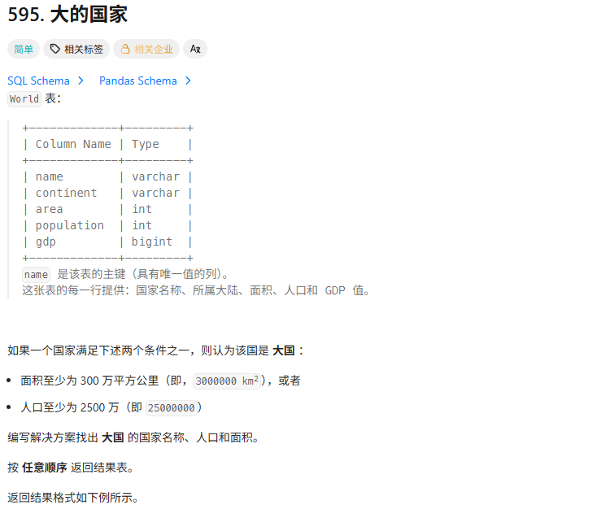
```
SELECT name, population, area 
FROM World 
where area >= 3000000 or population >= 25000000
```
#### 1148. 文章浏览|
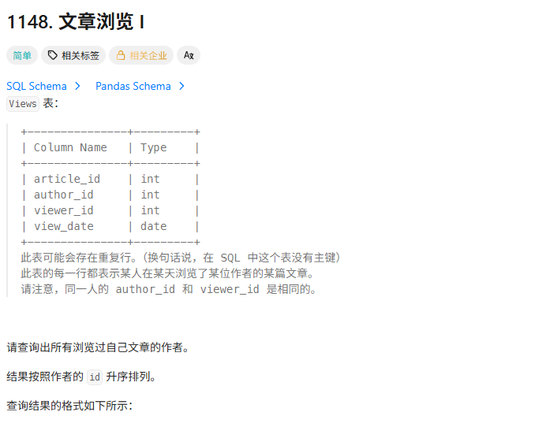
```
#这题不懂怎么去重 关键字 DISTINCT 用来查询某个字段不重复的记录
SELECT DISTINCT author_id as id
FROM Views
WHERE author_id = viewer_id
ORDER BY id
```
#### 1683.无效的推文
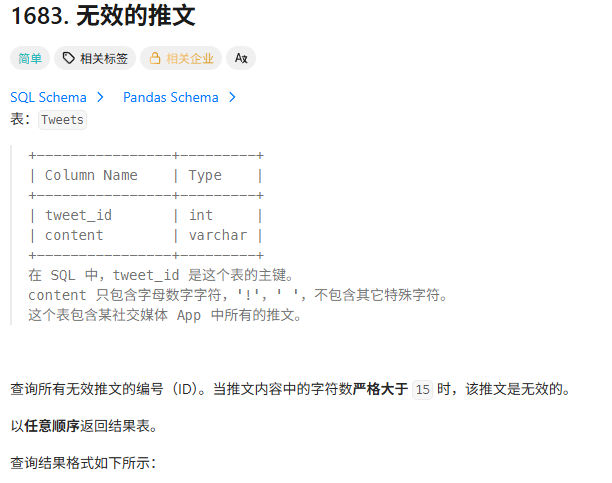
```
#判断字符串长度用length函数
SELECT tweet_id FROM Tweets WHERE length(content) > 15
```
### 连接
#### 1378.使用唯一标识码替换员工ID
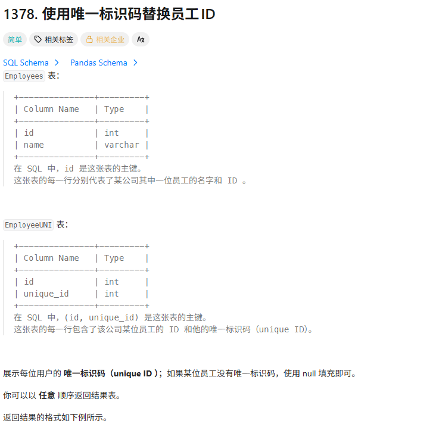

LEFT JOIN     返回左表所有的行，右表有匹配就一起输出了，没有就返回null
RIGHT JOIN  返回右表所有的行，左表有匹配就一起输出了，没有就返回null
```
# 这题不太懂没有unique ID的怎么用null填充 是用LEFT JOIN实现
SELECT EmployeeUNI.unique_id, Employees.name FROM Employees LEFT JOIN EmployeeUNI ON Employees.id = EmployeeUNI.id
```
#### 1068.产品销售分析|
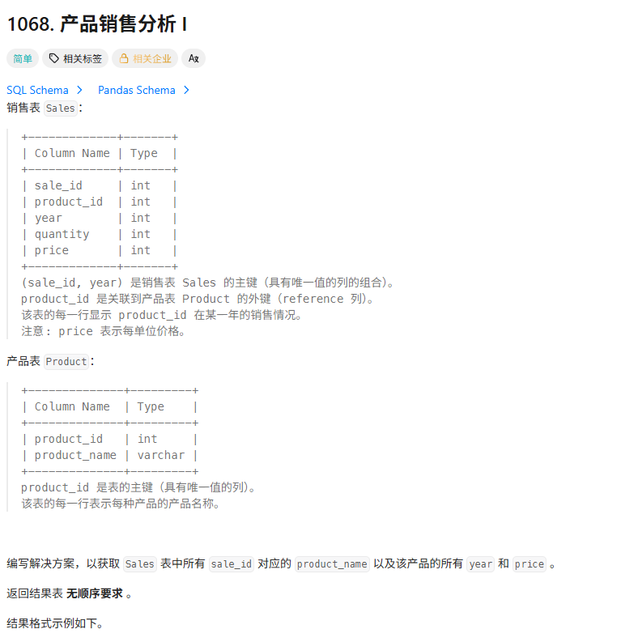
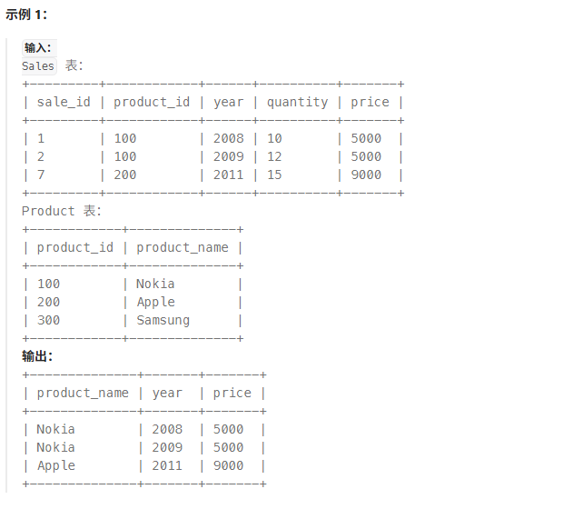
```
SELECT Product.product_name, Sales.year, Sales.price 
FROM Sales 
JOIN Product 
ON Sales.product_id = Product.product_id
```
#### 1581.进店却未进行过交易的顾客
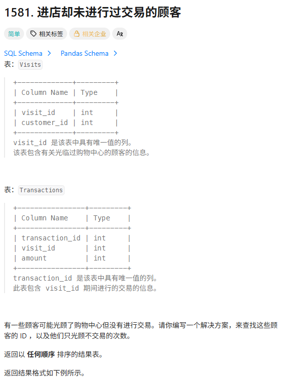
 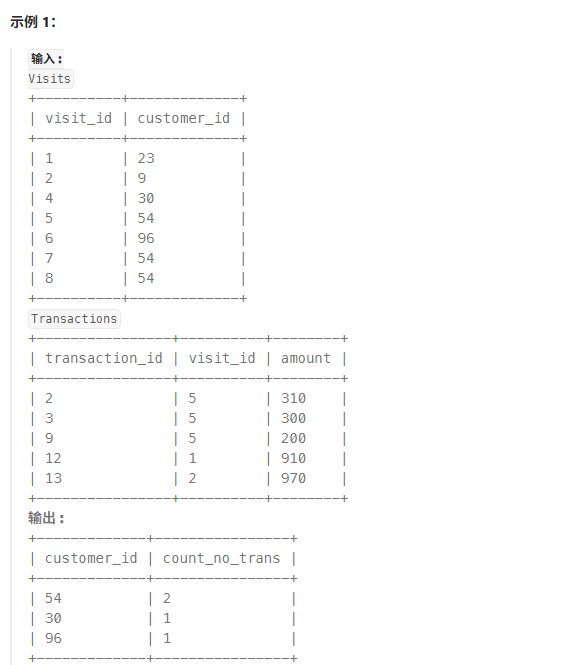
 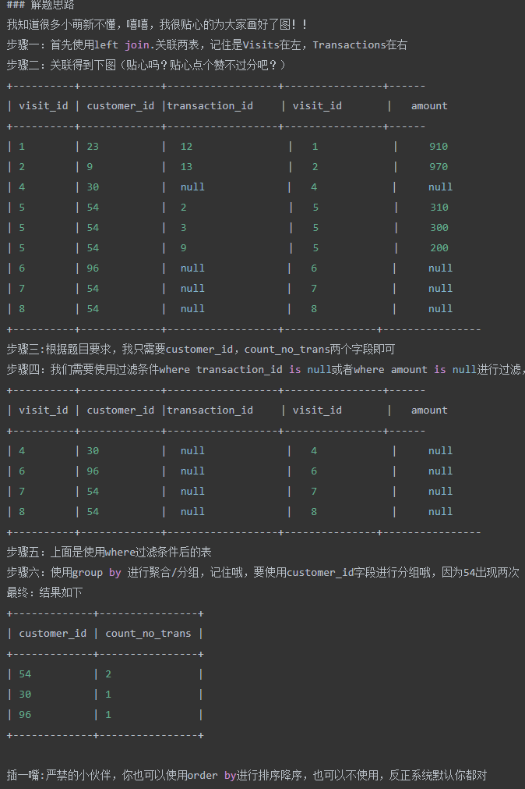
 表Visits->访问记录：哪个顾客来访了，并给这个记录分配了一个自增的id
 表Transactions->对每次访问的购买进行了记录：记录每次访问购买了几次商品及其对应的金额
 我们想要统计的是来了但是没买东西的顾客，顾客id在第一张表，而购买记录在第二张表，所以我们总是要把它们连接起来的，第二张表是购买了才记录，而我们要关注的是没有购买的，它们是不存在于第二张表，所以应该采用LEFT JOIN把没有购买的访问记录也给打出来，然后通过null进行筛选，最后进行分组和记次即可。
```
# GROUP BY customer_id 按customer_id进行了分组，这个分组并不是就是排在一起
# 而是带了一点合并的操作，打印出来其实只能看到一行了
# 这时候的其他属性，往往直接不可见了，只能通过聚合函数来统计一下
# 这里因为是按customer_id分组的，这列还是可见的
SELECT customer_id, COUNT(*) AS count_no_trans
FROM Visits
LEFT JOIN Transactions
ON Visits.visit_id = Transactions.visit_id
WHERE transaction_id IS NULL
GROUP BY customer_id
```
#### 197.上升的温度
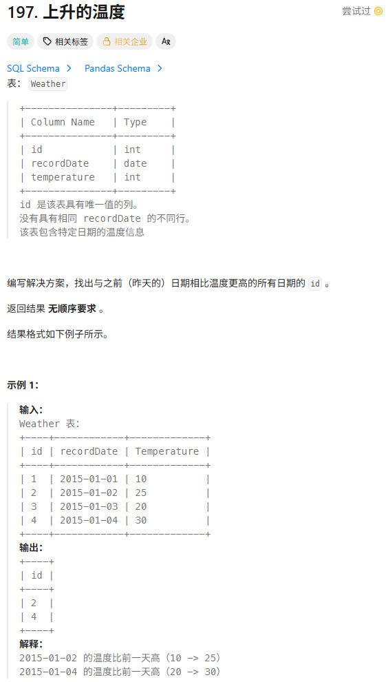
```
SELECT w1.id
FROM Weather AS w1
LEFT JOIN Weather AS w2
ON w1.recordDate = DATE_ADD(w2.recordDate, INTERVAL 1 DAY)
WHERE w1.Temperature > w2.Temperature
```
下面补充一些date参数操作的相关函数
```
SELECT NOW(); -- 示例输出: 2023-03-11 15:32:45

SELECT CURDATE(); -- 示例输出: 2023-03-11

SELECT CURTIME(); -- 示例输出: 15:32:45

SELECT DATE('2023-03-11 15:32:45'); -- 提取日期部分 示例输出: 2023-03-11 

SELECT TIME('2023-03-11 15:32:45'); -- 提取时间部分 示例输出: 15:32:45

SELECT YEAR('2023-03-11 15:32:45'); -- 提取年 示例输出: 2023

SELECT MONTH('2023-03-11 15:32:45'); -- 提取月 示例输出: 3

SELECT DAY('2023-03-11 15:32:45'); -- 提取天 示例输出: 11

SELECT DATEDIFF('2023-03-11', '2023-03-04'); -- 计算两个日期的天数差 示例输出: 7

SELECT TIMEDIFF('23:59:59', '12:00:00'); -- 计算两个时间的时间差 示例输出: 11:59:59

SELECT TIMESTAMPDIFF(HOUR, '2023-03-11 15:00:00', '2023-03-11 16:00:00'); 
-- 以指定单位计算两个日期时间的差值 示例输出: 1

SELECT DATE_FORMAT('2023-03-11 15:32:45', '%Y-%m-%d %H:%i:%s'); 
-- 格式化日期时间为指定字符串 示例输出: 2023-03-11 15:32:45

SELECT TIME_FORMAT('15:32:45', '%H:%i:%s'); 
-- 格式化时间为指定字符串 示例输出: 15:32:45

SELECT LAST_DAY('2023-03-11'); -- 获取指定日期所在月份的最后一天 示例输出: 2023-03-31

SELECT ADDDATE('2023-03-11', INTERVAL 7 DAY); 
-- 在日期上加上指定的天数 示例输出: 2023-03-18

SELECT SUBDATE('2023-03-11', INTERVAL 7 DAY); 
-- 在日期上减去指定的天数 示例输出: 2023-03-04
```
