### 分布式基础
单体架构：所有功能模块都在一个项目
开发和部署简单，但无法应对高并发


集群架构：
可以解决高并发，但无法做到灵活的模块化升级（改一个模块要全部重新打包部署、不支持不同组件用不同语言开发）


分布式架构：一个大型应用被拆分成很多小应用（例如商品、订单、支付、用户、物流、直播）分布部署在各个机器（包括服务器、数据库、中间件）
支持数据隔离、多语言


一项服务的多个副本不能都挂在同一个服务器，这样如果那个服务器挂了这个服务就用不了了。所以要分着部署在多条服务器，防止单点故障。
然后不同的服务可能部署在不同的服务器，它们之间要互相调用的话要通过远程调用（RPC, Remote Procedure Call）。
如何知道对应服务部署在哪个服务器呢，对应服务上线/挂了怎么更新信息呢 -> 注册中心（包含服务发现和服务注册功能）有多个结合负载均衡使用就好了。
可以通过配置中心统一管理配置 
如果许多服务都要调用其中一个服务，而这个服务卡了，那么可能就会导致整个系统的瘫痪（服务雪崩），解决方案就是服务熔断（许多请求超时了，那么之后就不再继续发请求，而是直接判断为失败快速返回，防止请求堆积）。
请求时通过网关 + 注册中心，根据路由，把请求发送到对应的服务器
其中涉及到的各个部分的常用组件
微服务：SpringBoot
注册中心/配置中心：Spring Cloud Alibaba Nacos
网关：Spring Cloud Gateway
远程调用：Spring Cloud OpenFeign
服务熔断：Spring Cloud Alibaba Sentinel
分布式事务：Spring Cloud Alibaba Seata
该教程的版本选择

创建微服务项目
工程结构


-> next -> create
删除一些没用的

删除完


pom文件修改
在\<groupId>上方添加
```xml
<packaging>pom</packaging>
```
删除
```xml
<url/>  
<licenses>  
    <license/>
</licenses>  
<developers>  
    <developer/>
</developers>  
<scm>  
    <connection/>    
    <developerConnection/>    
    <tag/>    
	<url/>
</scm>
```
src文件夹也可以删了
SpringBoot版本改为3.3.4
```xml
<parent>  
    <groupId>org.springframework.boot</groupId>  
    <artifactId>spring-boot-starter-parent</artifactId>  
    <version>3.3.4</version>  
    <relativePath/> <!-- lookup parent from repository -->  
</parent>
```
删除
```xml
<dependencies>  
    <dependency>        <groupId>org.springframework.boot</groupId>  
        <artifactId>spring-boot-starter</artifactId>  
    </dependency>  
    <dependency>        <groupId>org.springframework.boot</groupId>  
        <artifactId>spring-boot-starter-test</artifactId>  
        <scope>test</scope>  
    </dependency></dependencies>
```
新增配置
```xml
<properties>  
    <java.version>21</java.version>  
    <maven.compiler.source>21</maven.compiler.source>  
    <maven.compiler.target>21</maven.compiler.target>  
    <project.build.sourceEncoding>UTF-8</project.build.sourceEncoding>  
    <spring-cloud.version>2023.0.3</spring-cloud.version>  
    <spring-cloud-alibaba.version>2023.0.3.2</spring-cloud-alibaba.version>  
</properties>
<dependencyManagement>  
    <dependencies>        
	    <dependency>            
		    <groupId>org.springframework.cloud</groupId>  
            <artifactId>spring-cloud-dependencies</artifactId>  
            <version>${spring-cloud.version}</version>  
            <type>pom</type>  
            <scope>import</scope>  
        </dependency>        
        <dependency>            
	        <groupId>com.alibaba.cloud</groupId>  
            <artifactId>spring-cloud-alibaba-dependencies</artifactId>  
            <version>${spring-cloud-alibaba.version}</version>  
            <type>pom</type>  
            <scope>import</scope>  
        </dependency>    
    </dependencies>
</dependencyManagement>
```
新建一个module


一样在service的pom添加

然后src文件夹也可以删了
在services下创建两个子模块 service-product、service-order

在services的pom中导入依赖，子模块也都会有
```xml
<dependencies>  
    <!--服务发现 -->  
    <dependency>  
        <groupId>com.alibaba.cloud</groupId>  
        <artifactId>spring-cloud-starter-alibaba-nacos-discovery</artifactId>  
    </dependency>    
<!--远程调用 -->  
    <dependency>  
        <groupId>org.springframework.cloud</groupId>  
        <artifactId>spring-cloud-starter-openfeign</artifactId>  
        <version>5.0.0</version>  
    </dependency>
</dependencies>
```

maven显示中勾上这个，可以按继承关系显示

### Nacos
#### 注册中心

服务注册：各项服务及副本在哪个服务器上
服务发现：找到各项服务及服务所在的服务器，向它们发起请求
安装

进入到bin文件夹下，打开命令行输入下面的命令。启动成功后进入对应网址就可以看到对应内容了
```
startup.cmd -m standalone
```
##### 服务注册
流程
1.启动微服务（SpringBoot微服务web项目启动）
2.引入服务发现依赖（spring-cloud-starter-alibaba-nacos-discovery）
3.配置Nacos地址（spring.cloud.nacos.server-addr=127.0.0.1:8848）
4.查看注册中心效果（访问http://localhost:8848/nacos）
5.集群模式启动测试（单机情况下通过改变端口模拟微服务集群）
order的pom中添加web项目依赖
```xml
<dependencies>  
    <dependency>        
	    <groupId>org.springframework.boot</groupId>  
        <artifactId>spring-boot-starter-web</artifactId>  
    </dependency>
</dependencies>
```
服务发现在services中一起引入了
在order中创建启动类

```java
package com.flowers.order;  
  
import org.springframework.boot.SpringApplication;  
import org.springframework.boot.autoconfigure.SpringBootApplication;  
  
@SpringBootApplication  
public class OrderMainApplication {  
    public static void main(String[] args) {  
        SpringApplication.run(OrderMainApplication.class, args);  
    }  
}
```
resources文件夹下创建配置文件application.properties
```
spring.application.name=service-order  
server.port=8000  
  
spring.cloud.nacos.server-addr=127.0.0.1:8848
```
最后一个是告诉这个应用nacos注册中心在哪，这样才能把这个应用注册
然后启动服务，在Nacos中就可以看到了

同样的去配置service-product
多端口启动
点到左下方的services，看看有没有对应的服务，没有SpringBoot的话点击"+" -> Run Configuration选择Spring Boot就可以看到了，然后右键对应的服务可以复制产生副本。
然后Options中选上Program arguments，可以修改端口


然后创建完全部启动


##### 服务发现
1.开启服务发现功能（@EnableDiscoveryClient）
这个注解是加在启动类上的，后面两步其实都是随便试试，后面可以自动搞的，不用自己掉api，主要做的就是在启动类上加上这个注解。
2.测试服务发现API（DiscoveryClient）
3.测试服务发现API（NacosServiceDiscovery）
注解加上后在pom里加入测试相关依赖
```
<dependency>  
    <groupId>org.springframework.boot</groupId>  
    <artifactId>spring-boot-starter-test</artifactId>  
    <scope>test</scope> <!--仅在测试文件夹生效-->  
</dependency>
```
测试

```java
package com.flowers.product;  
  
import com.alibaba.cloud.nacos.discovery.NacosServiceDiscovery;  
import com.alibaba.nacos.api.exception.NacosException;  
import org.junit.jupiter.api.Test;  
import org.springframework.beans.factory.annotation.Autowired;  
import org.springframework.boot.test.context.SpringBootTest;  
import org.springframework.cloud.client.ServiceInstance;  
import org.springframework.cloud.client.discovery.DiscoveryClient;  
  
import java.util.List;  
  
@SpringBootTest(classes = ProductMainApplication.class) // 解决找不到主启动类  
public class DiscoveryTest {  
  
    // 所有注册中心都可以用它的api  
    @Autowired  
    DiscoveryClient discoveryClient;  
  
    // Nacos才能用  
    @Autowired  
    NacosServiceDiscovery nacosServiceDiscovery;  
  
    @Test  
    void discoveryClientTest(){  
        // ..getServices 可以看到注册中心所有服务的名字  
        for(String service : discoveryClient.getServices()){  
            System.out.println("service = " + service);  
            // 获取ip+port  
            List<ServiceInstance> instances = discoveryClient.getInstances(service);  
            for(ServiceInstance instance : instances){  
                System.out.println("ip = " + instance.getHost() +  ", port = " + instance.getPort());  
            }  
        }  
    }  
  
    @Test  
    void nacosServiceDiscoveryTest() throws NacosException {  
        for(String service : nacosServiceDiscovery.getServices()){  
            System.out.println("service = " + service);  
            List<ServiceInstance> instances = nacosServiceDiscovery.getInstances(service);  
            for(ServiceInstance instance : instances){  
                System.out.println("ip = " + instance.getHost() +  ", port = " + instance.getPort());  
            }  
        }  
    }  
}
```
#####  编写微服务API+远程调用基本实现


API可以通过远程调用，不过一些其他服务的对象，本服务要用的话就会比较麻烦，这里先新创建一个Module。

所有微服务的数据模型都放在里面

然后每个服务都要用这里面的对象，所以可以去services里面添加它的依赖
相关代码
Order对象
```java
package com.flowers.order.bean;  
  
import com.flowers.product.bean.Product;  
import lombok.Data;  
  
import java.math.BigDecimal;  
import java.util.List;  
  
@Data  
public class Order {  
    private Long id;  
    private BigDecimal totalAmount;  
    private Long userId;  
    private String nickName;  
    private String address;  
    private List<Product> productList;  
}
```
Product对象
```java
package com.flowers.product.bean;  
  
import lombok.Data;  
  
import java.math.BigDecimal;  
  
@Data  
public class Product {  
    private Long id;  
    private BigDecimal price;  
    private String name;  
    private int num;  
}
```
OrderController
```java
package com.flowers.order.controller;  
  
import com.flowers.order.bean.Order;  
import com.flowers.order.service.OrderService;  
import org.springframework.beans.factory.annotation.Autowired;  
import org.springframework.web.bind.annotation.GetMapping;  
import org.springframework.web.bind.annotation.RequestParam;  
import org.springframework.web.bind.annotation.RestController;  
  
@RestController  
public class OrderController {  
  
    @Autowired  
    OrderService orderService;  
  
    @GetMapping("/create")  
    public Order createOrder(@RequestParam("productId") Long productId, @RequestParam("userId") Long userId) {  
        return orderService.createOrder(productId, userId);  
    }  
}
```
OrderServiceimpl
```java
package com.flowers.order.service.impl;  
  
import com.flowers.order.bean.Order;  
import com.flowers.order.service.OrderService;  
import com.flowers.product.bean.Product;  
import lombok.extern.slf4j.Slf4j;  
import org.springframework.beans.factory.annotation.Autowired;  
import org.springframework.cloud.client.ServiceInstance;  
import org.springframework.cloud.client.discovery.DiscoveryClient;  
import org.springframework.stereotype.Service;  
import org.springframework.web.client.RestTemplate;  
  
import java.math.BigDecimal;  
import java.util.List;  
import java.util.Random;  
  
@Service  
@Slf4j  
public class OrderServiceimpl implements OrderService {  
  
    @Autowired  
    DiscoveryClient discoveryClient;  
    @Autowired  
    RestTemplate restTemplate;  
  
    @Override  
    public Order createOrder(Long productId, Long userId) {  
        Product product = getProductFromRemote(productId);  
        Order order = new Order();  
        order.setId(1L);  
        order.setTotalAmount(new BigDecimal(product.getNum()).multiply(product.getPrice()));  
        order.setUserId(userId);  
        order.setAddress("福建省龙岩市新罗区");  
        order.setNickName("花落为谁念");  
        order.setProductList(List.of(product));  
        return order;  
    }  
  
    private Product getProductFromRemote(Long productId) {  
        // 1.获取商品服务所在的所有机器IP + 端口  
        List<ServiceInstance> instances = discoveryClient.getInstances("service-product");  
        // 随机挑选一个 负载均衡  
        Random random = new Random();  
        int index = random.nextInt(instances.size());  
        ServiceInstance instance = instances.get(index);  
        // 远程URL  
        String url = "http://" + instance.getHost() + ":" + instance.getPort() + "/product/" + productId;  
        log.info("远程请求:{}", url);  
        // 2.给远程发送请求  
        return restTemplate.getForObject(url, Product.class);  
    }  
}
```
OrderConfig
```java
package com.flowers.order.config;  
  
import org.springframework.context.annotation.Bean;  
import org.springframework.context.annotation.Configuration;  
import org.springframework.web.client.RestTemplate;  
  
@Configuration  
public class OrderServiceConfig {  
  
    @Bean  
    public RestTemplate restTemplate() {  
        return new RestTemplate();  
    }  
}
```
ProductController
```java
package com.flowers.product.controller;  
  
import com.flowers.product.bean.Product;  
import com.flowers.product.service.ProductService;  
import org.springframework.beans.factory.annotation.Autowired;  
import org.springframework.web.bind.annotation.GetMapping;  
import org.springframework.web.bind.annotation.PathVariable;  
import org.springframework.web.bind.annotation.RestController;  
  
@RestController  
public class ProductController {  
  
    @Autowired  
    ProductService productService;  
  
    /**  
     * 查询商品  
     * @param productId 商品Id  
     */    @GetMapping("/product/{id}")  
    public Product getProduct(@PathVariable("id") Long productId) {  
        return productService.getProductById(productId);  
    }  
}
```
ProductServiceimpl
```java
package com.flowers.product.service.impl;  
  
import com.flowers.product.bean.Product;  
import com.flowers.product.service.ProductService;  
import org.springframework.stereotype.Service;  
  
import java.math.BigDecimal;  
  
@Service  
public class ProductServiceimpl implements ProductService {  
  
    @Override  
    public Product getProductById(Long productId) {  
        Product product = new Product();  
        product.setId(productId);  
        product.setPrice(new BigDecimal("100"));  
        product.setName("测试商品");  
        product.setNum(5);  
        return product;  
    }  
}
```
##### 负载均衡API测试
1.引入负载均衡依赖（spring-cloud-starter-loadbalancer）
Order的pom.xml中引入
```xml
<dependency>  
    <groupId>org.springframework.cloud</groupId>  
    <artifactId>spring-cloud-starter-loadbalancer</artifactId>  
</dependency>
```
2.测试负载均衡API（LoadBalancerClient）
Order的pom.xml中引入
```xml
<dependency>  
    <groupId>org.springframework.boot</groupId>  
    <artifactId>spring-boot-starter-test</artifactId>  
    <scope>test</scope>  
</dependency>
```

3.测试远程调用（RestTemplate0
```java
package com.flowers.order;  
  
import org.junit.jupiter.api.Test;  
import org.springframework.beans.factory.annotation.Autowired;  
import org.springframework.boot.test.context.SpringBootTest;  
import org.springframework.cloud.client.ServiceInstance;  
import org.springframework.cloud.client.loadbalancer.LoadBalancerClient;  
  
@SpringBootTest  
public class LoadBalancerTest {  
  
    @Autowired  
    LoadBalancerClient loadBalancerClient;  
  
    @Test  
    void test(){  
        ServiceInstance choose = loadBalancerClient.choose("service-product");  
        System.out.println("choose:" + choose.getHost() + ":" + choose.getPort());  
        choose = loadBalancerClient.choose("service-product");  
        System.out.println("choose:" + choose.getHost() + ":" + choose.getPort());  
        choose = loadBalancerClient.choose("service-product");  
        System.out.println("choose:" + choose.getHost() + ":" + choose.getPort());  
        choose = loadBalancerClient.choose("service-product");  
        System.out.println("choose:" + choose.getHost() + ":" + choose.getPort());  
        choose = loadBalancerClient.choose("service-product");  
        System.out.println("choose:" + choose.getHost() + ":" + choose.getPort());  
    }  
}
```
4.测试负载均衡调用
```java
private Product getProductFromRemoteWithLoadBalance(Long productId) {  
    // 1.通过负载均衡选择一个服务/副本  
    ServiceInstance instance = loadBalancerClient.choose("service-product");  
    // 远程URL  
    String url = "http://" + instance.getHost() + ":" + instance.getPort() + "/product/" + productId;  
    log.info("远程请求:{}", url);  
    // 2.给远程发送请求  
    return restTemplate.getForObject(url, Product.class);  
}
```
##### @LoadBalanced注解式负载均衡
把这个注解加到远程调用客户端上就可以了，以后也多用这种形式
```java
@Configuration  
public class OrderServiceConfig {  
  
    @LoadBalanced  
    @Bean    public RestTemplate restTemplate() {  
        return new RestTemplate();  
    }  
}
```
##### 经典面试题
如果注册中心宕机，远程调用还能成功吗？
目前的步骤是
1.去注册中心获取微服务地址列表
2.给对方服务的某个地址发送请求
核心是给对方服务发送请求，那么每次多一次获取请求地址其实是比较慢的
改进方式就是获取一次，然后存储在缓存中（服务一般是不会挂的，变动不频繁），然后可以让缓存实时和注册中心同步消息，有新增/挂了都同步一下。
这时候如果注册中心挂了
之前调用过，那么还可以正常远程调用（之前的服务没挂）
之前没调用过，是第一次调用，那么就不行了
#### 配置中心

之前某个服务要更新配置，需要把这个服务下线然后重新打包上线，中间需要停机，有了配置中心之后就可以不停机更新。
##### 基本用法

在services的pom中引入依赖
```xml
<!-- 配置中心 -->  
<dependency>  
    <groupId>com.alibaba.cloud</groupId>  
    <artifactId>spring-cloud-starter-alibaba-nacos-config</artifactId>  
</dependency>
```
在order的application.properties添加下面这行
```yaml
spring.config.import=nacos:service-order.properties
```
代表希望项目启动后导入这个配置，然后可以在nacos的配置管理中创建配置，Data Id需要设置为service-order.properties


然后就可以在order.controller里面测试能不能用了
```java
@Value("${order.timeout}")  
String orderTimeout;  
@Value("${order.auto-confirm}")  
String autoConfirm;  
  
@GetMapping("/getConfig")  
public String getConfig(){  
    return "order.timeout:"+orderTimeout+",autoConfirm:"+autoConfirm;  
}
```

不过此时修改配置文件，运行的代码还不能实时感知到，需要加上@RefreshScope这个注解
```java
@RefreshScope  
@RestController  
public class OrderController 
```
如果统一导了配置中心依赖，但是某个微服务没配置，这时候是会报错的。可以先禁用导入检查
```
spring.cloud.nacos.config.import-check.enabled=false
```
##### 动态刷新

第二种方法操作步骤
创建一个properties类，把之前的变量去掉前缀放进来，然后加对应的注解
```java
package com.flowers.order.properties;  
  
import lombok.Data;  
import org.springframework.boot.context.properties.ConfigurationProperties;  
import org.springframework.stereotype.Component;  
  
@Component  
@ConfigurationProperties(prefix = "order") // 配置批量绑定，在nacos下，可以无需@RefreshScope就能实现自动刷新  
@Data  
public class OrderProperties {  
  
    String timeOut;  
    String autoConfirm;  
}
```
之后就可以都从这个类中获取配置了
```java
@Autowired  
OrderProperties orderProperties;  
  
@GetMapping("/getConfig")  
public String getConfig(){  
    return "order.timeout:"+ orderProperties.getTimeOut() +",autoConfirm:" + orderProperties.getAutoConfirm();  
}
```
##### 配置监听
是上面所说的第三种方式，是在对应启动类中加下面的代码。只要Nacos中的配置变了一个，全部都会拿到其实。
```java
// 1.项目启动就监听配置文件变化  
// 2.发送变化后拿到变化值  
// 3.发送邮件  
  
// ApplicationRunner是一个一次性的任务，项目启动后就会执行  
@Bean // 加了这个注解后，方法的参数也会自动从容器中拿  
ApplicationRunner applicationRunner(NacosConfigManager nacosConfigManager){  
    return new ApplicationRunner() {  
        @Override  
        public void run(ApplicationArguments args) throws Exception {  
            ConfigService configService = nacosConfigManager.getConfigService();  
            configService.addListener("service-order.properties",  
                    "DEFAULT_GROUP",  
                    new Listener() {  
                        @Override  
                        public Executor getExecutor() {  
                            return Executors.newFixedThreadPool(4);  
                        }  
  
                        @Override  
                        public void receiveConfigInfo(String s) {  
                            System.out.println("变化的配置信息" + s);  
                            System.out.println("邮件通知...");  
                        }  
                    });  
            System.out.println("=============开始监听配置文件变化=============");  
        }  
    };  
}
```
##### 经典面试题
Nacos中的数据集和application.properties有相同的配置项，哪个生效？
以Nacos中配置中心的为准。（引入配置中心的目的就是统一管理各个微服务的配置，它肯定是要高优先级的）
配置优先级规则
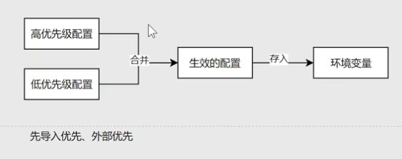
高优先级里面声明过了，低优先级里相同的东西就会被丢弃掉。都是导入的话，排在前面的优先级高。
##### 数据隔离-namespace区分多环境
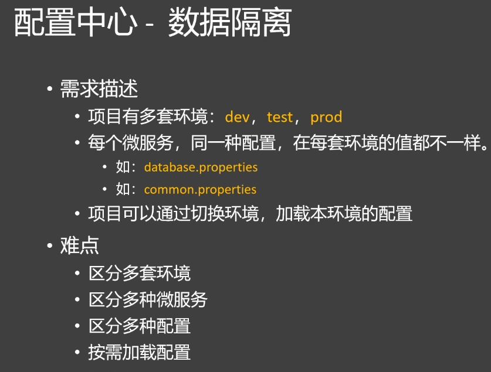
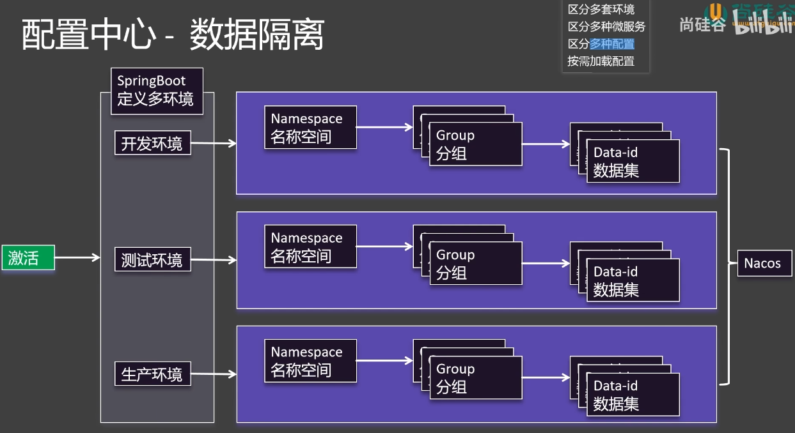
Namespace区分不同环境（在配置列表的上分可以选）、Group区分不同微服务（创建配置时可以选）、不同Data区分不同的配置
要在多个环境创建配置环境的时候可以用一下克隆功能，会方便点。
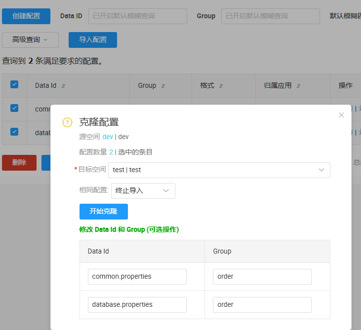
##### 数据隔离动态切换环境
重新写个yaml配置文件，在配置里面可以设置namespace、group
注意yaml上下级之间差两个空格，然后：后面要带个空格
```yaml
server:  
  port: 8000  
  
spring:  
  application:  
    name: order-service  
  cloud:  
    nacos:  
      server-addr: 127.0.0.1:8848  
      config:  
        namespace: dev  
  config:  
    import:  
      - nacos:common.properties?group=order  
      - nacos:database.properties?group=order
```
不过不同环境下的配置文件也可能是不一样的，可以这样配置
```yaml
server:  
  port: 8000  
  
spring:  
  profiles:  
    active: dev  
  application:  
    name: order-service  
  cloud:  
    nacos:  
      server-addr: 127.0.0.1:8848  
      config:  
        namespace: ${spring.profiles.active:dev} #冒号后面是默认值  
  
---  
spring:  
  config:  
    import:  
      - nacos:common.properties?group=order  
      - nacos:database.properties?group=order  
    activate:  
      on-profile: dev  
---  
spring:  
  config:  
    import:  
      - nacos:common.properties?group=order  
      - nacos:database.properties?group=order  
    activate:  
      on-profile: test  
---  
spring:  
  config:  
    import:  
      - nacos:common.properties?group=order  
      - nacos:database.properties?group=order  
    activate:  
      on-profile: prod
```
### OpenFeign
#### 远程调用
##### 声明式实现
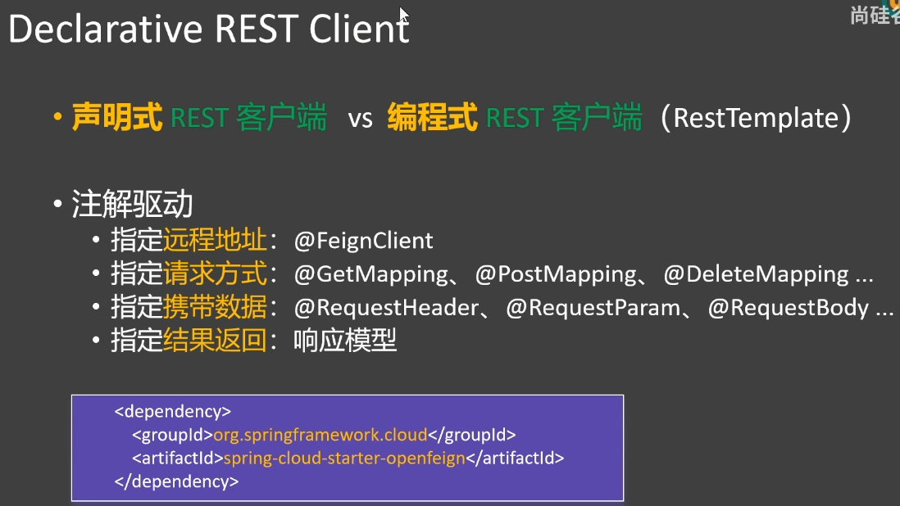
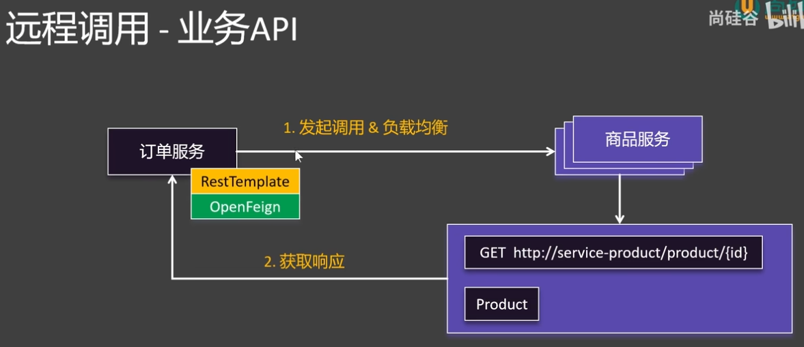
1.在要用远程调用的启动类上添加@EnableFeignClients注解
2.创建调用Product API的FeignClient
```java
package com.flowers.order.feigh;  
  
import com.flowers.product.bean.Product;  
import org.springframework.cloud.openfeign.FeignClient;  
import org.springframework.web.bind.annotation.GetMapping;  
import org.springframework.web.bind.annotation.PathVariable;  
  
@FeignClient(value = "service-product") // Feign客户端  value里面的就是要调用的对方微服务的名字  
public interface ProductFeignClient {  
  
    // 复用了MVC注解，这里是指定要发送请求的地址  
    // 然后@PathVariable是把你的参数放到url上  
    @GetMapping("/product/{id}")  
    Product getProductById(@PathVariable("id") Long id);  
  
}
```
获取对方服务的IP + Port还有负载均衡这个feign自动帮你做了
然后直接用就好了
```java
Product product = productFeignClient.getProductById(productId);
```
##### 第三方API
调用外部的一些api，没在注册中心里面的
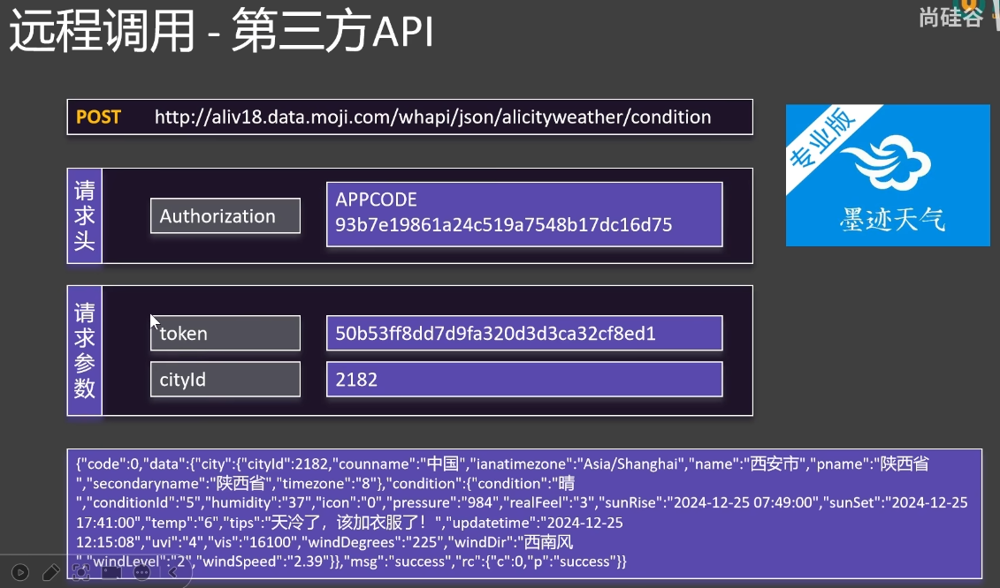
```java
package com.flowers.order.feigh;  
  
import org.springframework.cloud.openfeign.FeignClient;  
import org.springframework.web.bind.annotation.PostMapping;  
import org.springframework.web.bind.annotation.RequestHeader;  
import org.springframework.web.bind.annotation.RequestParam;  
  
// value随便写一个就行，url写其域名部分   路径先不要写  
// 如果指定了url，那么就是给这个位置发送请求，然后在方法上在指定请求路径  
// 没有指定url，就是给value的微服务发送请求，feign需要自动连上注册中心，找到对应IP+port再负载均衡
@FeignClient(value = "weather-client", url = "http://aliv18.data.moji.com")  
public interface WeatherFeignClient {  
  
    // 后面的路径  
    @PostMapping("/whapi/json/alicityweather/condition")  
    String getWeather(@RequestHeader("Authorization") String auth  
            , @RequestParam("token") String token, @RequestParam("cityId") String cityId);  
}
```
##### 小技巧&面试题
如果是要调用内部微服务的API，去对应的controller里面把方法签名cv过来就可以了。是一样的。
第三方的话就根据对方的文档写了。
客户端负载均衡与服务端负载均衡区别？
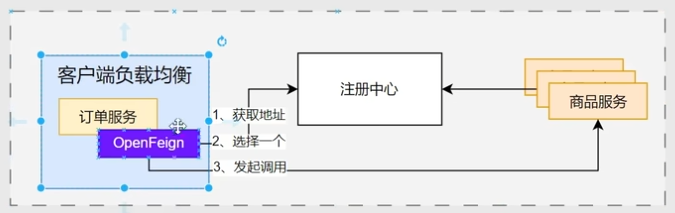
获取到对方的所有服务地址，然后在**客户端**这里进行负载均衡，选择一个调用。
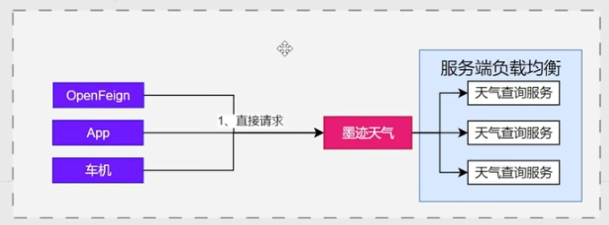
客户端给服务端发请求，然后**服务端**进行负载均衡，选一个处理请求并返回
#### 进阶配置
##### 日志
正常只能看到调用完的结果，看不到请求内容。想要看到详细请求信息的话就需要开启日志功能。
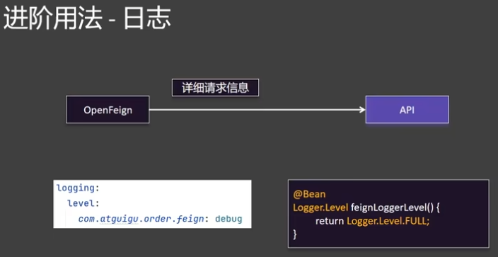
1.添加配置
```yaml
logging:  
  level:  
    com.flowers.order.feign: debug
```
2.添加日志记录组件
```java
@Bean  
Logger.Level feignLoggerLevel(){  
    return Logger.Level.FULL;  
}
```
##### 超时控制-默认效果
为了避免一个服务的卡顿导致全链路的崩溃，需要引入超时控制
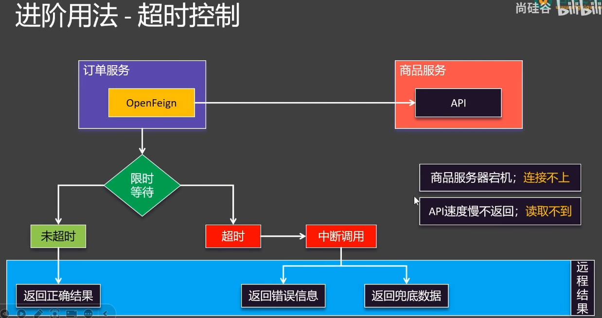
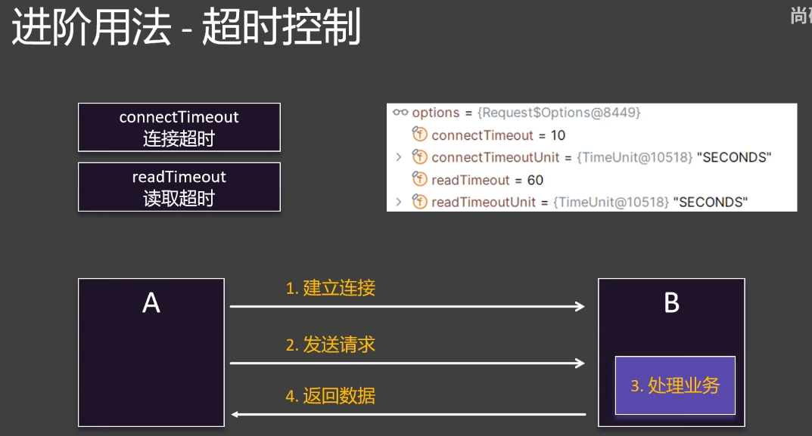
连接超时->看步骤1所需时间  默认10秒
读取超时->看步骤2、3、4所需时间  默认60秒
目前是默认返回错误信息，返回兜底数据要学了后面熔断才可以做
##### 超时配置
新建一个application-feign.yml
```yaml
spring:  
  cloud:  
    openfeign:  
      client:  
        config:  
          default:  
            logger-level: full  
            connect-timeout: 1000  
            read-timeout: 2000  
          service-product: # 是@FeignClient注解中value的值（没配置contextId的话，有配置就是这个id）  
            logger-level: full  
            connect-timeout: 3000  
            read-timeout: 5000
```
在主yaml中include一下就好了
```yaml
spring:  
  profiles:   
    include: feign
```

##### 重试机制
 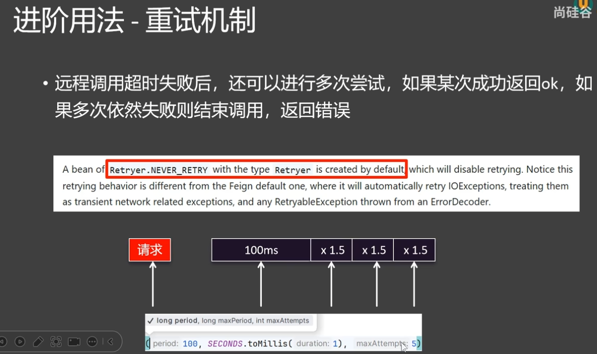
默认是不会重试的，不过可以配置下面那样的重试机制
间隔为100ms，最大间隔为1s，最大尝试次数为5
第一次尝试也算一次，失败后间隔100ms试一次，还失败的话下次就等待100ms * 1.5后再试，每次等待时间都乘1.5，直到达到1s。
实现方式：
在配置类里面配置一个retryer
```java
@Bean  
Retryer retryer(){  
    return new Retryer.Default(100,1000,5);  
}
```
##### 拦截器
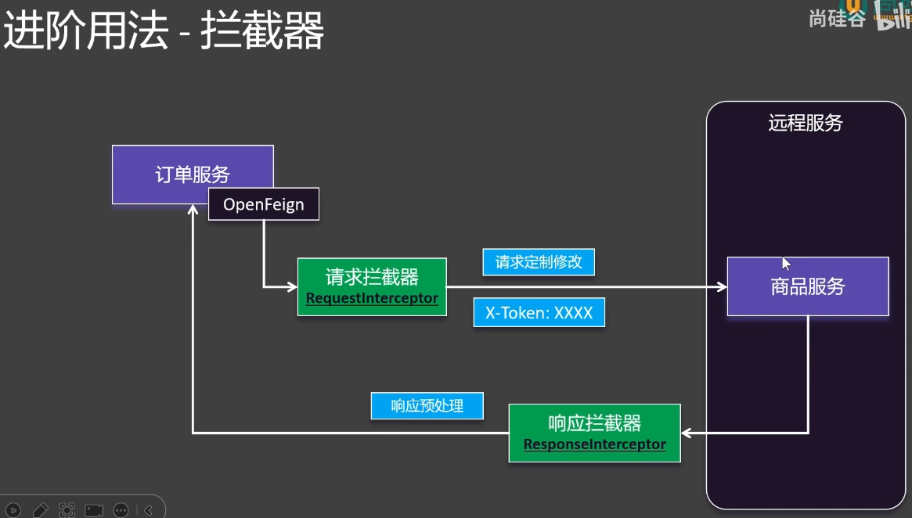
先创建一个拦截器，需要实现feign包下的RequestInterceptor
```java
package com.flowers.order.interceptor;  
  
import feign.RequestInterceptor;  
import feign.RequestTemplate;  
  
import java.util.UUID;  
  
public class TokenRequestInterceptor implements RequestInterceptor {  
  
    /**  
     * 请求拦截器  
     * @param requestTemplate 请求模版  
     */  
    @Override  
    public void apply(RequestTemplate requestTemplate) {  
        requestTemplate.header("Token", UUID.randomUUID().toString());  
    }  
}
```
然后往feign配置类里面添加这个拦截器
```yaml
spring:  
  cloud:  
    openfeign:  
      client:  
        config:  
          default:  
            logger-level: full  
            connect-timeout: 1000  
            read-timeout: 2000  
          service-product: # 是@FeignClient注解中value的值（没配置contextId的话，有配置就是这个id）  
            logger-level: full  
            connect-timeout: 3000  
            read-timeout: 5000  
            request-interceptors:  
              - com.flowers.order.interceptor.TokenRequestInterceptor
```
或者仅在拦截器上加上@Component注解，也会自动找到。之后每次发送请求时就会对请求进行改造了。
##### Fallback兜底返回
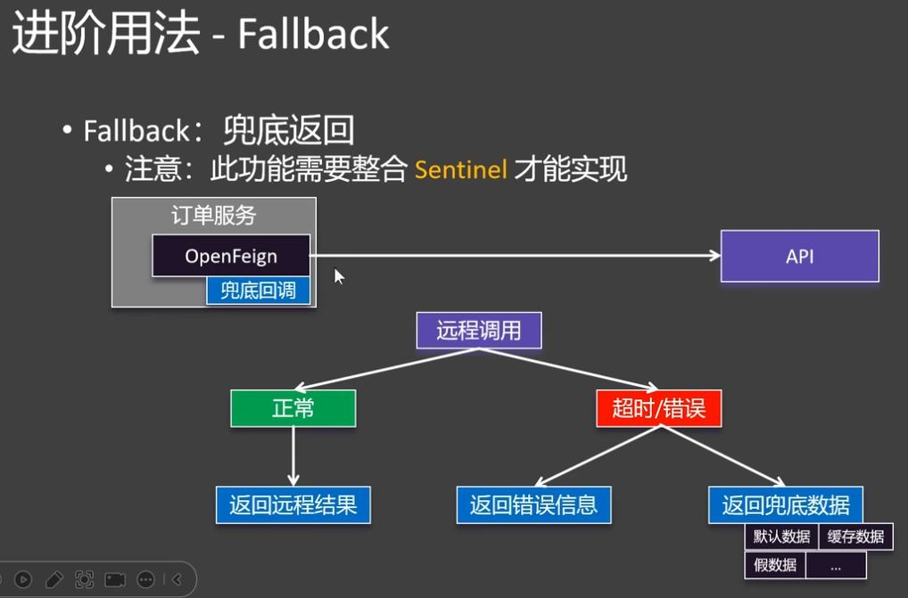
兜底返回的目的就是请求失败的时候可以拿到一个默认数据，让业务可以继续往下推进，改善用户体验。
写一个Fallback类实现对应的FeignClient
```java
package com.flowers.order.feign.fallback;  
  
import com.flowers.order.feign.ProductFeignClient;  
import com.flowers.product.bean.Product;  
import org.springframework.stereotype.Component;  
  
import java.math.BigDecimal;  
  
@Component  
public class ProductFeignClientFallback implements ProductFeignClient {  
    @Override  
    public Product getProductById(Long id) {  
        System.out.println("兜底回调....");  
        Product product = new Product();  
        product.setId(id);  
        product.setPrice(new BigDecimal("0"));  
        product.setName("未知商品");  
        product.setNum(0);  
        return product;  
    }  
}
```
在原来的客户端上指定FallBack
```java
@FeignClient(value = "service-product", fallback = ProductFeignClientFallback.class)
```
引入sentinel依赖
```java
<dependency>  
    <groupId>com.alibaba.cloud</groupId>  
    <artifactId>spring-cloud-starter-alibaba-sentinel</artifactId>  
</dependency>
```
在feign中开启sentinel
```java
feign:  
  sentinel:  
    enabled: true
```
### Sentinel
#### 基础
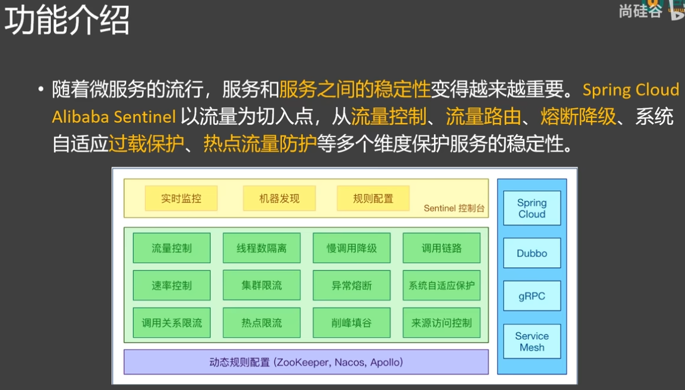
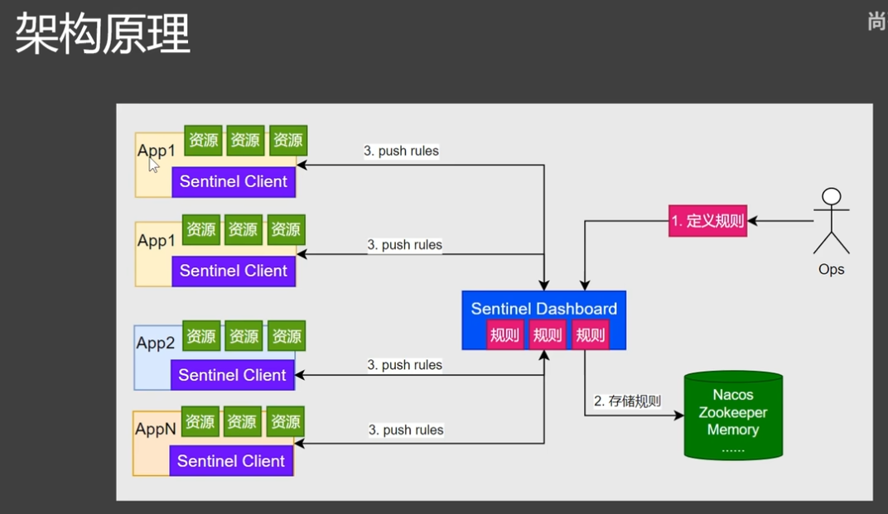
每个微服务中都有许多资源需要进行保护，引入Sentinel Client，这些Client就能连上Sentinel控制台，控制台中可以对每个资源的管理规则（限流规则、黑白名单） 进行定义，规则可以存储到配置中心，规则发生变更，控制台可以推送给每个微服务。每次访问资源时，就会看看符合不符合规则，符合就放行，不符合就拒绝服务。
流程中和编码相关的主要是资源和规则
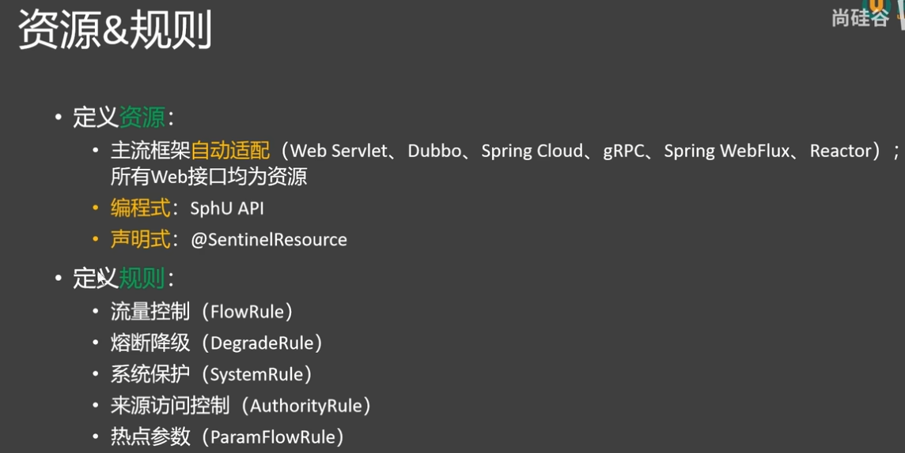
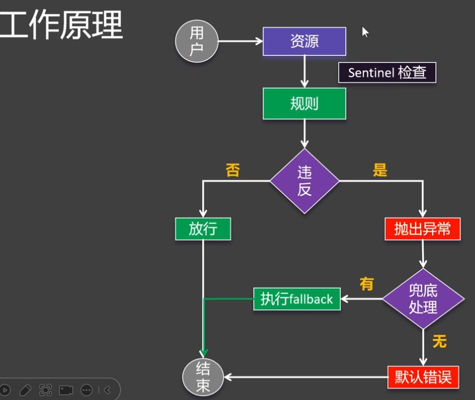
#### 整合
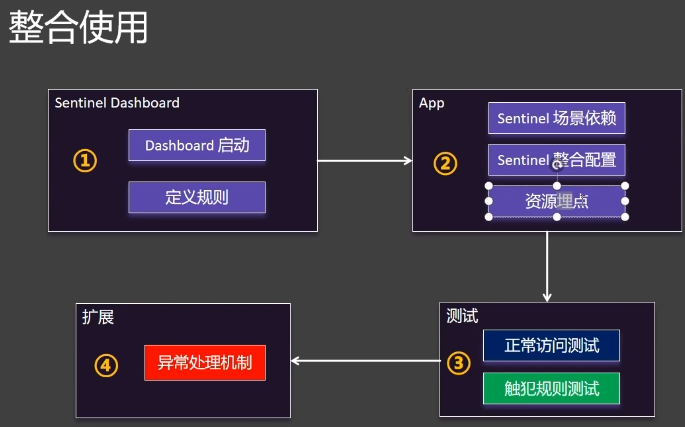
下载jar包
然后在jar包所在文件夹下进入cmd，输入下面命令启动控制台
```
java -jar sentinel-dashboard-1.8.8.jar
```
然后访问本机的8080端口即可
默认的账号密码都为sentinel

在services的pom中添加sentinel依赖
```xml
<dependency>  
    <groupId>com.alibaba.cloud</groupId>  
    <artifactId>spring-cloud-starter-alibaba-sentinel</artifactId>  
</dependency>
```
之后每个微服务都要连上sentinel控制台，就是在配置文件里面都加上这个
```
spring:  
  cloud:   
    sentinel:  
      transport:  
        dashboard: localhost:8080  
      eager: true # 取消懒加载
```
在createOrder方法上加@SentinelResource(value = "createOrder")，将其定义为资源
```java
@SentinelResource(value = "createOrder")  
@Override  
public Order createOrder(Long productId, Long userId) {  
    // Product product = getProductFromRemoteWithLoadAnnotation(productId);  
    Product product = productFeignClient.getProductById(productId);  
    Order order = new Order();  
    order.setId(1L);  
    order.setTotalAmount(new BigDecimal(product.getNum()).multiply(product.getPrice()));  
    order.setUserId(userId);  
    order.setAddress("福建省龙岩市新罗区");  
    order.setNickName("花落为谁念");  
    order.setProductList(List.of(product));  
    return order;  
}
```
请求[localhost:8000/create?productId=1&userId=2](http://localhost:8000/create?productId=1&userId=2)后，可以再簇点链路中查看整个方法的资源调用过程，可以在其中任意位置添加规则
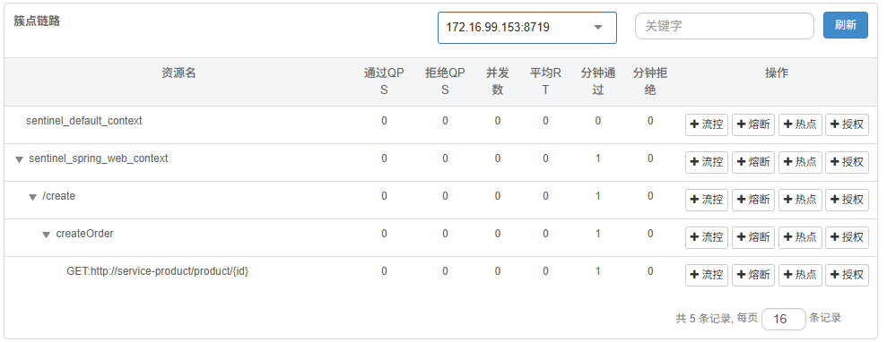
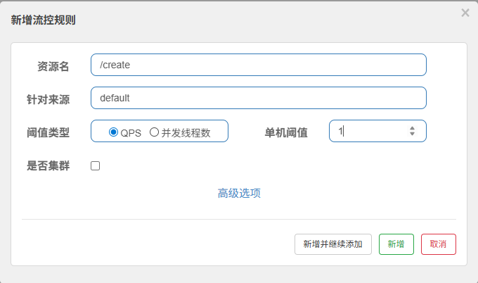
设置/create方法的QPS限制为1，这时候如果请求频率过高就会报错
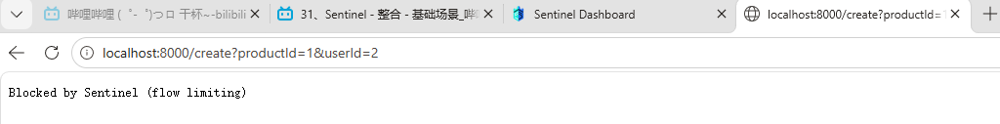
#### 异常处理
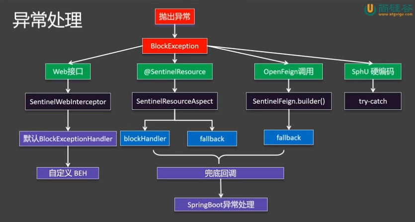
##### Web接口
Web接口资源被请求时，sentinel默认用的是SentinelWebInterceptor拦截器进行处理，这个拦截器中会判断是否违反规则，违反了话就会调用默认BlockExceptionHandler进行处理。要改变默认的处理机制，返回自己定义的内容，就需要自定义一个BlockExceptionHandler，把它放到容器里就可以生效了。
在model中定义一个R对象，它是将来要返回给前端的数据
```java
package com.flowers.common;  
  
import lombok.Data;  
  
@Data  
public class R {  
    private int code;  
    private String msg;  
    private Object data;  
  
    public static R ok() {  
        R r = new R();  
        r.setCode(200);  
        return r;  
    }  
  
    public static R ok(String msg, Object data) {  
        R r = new R();  
        r.setCode(200);  
        r.setMsg(msg);  
        r.setData(data);  
        return r;  
    }  
  
    public static R error() {  
        R r = new R();  
        r.setCode(500);  
        return r;  
    }  
  
    public static R error(Integer code, String msg) {  
        R r = new R();  
        r.setCode(code);  
        r.setMsg(msg);  
        return r;  
    }  
}
```
自定义一个BlockExceptionHandler
```java
package com.flowers.order.exception;  
  
import com.alibaba.csp.sentinel.adapter.spring.webmvc_v6x.callback.BlockExceptionHandler;  
import com.alibaba.csp.sentinel.slots.block.BlockException;  
import com.fasterxml.jackson.databind.ObjectMapper;  
import com.flowers.common.R;  
import jakarta.servlet.http.HttpServletRequest;  
import jakarta.servlet.http.HttpServletResponse;  
import org.springframework.stereotype.Component;  
  
import java.io.PrintWriter;  
  
@Component  
public class MyBlockExceptionHandler implements BlockExceptionHandler {  
  
    private ObjectMapper objectMapper = new ObjectMapper();  
  
    @Override  
    public void handle(HttpServletRequest httpServletRequest, HttpServletResponse httpServletResponse, String s, BlockException e) throws Exception {  
        httpServletResponse.setContentType("application/json;charset=UTF-8");  
        PrintWriter writer = httpServletResponse.getWriter();  
  
        R error = R.error(500, s + "被sentinel限制了，原因：" + e.getClass());  
  
        String json = objectMapper.writeValueAsString(error);  
        writer.write(json);  
  
        writer.flush();  
        writer.close();  
    }  
}
```
然后重新配置一下流控规则，触发一下就会显示自定义返回的错误内容了
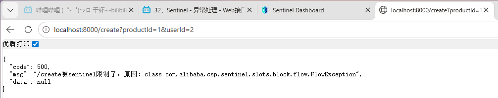
##### @SentinelResource
这个注解标注在非controller层的方法
当带有@SentinelResource的资源被请求时，会通过SentinelResourceAspect这个切面进行处理，判断是否违反规则，没有违反就放行，违反的话看注解上有没有标注blockHandler， 有标注由它处理异常，没有标注走一个兜底回调，它回去看注解里面有没有指定fallback，有就由他进行处理，为空的话调用default fallback，这个也要看注解里面有没有指定，有就执行，没有就抛一个异常。
目前是一个都没有指定，所以会显示springBoot默认的异常显示页面。
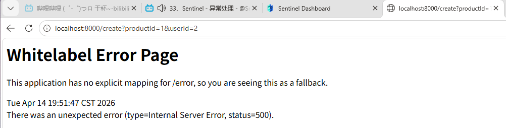
解决，注解上指定blockHandler，然后编写对应的方法，要求名称相同
```java
@SentinelResource(value = "createOrder", blockHandler = "createOrderFallBack")  
@Override  
public Order createOrder(Long productId, Long userId) {  
    // Product product = getProductFromRemoteWithLoadAnnotation(productId);  
    Product product = productFeignClient.getProductById(productId);  
    Order order = new Order();  
    order.setId(1L);  
    order.setTotalAmount(new BigDecimal(product.getNum()).multiply(product.getPrice()));  
    order.setUserId(userId);  
    order.setAddress("福建省龙岩市新罗区");  
    order.setNickName("花落为谁念");  
    order.setProductList(List.of(product));  
    return order;  
}  
  
// 兜底回调  
public Order createOrderFallBack(Long productId, Long userId, BlockException e) {  
    // 返回兜底数据  
    Order order = new Order();  
    order.setId(0L);  
    order.setTotalAmount(new BigDecimal("0"));  
    order.setUserId(userId);  
    order.setNickName("未知用户");  
    order.setAddress("异常信息：" + e.getClass());  
    return order;  
}
```
然后如果触发异常就会返回兜底数据了
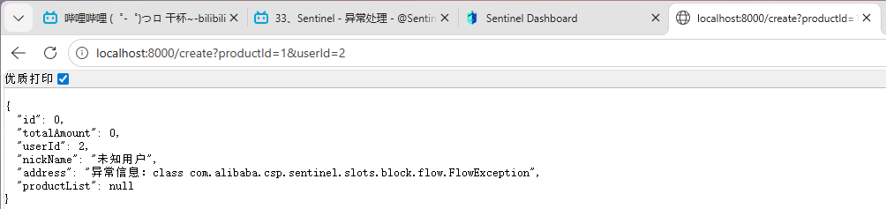
##### OpenFeign
 远程调用sentinel也会自动探测到
 然后如果远程调用这里违反规则了，如果对应的FeignClient有指定fallback，那么会调用这个兜底回调，没有的话也是向上抛异常，最后会被SpringBoot异常处理处理。
```java
 @FeignClient(value = "service-product", fallback = ProductFeignClientFallback.class)
```
##### SphU硬编码
想对任何一段代码进行控制
```java
try {  
    SphU.entry("资源名");  
    // 要执行的代码  
    // 然后这段代码也会被识别成一个资源应该  
} catch (BlockException e) {  
    // 违背了规则后对应的处理逻辑  
    throw new RuntimeException(e);  
}
```
#### 流控规则
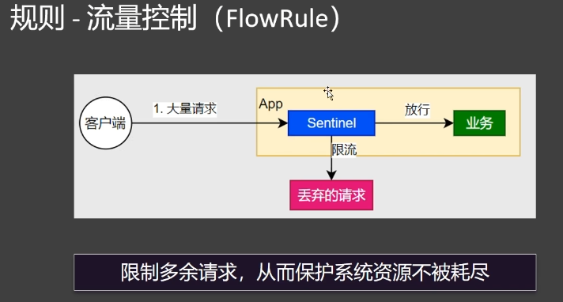
##### 阈值类型
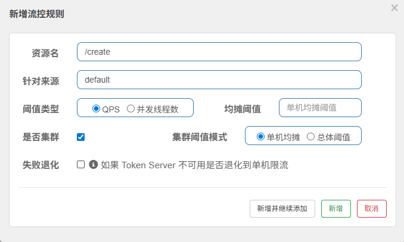
针对来源default表示从任何地方过来的请求都遵循设置的流控规则
阈值类型：
QPS：每秒请求数，通过计数器实现，轻量
并发线程数：效果和QPS一样，但是它要配合线程池，统计线程池里面的线程数量，性能更低
是否集群后面的两个选项也很清楚，一个是总的起来限制QPS（对全部服务器的QPS），一个是总的/服务器数量（限制每个服务器的QPS）。
##### 流控模式-直接
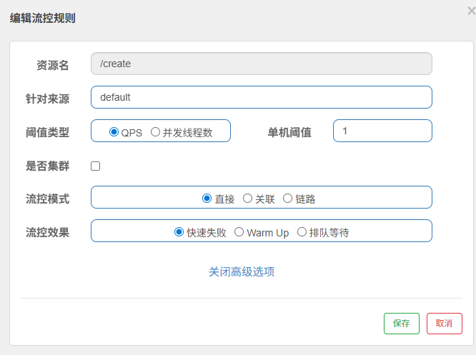
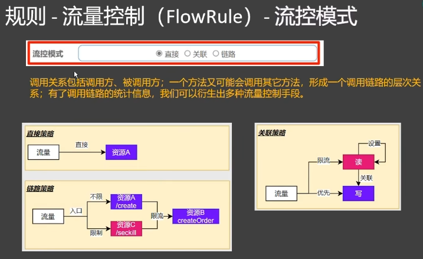
直接就是对资源A的请求都限制，不区分链路，不关联别的资源，和后面对比看比较好。
然后只有直接可以用流控效果为Warm up和排队等待，其他是不可以的
##### 流控模式-链路
给资源B新增一个/seckill的访问链路
```java
@GetMapping("/seckill")  
public Order seckill(@RequestParam("productId") Long productId, @RequestParam("userId") Long userId) {  
    Order order = orderService.createOrder(productId, userId);  
    order.setId(Long.MAX_VALUE);  
    return order;  
}
```
关闭上下文统一（最后一项）
```yaml
sentinel:  
  transport:  
    dashboard: localhost:8080  
  eager: true # 取消懒加载  
  web-context-unify: false
```
这样才会把不同的链路都显示出来
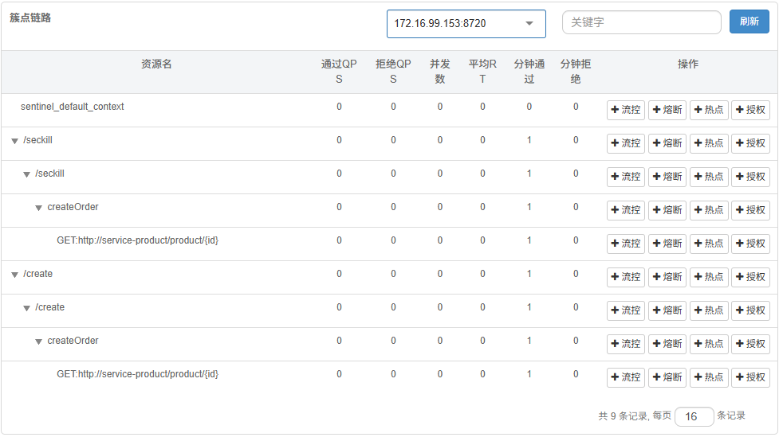
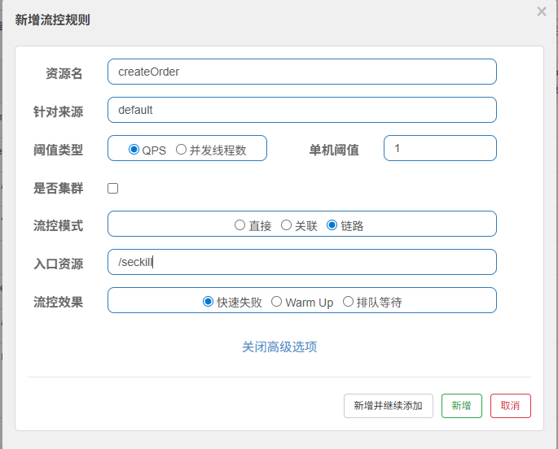
##### 流控模式-关联
就是有两个资源，它们其实访问都是一个东西（对数据库的读/写），可以限制当写的请求量不大的时候，不限制读，写的请求量上来了就限制读。
新增两个资源
```java
@GetMapping("/writeDb")  
public String writeDb(){  
    return "writeDb success";  
}  
  
@GetMapping("/readDb")  
public String readDb(){  
    return "readDb success";  
}
```
设置关联流控
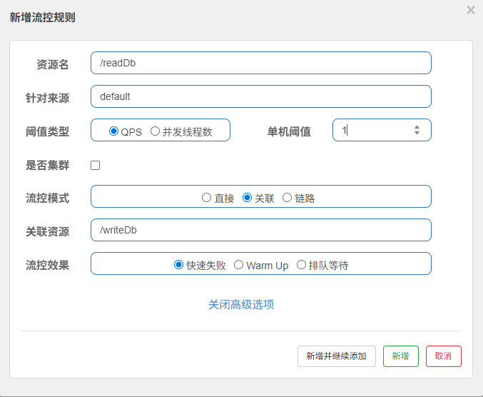
这时候如果/writeDb的qps超过1了，那么就会现在/readDb的访问
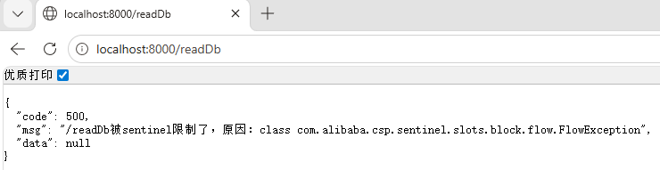
##### 流控效果-快速失败
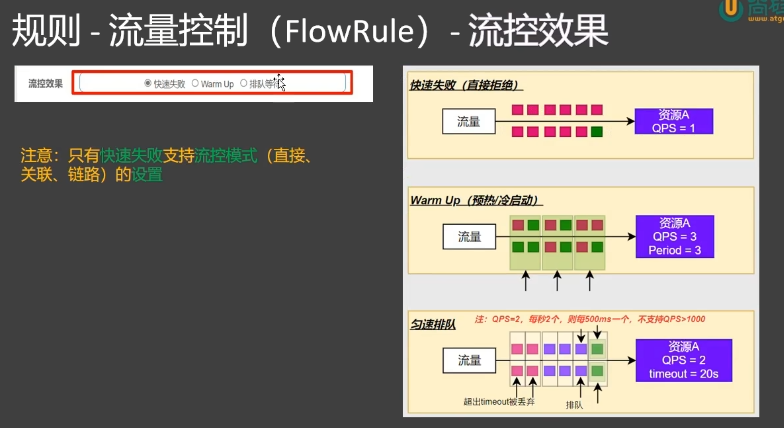
没违反规则放行，违反规则后直接抛一个BlockException异常，请求直接被丢弃
在之前的自定义BlockExceptionHandler中给响应添加上状态码，方便压测工具识别
```java
httpServletResponse.setStatus(429); // too many request
```
##### 流控效果-Warm Up
大量请求涌入的时候开始启动策略
让QPS缓慢增加（线性增长），在指定时间（Period）到达设置上限后（QPS）保持它运行
每秒多余的请求也会被丢弃
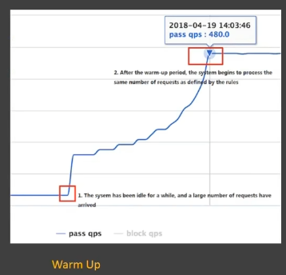
##### 流控效果-匀速排队
大量请求涌入的时候开始启动策略
不支持QPS>1000，因为时间精度为ms，太高就失效了
如果设置QPS为2，那么就是每500ms放一个进来，然后其他的排队。然后排队的超出排队时间也会被丢出去。
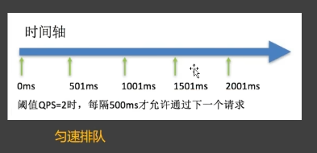
基于漏桶算法实现的
这个500ms放进来的是新的还是队列中的？
#### 熔断规则
也叫熔断降级
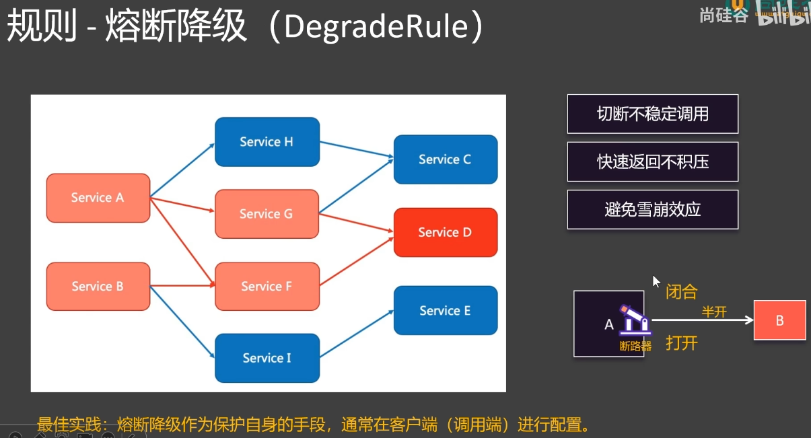
发现一个服务不可用时，及时切断不稳定调用，也就是不再去请求它了，直接快速失败返回数据，避免当前服务以及链路前面的服务被牵连，导致服务雪崩。和服务的断开\联系是由断路器控制的，它在对方不稳定时闭合，稳定时断开。怎么知道对方崩了之后又恢复呢，有一个半开状态，就是随便放几个请求过去试试。
##### 断路器工作原理
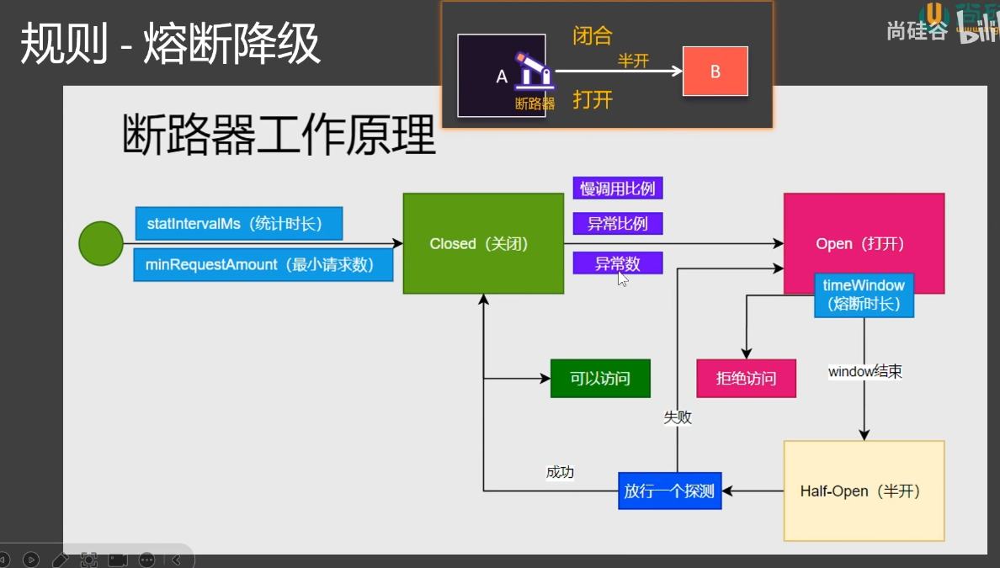
怎么看断路器要不要打开，是根据配置的策略来的，以慢调用比例为例，当慢请求（根据时间判断）的比例超过阈值的时候，就打开断路器，会打开一段时间，这个时间窗口内的所有请求都被拒绝，窗口结束后，进入半开状态，这时候会放行一个请求探测一下，成功了就关闭断路器，失败了或者还是太慢就又关闭断路器一段时间。
##### 熔断策略-慢调用比例
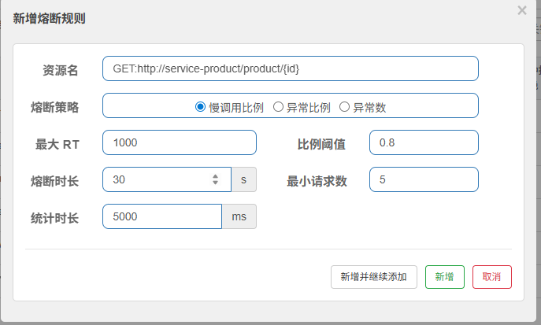
在统计时长5秒内，如果有80%的请求都是慢请求（超过1000ms）那么就熔断30s。（不过请求数>5才会开始工作，是从第一个开始统计的）。所以如果一个接口总是超时的，那么前5个还是会有数据的，后面就熔断了。熔断结束后第一个请求，是可以发出去成功获得数据的，不过因为它仍然超时，所以这个发完之后又熔断了。
##### 熔断策略-异常比例
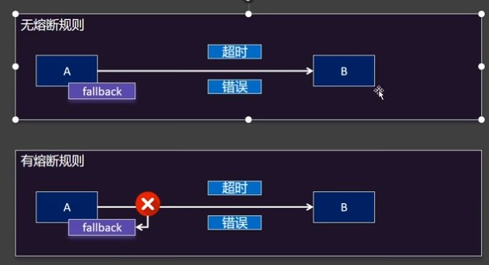
如果无熔断规则，那么发送请求完发现异常了才调用兜底回调。如有熔断规则，那么不会尝试去发这个可能触发异常的请求，而直接去调用兜底回调，节省支援。
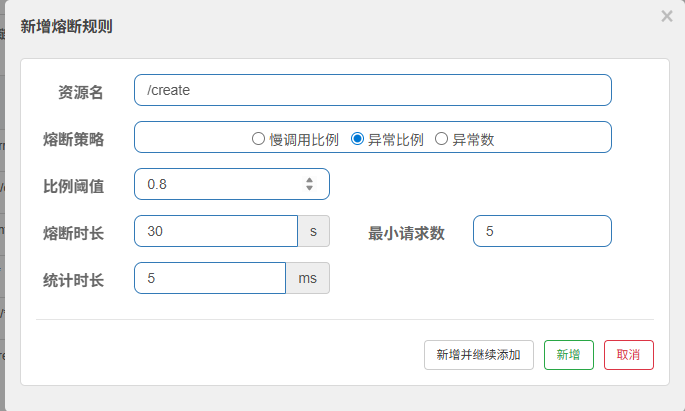
5秒内，请求数超过5时，如果远程调用出现异常（调用的方法抛异常这样的，比如10/0这样的0除异常）的比例达到80%，那么熔断30s。
##### 熔断策略-异常数
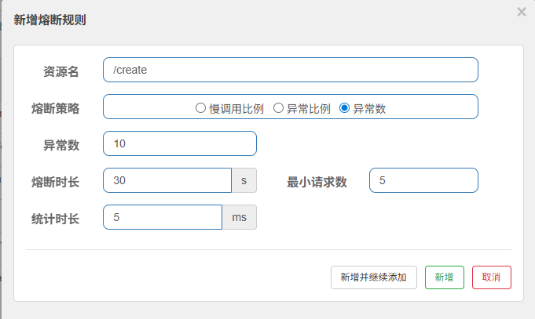
5秒内，不管发送多少请求（当然要超过5），只要远程调用的异常数达到10次，就熔断30s。
#### 热点规则
是更细的流控规则，最小单位从资源到参数了。
如果参数是指定的xxx然后QPS到了就现在，如果参数不是指定的，是非热点，那么就放行。或者反过来，是指定的放行，不是指定的限制。
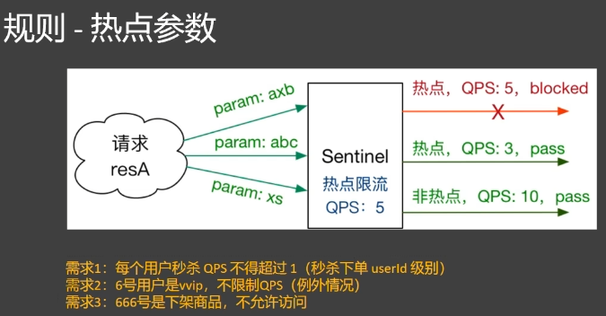
##### 环境搭建
创建一个资源点写一个fallback
```java
@GetMapping("/seckill")  
@SentinelResource(value = "seckill-order", blockHandler = "seckillFallback")  
public Order seckill(@RequestParam("productId") Long productId, @RequestParam("userId") Long userId) {  
    Order order = orderService.createOrder(productId, userId);  
    order.setId(Long.MAX_VALUE);  
    return order;  
}  
  
public Order seckillFallback(Long productId, Long userId, BlockException e) {  
    log.info("seckillFallback....");  
    Order order = new Order();  
    order.setId(productId);  
    order.setUserId(userId);  
    order.setAddress("异常信息:" + e.getClass());  
    return order;  
}
```
为什么要创建一个资源点呢，因为web的这些接口默认是不支持热点规则的，要自己搞一个。

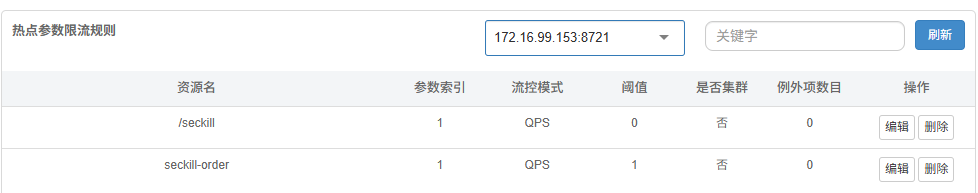
上面那个就是不行的，要在自己新建的资源点上定热点规则才可以。
##### 热点参数限流
需求1
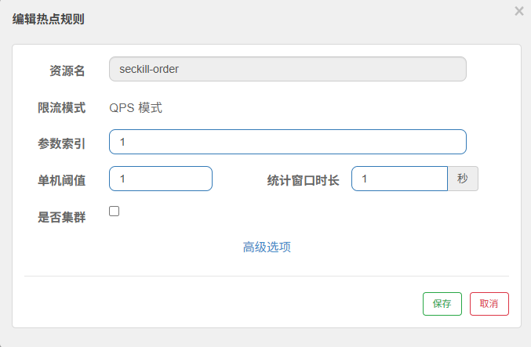
对于参数1（userId）进行限制，每个相同的userId一秒只能请求一次。不过不携带的话不会被流控，这个看你是不是想要这种，如果不携带也要控制的话可以加个默认值。

需求2
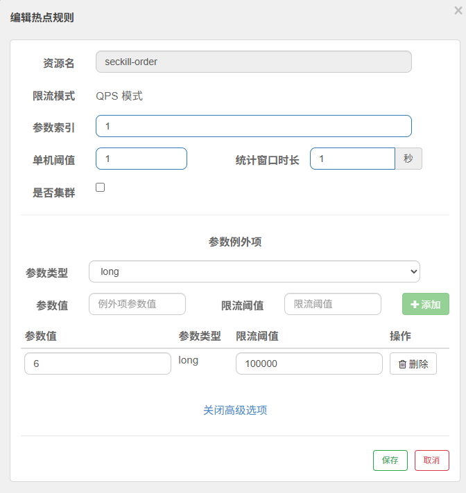
需求3
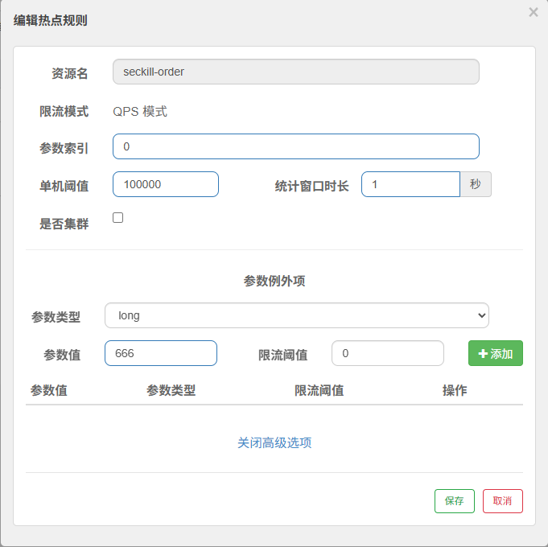
#### 补充及总结
blockHandler只能处理限流异常
fallback还可以处理业务异常

授权规则
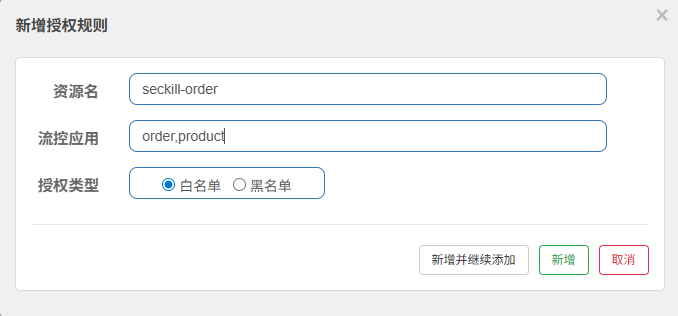
白名单就是仅有列出的这几个应用可以访问该资源。
黑名单就是列出的这几个应用不能访问该资源。
系统规则
根据现在系统的情况来进行限流
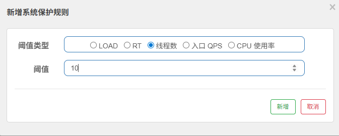
比如这里就是当前系统后台的线程数超过10个了就限流

应用重启后配置的规则都失效了，这个到时候可以看看持久化是怎么做的。
### Gateway
#### 简介
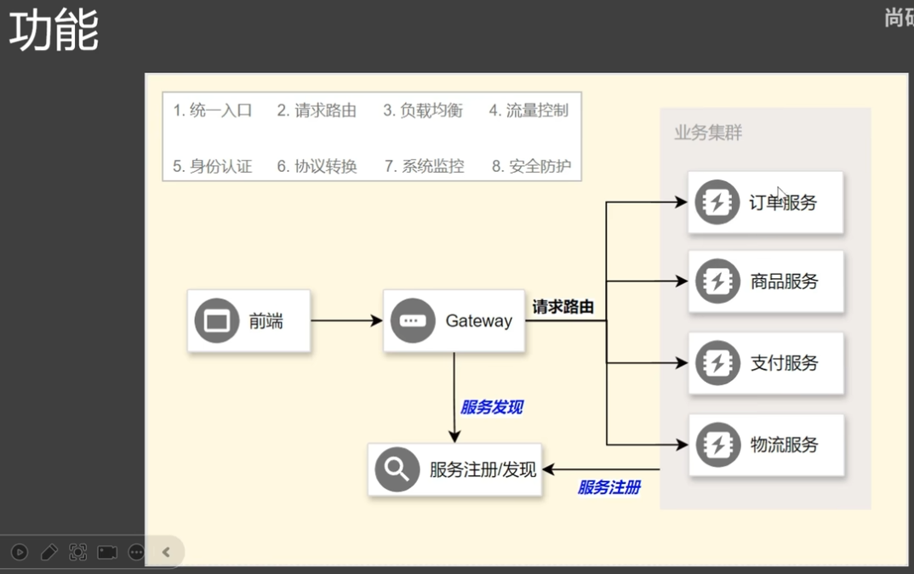
让前端不用记住每个微服务的地址，前端只需要把请求发给网关，然后由网关判断这个请求该转给哪个微服务，然后去Nacos中获取该微服务的所有服务器的ip+port，然后选一个/负载均衡地进行转发。 
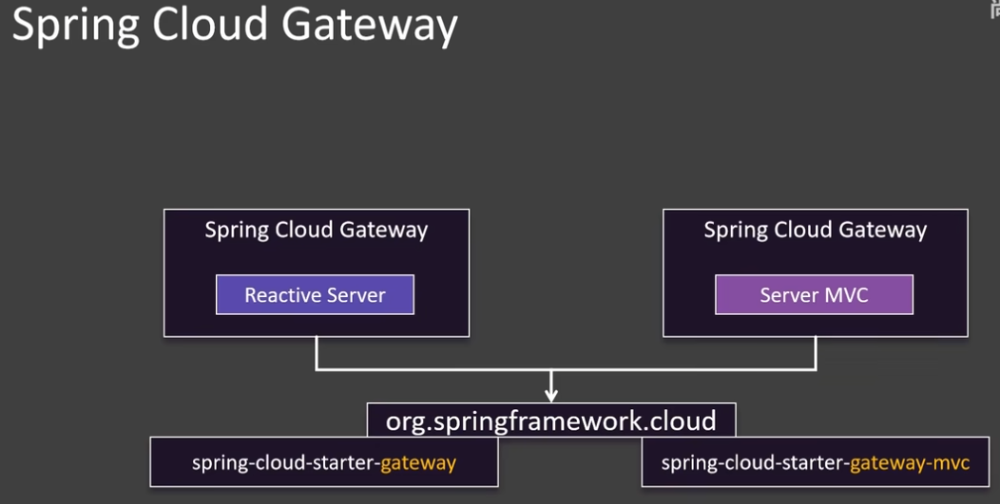
分为响应式和传统的网关，响应式性能会更好，用谁导入谁的依赖就好了。
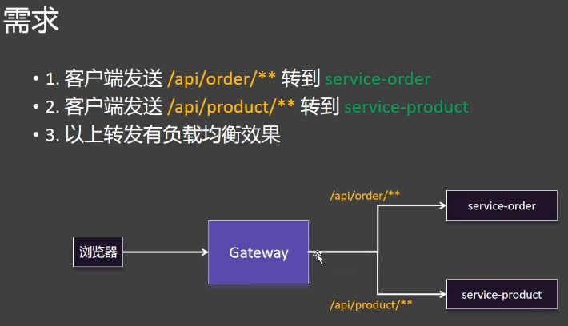

创建网关
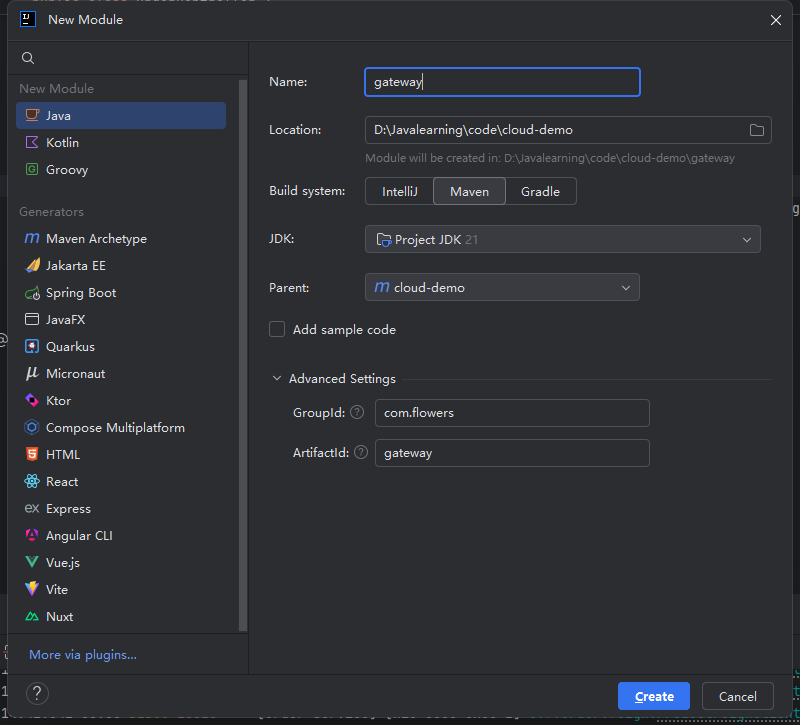
在网关的pom中添加依赖
```xml
<dependencies>  
    <dependency>        
	    <groupId>org.springframework.cloud</groupId>  
        <artifactId>spring-cloud-starter-gateway</artifactId>  
    </dependency>
    <dependency>  
	    <groupId>com.alibaba.cloud</groupId>  
	    <artifactId>spring-cloud-starter-alibaba-nacos-discovery</artifactId>  
	</dependency>
</dependencies>
```
创建启动类
```java
package com.flowers;  
  
import org.springframework.boot.SpringApplication;  
import org.springframework.boot.autoconfigure.SpringBootApplication;  
  
@SpringBootApplication  
public class gatewayMainApplication {  
  
    public static void main(String[] args) {  
        SpringApplication.run(gatewayMainApplication.class, args);  
    }  
}
```
配置
```yaml
spring:  
  application:  
    name: gateway  
  cloud:  
    nacos:  
      server-addr: 127.0.0.1:8848  
  
server:  
  port: 80
```
配置为80端口之后就可以不用带端口了，默认就是80
#### 路由
##### 规则配置
通过配置文件配置 application-route.yml
```yaml
spring:  
  cloud:  
    gateway:  
      routes:  
        - id: order-route  
          uri: lb://service-order #负载均衡的交给order服务  lb://就是负载均衡  不过前提是要引入负载均衡依赖  
          predicates:  
            - Path=/api/order/** #把/api/order开头的请求   对应服务的请求路径也要加上这个   远程调用client也要加  
                                                        #转的时候是请求微服务的这个完整路径/api/order/**  
        - id: product-route  
          uri: lb://service-product  
          predicates:  
            - Path=/api/product/**
```
在主配置文件中导入配置文件就好
##### 工作原理
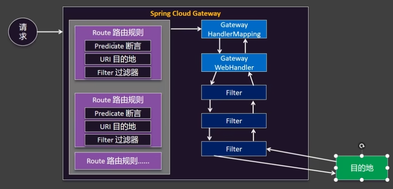
根据断言，匹配上了就转给指定的目的地，如果有配置filter，那么在转发前/接收后，还会依次经过过滤器。然后这个断言的配置，是像Switch case那样的，就是后面一个条件可能包括了前面的条件，那么前面（有写order就按order来，没有就按写的顺序，从上到下）的条件会把它先拦住直接去它的目的地了，不会往后走。有多个断言的话需要同时满足。
#### 断言
##### 写法 
https://springdoc.cn/spring-cloud-gateway/
可以去官方文档的Predicate工厂处查看
##### 自定义断言工厂
创建断言工厂：继承AbstractRoutePredicateFactory，在里面写好config和要重写的几个方法
```java
package com.flowers.predicate;  
  
import jakarta.validation.constraints.NotEmpty;  
import org.springframework.cloud.gateway.handler.predicate.AbstractRoutePredicateFactory;  
import org.springframework.cloud.gateway.handler.predicate.GatewayPredicate;  
import org.springframework.http.server.reactive.ServerHttpRequest;  
import org.springframework.stereotype.Component;  
import org.springframework.util.StringUtils;  
import org.springframework.validation.annotation.Validated;  
import org.springframework.web.server.ServerWebExchange;  
  
import java.util.Arrays;  
import java.util.List;  
import java.util.function.Predicate;  
  
@Component  
public class VipRoutePredicateFactory extends AbstractRoutePredicateFactory< VipRoutePredicateFactory.Config> {  
  
    public VipRoutePredicateFactory() {  
        super(Config.class);  
    }  
  
    @Override  
    public Predicate<ServerWebExchange> apply(Config config){  
        return new GatewayPredicate() {  
            @Override  
            public boolean test(ServerWebExchange serverWebExchange) {  
                // localhost/search?user=flowers  
                // 如果设置的param参数传入的是设置的value，那么判断其为vip，转发到对应路径  
                ServerHttpRequest request = serverWebExchange.getRequest();  
                String first = request.getQueryParams().getFirst(config.getParam());  
                return StringUtils.hasText(first) && first.equals(config.getValue());  
            }  
        };  
    }  
  
    // 短写法里面，把第一个值放到哪个参数，第二个值放到哪个参数里  
    // Vip=user,flowers  
    // param = user, flowers = value    @Override  
    public List<String> shortcutFieldOrder() {  
        return Arrays.asList("param", "value");  
    }  
  
    /**  
     * 可以配置的参数  
     * 该断言能传两个参数，一个是参数名，一个是对应的value  
     */    @Validated  
    public static class Config {  
        @NotEmpty  
        private String param;  
        @NotEmpty  
        private String value;  
  
        public @NotEmpty String getParam() {  
            return param;  
        }  
  
        public void setParam(@NotEmpty String param) {  
            this.param = param;  
        }  
  
        public @NotEmpty String getValue() {  
            return value;  
        }  
  
        public void setValue(@NotEmpty String value) {  
            this.value = value;  
        }  
    }  
}
```
配置断言
```yml
#短写法
- id: vip-route  
  uri: https://www.bilibili.com/  
  predicates:  
    - Path=/api/watch  
    - Vip=user,flowers
#长写法
- id: vip-route  
  uri: https://www.bilibili.com/  
  predicates:  
   - name: Path  
     args:  
      patterns: /api/watch  
   - name: Vip  
     args:  
      param: user  
      value: flowers
```
断言工厂名的前缀就是name
#### 过滤器
##### 基本使用
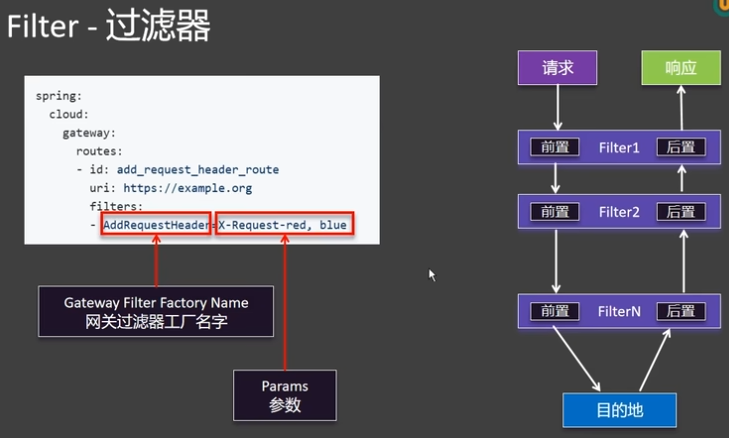
使用示例
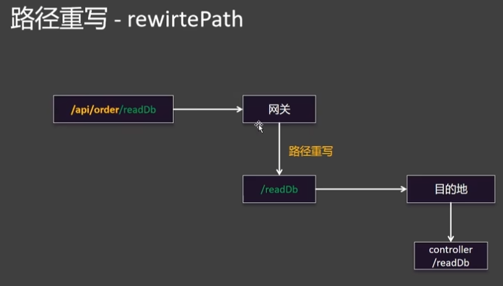
之前会把整个路径都传给服务去里面查，这样每个服务/client都要加上/api/order的前缀，很麻烦，可以通过这个路径重写解决。
[Spring Cloud Gateway 中文文档](https://springdoc.cn/spring-cloud-gateway/)
可以去文档里面的Filter工厂里面查看基本的一些过滤器的使用，下面是rewritePath的示例
```yml
spring:
  cloud:
    gateway:
      routes:
      - id: rewritepath_route
        uri: https://example.org
        predicates:
        - Path=/red/**
        filters:
        - RewritePath=/red/?(?<segment>.*), /$\{segment}
```
对于请求路径为 /red/blue 的情况，在进行下游请求之前将路径设置为 /blue。注意，由于YAML的规范，$ 应该被替换成 $\。（？前的就是要删除的反正）
我们自己这边就这样用
```yml
filters:  
  - RewritePath=/api/order/?(?<segment>.*), /$\{segment}

filters:  
  - RewritePath=/api/product/?(?<segment>.*), /$\{segment}
```
##### 默认filter
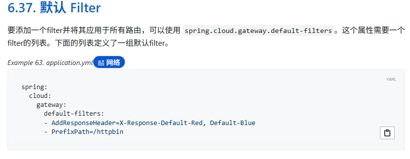
##### Globalfilter
创建一个继承GlobalFilter的类，然后加上@Component注解就好，这个也是对全部请求生效的。
```java
package com.flowers.filter;  
  
import lombok.extern.slf4j.Slf4j;  
import org.springframework.cloud.gateway.filter.GatewayFilterChain;  
import org.springframework.cloud.gateway.filter.GlobalFilter;  
import org.springframework.core.Ordered;  
import org.springframework.http.server.reactive.ServerHttpRequest;  
import org.springframework.http.server.reactive.ServerHttpResponse;  
import org.springframework.stereotype.Component;  
import org.springframework.web.server.ServerWebExchange;  
import reactor.core.publisher.Mono;  
  
@Component  
@Slf4j  
public class RtGlobalFilter implements GlobalFilter, Ordered {  
    @Override  
    public Mono<Void> filter(ServerWebExchange exchange, GatewayFilterChain chain) {  
        // 前置逻辑  
        ServerHttpRequest request = exchange.getRequest();  
        ServerHttpResponse response = exchange.getResponse();  
  
        String uri = request.getURI().toString();  
        long start = System.currentTimeMillis();  
        log.info("请求[{}]开始, 时间:{}",uri, start);  
    
        Mono<Void> filter = chain.filter(exchange)  // 放行  
                .doFinally((result) -> {  
                    // 后置逻辑  
                    long end = System.currentTimeMillis();  
                    log.info("请求[{}]结束, 时间:{}, 耗时:{}",uri, end, end - start);  
                });  
  
        return filter;  
    }  
  
    // 过滤器顺序，order越小优先级越高  
    @Override  
    public int getOrder() {  
        return 0;  
    }  
}
```
##### 自定义过滤器
仿造AddRequestHeaderGatewayFilterFactory写的一个，在响应之前添加一个一次性令牌的过滤器
```java
package com.flowers.filter;  
  
import org.springframework.cloud.gateway.filter.GatewayFilter;  
import org.springframework.cloud.gateway.filter.GatewayFilterChain;  
import org.springframework.cloud.gateway.filter.factory.AbstractNameValueGatewayFilterFactory;  
import org.springframework.http.HttpHeaders;  
import org.springframework.http.server.reactive.ServerHttpResponse;  
import org.springframework.stereotype.Component;  
import org.springframework.web.server.ServerWebExchange;  
import reactor.core.publisher.Mono;  
  
import java.util.UUID;  
  
@Component  
public class OnceTokenGatewayFilterFactory extends AbstractNameValueGatewayFilterFactory {  
    @Override  
    public GatewayFilter apply(NameValueConfig config) {  
        return new GatewayFilter() {  
            @Override  
            public Mono<Void> filter(ServerWebExchange exchange, GatewayFilterChain chain) {  
                // 每次响应之前，添加一个一次性令牌，支持uuid，jwt等各种格式  
                return chain.filter(exchange).then(Mono.fromRunnable(() -> {  
                    ServerHttpResponse response = exchange.getResponse();  
                    HttpHeaders headers = response.getHeaders();  
                    String value = config.getValue();  
                    if ("uuid".equalsIgnoreCase(value)) {  
                        value = UUID.randomUUID().toString();  
                    } else if ("jwt".equalsIgnoreCase(value)) {  
                        value = "FakeJwtToken";  
                    }  
                    headers.add(config.getName(), value);  
                }));  
            }  
        };  
    }  
}
```
使用
```
filters:   
  - OnceToken=X-Response-Token, uuid
```
#### 扩展&总结
允许前端跨域访问/跨域响应给前端
参考文档中的CORS配置
[Spring Cloud Gateway 中文文档](https://springdoc.cn/spring-cloud-gateway/#cors-%E9%85%8D%E7%BD%AE)

微服务之间的调用经过网关吗？
目前上面做的是没过的，一个服务->去注册中心拿到对应服务的地址->负载均衡->远程调用该服务
也可以先过网关，就是把远程调用上的FeignClient的value改成网关，然后方法上的路径+/api/order/这种网关里面配置的对应的前缀，不过没啥意义。
### Seata
#### 基础
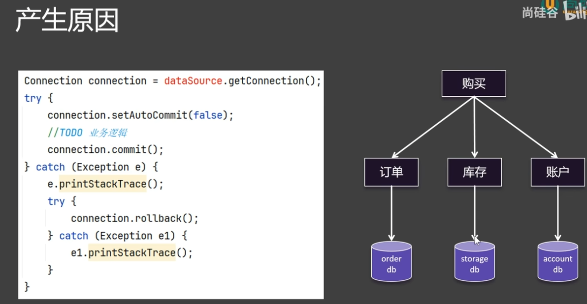
之前的事务都是建立连接上的：关闭自动提交，然后执行业务逻辑，如果过程中出现异常就回滚，没有异常就提交。但是微服务场景下，各个服务都独自去连接自己的数据库，而一个操作可能涉及到多个服务的多个数据库，它们涉及多个连接，这时候以前的办法就实施不了了，只会在出现异常的那个链路部分回滚，数据会出问题。
##### 环境搭建
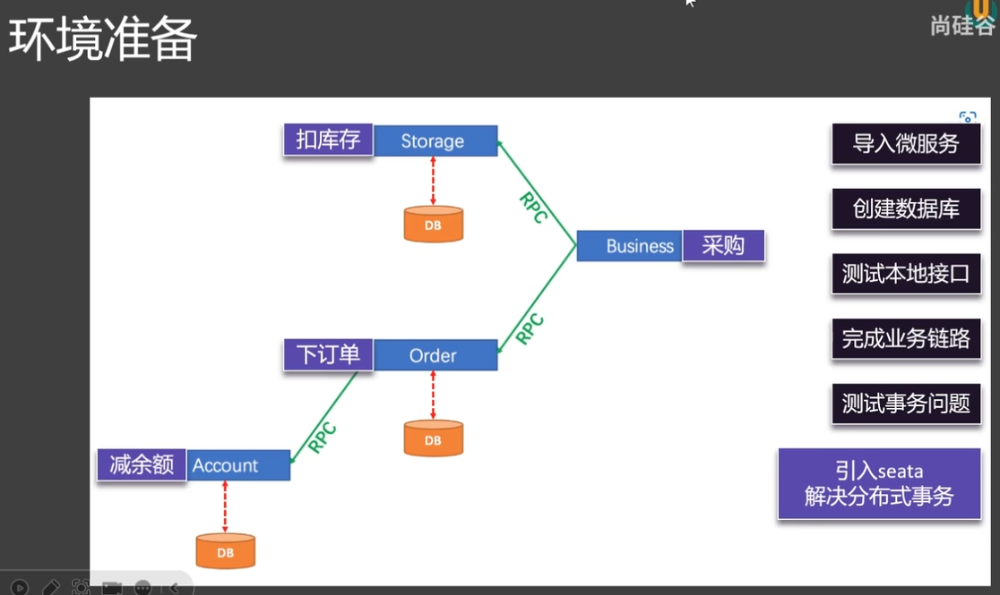
##### 接口测试
略
##### 本地事务测试
 略
##### 打通远程链路
略
##### 架构原理
 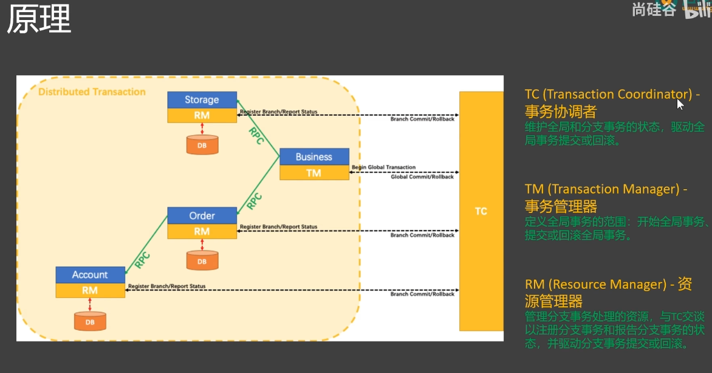
全局事务 采购 = 分支事务 扣库存 + 分支事务 下订单 + 分支事务 减余额
TC就是感知全局事务和分支事务的状态，根据这些状态去指挥各个事务提交/回滚
TM 管这个全局事务      需要向TC报告
RM 管自己的分支事务  需要向TC报告  不是向TM报告
然后TC统筹管理，所以TC服务器的稳定很重要
##### 整合Seata完成
1.启动seata服务器（需要下载）
[Apache Seata](https://seata.apache.org/zh-cn/)
2.在services的pom文件引入依赖
```xml
<dependency>
	<groupId>com.alibaba.cloud</groudId>
	<artifactId>spring-cloud-starter-alibaba-seata</artifactId>
	<version>2023.0.3.2</version>
</dependency>	
```
3.配置seata服务器地址
在每个微服务下创建一个file.conf
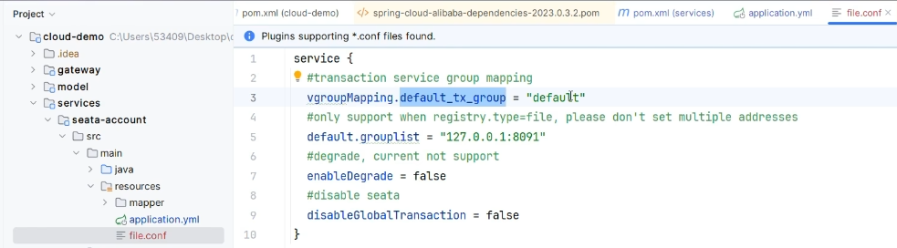
主要是指定seata服务器地址
4.把@GlobalTransactional加在采购那个方法上（serviceimpl层的方法）

原来每个地方的@Transactiona要不要加？

数据库里面需要添加一个UNDO_LOG表
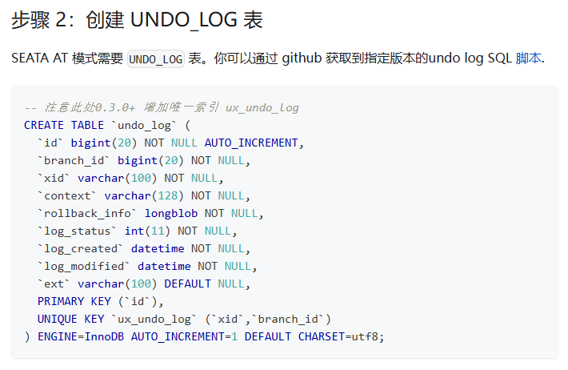

#### 原理
##### 二阶提交协议流程
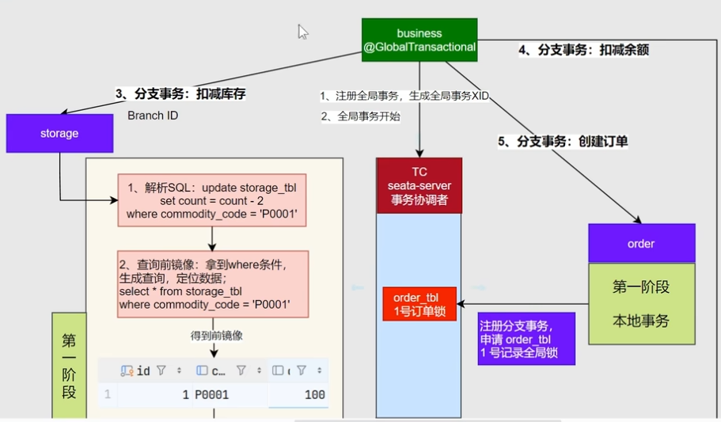
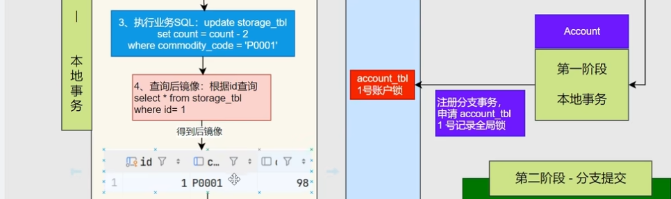

 全局锁在什么时候释放？

 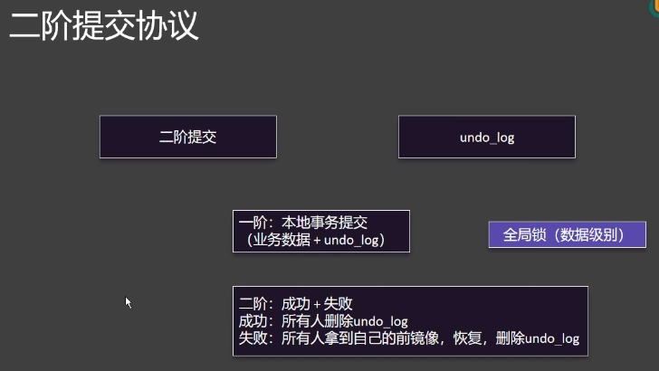
##### 二阶提交可视化
略 
##### 四种事务模式
上面说的是AT模式，全部东西由seata自动化控制。
 XA模式，性能较低，不如AT
TCC模式，全手动模式，资源的准备、提交和回滚都要自己写代码
SAGA适用于长事务，AT模式的锁在长事务下影响还是很大的。
