### 分布式基础
单体架构：所有功能模块都在一个项目
开发和部署简单，但无法应对高并发
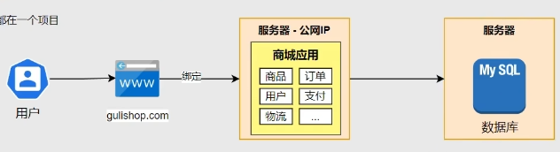

集群架构：
可以解决高并发，但无法做到灵活的模块化升级（改一个模块要全部重新打包部署、不支持不同组件用不同语言开发）
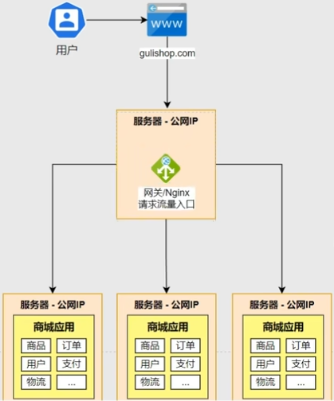

分布式架构：一个大型应用被拆分成很多小应用（例如商品、订单、支付、用户、物流、直播）分布部署在各个机器（包括服务器、数据库、中间件）
支持数据隔离、多语言
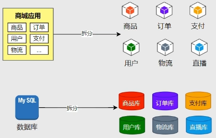
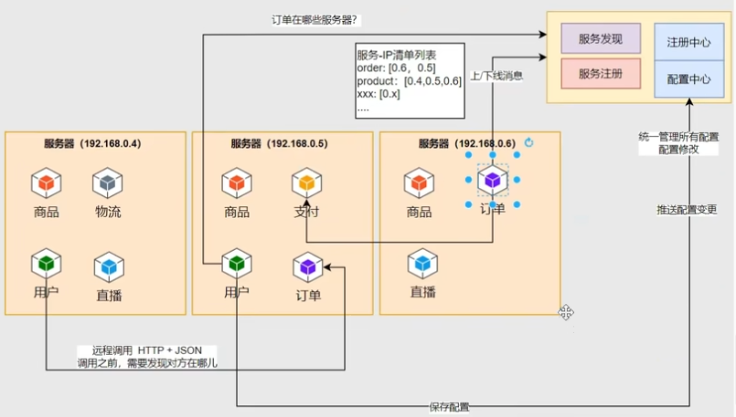
一项服务的多个副本不能都挂在同一个服务器，这样如果那个服务器挂了这个服务就用不了了。所以要分着部署在多条服务器，防止单点故障。
然后不同的服务可能部署在不同的服务器，它们之间要互相调用的话要通过远程调用（RPC, Remote Procedure Call）。
如何知道对应服务部署在哪个服务器呢，对应服务上线/挂了怎么更新信息呢 -> 注册中心（包含服务发现和服务注册功能）有多个结合负载均衡使用就好了。
可以通过配置中心统一管理配置 
如果许多服务都要调用其中一个服务，而这个服务卡了，那么可能就会导致整个系统的瘫痪（服务雪崩），解决方案就是服务熔断（许多请求超时了，那么之后就不再继续发请求，而是直接判断为失败快速返回，防止请求堆积）。
请求时通过网关 + 注册中心，根据路由，把请求发送到对应的服务器
其中涉及到的各个部分的常用组件
微服务：SpringBoot
注册中心/配置中心：Spring Cloud Alibaba Nacos
网关：Spring Cloud Gateway
远程调用：Spring Cloud OpenFeign
服务熔断：Spring Cloud Alibaba Sentinel
分布式事务：Spring Cloud Alibaba Seata
该教程的版本选择
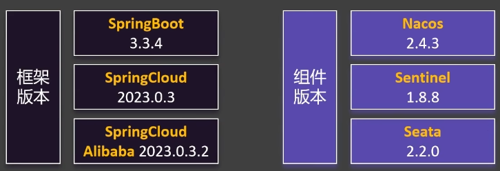
创建微服务项目
工程结构
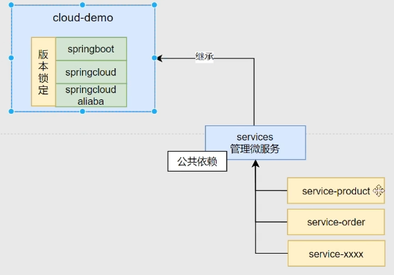
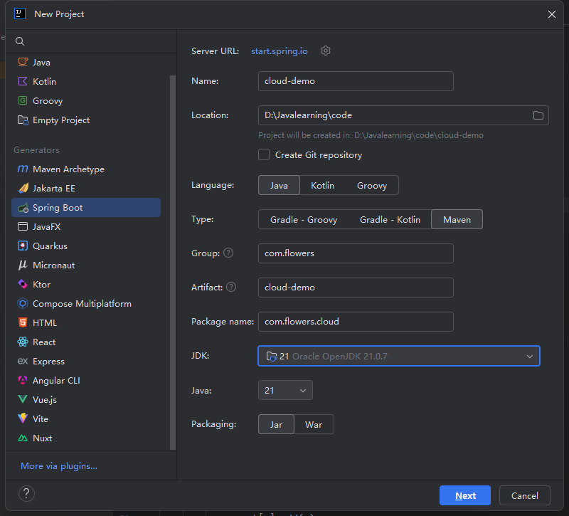
-> next -> create
删除一些没用的

删除完


pom文件修改
在\<groupId>上方添加
```xml
<packaging>pom</packaging>
```
删除
```xml
<url/>  
<licenses>  
    <license/>
</licenses>  
<developers>  
    <developer/>
</developers>  
<scm>  
    <connection/>    
    <developerConnection/>    
    <tag/>    
	<url/>
</scm>
```
src文件夹也可以删了
SpringBoot版本改为3.3.4
```xml
<parent>  
    <groupId>org.springframework.boot</groupId>  
    <artifactId>spring-boot-starter-parent</artifactId>  
    <version>3.3.4</version>  
    <relativePath/> <!-- lookup parent from repository -->  
</parent>
```
删除
```xml
<dependencies>  
    <dependency>        <groupId>org.springframework.boot</groupId>  
        <artifactId>spring-boot-starter</artifactId>  
    </dependency>  
    <dependency>        <groupId>org.springframework.boot</groupId>  
        <artifactId>spring-boot-starter-test</artifactId>  
        <scope>test</scope>  
    </dependency></dependencies>
```
新增配置
```xml
<properties>  
    <java.version>21</java.version>  
    <maven.compiler.source>21</maven.compiler.source>  
    <maven.compiler.target>21</maven.compiler.target>  
    <project.build.sourceEncoding>UTF-8</project.build.sourceEncoding>  
    <spring-cloud.version>2023.0.3</spring-cloud.version>  
    <spring-cloud-alibaba.version>2023.0.3.2</spring-cloud-alibaba.version>  
</properties>
<dependencyManagement>  
    <dependencies>        
	    <dependency>            
		    <groupId>org.springframework.cloud</groupId>  
            <artifactId>spring-cloud-dependencies</artifactId>  
            <version>${spring-cloud.version}</version>  
            <type>pom</type>  
            <scope>import</scope>  
        </dependency>        
        <dependency>            
	        <groupId>com.alibaba.cloud</groupId>  
            <artifactId>spring-cloud-alibaba-dependencies</artifactId>  
            <version>${spring-cloud-alibaba.version}</version>  
            <type>pom</type>  
            <scope>import</scope>  
        </dependency>    
    </dependencies>
</dependencyManagement>
```
新建一个module
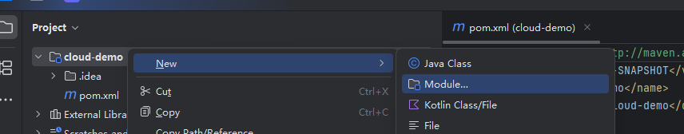
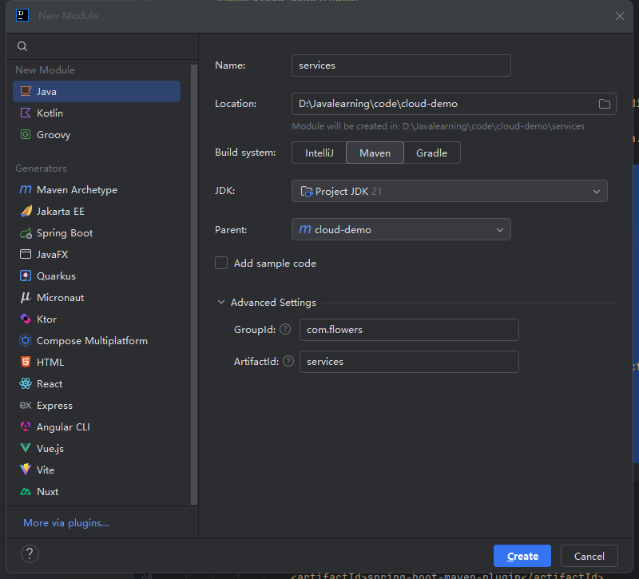
一样在service的pom添加
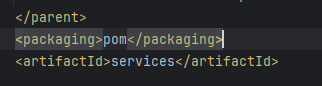
然后src文件夹也可以删了
在services下创建两个子模块 service-product、service-order
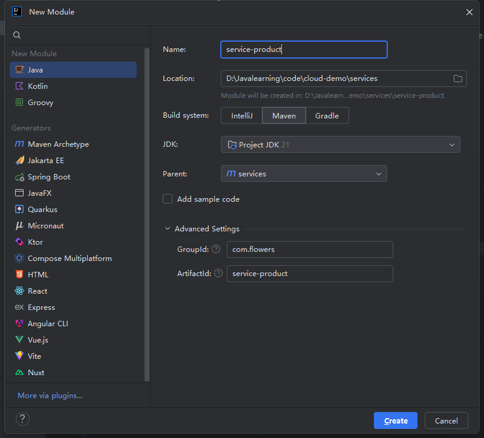
在services的pom中导入依赖，子模块也都会有
```xml
<dependencies>  
    <!--服务发现 -->  
    <dependency>  
        <groupId>com.alibaba.cloud</groupId>  
        <artifactId>spring-cloud-starter-alibaba-nacos-discovery</artifactId>  
    </dependency>    
<!--远程调用 -->  
    <dependency>  
        <groupId>org.springframework.cloud</groupId>  
        <artifactId>spring-cloud-starter-openfeign</artifactId>  
        <version>5.0.0</version>  
    </dependency>
</dependencies>
```
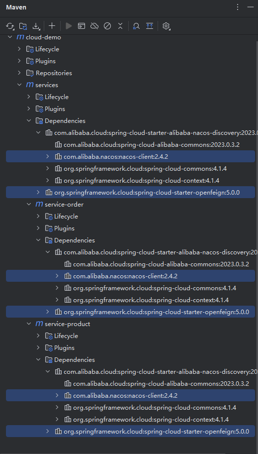
maven显示中勾上这个，可以按继承关系显示

### Nacos
#### 注册中心
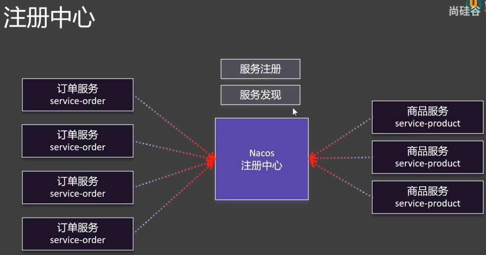
服务注册：各项服务及副本在哪个服务器上
服务发现：找到各项服务及服务所在的服务器，向它们发起请求
安装
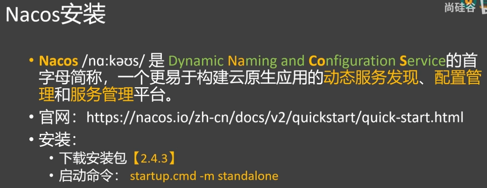
进入到bin文件夹下，打开命令行输入下面的命令。启动成功后进入对应网址就可以看到对应内容了
```
startup.cmd -m standalone
```
##### 服务注册
流程
1.启动微服务（SpringBoot微服务web项目启动）
2.引入服务发现依赖（spring-cloud-starter-alibaba-nacos-discovery）
3.配置Nacos地址（spring.cloud.nacos.server-addr=127.0.0.1:8848）
4.查看注册中心效果（访问http://localhost:8848/nacos）
5.集群模式启动测试（单机情况下通过改变端口模拟微服务集群）
order的pom中添加web项目依赖
```xml
<dependencies>  
    <dependency>        
	    <groupId>org.springframework.boot</groupId>  
        <artifactId>spring-boot-starter-web</artifactId>  
    </dependency>
</dependencies>
```
服务发现在services中一起引入了
在order中创建启动类
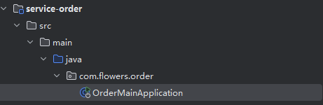
```java
package com.flowers.order;  
  
import org.springframework.boot.SpringApplication;  
import org.springframework.boot.autoconfigure.SpringBootApplication;  
  
@SpringBootApplication  
public class OrderMainApplication {  
    public static void main(String[] args) {  
        SpringApplication.run(OrderMainApplication.class, args);  
    }  
}
```
resources文件夹下创建配置文件application.properties
```
spring.application.name=service-order  
server.port=8000  
  
spring.cloud.nacos.server-addr=127.0.0.1:8848
```
最后一个是告诉这个应用nacos注册中心在哪，这样才能把这个应用注册
然后启动服务，在Nacos中就可以看到了
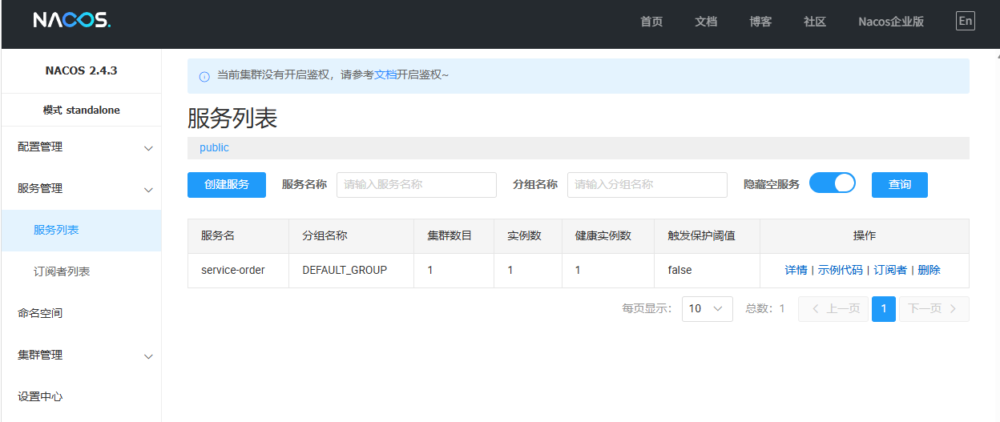
同样的去配置service-product
多端口启动
点到左下方的services，看看有没有对应的服务，没有SpringBoot的话点击"+" -> Run Configuration选择Spring Boot就可以看到了，然后右键对应的服务可以复制产生副本。
然后Options中选上Program arguments，可以修改端口
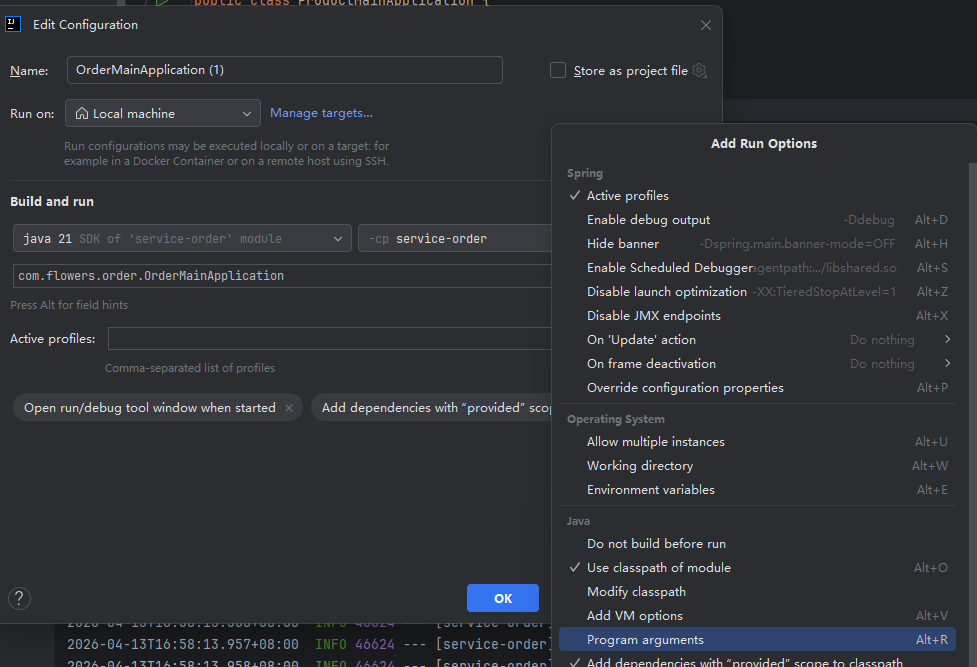
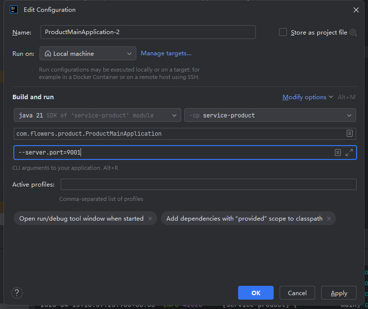
然后创建完全部启动
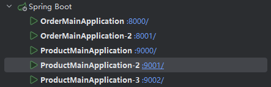
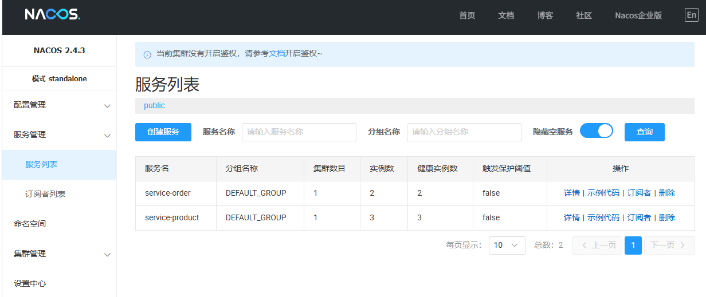

##### 服务发现
1.开启服务发现功能（@EnableDiscoveryClient）
这个注解是加在启动类上的，后面两步其实都是随便试试，后面可以自动搞的，不用自己掉api，主要做的就是在启动类上加上这个注解。
2.测试服务发现API（DiscoveryClient）
3.测试服务发现API（NacosServiceDiscovery）
注解加上后在pom里加入测试相关依赖
```
<dependency>  
    <groupId>org.springframework.boot</groupId>  
    <artifactId>spring-boot-starter-test</artifactId>  
    <scope>test</scope> <!--仅在测试文件夹生效-->  
</dependency>
```
测试

```java
package com.flowers.product;  
  
import com.alibaba.cloud.nacos.discovery.NacosServiceDiscovery;  
import com.alibaba.nacos.api.exception.NacosException;  
import org.junit.jupiter.api.Test;  
import org.springframework.beans.factory.annotation.Autowired;  
import org.springframework.boot.test.context.SpringBootTest;  
import org.springframework.cloud.client.ServiceInstance;  
import org.springframework.cloud.client.discovery.DiscoveryClient;  
  
import java.util.List;  
  
@SpringBootTest(classes = ProductMainApplication.class) // 解决找不到主启动类  
public class DiscoveryTest {  
  
    // 所有注册中心都可以用它的api  
    @Autowired  
    DiscoveryClient discoveryClient;  
  
    // Nacos才能用  
    @Autowired  
    NacosServiceDiscovery nacosServiceDiscovery;  
  
    @Test  
    void discoveryClientTest(){  
        // ..getServices 可以看到注册中心所有服务的名字  
        for(String service : discoveryClient.getServices()){  
            System.out.println("service = " + service);  
            // 获取ip+port  
            List<ServiceInstance> instances = discoveryClient.getInstances(service);  
            for(ServiceInstance instance : instances){  
                System.out.println("ip = " + instance.getHost() +  ", port = " + instance.getPort());  
            }  
        }  
    }  
  
    @Test  
    void nacosServiceDiscoveryTest() throws NacosException {  
        for(String service : nacosServiceDiscovery.getServices()){  
            System.out.println("service = " + service);  
            List<ServiceInstance> instances = nacosServiceDiscovery.getInstances(service);  
            for(ServiceInstance instance : instances){  
                System.out.println("ip = " + instance.getHost() +  ", port = " + instance.getPort());  
            }  
        }  
    }  
}
```
#####  编写微服务API+远程调用基本实现
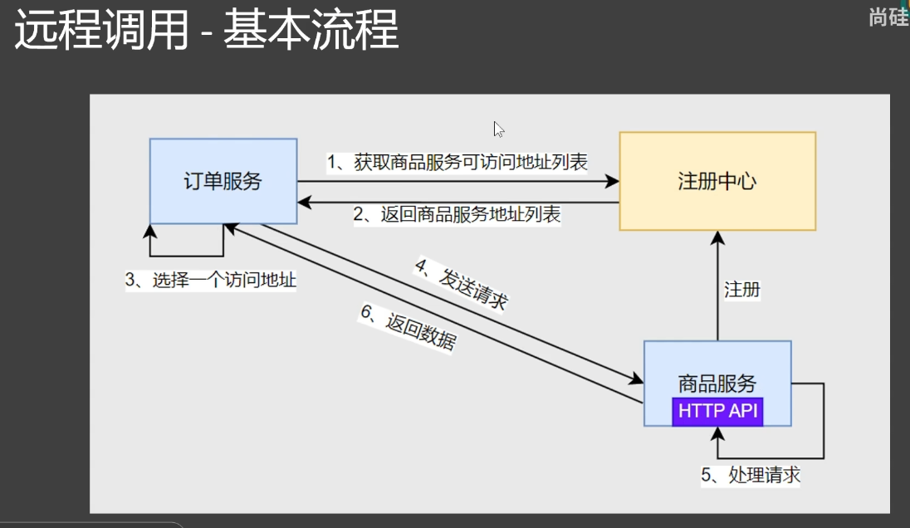
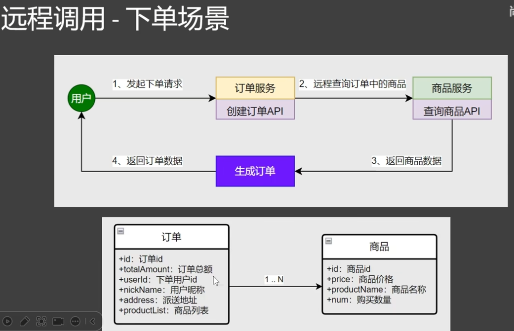
API可以通过远程调用，不过一些其他服务的对象，本服务要用的话就会比较麻烦，这里先新创建一个Module。
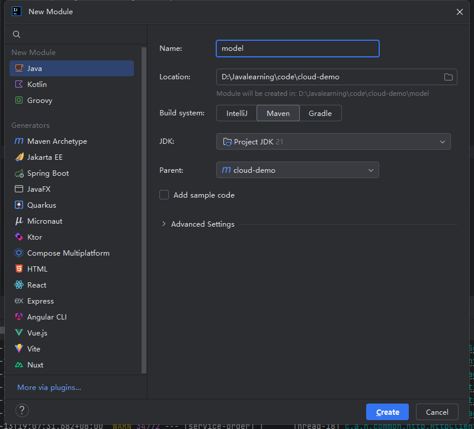
所有微服务的数据模型都放在里面
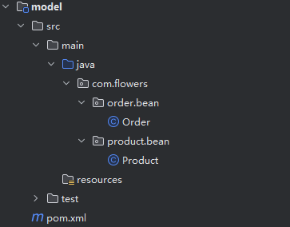
然后每个服务都要用这里面的对象，所以可以去services里面添加它的依赖
相关代码
Order对象
```java
package com.flowers.order.bean;  
  
import com.flowers.product.bean.Product;  
import lombok.Data;  
  
import java.math.BigDecimal;  
import java.util.List;  
  
@Data  
public class Order {  
    private Long id;  
    private BigDecimal totalAmount;  
    private Long userId;  
    private String nickName;  
    private String address;  
    private List<Product> productList;  
}
```
Product对象
```java
package com.flowers.product.bean;  
  
import lombok.Data;  
  
import java.math.BigDecimal;  
  
@Data  
public class Product {  
    private Long id;  
    private BigDecimal price;  
    private String name;  
    private int num;  
}
```
OrderController
```java
package com.flowers.order.controller;  
  
import com.flowers.order.bean.Order;  
import com.flowers.order.service.OrderService;  
import org.springframework.beans.factory.annotation.Autowired;  
import org.springframework.web.bind.annotation.GetMapping;  
import org.springframework.web.bind.annotation.RequestParam;  
import org.springframework.web.bind.annotation.RestController;  
  
@RestController  
public class OrderController {  
  
    @Autowired  
    OrderService orderService;  
  
    @GetMapping("/create")  
    public Order createOrder(@RequestParam("productId") Long productId, @RequestParam("userId") Long userId) {  
        return orderService.createOrder(productId, userId);  
    }  
}
```
OrderServiceimpl
```java
package com.flowers.order.service.impl;  
  
import com.flowers.order.bean.Order;  
import com.flowers.order.service.OrderService;  
import com.flowers.product.bean.Product;  
import lombok.extern.slf4j.Slf4j;  
import org.springframework.beans.factory.annotation.Autowired;  
import org.springframework.cloud.client.ServiceInstance;  
import org.springframework.cloud.client.discovery.DiscoveryClient;  
import org.springframework.stereotype.Service;  
import org.springframework.web.client.RestTemplate;  
  
import java.math.BigDecimal;  
import java.util.List;  
import java.util.Random;  
  
@Service  
@Slf4j  
public class OrderServiceimpl implements OrderService {  
  
    @Autowired  
    DiscoveryClient discoveryClient;  
    @Autowired  
    RestTemplate restTemplate;  
  
    @Override  
    public Order createOrder(Long productId, Long userId) {  
        Product product = getProductFromRemote(productId);  
        Order order = new Order();  
        order.setId(1L);  
        order.setTotalAmount(new BigDecimal(product.getNum()).multiply(product.getPrice()));  
        order.setUserId(userId);  
        order.setAddress("福建省龙岩市新罗区");  
        order.setNickName("花落为谁念");  
        order.setProductList(List.of(product));  
        return order;  
    }  
  
    private Product getProductFromRemote(Long productId) {  
        // 1.获取商品服务所在的所有机器IP + 端口  
        List<ServiceInstance> instances = discoveryClient.getInstances("service-product");  
        // 随机挑选一个 负载均衡  
        Random random = new Random();  
        int index = random.nextInt(instances.size());  
        ServiceInstance instance = instances.get(index);  
        // 远程URL  
        String url = "http://" + instance.getHost() + ":" + instance.getPort() + "/product/" + productId;  
        log.info("远程请求:{}", url);  
        // 2.给远程发送请求  
        return restTemplate.getForObject(url, Product.class);  
    }  
}
```
OrderConfig
```java
package com.flowers.order.config;  
  
import org.springframework.context.annotation.Bean;  
import org.springframework.context.annotation.Configuration;  
import org.springframework.web.client.RestTemplate;  
  
@Configuration  
public class OrderServiceConfig {  
  
    @Bean  
    public RestTemplate restTemplate() {  
        return new RestTemplate();  
    }  
}
```
ProductController
```java
package com.flowers.product.controller;  
  
import com.flowers.product.bean.Product;  
import com.flowers.product.service.ProductService;  
import org.springframework.beans.factory.annotation.Autowired;  
import org.springframework.web.bind.annotation.GetMapping;  
import org.springframework.web.bind.annotation.PathVariable;  
import org.springframework.web.bind.annotation.RestController;  
  
@RestController  
public class ProductController {  
  
    @Autowired  
    ProductService productService;  
  
    /**  
     * 查询商品  
     * @param productId 商品Id  
     */    @GetMapping("/product/{id}")  
    public Product getProduct(@PathVariable("id") Long productId) {  
        return productService.getProductById(productId);  
    }  
}
```
ProductServiceimpl
```java
package com.flowers.product.service.impl;  
  
import com.flowers.product.bean.Product;  
import com.flowers.product.service.ProductService;  
import org.springframework.stereotype.Service;  
  
import java.math.BigDecimal;  
  
@Service  
public class ProductServiceimpl implements ProductService {  
  
    @Override  
    public Product getProductById(Long productId) {  
        Product product = new Product();  
        product.setId(productId);  
        product.setPrice(new BigDecimal("100"));  
        product.setName("测试商品");  
        product.setNum(5);  
        return product;  
    }  
}
```
##### 负载均衡API测试
1.引入负载均衡依赖（spring-cloud-starter-loadbalancer）
Order的pom.xml中引入
```xml
<dependency>  
    <groupId>org.springframework.cloud</groupId>  
    <artifactId>spring-cloud-starter-loadbalancer</artifactId>  
</dependency>
```
2.测试负载均衡API（LoadBalancerClient）
Order的pom.xml中引入
```xml
<dependency>  
    <groupId>org.springframework.boot</groupId>  
    <artifactId>spring-boot-starter-test</artifactId>  
    <scope>test</scope>  
</dependency>
```

3.测试远程调用（RestTemplate0
```java
package com.flowers.order;  
  
import org.junit.jupiter.api.Test;  
import org.springframework.beans.factory.annotation.Autowired;  
import org.springframework.boot.test.context.SpringBootTest;  
import org.springframework.cloud.client.ServiceInstance;  
import org.springframework.cloud.client.loadbalancer.LoadBalancerClient;  
  
@SpringBootTest  
public class LoadBalancerTest {  
  
    @Autowired  
    LoadBalancerClient loadBalancerClient;  
  
    @Test  
    void test(){  
        ServiceInstance choose = loadBalancerClient.choose("service-product");  
        System.out.println("choose:" + choose.getHost() + ":" + choose.getPort());  
        choose = loadBalancerClient.choose("service-product");  
        System.out.println("choose:" + choose.getHost() + ":" + choose.getPort());  
        choose = loadBalancerClient.choose("service-product");  
        System.out.println("choose:" + choose.getHost() + ":" + choose.getPort());  
        choose = loadBalancerClient.choose("service-product");  
        System.out.println("choose:" + choose.getHost() + ":" + choose.getPort());  
        choose = loadBalancerClient.choose("service-product");  
        System.out.println("choose:" + choose.getHost() + ":" + choose.getPort());  
    }  
}
```
4.测试负载均衡调用
```java
private Product getProductFromRemoteWithLoadBalance(Long productId) {  
    // 1.通过负载均衡选择一个服务/副本  
    ServiceInstance instance = loadBalancerClient.choose("service-product");  
    // 远程URL  
    String url = "http://" + instance.getHost() + ":" + instance.getPort() + "/product/" + productId;  
    log.info("远程请求:{}", url);  
    // 2.给远程发送请求  
    return restTemplate.getForObject(url, Product.class);  
}
```
##### @LoadBalanced注解式负载均衡
把这个注解加到远程调用客户端上就可以了，以后也多用这种形式
```java
@Configuration  
public class OrderServiceConfig {  
  
    @LoadBalanced  
    @Bean    public RestTemplate restTemplate() {  
        return new RestTemplate();  
    }  
}
```
##### 经典面试题
如果注册中心宕机，远程调用还能成功吗？
目前的步骤是
1.去注册中心获取微服务地址列表
2.给对方服务的某个地址发送请求
核心是给对方服务发送请求，那么每次多一次获取请求地址其实是比较慢的
改进方式就是获取一次，然后存储在缓存中（服务一般是不会挂的，变动不频繁），然后可以让缓存实时和注册中心同步消息，有新增/挂了都同步一下。
这时候如果注册中心挂了
之前调用过，那么还可以正常远程调用（之前的服务没挂）
之前没调用过，是第一次调用，那么就不行了
#### 配置中心
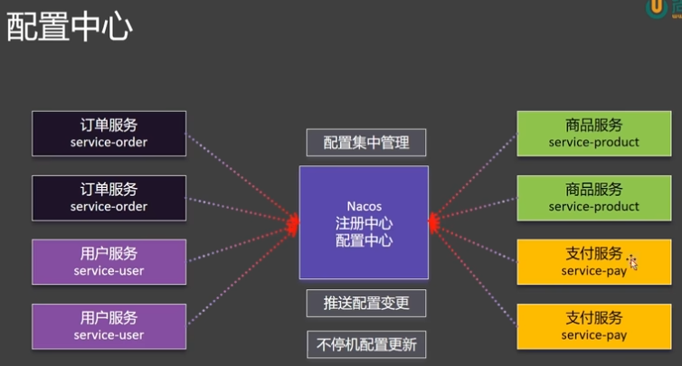
之前某个服务要更新配置，需要把这个服务下线然后重新打包上线，中间需要停机，有了配置中心之后就可以不停机更新。
##### 基本用法
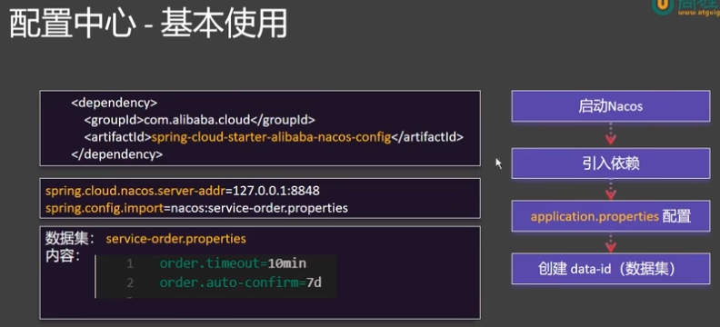
在services的pom中引入依赖
```xml
<!-- 配置中心 -->  
<dependency>  
    <groupId>com.alibaba.cloud</groupId>  
    <artifactId>spring-cloud-starter-alibaba-nacos-config</artifactId>  
</dependency>
```
在order的application.properties添加下面这行
```yaml
spring.config.import=nacos:service-order.properties
```
代表希望项目启动后导入这个配置，然后可以在nacos的配置管理中创建配置，Data Id需要设置为service-order.properties
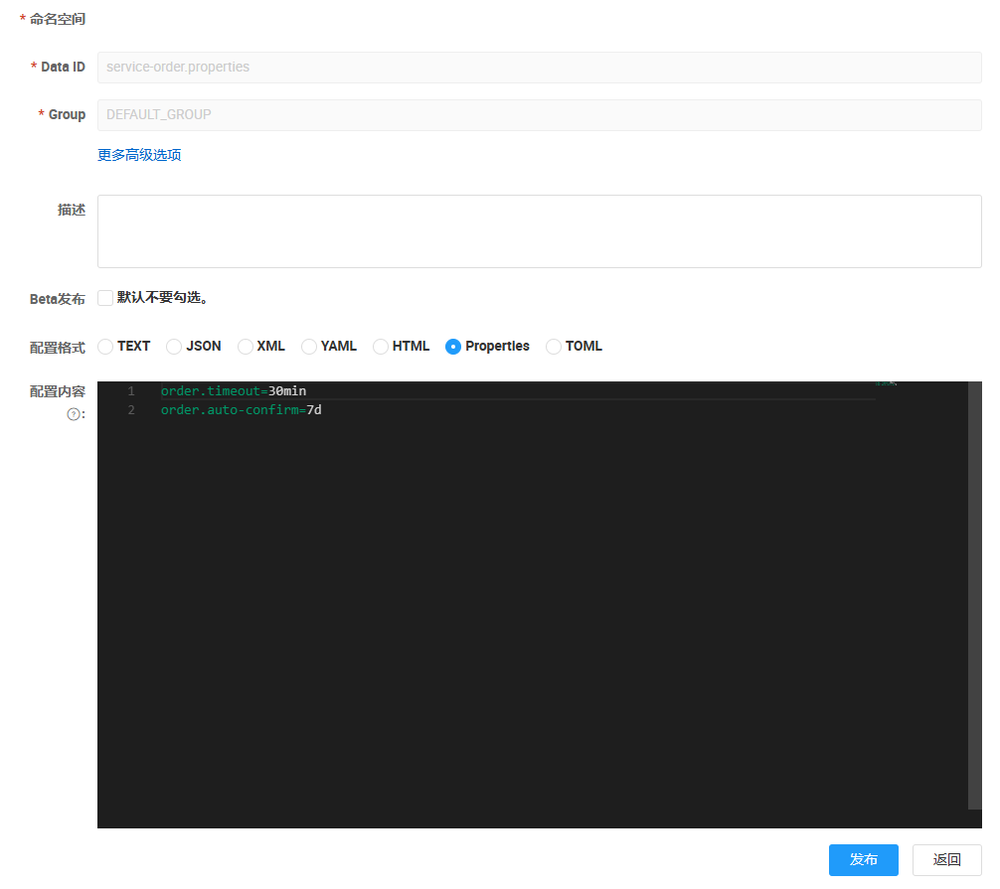

然后就可以在order.controller里面测试能不能用了
```java
@Value("${order.timeout}")  
String orderTimeout;  
@Value("${order.auto-confirm}")  
String autoConfirm;  
  
@GetMapping("/getConfig")  
public String getConfig(){  
    return "order.timeout:"+orderTimeout+",autoConfirm:"+autoConfirm;  
}
```
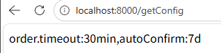
不过此时修改配置文件，运行的代码还不能实时感知到，需要加上@RefreshScope这个注解
```java
@RefreshScope  
@RestController  
public class OrderController 
```
如果统一导了配置中心依赖，但是某个微服务没配置，这时候是会报错的。可以先禁用导入检查
```
spring.cloud.nacos.config.import-check.enabled=false
```
##### 动态刷新
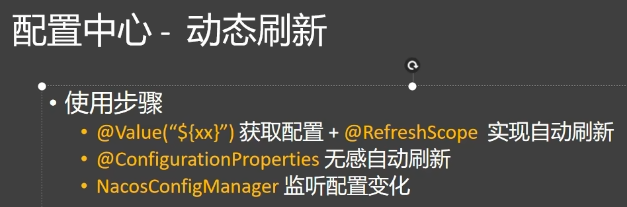
第二种方法操作步骤
创建一个properties类，把之前的变量去掉前缀放进来，然后加对应的注解
```java
package com.flowers.order.properties;  
  
import lombok.Data;  
import org.springframework.boot.context.properties.ConfigurationProperties;  
import org.springframework.stereotype.Component;  
  
@Component  
@ConfigurationProperties(prefix = "order") // 配置批量绑定，在nacos下，可以无需@RefreshScope就能实现自动刷新  
@Data  
public class OrderProperties {  
  
    String timeOut;  
    String autoConfirm;  
}
```
之后就可以都从这个类中获取配置了
```java
@Autowired  
OrderProperties orderProperties;  
  
@GetMapping("/getConfig")  
public String getConfig(){  
    return "order.timeout:"+ orderProperties.getTimeOut() +",autoConfirm:" + orderProperties.getAutoConfirm();  
}
```
##### 配置监听
##### 经典面试题
##### 数据隔离-namespace区分多环境
##### 数据隔离动态切换环境

### OpenFeign
### Sentinel
### Gateway
### Seata
