## 数组
### 理论基础
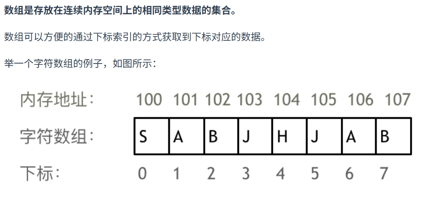
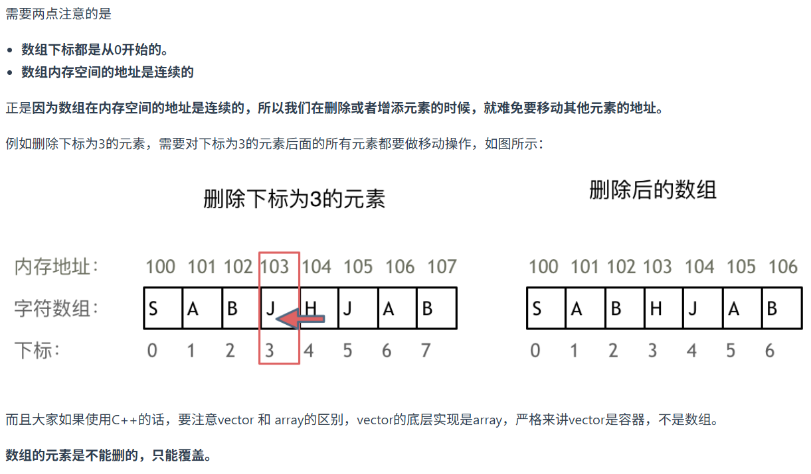

C++是，java不知道。
### 704.二分查找

时间100.00%，空间7.45%
```
class Solution {
    public int search(int[] nums, int target) {
        int n = nums.length;
        int left = 0;
        int right = n - 1;
        while(left <= right){
            int mid = (left + right) / 2;
            if(target == nums[mid])  return mid;
            else if(target < nums[mid]) right = mid - 1;
            else left = mid + 1;
        }
        return -1;
    }
}
```
### 27.移除元素
 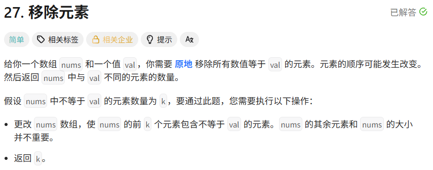
 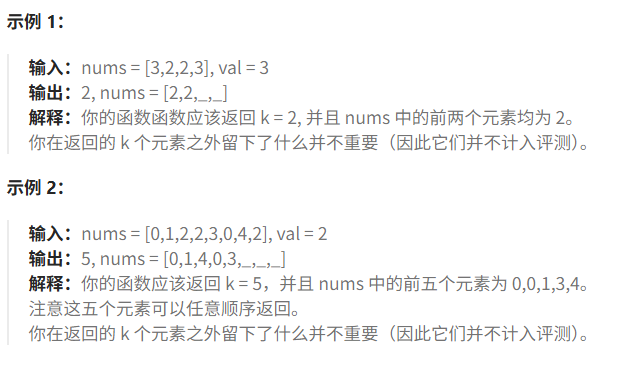
时间100.00，空间5.21%
```
class Solution {
    public int removeElement(int[] nums, int val) {
        //遍历，不是target就往前放
        //是就不管（删了）
        int length = 0;
        int k = 0;
        for(int i = 0;i < nums.length;i++){
            if(nums[i] != val){
                nums[length] = nums[i];
                length++;
            }else{
                k++;
            }
        }
        return nums.length - k;
    }
}
```
### 977.有序数组的平方

时间100.00%，空间92.25%
```
class Solution {
    public int[] sortedSquares(int[] nums) {
        //找到平方最小的那个数，以它为中心（越往两边走肯定平方是越大的）
        //搞个left right 分别向两边扩展，谁平方小放谁
        int n = nums.length;
        int minIndex = 0;
        int min = Integer.MAX_VALUE;
        for(int i = 0;i < n;i++){
            if(nums[i] * nums[i] < min){
                min = nums[i] * nums[i];
                minIndex = i;
            }
        }
        int[] res = new int[n];
        res[0] = nums[minIndex] * nums[minIndex];
        int length = 1;
        int left = minIndex - 1;
        int right = minIndex + 1;
        while(length < n){
            if(left < 0){
                res[length] = nums[right] * nums[right];
                right++;
                length++;
                continue;
            }
            if(right >= n){
                res[length] = nums[left] * nums[left];
                left--;
                length++;
                continue;
            }
            if(left == right){
                res[length] = nums[left] * nums[left];
                left--;
                right++;
                length++;
                continue;
            }
            if(nums[right] * nums[right] <= nums[left] * nums[left]){
                res[length] = nums[right] * nums[right];
                right++;
                length++;
            }else{
                res[length] = nums[left] * nums[left];
                left--;
                length++;
            }
        }
        return res;
    }
}
```
### 209.长度最小的子数组

时间99.78%，空间5.21%
```
class Solution {
    public int minSubArrayLen(int target, int[] nums) {
        //滑动窗口
        int n = nums.length;
        int sum = 0;//窗口内的和
        int left = 0;
        int min = n + 1;
        for(int right = 0; right < n;right++){
            sum += nums[right];
            while(left <= right && sum >= target){
                if(right - left + 1 < min){
                    min = right - left + 1;
                }
                sum -= nums[left];
                left++;
            }
        }
        if(min == n + 1) return 0;
        else return min;
    }
}
```
### 59.螺旋矩阵||
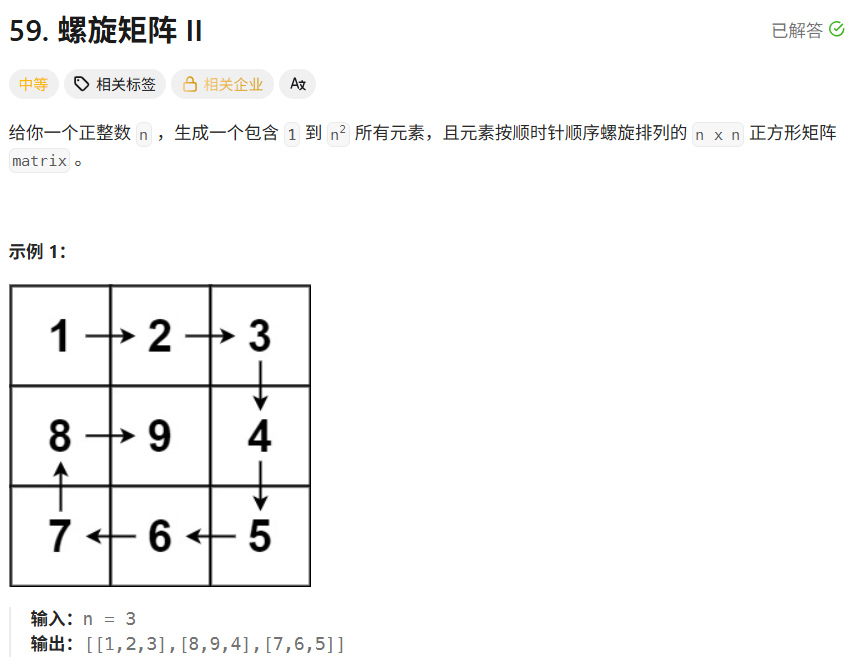
时间100.00%，空间10.04%
```
class Solution {
    public int[][] generateMatrix(int n) {
        int[][] res = new int[n][n];
        int num = 1;
        int i = 0;
        int j = 0;
        //模仿顺时针填入的方式，到边界了就换方向
        //边界：数组的边界 or 已经填过了
        while(num <= n * n){
            for(int k = 0;k < 4;k++){
                if(k == 0){
                    //向右填
                    while(j < n && res[i][j] == 0){
                        res[i][j] = num;
                        num++;
                        j++;
                    }
                    j--;
                    i++;
                }
                else if(k == 1){
                    //向下填
                    while(i < n && res[i][j] == 0){
                        res[i][j] = num;
                        num++;
                        i++;
                    }
                    i--;
                    j--;
                }
                else if(k == 2){
                    //向左填
                    while(j >= 0 && res[i][j] == 0){
                        res[i][j] = num;
                        num++;
                        j--;
                    }
                    j++;
                    i--;
                }else{
                    //向上填
                    while(i >= 0 && res[i][j] == 0){
                        res[i][j] = num;
                        num++;
                        i--;
                    }
                    i++;
                    j++;
                }
            }
        }
        return res;
    }
}
```
### 区间和

```
import java.util.Scanner;

public class Main {
    public static void main(String[] args) {
        Scanner scanner = new Scanner(System.in);
        //读数组长度n
        int n = scanner.nextInt();
        //思路：前缀和
        //求[a,b]区间上的元素和，到a处的前缀和-到b处的前缀和就行了
        int[] array = new int[n]; 
        //前缀和数组 pathSum[i] 表示[0,i - 1]上的和
        int[] pathSum = new int[n + 1];
        for(int i = 0;i < n;i++){
            //填数组和前缀和数组
            array[i] = scanner.nextInt();
            pathSum[i + 1] = pathSum[i] + array[i];
        }
        while(scanner.hasNextInt()){
            int a = scanner.nextInt();
            int b = scanner.nextInt();
            System.out.println(pathSum[b + 1] - pathSum[a]);
        }
        scanner.close();
    }
}
```
### 开发商购买土地

```
import java.util.Scanner;
import static java.lang.Math.*;

public class Main{
    public static void main(String[] args){
        Scanner scanner = new Scanner(System.in);
        int n = scanner.nextInt();
        int m = scanner.nextInt();
        int[] pathSum1 = new int[n];
        int[] pathSum2 = new int[m];
        int sum = 0;
        for(int i = 0;i < n;i++){
            for(int j = 0;j < m;j++){
                int a = scanner.nextInt();
                pathSum1[i] += a;
                pathSum2[j] += a;
                sum += a;
            }
        }
        //列的前缀和
        int min = Integer.MAX_VALUE;
        for(int i = 0;i < n;i++){
            if(i > 0){
                pathSum1[i] += pathSum1[i - 1];
            }
            int diff = Math.abs((sum - pathSum1[i]) - pathSum1[i]);
            if(diff < min){
                min = diff;
            }
        }
        //行的前缀和
        for(int j = 0;j < m;j++){
            if(j > 0){
                pathSum2[j] += pathSum2[j - 1];
            }
            int diff = Math.abs((sum - pathSum2[j]) - pathSum2[j]);
            if(diff < min){
                min = diff;
            }
        }
        System.out.println(min);
    }
}
```
## 链表
### 理论基础
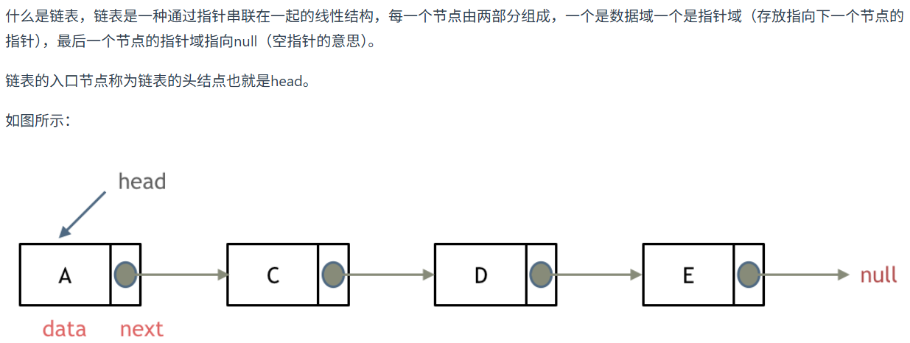
上图为单链表/单向链表，指针只能指向下一个节点
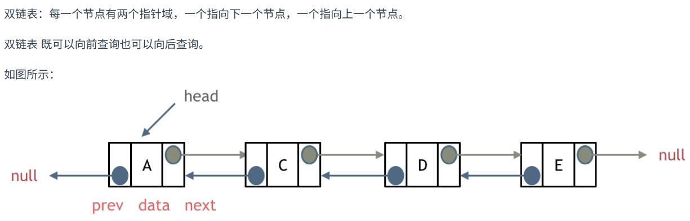
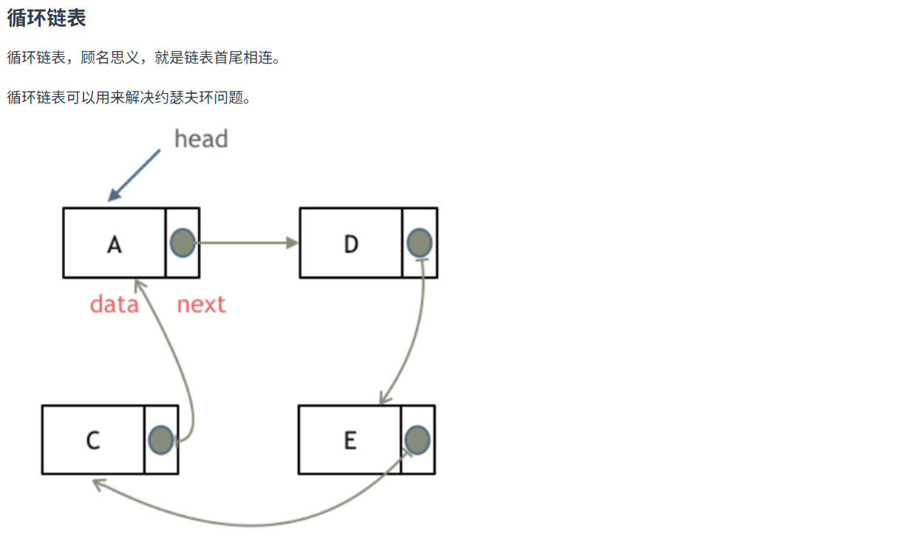

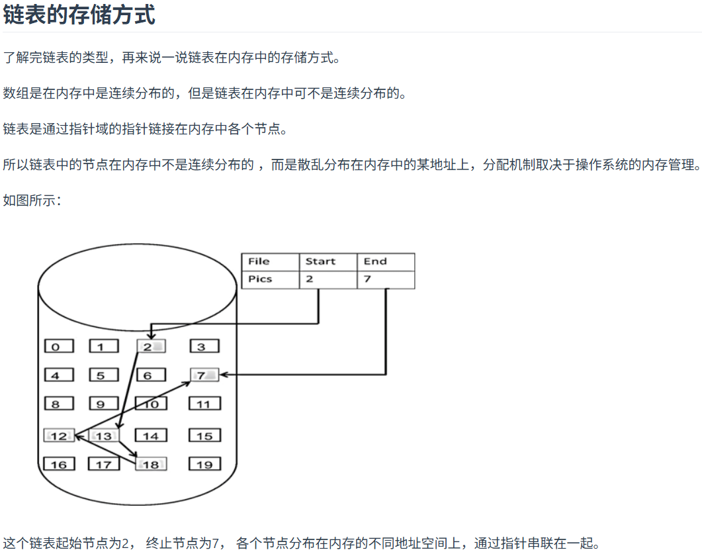
单向链表定义（java）
```
public class ListNode {
	int val;

    ListNode next;

    ListNode() {}

    ListNode(int val) { this.val = val; }

    ListNode(int val, ListNode next) { this.val = val; this.next = next; }
}
```
双向链表定义（java）
```
public class ListNode {
	int val;

    ListNode next;
    
    ListNode prev;

    ListNode() {}

    ListNode(int val) { this.val = val; }

    ListNode(int val, ListNode next, ListNode prev) { 
    this.val = val; this.next = next; this.prev = prev}
}
```
链表操作
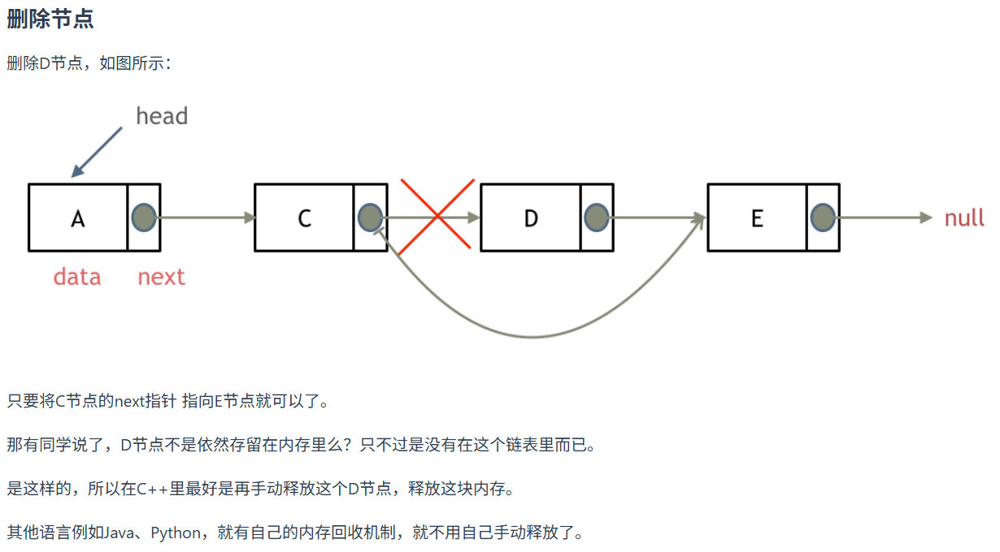
```
遍历链表到c
c.next = c.next.next
``` 
双向链表删除
a <-> b <-> c (x)<-> d  删除c
```
遍历链表到b
b.next = d.next.next;
b.next.prev = b;
```
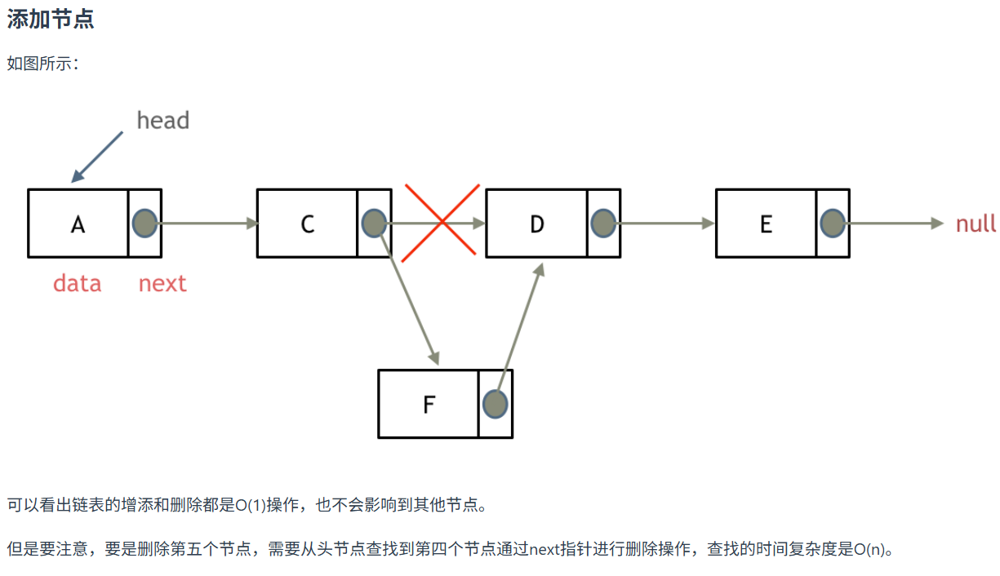
```
遍历链表到c
ListNode f = new ListNode();
f.next = c.next;
c.next = f;
```
双向链表添加
a <-> b <-> c (new) <-> d 新增节点c
```
遍历链表到b
ListNode c = new ListNode();
c.next = b.next;
b.next = c;
c.next.prev = c;
c.prev = b;
```
### 203.移除链表元素
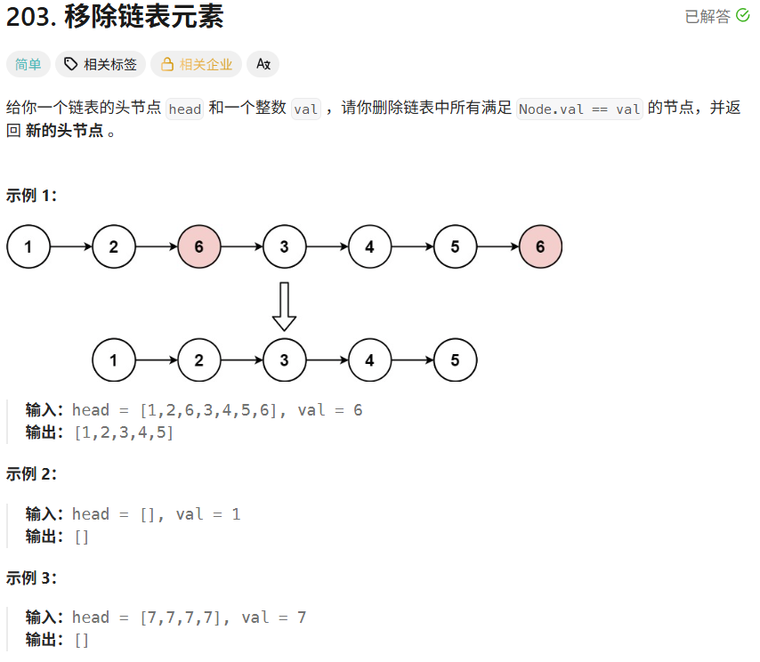
时间81.97%，空间7.45%
```
/**

 * Definition for singly-linked list.

 * public class ListNode {

 *     int val;

 *     ListNode next;

 *     ListNode() {}

 *     ListNode(int val) { this.val = val; }

 *     ListNode(int val, ListNode next) { this.val = val; this.next = next; }

 * }

 */

class Solution {

    public ListNode removeElements(ListNode head, int val) {

        ListNode prev = null;

        ListNode res = head;

        ListNode curr = res;

        while(curr != null){

            if(curr.val == val){

                if(prev == null){

                    res = curr.next;

                }else{

                    prev.next = curr.next;

                }

            }else{

                //如果当前节点被删除了是不用更新prev的

                prev = curr;

            }

            curr = curr.next;

        }

        return res;

    }

}
```
### 707.设计链表
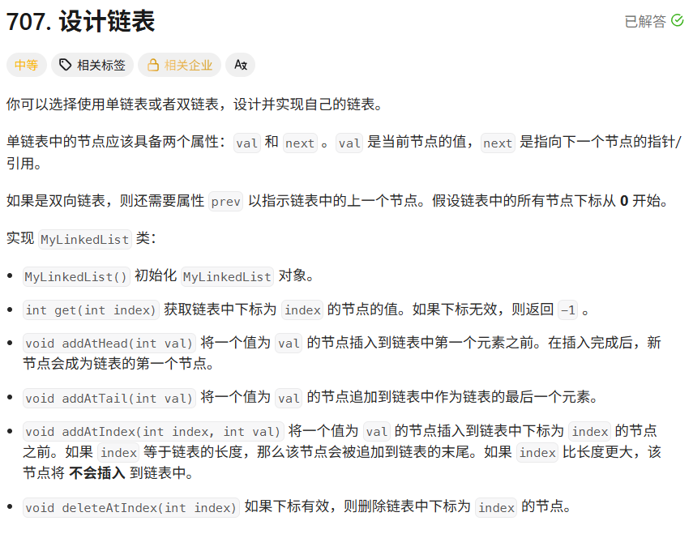
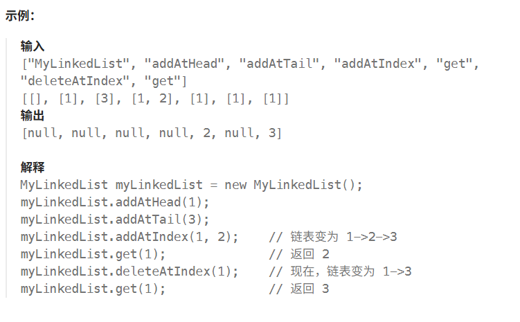
时间95.54%，空间18.23%
```
class MyLinkedList {

    //这个类名其实有点提示的，LinkedList的底层实现就是双向链表

    class ListNode{

        int val;

        ListNode prev;

        ListNode next;

        ListNode(){}

        ListNode(int val){this.val = val;}

    }

  

    private ListNode dHead;

    private ListNode dEnd;

    private int length;

  

    public MyLinkedList() {

        dHead = new ListNode();

        dEnd = new ListNode();

        dHead.next = dEnd;

        dEnd.prev = dHead;

        length = 0;

    }

    public int get(int index) {

        if(index >= length){

            return -1;

        }

        ListNode curr = dHead.next;

        for(int i = 0;i < index;i++){

            curr = curr.next;

        }

        return curr.val;

    }

    public void addAtHead(int val) {

        ListNode node = new ListNode(val);

        node.next = dHead.next;

        node.next.prev = node;

        dHead.next = node;

        node.prev = dHead;

        length++;

    }

    public void addAtTail(int val) {

        ListNode node = new ListNode(val);

        node.prev = dEnd.prev;

        node.prev.next = node;

        dEnd.prev = node;

        node.next = dEnd;

        length++;

    }

    public void addAtIndex(int index, int val) {

        if(index > length) return;

        ListNode curr = null;

        if(index <= length / 2){

            curr = dHead.next;

            for(int i = 0;i < index;i++){

                curr = curr.next;

            }

        }else{

            curr = dEnd;

            for(int i = 0;i < length - index;i++){

                curr = curr.prev;

            }

        }

        ListNode node = new ListNode(val);

        curr.prev.next = node;

        node.next = curr;

        node.prev = curr.prev;

        curr.prev = node;

        length++;

    }

    public void deleteAtIndex(int index) {

        if(index >= length) return;

        ListNode curr = null;

        if(index <= length / 2){

            curr = dHead.next;

            for(int i = 0;i < index;i++){

                curr = curr.next;

            }

        }else{

            curr = dEnd;

            for(int i = 0;i < length - index;i++){

                curr = curr.prev;

            }

        }

        curr.prev.next = curr.next;

        curr.next.prev = curr.prev;

        length--;

    }

}

  

/**

 * Your MyLinkedList object will be instantiated and called as such:

 * MyLinkedList obj = new MyLinkedList();

 * int param_1 = obj.get(index);

 * obj.addAtHead(val);

 * obj.addAtTail(val);

 * obj.addAtIndex(index,val);

 * obj.deleteAtIndex(index);

 */
```
### 反转链表
见hot100
### 24.两两交换链表中的节点
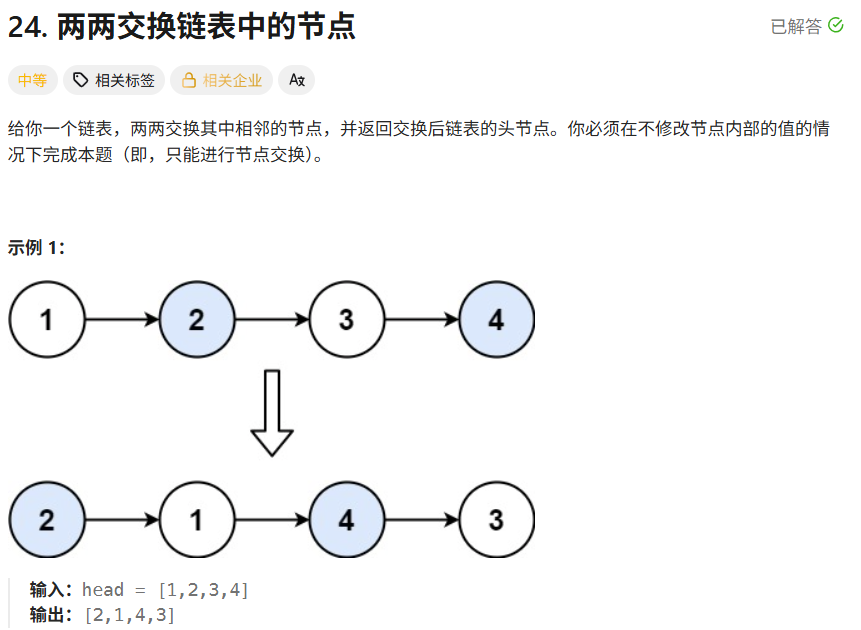时间100.00%，空间5.19%
```
/**

 * Definition for singly-linked list.

 * public class ListNode {

 *     int val;

 *     ListNode next;

 *     ListNode() {}

 *     ListNode(int val) { this.val = val; }

 *     ListNode(int val, ListNode next) { this.val = val; this.next = next; }

 * }

 */

class Solution {

    public ListNode swapPairs(ListNode head) {

        if(head == null || head.next == null){

            return head;

        }

        //先把前两个节点交换了，很多东西会方便一点

        ListNode res = head.next;//要返回的头结点

        head.next = res.next;

        res.next = head;

        ListNode curr = head.next;

        ListNode prev = head;

        //两个两个一组交换前后节点

        while(curr != null && curr.next != null){

            //curr curr.next next

            //curr.next curr next

            ListNode next = curr.next.next;

            prev.next = curr.next;

            prev.next.next = curr;

            curr.next = next;

            prev = curr;

            curr = next;

        }

        return res;

    }

}
```
### 19.删除链表的倒数第N个节点
见hot100
### 面试题02.07.链表相交
见hot100->160.相交链表
### 142.环形链表||
见hot100
## 哈希表
### new