## 数组
### 理论基础


C++是，java不知道。
### 704.二分查找

时间100.00%，空间7.45%
```
class Solution {
    public int search(int[] nums, int target) {
        int n = nums.length;
        int left = 0;
        int right = n - 1;
        while(left <= right){
            int mid = (left + right) / 2;
            if(target == nums[mid])  return mid;
            else if(target < nums[mid]) right = mid - 1;
            else left = mid + 1;
        }
        return -1;
    }
}
```
### 27.移除元素
 
 
时间100.00，空间5.21%
```
class Solution {
    public int removeElement(int[] nums, int val) {
        //遍历，不是target就往前放
        //是就不管（删了）
        int length = 0;
        int k = 0;
        for(int i = 0;i < nums.length;i++){
            if(nums[i] != val){
                nums[length] = nums[i];
                length++;
            }else{
                k++;
            }
        }
        return nums.length - k;
    }
}
```
### 977.有序数组的平方

时间100.00%，空间92.25%
```
class Solution {
    public int[] sortedSquares(int[] nums) {
        //找到平方最小的那个数，以它为中心（越往两边走肯定平方是越大的）
        //搞个left right 分别向两边扩展，谁平方小放谁
        int n = nums.length;
        int minIndex = 0;
        int min = Integer.MAX_VALUE;
        for(int i = 0;i < n;i++){
            if(nums[i] * nums[i] < min){
                min = nums[i] * nums[i];
                minIndex = i;
            }
        }
        int[] res = new int[n];
        res[0] = nums[minIndex] * nums[minIndex];
        int length = 1;
        int left = minIndex - 1;
        int right = minIndex + 1;
        while(length < n){
            if(left < 0){
                res[length] = nums[right] * nums[right];
                right++;
                length++;
                continue;
            }
            if(right >= n){
                res[length] = nums[left] * nums[left];
                left--;
                length++;
                continue;
            }
            if(left == right){
                res[length] = nums[left] * nums[left];
                left--;
                right++;
                length++;
                continue;
            }
            if(nums[right] * nums[right] <= nums[left] * nums[left]){
                res[length] = nums[right] * nums[right];
                right++;
                length++;
            }else{
                res[length] = nums[left] * nums[left];
                left--;
                length++;
            }
        }
        return res;
    }
}
```
### 209.长度最小的子数组

时间99.78%，空间5.21%
```
class Solution {
    public int minSubArrayLen(int target, int[] nums) {
        //滑动窗口
        int n = nums.length;
        int sum = 0;//窗口内的和
        int left = 0;
        int min = n + 1;
        for(int right = 0; right < n;right++){
            sum += nums[right];
            while(left <= right && sum >= target){
                if(right - left + 1 < min){
                    min = right - left + 1;
                }
                sum -= nums[left];
                left++;
            }
        }
        if(min == n + 1) return 0;
        else return min;
    }
}
```
### 59.螺旋矩阵||

时间100.00%，空间10.04%
```
class Solution {
    public int[][] generateMatrix(int n) {
        int[][] res = new int[n][n];
        int num = 1;
        int i = 0;
        int j = 0;
        //模仿顺时针填入的方式，到边界了就换方向
        //边界：数组的边界 or 已经填过了
        while(num <= n * n){
            for(int k = 0;k < 4;k++){
                if(k == 0){
                    //向右填
                    while(j < n && res[i][j] == 0){
                        res[i][j] = num;
                        num++;
                        j++;
                    }
                    j--;
                    i++;
                }
                else if(k == 1){
                    //向下填
                    while(i < n && res[i][j] == 0){
                        res[i][j] = num;
                        num++;
                        i++;
                    }
                    i--;
                    j--;
                }
                else if(k == 2){
                    //向左填
                    while(j >= 0 && res[i][j] == 0){
                        res[i][j] = num;
                        num++;
                        j--;
                    }
                    j++;
                    i--;
                }else{
                    //向上填
                    while(i >= 0 && res[i][j] == 0){
                        res[i][j] = num;
                        num++;
                        i--;
                    }
                    i++;
                    j++;
                }
            }
        }
        return res;
    }
}
```
### 区间和

```
import java.util.Scanner;

public class Main {
    public static void main(String[] args) {
        Scanner scanner = new Scanner(System.in);
        //读数组长度n
        int n = scanner.nextInt();
        //思路：前缀和
        //求[a,b]区间上的元素和，到a处的前缀和-到b处的前缀和就行了
        int[] array = new int[n]; 
        //前缀和数组 pathSum[i] 表示[0,i - 1]上的和
        int[] pathSum = new int[n + 1];
        for(int i = 0;i < n;i++){
            //填数组和前缀和数组
            array[i] = scanner.nextInt();
            pathSum[i + 1] = pathSum[i] + array[i];
        }
        while(scanner.hasNextInt()){
            int a = scanner.nextInt();
            int b = scanner.nextInt();
            System.out.println(pathSum[b + 1] - pathSum[a]);
        }
        scanner.close();
    }
}
```
### 开发商购买土地

```
import java.util.Scanner;
import static java.lang.Math.*;

public class Main{
    public static void main(String[] args){
        Scanner scanner = new Scanner(System.in);
        int n = scanner.nextInt();
        int m = scanner.nextInt();
        int[] pathSum1 = new int[n];
        int[] pathSum2 = new int[m];
        int sum = 0;
        for(int i = 0;i < n;i++){
            for(int j = 0;j < m;j++){
                int a = scanner.nextInt();
                pathSum1[i] += a;
                pathSum2[j] += a;
                sum += a;
            }
        }
        //列的前缀和
        int min = Integer.MAX_VALUE;
        for(int i = 0;i < n;i++){
            if(i > 0){
                pathSum1[i] += pathSum1[i - 1];
            }
            int diff = Math.abs((sum - pathSum1[i]) - pathSum1[i]);
            if(diff < min){
                min = diff;
            }
        }
        //行的前缀和
        for(int j = 0;j < m;j++){
            if(j > 0){
                pathSum2[j] += pathSum2[j - 1];
            }
            int diff = Math.abs((sum - pathSum2[j]) - pathSum2[j]);
            if(diff < min){
                min = diff;
            }
        }
        System.out.println(min);
    }
}
```
## 链表
### 理论基础

上图为单链表/单向链表，指针只能指向下一个节点


单向链表定义（java）
```
public class ListNode {
	int val;

    ListNode next;

    ListNode() {}

    ListNode(int val) { this.val = val; }

    ListNode(int val, ListNode next) { this.val = val; this.next = next; }
}
```
双向链表定义（java）
```
public class ListNode {
	int val;

    ListNode next;
    
    ListNode prev;

    ListNode() {}

    ListNode(int val) { this.val = val; }

    ListNode(int val, ListNode next, ListNode prev) { 
    this.val = val; this.next = next; this.prev = prev}
}
```
链表操作

```
遍历链表到c
c.next = c.next.next
``` 
双向链表删除
a <-> b <-> c (x)<-> d  删除c
```
遍历链表到b
b.next = d.next.next;
b.next.prev = b;
```

```
遍历链表到c
ListNode f = new ListNode();
f.next = c.next;
c.next = f;
```
双向链表添加
a <-> b <-> c (new) <-> d 新增节点c
```
遍历链表到b
ListNode c = new ListNode();
c.next = b.next;
b.next = c;
c.next.prev = c;
c.prev = b;
```
### 203.移除链表元素

时间81.97%，空间7.45%
```
/**

 * Definition for singly-linked list.

 * public class ListNode {

 *     int val;

 *     ListNode next;

 *     ListNode() {}

 *     ListNode(int val) { this.val = val; }

 *     ListNode(int val, ListNode next) { this.val = val; this.next = next; }

 * }

 */

class Solution {

    public ListNode removeElements(ListNode head, int val) {

        ListNode prev = null;

        ListNode res = head;

        ListNode curr = res;

        while(curr != null){

            if(curr.val == val){

                if(prev == null){

                    res = curr.next;

                }else{

                    prev.next = curr.next;

                }

            }else{

                //如果当前节点被删除了是不用更新prev的

                prev = curr;

            }

            curr = curr.next;

        }

        return res;

    }

}
```
### 707.设计链表


时间95.54%，空间18.23%
```
class MyLinkedList {

    //这个类名其实有点提示的，LinkedList的底层实现就是双向链表

    class ListNode{

        int val;

        ListNode prev;

        ListNode next;

        ListNode(){}

        ListNode(int val){this.val = val;}

    }

  

    private ListNode dHead;

    private ListNode dEnd;

    private int length;

  

    public MyLinkedList() {

        dHead = new ListNode();

        dEnd = new ListNode();

        dHead.next = dEnd;

        dEnd.prev = dHead;

        length = 0;

    }

    public int get(int index) {

        if(index >= length){

            return -1;

        }

        ListNode curr = dHead.next;

        for(int i = 0;i < index;i++){

            curr = curr.next;

        }

        return curr.val;

    }

    public void addAtHead(int val) {

        ListNode node = new ListNode(val);

        node.next = dHead.next;

        node.next.prev = node;

        dHead.next = node;

        node.prev = dHead;

        length++;

    }

    public void addAtTail(int val) {

        ListNode node = new ListNode(val);

        node.prev = dEnd.prev;

        node.prev.next = node;

        dEnd.prev = node;

        node.next = dEnd;

        length++;

    }

    public void addAtIndex(int index, int val) {

        if(index > length) return;

        ListNode curr = null;

        if(index <= length / 2){

            curr = dHead.next;

            for(int i = 0;i < index;i++){

                curr = curr.next;

            }

        }else{

            curr = dEnd;

            for(int i = 0;i < length - index;i++){

                curr = curr.prev;

            }

        }

        ListNode node = new ListNode(val);

        curr.prev.next = node;

        node.next = curr;

        node.prev = curr.prev;

        curr.prev = node;

        length++;

    }

    public void deleteAtIndex(int index) {

        if(index >= length) return;

        ListNode curr = null;

        if(index <= length / 2){

            curr = dHead.next;

            for(int i = 0;i < index;i++){

                curr = curr.next;

            }

        }else{

            curr = dEnd;

            for(int i = 0;i < length - index;i++){

                curr = curr.prev;

            }

        }

        curr.prev.next = curr.next;

        curr.next.prev = curr.prev;

        length--;

    }

}

  

/**

 * Your MyLinkedList object will be instantiated and called as such:

 * MyLinkedList obj = new MyLinkedList();

 * int param_1 = obj.get(index);

 * obj.addAtHead(val);

 * obj.addAtTail(val);

 * obj.addAtIndex(index,val);

 * obj.deleteAtIndex(index);

 */
```
### 反转链表
见hot100
### 24.两两交换链表中的节点
时间100.00%，空间5.19%
```
/**

 * Definition for singly-linked list.

 * public class ListNode {

 *     int val;

 *     ListNode next;

 *     ListNode() {}

 *     ListNode(int val) { this.val = val; }

 *     ListNode(int val, ListNode next) { this.val = val; this.next = next; }

 * }

 */

class Solution {

    public ListNode swapPairs(ListNode head) {

        if(head == null || head.next == null){

            return head;

        }

        //先把前两个节点交换了，很多东西会方便一点

        ListNode res = head.next;//要返回的头结点

        head.next = res.next;

        res.next = head;

        ListNode curr = head.next;

        ListNode prev = head;

        //两个两个一组交换前后节点

        while(curr != null && curr.next != null){

            //curr curr.next next

            //curr.next curr next

            ListNode next = curr.next.next;

            prev.next = curr.next;

            prev.next.next = curr;

            curr.next = next;

            prev = curr;

            curr = next;

        }

        return res;

    }

}
```
### 19.删除链表的倒数第N个节点
见hot100
### 面试题02.07.链表相交
见hot100->160.相交链表
### 142.环形链表||
见hot100
## 哈希表
### 理论基础
数组是其底层结构，主要用来等值查询/快速判断一个元素是否出现在集合里
关键在于元素存储位置的计算，计算过程如下图所示。
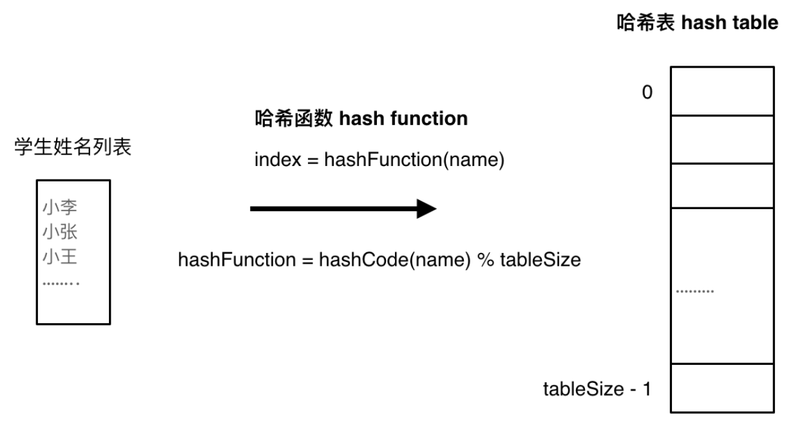
如果多个学生都映射到了同一个索引，就发生了哈希碰撞。解决哈希碰撞的方法有两种，一个是拉链法，一个是线性探测法。
拉链法就是数组+链表，计算到同一个索引就挂到这个位置下的链表就行了。这个方法需要选择适当的哈希表的大小，太大了浪费内存，太小的话一个桶下挂了太多节点查询时间会增加。
线性探测法，发生冲突了就找下一个空的位置存（从该索引开始向后查找，查询的时候也是，从该索引开始查找，直到找到目标键或者空位为止）。
**总结**，当我们遇到了要快速判断一个元素是否出现集合里的时候，就要考虑哈希法。但是哈希法也是牺牲了空间换取了时间，因为我们要使用额外的数组，set或者是map来存放数据，才能实现快速的查找。如果在做面试题目的时候遇到需要判断一个元素是否出现过的场景也应该第一时间想到哈希法！
### 242.有效的字母异位词
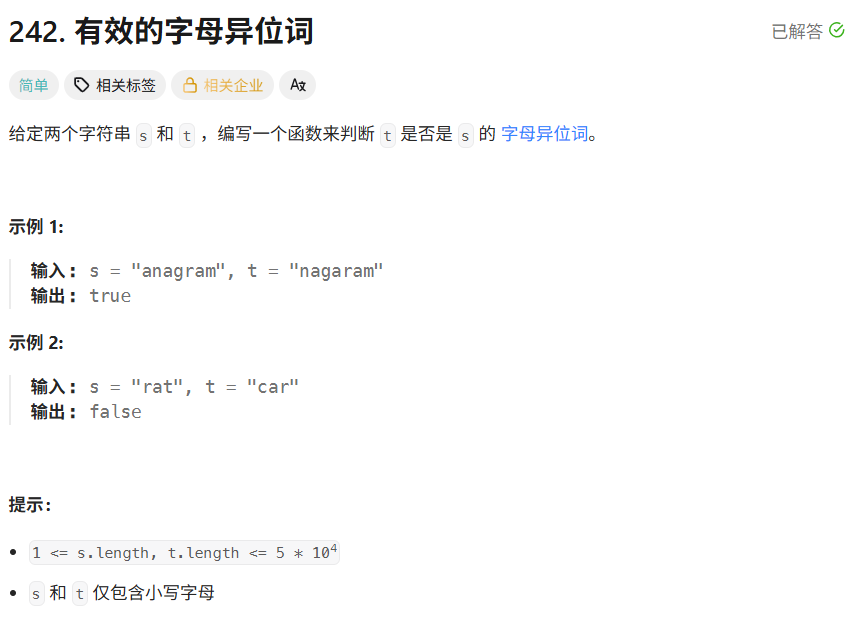时间92.42%，空间45.28%
```
class Solution {

    public boolean isAnagram(String s, String t) {

        int sl = s.length();

        int tl = t.length();

        if(sl != tl) return false;

        int[] sCount = new int[26];

        int[] tCount = new int[26];

        for(int i = 0;i < sl;i++){

            sCount[s.charAt(i) - 'a']++;

        }

        for(int i = 0;i < tl;i++){

            tCount[t.charAt(i) - 'a']++;

        }

        for(int i = 0;i < 26;i++){

            if(tCount[i] != sCount[i]){

                return false;

            }

        }

        return true;

    }

}
```
### 349.两个数组的交集
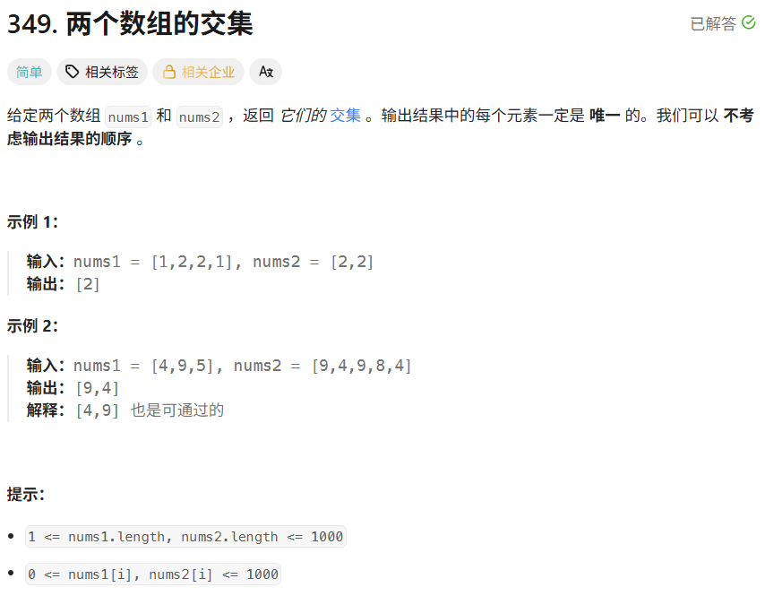时间90.36%，空间13.07%
```
class Solution {

    public int[] intersection(int[] nums1, int[] nums2) {

        //这个交集只是看重复的元素啊，而不是把重复的部分都打出来

        //就是[1,2,2,3,3]交[2,2,3,3]不是[2,2,3,3]而是[2,3]直接哈希表就能做

        Set<Integer> memory = new HashSet<>();//记住nums1中出现的数字

        Set<Integer> resSet = new HashSet<>();//存储结果，用HashSet来去重

        for(int i = 0;i < nums1.length;i++){

            memory.add(nums1[i]);

        }

        for(int i = 0;i < nums2.length;i++){

            if(memory.contains(nums2[i])){

                resSet.add(nums2[i]);

            }

        }

        int[] res = new int[resSet.size()];

        int length = 0;

        for(Integer i:resSet){

            res[length] = i;

            length++;

        }

        return res;

    }

}
```
### ★★★202.快乐数
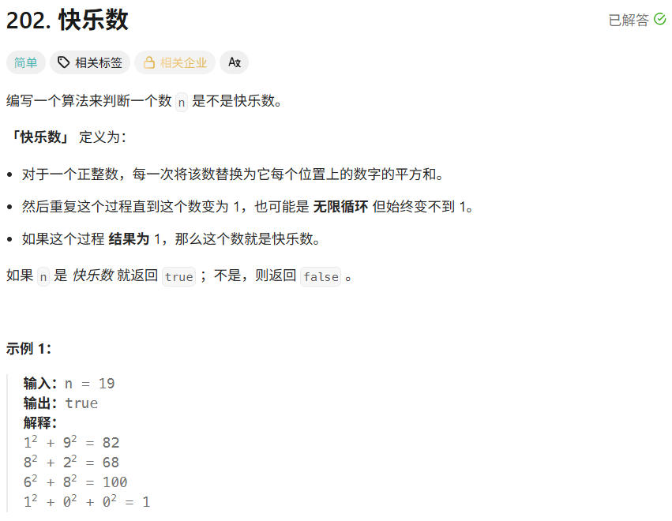这题虽然是在哈希表下的，但是是用双指针做的，这个思路会更好一点，用哈希表实现也简单的。时间85.80%，空间29.91%
```
class Solution {

    public boolean isHappy(int n) {

        //每个数经过一轮轮的变化，可能会有以下三种情况

        //1.最终会得到1 2.最终会进入循环 3.值会越来越大，最后接近无穷大

        //但是实际上每个数经过这样的操作之后都会进入循环，下面是证明

        //9 -> 81   99->162  999->243

        //也就是说三位数经过变化之后不可能操作243，那对于四位数呢，

        //可以验证每个位置上的数平方最大就是81，能得到的最大值就是位数 * 81

        //对于4位及以上的数字，经过一轮这样的变化后都是减小的，最终会被降到3位以内

        //所以任何数最终都会进入到一个循环，可以用快慢指针解决

        //哈希表就是把走过的数都记一下嘛，再走过一次就知道进循环了，直接return false；

        int slow = n;

        int fast = n;

        fast = operation(operation(fast));

        slow = operation(slow);

        while(fast != 1 && slow != 1){

            if(fast == slow) return false;

            fast = operation(operation(fast));

            slow = operation(slow);

        }

        return true;

    }

  

    private int operation(int n){

        int sum = 0;

        while(n > 0){

            int end = n % 10;

            sum += end * end;

            n /= 10;

        }

        return sum;

    }

}
```
### 1.两数之和
见hot100
### ★★★454.四数相加||

时间78.89%，空间38.58%
```
class Solution {

    public int fourSumCount(int[] nums1, int[] nums2, int[] nums3, int[] nums4) {

        //大概的思路我觉得就是数组两两为一组，然后用两数之和的想法来做

        //key放数组nums1和nums2中元素的和，value是这个和的出现次数

        //那么之后对于每个nums3和nums4中元素的和查找一下加起来就行了

        int n = nums1.length;

        Map<Integer, Integer> AandB = new HashMap<>();

        for(int i = 0;i < n;i++){

            for(int j = 0;j < n;j++){

                int temp = nums1[i] + nums2[j];

                //小小新学一个HashMap的getOrDefault函数

                //有这个key就获取值，没有就给个0

                AandB.put(temp, AandB.getOrDefault(temp, 0) + 1);

            }

        }

        int res = 0;

        for(int i = 0;i < n;i++){

            for(int j = 0;j < n;j++){

                int target = - nums3[i] - nums4[j];

                res += AandB.getOrDefault(target, 0);

            }

        }

        return res;

    }

}
```
### 383.赎金信
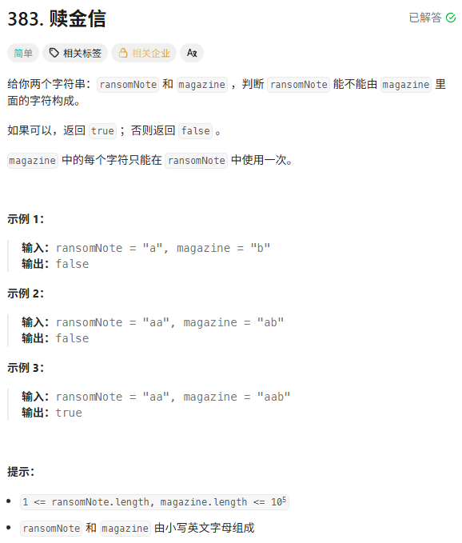
时间99.87%，空间33.95%
```
class Solution {

    public boolean canConstruct(String ransomNote, String magazine) {

        int l1 = ransomNote.length();

        int l2 = magazine.length();

        if(l1 > l2) return false;

        //其实就是要用magazine中的字符把ransomNote拼出来嘛

        //统计magazine出现的字母及其出现次数（就是可使用的字母及其出现次数）

        //要用的字母没次数了或者本来就是没有就return false，其他true

        //注意这里的hashmap可以用int[26]简化

        int[] count = new int[26];

        for(int i = 0;i < l2;i++){

            count[magazine.charAt(i) - 'a']++;

        }

        for(int i = 0;i < l1;i++){

            if(count[ransomNote.charAt(i) - 'a'] == 0) return false;

            count[ransomNote.charAt(i) - 'a']--;

        }

        return true;

    }

}
```
### 15.三数之和
见hot100
### 18.四数之和
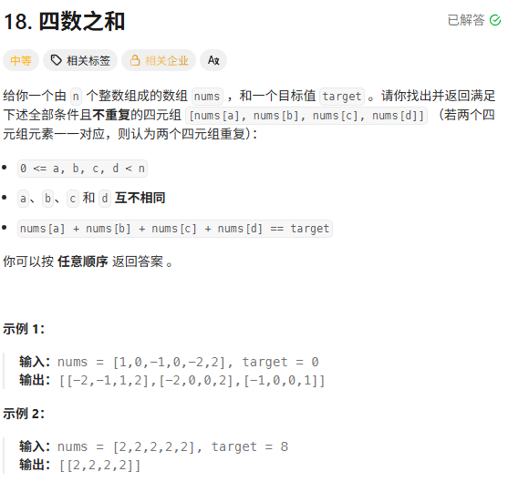
时间33.62%，空间30.55%
```
class Solution {

    public List<List<Integer>> fourSum(int[] nums, int target) {

        Arrays.sort(nums);

        List<List<Integer>> res = new ArrayList<>();

        //其实很好降成三数之和啊我感觉

        //遍历到的当前的数作为第一个数

        //后面找三数之和为target-这个数就行

        int n = nums.length;

        for(int i = 0;i < n - 3;i++){

            if(i > 0 && nums[i] == nums[i - 1]){

                continue;

            }

            for(int j = i + 1;j < n - 2;j++){

                if(j > i + 1 && nums[j] == nums[j - 1]) continue;

                int left = j + 1;

                int right = n - 1;

                while(left < right){

                    int sum = nums[i] + nums[j] + nums[left] + nums[right];

                    //这里是为了处理一个特例，就是加起来溢成负数了

                    if(nums[i] > 0 && nums[j] > 0 && nums[left] > 0 &&

                    nums[right] > 0 && sum < 0){

                        right--;

                        continue;

                    }

                    if(sum == target){

                        List<Integer> temp = new ArrayList<>();

                        temp.add(nums[i]);

                        temp.add(nums[j]);

                        temp.add(nums[left]);

                        temp.add(nums[right]);

                        res.add(temp);

                        left++;

                        while(left < n && nums[left] == nums[left - 1]){

                            left++;

                        }

                        right--;

                        while(right > 0 && nums[right] == nums[right + 1]){

                            right--;

                        }

                    }else if(sum > target){

                        right--;

                    }else{

                        left++;

                    }

                }

            }

        }

        return res;

    }

}
```
## 字符串
### 344.反转字符串
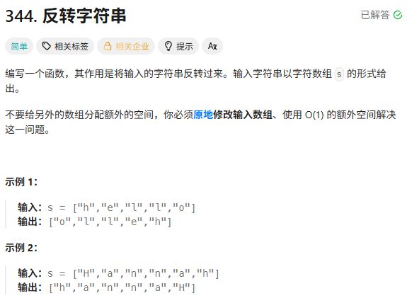
时间100.00%，空间29.81%
```
class Solution {

    public void reverseString(char[] s) {

        int left = 0;

        int right = s.length - 1;

        while(left < right){

            char temp = s[left];

            s[left] = s[right];

            s[right] = temp;

            left++;

            right--;

        }

    }

}
```
### 541.反转字符串||
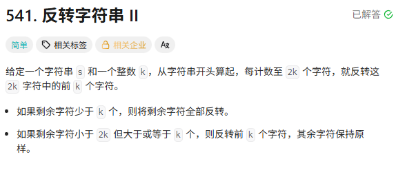
时间18.94%，空间36.06%
先是自己写的，这里找每个反转位置(第2k个数)的时候不用一个个遍历然后判断，直接每次让i+2k就行了，可以优化。
```
class Solution {

    public String reverseStr(String s, int k) {

        char[] sArray = s.toCharArray();

        int sl = sArray.length;

        for(int i = 0;i < sl;i++){

            int count = (i + 1) % (2 * k);

            if(i == sl - 1){

                if(count < k){

                    reverse(sArray, i - count + 1, i);

                }else if(count >= k && count < 2 * k){

                    reverse(sArray, i - count + 1, i - count + k);

                }

            }

            if(count == 0){

                reverse(sArray, i - 2 * k + 1, i - k);

            }

        }

        return new String(sArray);

    }

  

    private void reverse(char[] sArray, int begin, int end){

        int left = begin;

        int right = end;

        while(left < right){

            char temp = sArray[left];

            sArray[left] = sArray[right];

            sArray[right] = temp;

            left++;

            right--;

        }

    }

}
```
时间93.18%，空间14.21%
```
class Solution {

    public String reverseStr(String s, int k) {

        char[] sArray = s.toCharArray();

        int sl = sArray.length;

        for(int i = 0;i < sl;i += 2 * k){

            //这样每次移动都是到新的一组的开头

            //如果这一组数少于k个，全部反转

            if(i + k >= sl){

                reverse(sArray, i, sl - 1);

                break;

            }

            //这组数完整(能凑到2k)或者 2k > length > =k 反转前k个

            reverse(sArray, i, i + k - 1);

        }

        return new String(sArray);

    }

  

    private void reverse(char[] sArray, int begin, int end){

        int left = begin;

        int right = end;

        while(left < right){

            char temp = sArray[left];

            sArray[left] = sArray[right];

            sArray[right] = temp;

            left++;

            right--;

        }

    }

}
```
### LCR 122.路径加密

时间100.00%，空间11.55%
```
class Solution {

    public String pathEncryption(String path) {

        char[] pathArray = path.toCharArray();

        for(int i = 0;i < pathArray.length;i++){

            if(pathArray[i] == '.') pathArray[i] = ' ';

        }

        return new String(pathArray);

    }

}
```
### 151.反转字符串中的单词
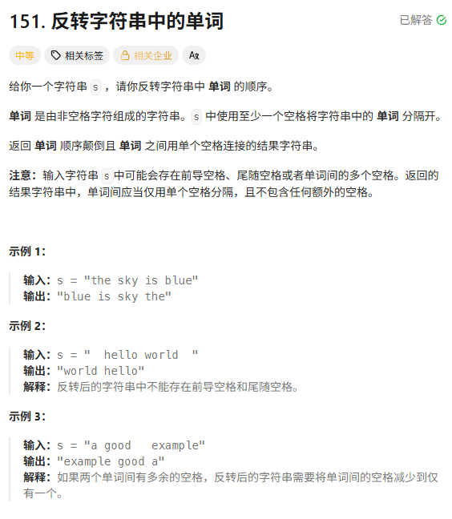
时间5.67%，空间5.03%
```
class Solution {

    public String reverseWords(String s) {

        //后进先出 -> 用栈

        //把每个单词都摘出来然后入栈

        //然后依次出栈即可

        List<String> words = new LinkedList<>();

        int first = 0;

        for(int i = 0;i < s.length();i++){

            //如果前面是空格当前是字符，这个位置就是当前单词的头

            //i > 0放心加，first初值是0，如果0是头的话那么这个会到下个单词才生效

            if(i > 0 && s.charAt(i) != ' ' && s.charAt(i - 1) == ' ') first = i;

            //当前是空格然后前面一个是字符，前一个位置位置就是当前单词的尾

            if(i > 0 && s.charAt(i) == ' ' && s.charAt(i - 1) != ' '){

                words.addFirst(s.substring(first, i));

            }

            //不过到最后可能没有空格，也是到尾了要结算一下

            if(i == s.length() - 1 && s.charAt(i) != ' '){

                words.addFirst(s.substring(first, i + 1));

            }

        }

        String res = new String();

        for(String word : words){

            res = res + word + " ";

        }

        return res.substring(0, res.length() - 1);

    }

}
```
改进：时间82.28%，空间20.11%
```
class Solution {

    public String reverseWords(String s) {

        s = s.trim();//删除首尾空格

        //通过双指针定位单词的首尾 i左指针 j 右指针

        int j = s.length() - 1;

        List<String> words = new LinkedList<>();

        for(int i = s.length() - 1;i >= 0;i--){

            //i向左移动直到找到第一个空格

            if(s.charAt(i) == ' '){

                //那么第一个空格的后一个字符到j就是当前单词，加入到列表里

                words.addLast(s.substring(i + 1,j + 1));

                //把对应的分隔符也给带上

                words.addLast(" ");

                //跳过其他空格，如果有的话

                while(s.charAt(i) == ' '){

                    i--;

                }

                //跳完之后i来到了下一个单词的末尾，把j赋值过来

                j = i;

            }

            //i到边界的情况，也结束了

            if(i == 0){

                words.addLast(s.substring(0,j + 1));

            }

        }

        StringBuilder res = new StringBuilder();

        for(String word : words){

            res.append(word);

        }

        return res.toString();

    }

}
```
### 右旋字符串
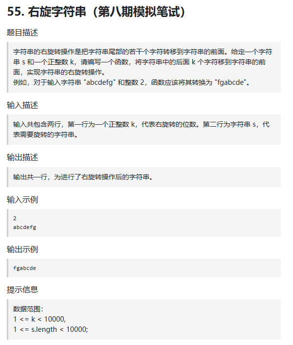
借助字符串数组实现
```
import java.util.Scanner;

public class Main {
    public static void main(String[] args){
        Scanner scanner = new Scanner(System.in);
        //读右旋转的位数k
        int k = scanner.nextInt();
        //读取待操作的字符串
        String s = scanner.next();
        int sl = s.length();
        char[] resArray = new char[sl];
        //右旋你其实可以把每个字符旋转完的坐标算出来
        //然后直接创一个新字符数组放在对应的位置
        //影响就是空间复杂度为O(n)
        for(int i = 0;i < sl;i++){
            int index = (i + k) % sl;
            resArray[index] = s.charAt(i);
        }
        System.out.println(new String(resArray));
    }
}
```
不用创建字符串数组，不过耗时比上面的那个久了一点，空间用的是少了一点
```
import java.util.Scanner;
public class Main {
    public static void main(String[] args){
        Scanner scanner = new Scanner(System.in);
        //读右旋转的位数k
        int k = scanner.nextInt();
        //读取待操作的字符串
        String s = scanner.next();
        int sl = s.length();
        System.out.println(s.substring(sl - k, sl)
        + s.substring(0, sl - k));
    }
}
```
### ★★★28.找出字符串中第一个匹配项的下标
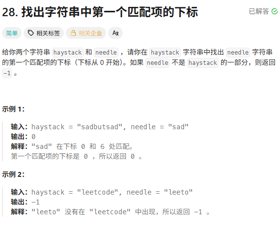
自己写的，差不多纯暴力的写法。时间2.77%，空间22.62%
```
class Solution {
    public int strStr(String haystack, String needle) {
        for(int i = 0;i < haystack.length();i++){
            if(haystack.charAt(i) == needle.charAt(0)){
                //第一个字符相同进入匹配
                int j = 1;
                while(j < needle.length() && i + j < haystack.length()
                && haystack.charAt(i + j) == needle.charAt(j)){
                    j++;
                }
                if(j == needle.length()) return i;
            }
        }
        return -1;
    }
}
```
优化：KMP算法。时间55.65%，空间7.02%
上面的算法是每次遇到开头相同的就进入匹配，一直匹配到不一致或者结束为止，当出现了不一致，回退到上次开头的下一个再继续匹配。那么这个匹配的过程中其实两边都在往后走，我们肯定是得到了一些信息的，能不能利用这些信息避免回退呢。
方法就是KMP算法。它首先是有一个next数组。下标i处的值就代表了到这的子串的最长相同的前后缀长度。
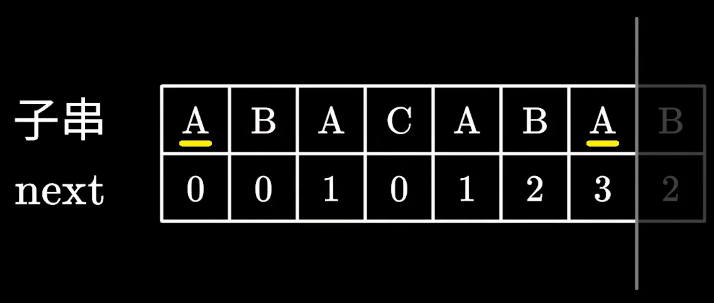
这有什么意义呢，就比如下图是在匹配串的A位置出现了不一致（该位置记为j，原串的对应位置记为i），不想回退，就要从i往前看，然后从匹配串的开头往后看，看i前面的有哪些字符和匹配串前面的字符是相同的（当然这个是要小于j的，不然你移动一下不是还是原样嘛），这样我们直接从相同的位置之后再开始匹配就好了。找下次开始的位置就是通过next数组实现的。
```
j = next[j - 1] 
```
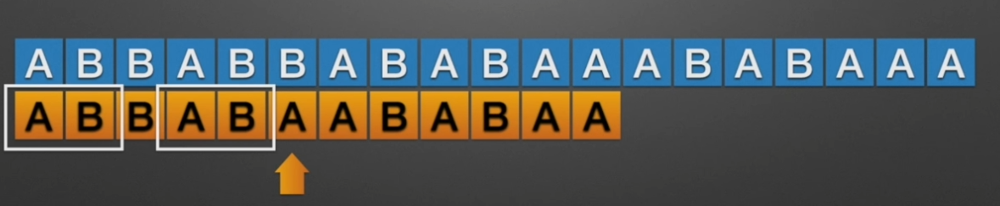
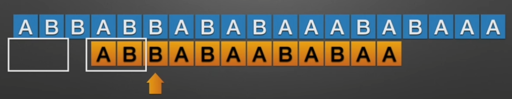
next数组的构建过程(摘自这题的题解) 
i是后缀末尾，j是前缀的末尾，也代表了当前相同前后缀的长度。
如果i和j位置上的字符相同，相同的部分就+1，前后缀指针都往后移动一个位置，同时把这个位置相同前后缀的长度赋值一下。
如果i和j位置上的字符不同，说明当前的前缀尾和后缀尾不同了，相同部分加不了了，同时收缩后缀和前缀，收缩后缀你看不太到就是，因为后缀尾是不变的，收缩前缀怎么收呢，也是每次
```
j = next[j - 1] 
```
目前是知道0到j-1是和i-j到i-1是相同的，就是不断收缩前面的，看能不能让收缩完的前缀尾等于这个b（如果相等的话 b前面和前缀尾前面的都是相同的嘛，按这样收缩的话，长度就可以从这开始加了）不能就继续回退，直到j = 0。
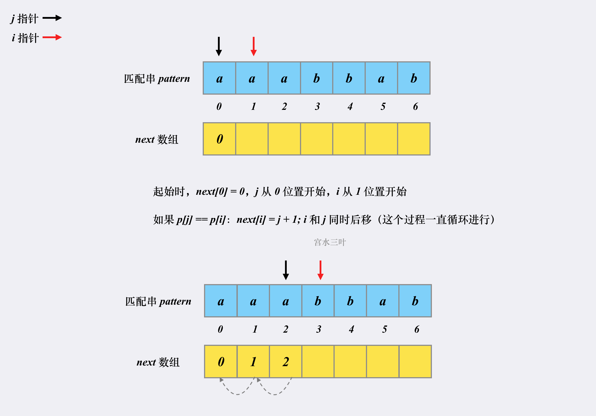
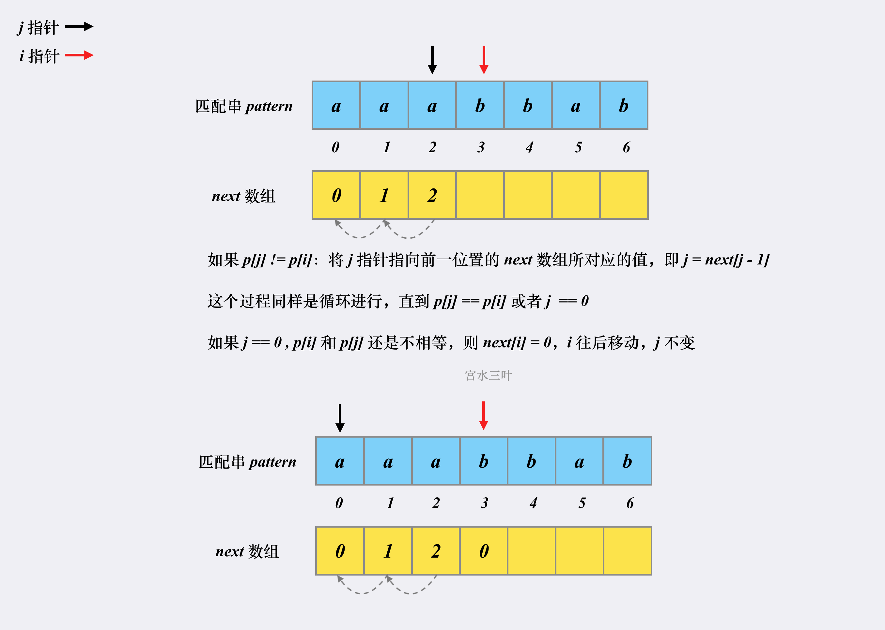
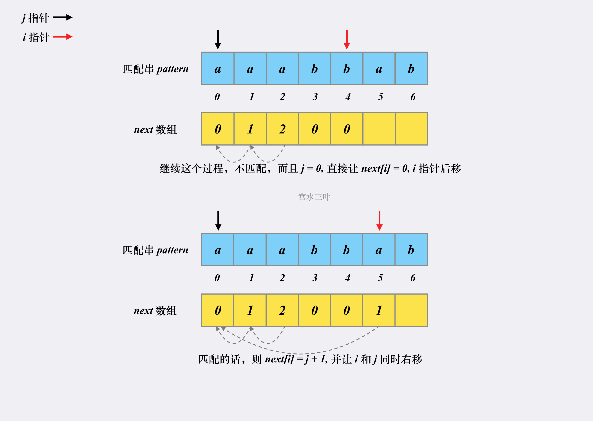
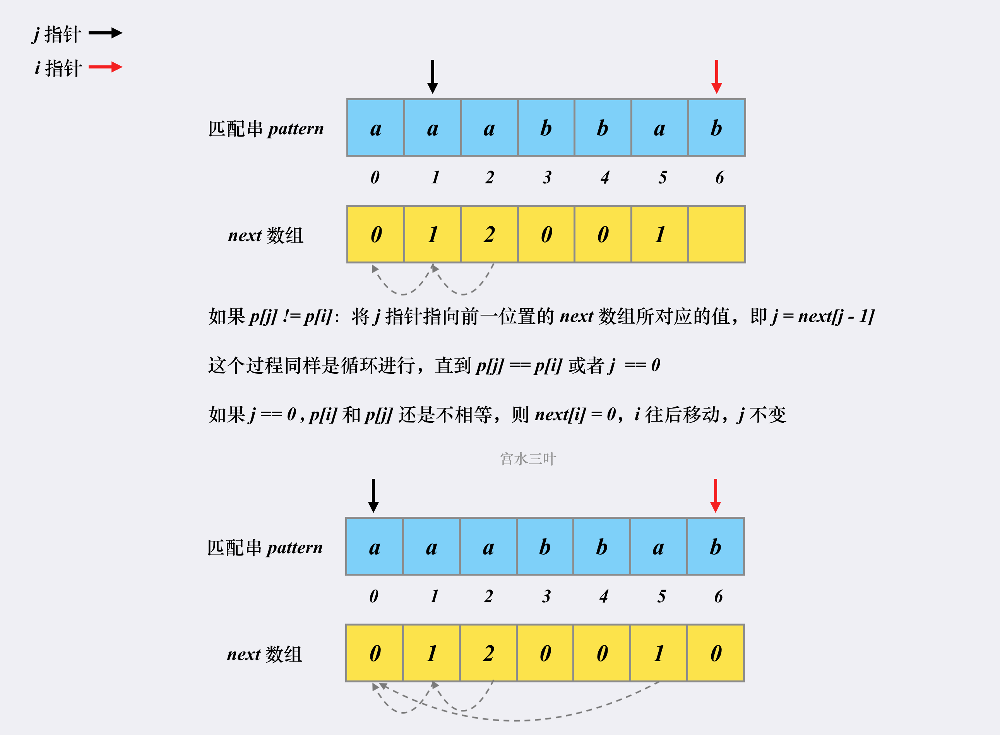
```
class Solution {

    public int strStr(String haystack, String needle) {

        char[] h = haystack.toCharArray();

        char[] n = needle.toCharArray();

        int hl = h.length;

        int nl = n.length;

        //构建next数组

        int[] next = new int[nl];

        for(int i = 1, j = 0;i < nl;i++){

            //如果n[j] != n[i] -> j = next[j - 1]  循环进行，直到j == 0 或者二者相等

            //如果j == 0 二者还是不相等，那么next[i] = 0，i往后移动，j不变

            while(j > 0 && n[i] != n[j]) j = next[j - 1];

            //如果n[j] ==n[i] -> (1)next[i] = j + 1  (2)i和j同时后移（循环进行）

            if(n[i] == n[j]) j++;//循环完i就+1了

            next[i] = j;//next[i] = j + 1

        }

        for(int i = 0, j = 0;i < hl;i++){

            while(j > 0 && h[i] != n[j]) j = next[j - 1];

            //匹配成功往后移动

            if(h[i] == n[j]) j++;

            //一整段匹配成功，直接返回下标

            if(j == nl) return i - nl + 1;

        }

        return -1;

    }

}
```
### ★★★459.重复的子字符串
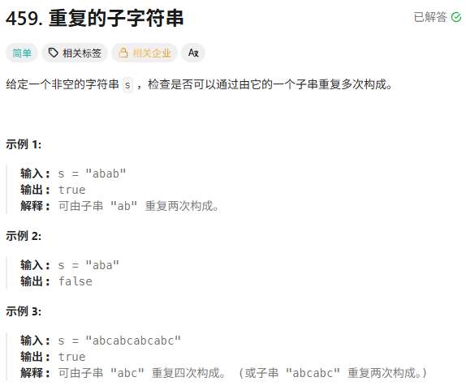
时间92.72%，空间46.57%（不过时间复杂度高，是n^2）
```
class Solution {

    public boolean repeatedSubstringPattern(String s) {

        int sl = s.length();

        boolean res = false;

        for(int i = 1;i <= sl / 2 && !res;i++){

            //假设可以由长度为i的子串构成

            //如果sl != n * i 不可能由长度为i的子串构成，跳过

            if(sl % i != 0) continue;

            //如果可以由长度为i的子串构成，那么

            //第1个到第i个字符，每隔i肯定都会重复，不满足就不是

            boolean flag = true;

            for(int j = 1;j <= i;j++){

                //记录一下第一个字符

                char a = s.charAt(j - 1);

                int k = j - 1 + i;

                while(k < sl){

                   if(s.charAt(k) != a) break;

                   k+=i;

                }

                if(k < sl){

                    flag = false;

                    break;

                }

            }

            res = flag;

        }

        return res;

    }

}
```
通过KMP算法里面的Next数组实现
如果最长相等前后缀不包含的子串的长度不等于0且该长度可以被字符串s的长度整除，那么不包含的子串就是s的最小重复子串。否则就找不到子串重复可以构成原串。
时间99.47%，空间21.72%
```
class Solution {

    public boolean repeatedSubstringPattern(String s) {

        int sl = s.length();

        int[] next = new int[sl];

        char[] sArray = s.toCharArray();

        for(int i = 1, j = 0;i < sl;i++){

            while(j > 0 && sArray[i] != sArray[j]) j = next[j - 1];

            if(sArray[i] == sArray[j]) j++;

            next[i] = j;

        }

        return next[sl - 1] > 0 && sl % (sl - next[sl - 1]) == 0;

    }

}
```
## 双指针法

### 27.移除元素
做过了
### 344.反转字符串
做过了
### 替换数字
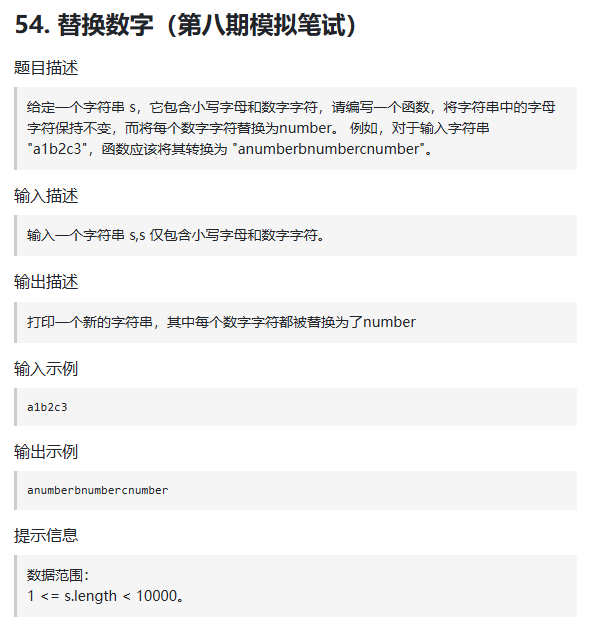
暴力解法，用的不是双指针，感觉双指针还更麻烦
```
import java.util.Scanner;

public class Main{

    public static void main(String[] args){

        Scanner scanner = new Scanner(System.in);

        String s = scanner.next();

        StringBuilder res = new StringBuilder();

        //新开一个StringBuilder，遍历原串的每个字符

        //是字母就原样加上去，是数字就替换

        for(int i = 0;i < s.length();i++){

            char now = s.charAt(i);

            if(now >= '0' && now <= '9'){

                res.append("number");

            }else{

                res.append(now);

            }

        }

        System.out.println(res);

    }

}
```
### 151.反转字符串中的单词
做过了
### 206.反转链表
见hot100
### 19.删除链表的倒数第N个节点
见hot100
### 142.环形链表||
见hot100
### 15.三数之和
见hot100
### 18.四数之和
做过了
## 栈与队列
### 理论基础
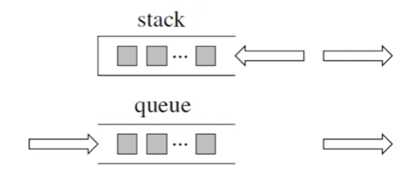
栈：后进先出
队列：先进先出
### 232.用栈实现队列
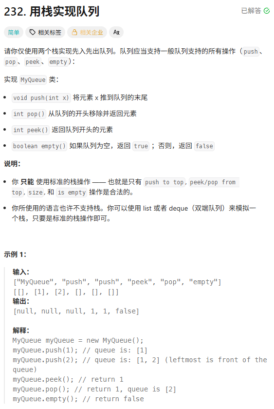
时间100.00%，空间5.05%
```
class MyQueue {

    //搞一个输入栈和一个输出栈

    //输入的话就依次进入到输入栈里面

    //要输出或者要看头部元素的时候，把输入栈的元素倒到输出栈里面（输出栈为空）

    //这样输出栈里面的元素就是按最前到最后排列了，做对应的操作即可

    //输出完或者看完顶部元素是不用把输出栈的元素倒回输入栈的

    //只要在输出栈空了之后再倒元素过来，那么输出栈里面的一直就是最前面的元素

    //输入一直补到输入栈就行

    List<Integer> inStack;

    List<Integer> outStack;

    public MyQueue() {

        inStack = new LinkedList<>();

        outStack = new LinkedList<>();

    }

    public void push(int x) {

        inStack.addFirst(x);

    }

    public int pop() {

        if(outStack.isEmpty()){

            transfer();

        }

        return outStack.removeFirst();

    }

    public int peek() {

        if(outStack.isEmpty()){

            transfer();

        }

        return outStack.getFirst();

    }

    public boolean empty() {

        return inStack.isEmpty() && outStack.isEmpty();

    }

  

    private void transfer(){

        while(!inStack.isEmpty()){

            outStack.addFirst(inStack.removeFirst());

        }

    }

}

  

/**

 * Your MyQueue object will be instantiated and called as such:

 * MyQueue obj = new MyQueue();

 * obj.push(x);

 * int param_2 = obj.pop();

 * int param_3 = obj.peek();

 * boolean param_4 = obj.empty();

 */
```
### 225.用队列实现栈
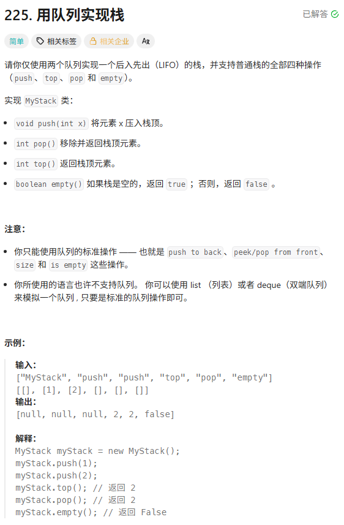
时间100.00%，空间5.10%
```
class MyStack {

    //利用两个队列就和用栈实现队列一样

    //要出的时候把输入队列里面的倒入到输出队列里面就行了（输出队列非空）

    //只用一个队列实现的话就是每次入队列的时候，先统计一下队列的元素个数n

    //然后把新元素入队列，然后把前面n个元素出队列再进来就好了

    List<Integer> queue;

  

    public MyStack() {

        //addLast + removeFirst + getFirst

        queue = new LinkedList<>();

    }

    public void push(int x) {

        int n = queue.size();

        queue.addLast(x);

        for(int i = 0;i < n;i++){

            queue.addLast(queue.removeFirst());

        }

    }

    public int pop() {

        return queue.removeFirst();

    }

    public int top() {

        return queue.getFirst();

    }

    public boolean empty() {

        return queue.isEmpty();

    }

}

  

/**

 * Your MyStack object will be instantiated and called as such:

 * MyStack obj = new MyStack();

 * obj.push(x);

 * int param_2 = obj.pop();

 * int param_3 = obj.top();

 * boolean param_4 = obj.empty();

 */
```
### 20.有效的括号
见hot100
### 1047.删除字符串中的所有相邻重复项
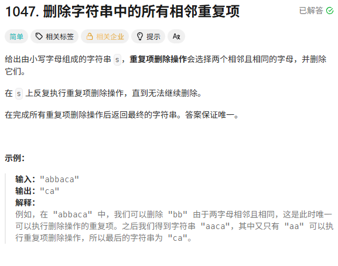
时间72.31%，空间41.30%
```
class Solution {

    public String removeDuplicates(String s) {

        //是用栈的思想实现的，最后整理答案的时候要倒序出

        //所以用了双端队列，核心部分是栈

        //就是依次入栈，每个字符进来的时候看看当前字符和栈顶是不是相同的

        //是就相消了，不是就入栈

        List<Character> deque = new LinkedList<>();

        for(int i = 0;i < s.length();i++){

            char c = s.charAt(i);

            if(!deque.isEmpty() && c == deque.getFirst()){

                deque.removeFirst();

            }else{

                deque.addFirst(c);

            }

        }

        StringBuilder res = new StringBuilder();

        while(!deque.isEmpty()){

            res.append(deque.removeLast());

        }

        return res.toString();

    }

}
```
### 150.逆波兰表达式求值
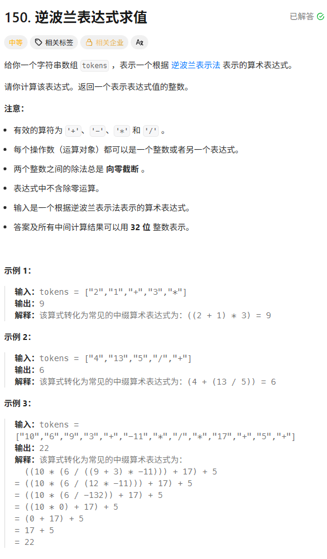
时间30.89%，空间14.82%
```
class Solution {

    public int evalRPN(String[] tokens) {

        //逆波兰表达式：把运算符写在操作数后

        //2  1  + 就是2 + 1

        //2  1  + 3 * 就是先2 + 1 然后再 * 3  

        List<Integer> stack = new LinkedList<>();

        for(int i = 0;i < tokens.length;i++){

            if(tokens[i].equals("+") || tokens[i].equals("-")

            || tokens[i].equals("*") || tokens[i].equals("/")){

                int num2 = stack.removeFirst();

                int num1 = stack.removeFirst();

                switch(tokens[i]){

                    case "+":stack.addFirst(num1 + num2);break;

                    case "-":stack.addFirst(num1 - num2);break;

                    case "*":stack.addFirst(num1 * num2);break;

                    default :stack.addFirst(num1 / num2);break;

                }

            }else{

                stack.addFirst(Integer.parseInt(tokens[i]));

            }

        }

        return stack.getFirst();

    }

}
```
### 239.滑动窗口最大值
见hot100
### 347.前K个高频元素
见hot100
## 二叉树

