## 数组
### 理论基础
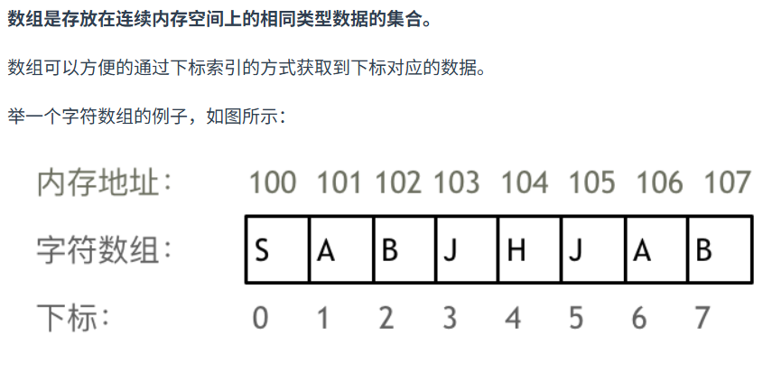
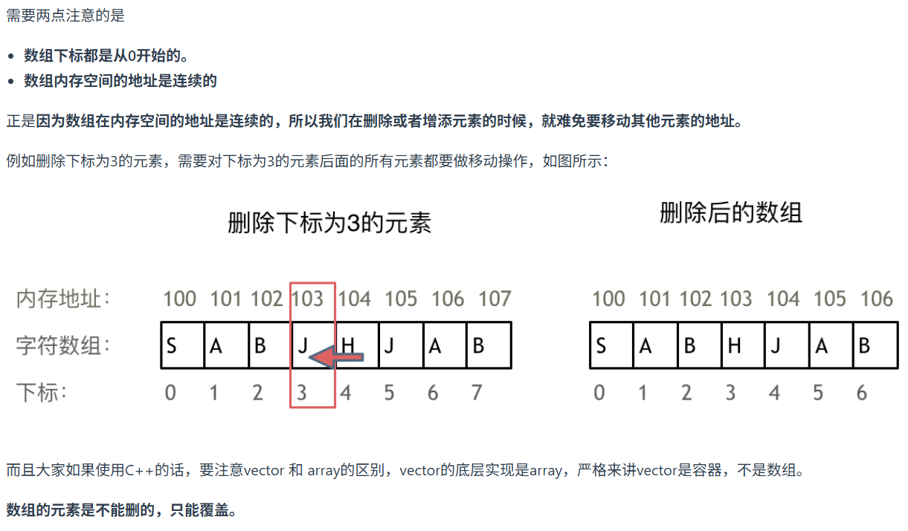
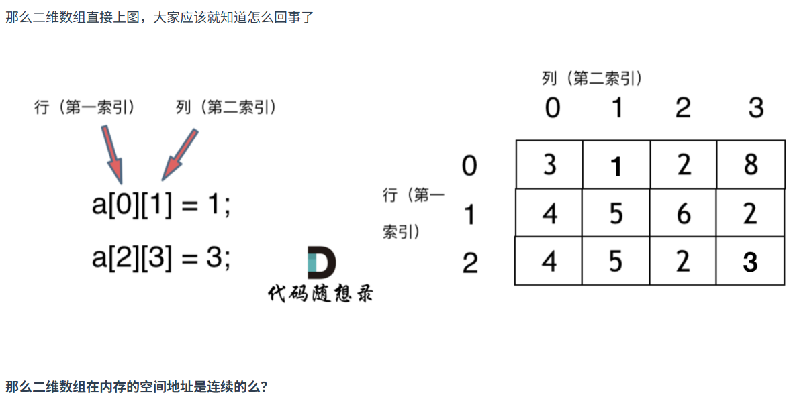
C++是，java不知道。
### 704.二分查找
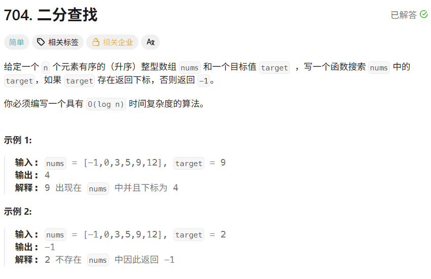
时间100.00%，空间7.45%
```
class Solution {
    public int search(int[] nums, int target) {
        int n = nums.length;
        int left = 0;
        int right = n - 1;
        while(left <= right){
            int mid = (left + right) / 2;
            if(target == nums[mid])  return mid;
            else if(target < nums[mid]) right = mid - 1;
            else left = mid + 1;
        }
        return -1;
    }
}
```
### 27.移除元素
 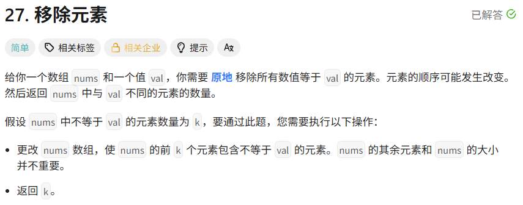
 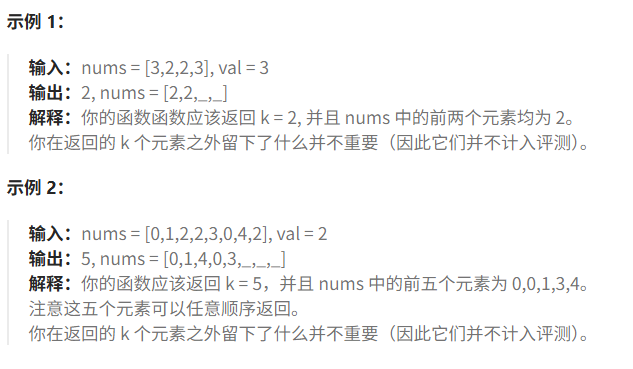
时间100.00，空间5.21%
```
class Solution {
    public int removeElement(int[] nums, int val) {
        //遍历，不是target就往前放
        //是就不管（删了）
        int length = 0;
        int k = 0;
        for(int i = 0;i < nums.length;i++){
            if(nums[i] != val){
                nums[length] = nums[i];
                length++;
            }else{
                k++;
            }
        }
        return nums.length - k;
    }
}
```
### 977.有序数组的平方
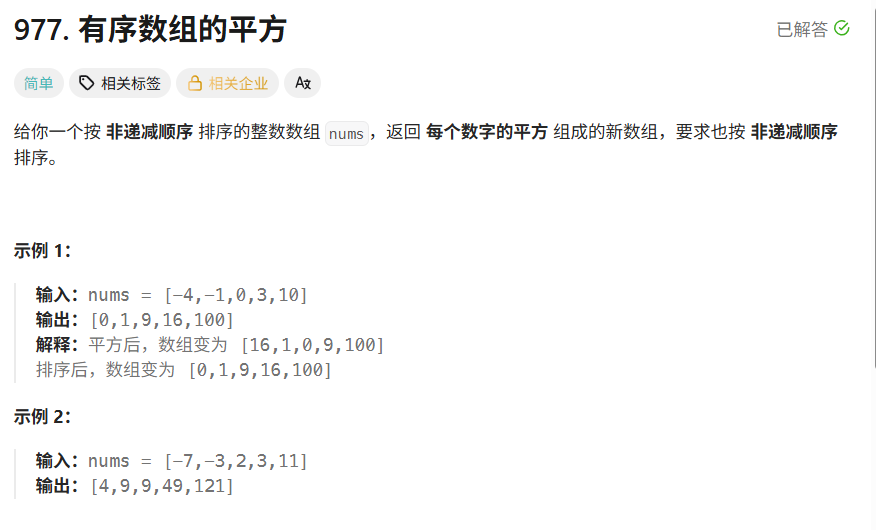
时间100.00%，空间92.25%
```
class Solution {
    public int[] sortedSquares(int[] nums) {
        //找到平方最小的那个数，以它为中心（越往两边走肯定平方是越大的）
        //搞个left right 分别向两边扩展，谁平方小放谁
        int n = nums.length;
        int minIndex = 0;
        int min = Integer.MAX_VALUE;
        for(int i = 0;i < n;i++){
            if(nums[i] * nums[i] < min){
                min = nums[i] * nums[i];
                minIndex = i;
            }
        }
        int[] res = new int[n];
        res[0] = nums[minIndex] * nums[minIndex];
        int length = 1;
        int left = minIndex - 1;
        int right = minIndex + 1;
        while(length < n){
            if(left < 0){
                res[length] = nums[right] * nums[right];
                right++;
                length++;
                continue;
            }
            if(right >= n){
                res[length] = nums[left] * nums[left];
                left--;
                length++;
                continue;
            }
            if(left == right){
                res[length] = nums[left] * nums[left];
                left--;
                right++;
                length++;
                continue;
            }
            if(nums[right] * nums[right] <= nums[left] * nums[left]){
                res[length] = nums[right] * nums[right];
                right++;
                length++;
            }else{
                res[length] = nums[left] * nums[left];
                left--;
                length++;
            }
        }
        return res;
    }
}
```
### 209.长度最小的子数组
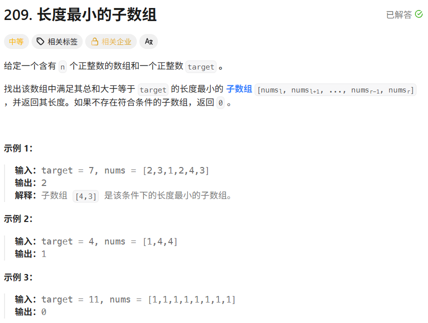
时间99.78%，空间5.21%
```
class Solution {
    public int minSubArrayLen(int target, int[] nums) {
        //滑动窗口
        int n = nums.length;
        int sum = 0;//窗口内的和
        int left = 0;
        int min = n + 1;
        for(int right = 0; right < n;right++){
            sum += nums[right];
            while(left <= right && sum >= target){
                if(right - left + 1 < min){
                    min = right - left + 1;
                }
                sum -= nums[left];
                left++;
            }
        }
        if(min == n + 1) return 0;
        else return min;
    }
}
```
### 59.螺旋矩阵||
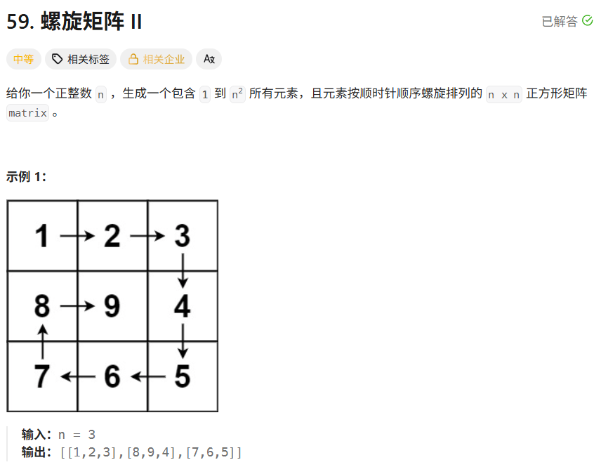
时间100.00%，空间10.04%
```
class Solution {
    public int[][] generateMatrix(int n) {
        int[][] res = new int[n][n];
        int num = 1;
        int i = 0;
        int j = 0;
        //模仿顺时针填入的方式，到边界了就换方向
        //边界：数组的边界 or 已经填过了
        while(num <= n * n){
            for(int k = 0;k < 4;k++){
                if(k == 0){
                    //向右填
                    while(j < n && res[i][j] == 0){
                        res[i][j] = num;
                        num++;
                        j++;
                    }
                    j--;
                    i++;
                }
                else if(k == 1){
                    //向下填
                    while(i < n && res[i][j] == 0){
                        res[i][j] = num;
                        num++;
                        i++;
                    }
                    i--;
                    j--;
                }
                else if(k == 2){
                    //向左填
                    while(j >= 0 && res[i][j] == 0){
                        res[i][j] = num;
                        num++;
                        j--;
                    }
                    j++;
                    i--;
                }else{
                    //向上填
                    while(i >= 0 && res[i][j] == 0){
                        res[i][j] = num;
                        num++;
                        i--;
                    }
                    i++;
                    j++;
                }
            }
        }
        return res;
    }
}
```
### 区间和
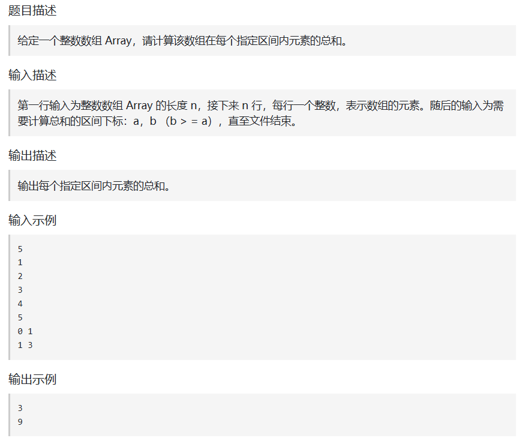
```
import java.util.Scanner;

public class Main {
    public static void main(String[] args) {
        Scanner scanner = new Scanner(System.in);
        //读数组长度n
        int n = scanner.nextInt();
        //思路：前缀和
        //求[a,b]区间上的元素和，到a处的前缀和-到b处的前缀和就行了
        int[] array = new int[n]; 
        //前缀和数组 pathSum[i] 表示[0,i - 1]上的和
        int[] pathSum = new int[n + 1];
        for(int i = 0;i < n;i++){
            //填数组和前缀和数组
            array[i] = scanner.nextInt();
            pathSum[i + 1] = pathSum[i] + array[i];
        }
        while(scanner.hasNextInt()){
            int a = scanner.nextInt();
            int b = scanner.nextInt();
            System.out.println(pathSum[b + 1] - pathSum[a]);
        }
        scanner.close();
    }
}
```
### 开发商购买土地
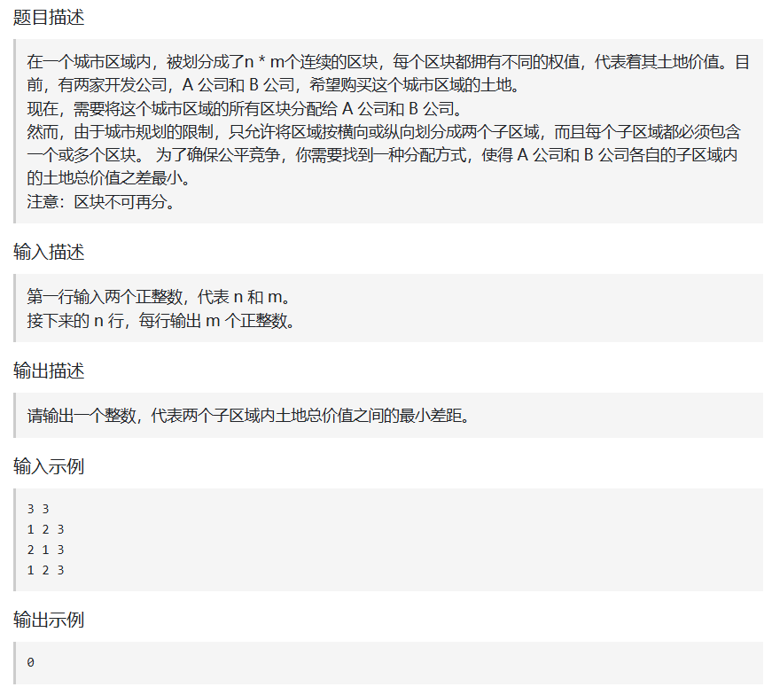
```
import java.util.Scanner;
import static java.lang.Math.*;

public class Main{
    public static void main(String[] args){
        Scanner scanner = new Scanner(System.in);
        int n = scanner.nextInt();
        int m = scanner.nextInt();
        int[] pathSum1 = new int[n];
        int[] pathSum2 = new int[m];
        int sum = 0;
        for(int i = 0;i < n;i++){
            for(int j = 0;j < m;j++){
                int a = scanner.nextInt();
                pathSum1[i] += a;
                pathSum2[j] += a;
                sum += a;
            }
        }
        //列的前缀和
        int min = Integer.MAX_VALUE;
        for(int i = 0;i < n;i++){
            if(i > 0){
                pathSum1[i] += pathSum1[i - 1];
            }
            int diff = Math.abs((sum - pathSum1[i]) - pathSum1[i]);
            if(diff < min){
                min = diff;
            }
        }
        //行的前缀和
        for(int j = 0;j < m;j++){
            if(j > 0){
                pathSum2[j] += pathSum2[j - 1];
            }
            int diff = Math.abs((sum - pathSum2[j]) - pathSum2[j]);
            if(diff < min){
                min = diff;
            }
        }
        System.out.println(min);
    }
}
```
## 链表
### 理论基础
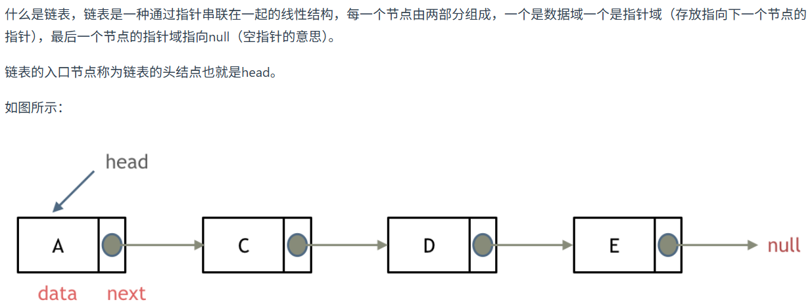
上图为单链表/单向链表，指针只能指向下一个节点
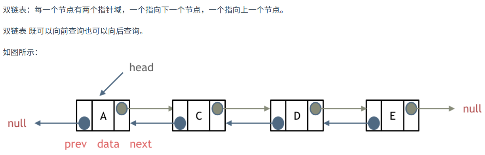
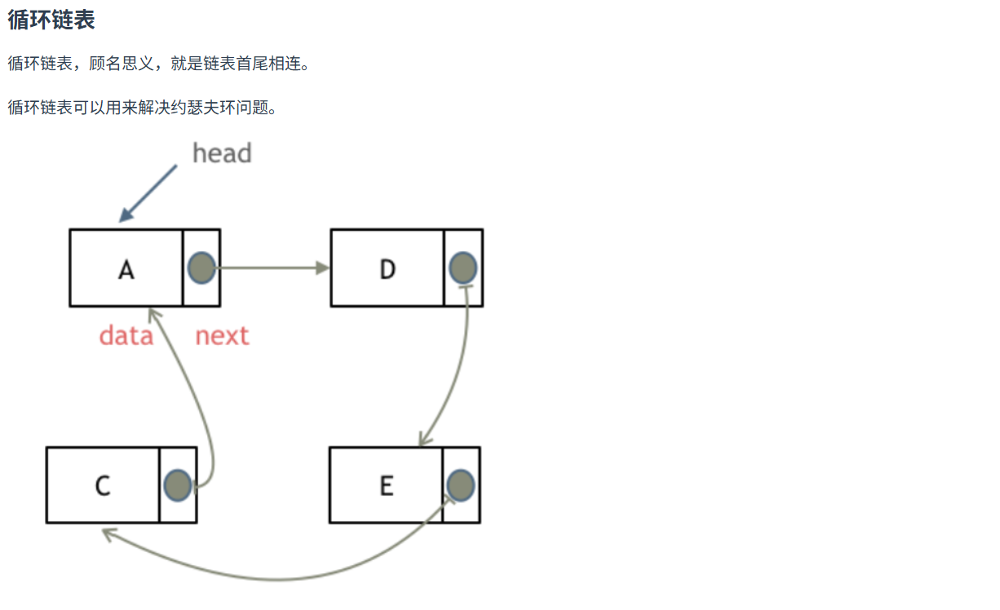

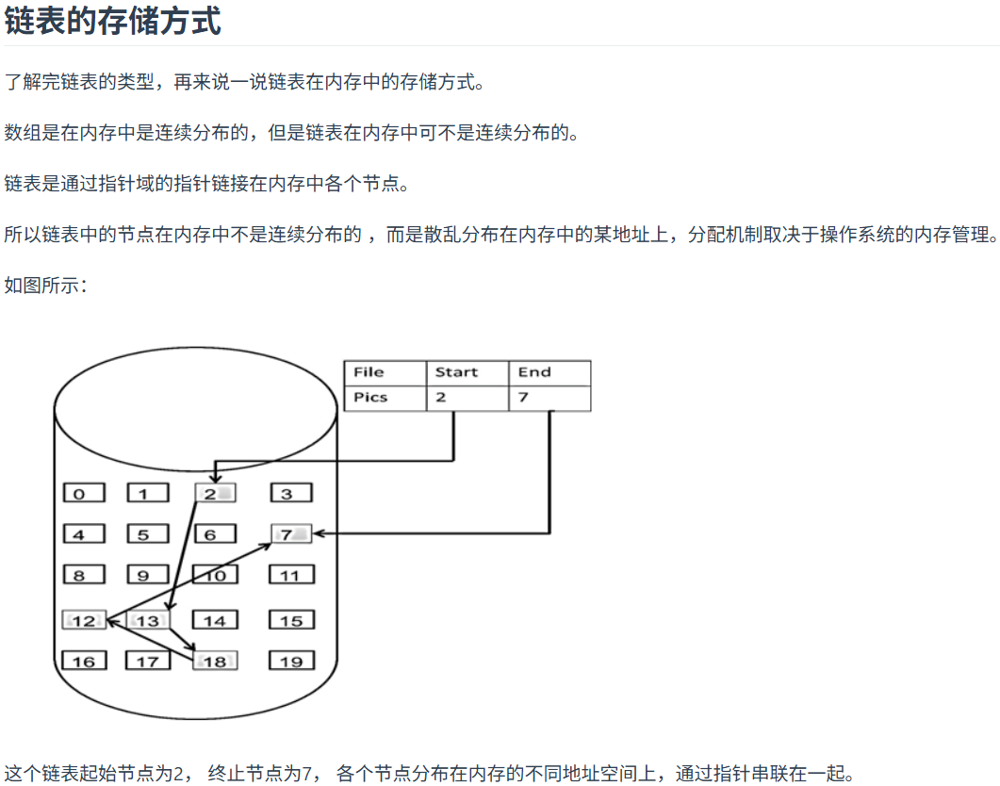
单向链表定义（java）
```
public class ListNode {
	int val;

    ListNode next;

    ListNode() {}

    ListNode(int val) { this.val = val; }

    ListNode(int val, ListNode next) { this.val = val; this.next = next; }
}
```
双向链表定义（java）
```
public class ListNode {
	int val;

    ListNode next;
    
    ListNode prev;

    ListNode() {}

    ListNode(int val) { this.val = val; }

    ListNode(int val, ListNode next, ListNode prev) { 
    this.val = val; this.next = next; this.prev = prev}
}
```
链表操作
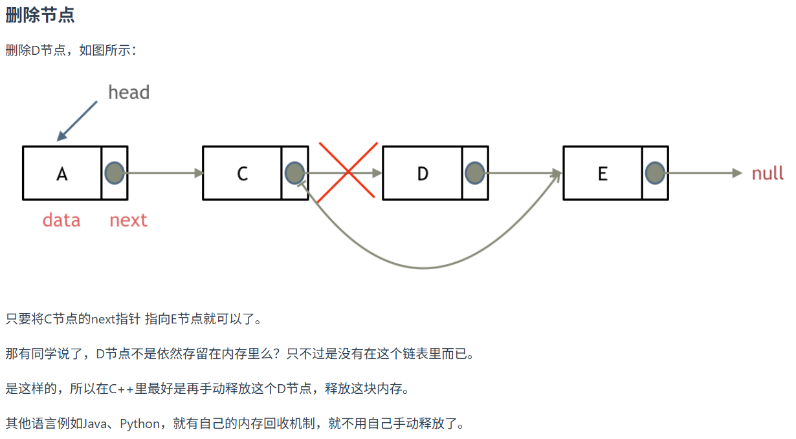
```
遍历链表到c
c.next = c.next.next
``` 
双向链表删除
a <-> b <-> c (x)<-> d  删除c
```
遍历链表到b
b.next = d.next.next;
b.next.prev = b;
```
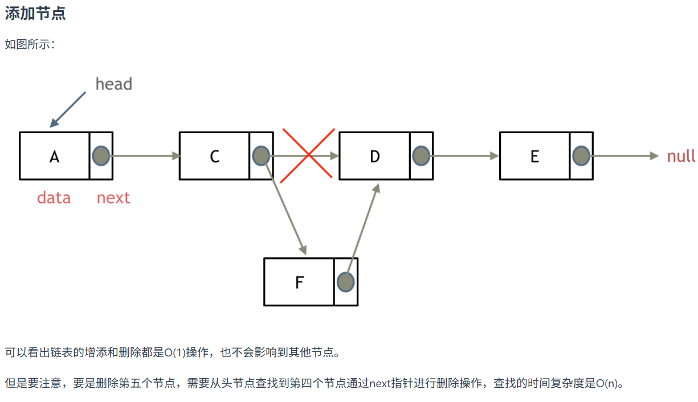
```
遍历链表到c
ListNode f = new ListNode();
f.next = c.next;
c.next = f;
```
双向链表添加
a <-> b <-> c (new) <-> d 新增节点c
```
遍历链表到b
ListNode c = new ListNode();
c.next = b.next;
b.next = c;
c.next.prev = c;
c.prev = b;
```
### 203.移除链表元素
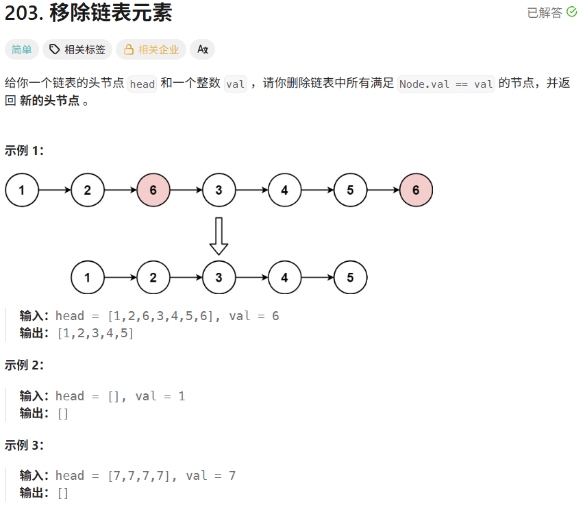
时间81.97%，空间7.45%
```
/**

 * Definition for singly-linked list.

 * public class ListNode {

 *     int val;

 *     ListNode next;

 *     ListNode() {}

 *     ListNode(int val) { this.val = val; }

 *     ListNode(int val, ListNode next) { this.val = val; this.next = next; }

 * }

 */

class Solution {

    public ListNode removeElements(ListNode head, int val) {

        ListNode prev = null;

        ListNode res = head;

        ListNode curr = res;

        while(curr != null){

            if(curr.val == val){

                if(prev == null){

                    res = curr.next;

                }else{

                    prev.next = curr.next;

                }

            }else{

                //如果当前节点被删除了是不用更新prev的

                prev = curr;

            }

            curr = curr.next;

        }

        return res;

    }

}
```
### 707.设计链表
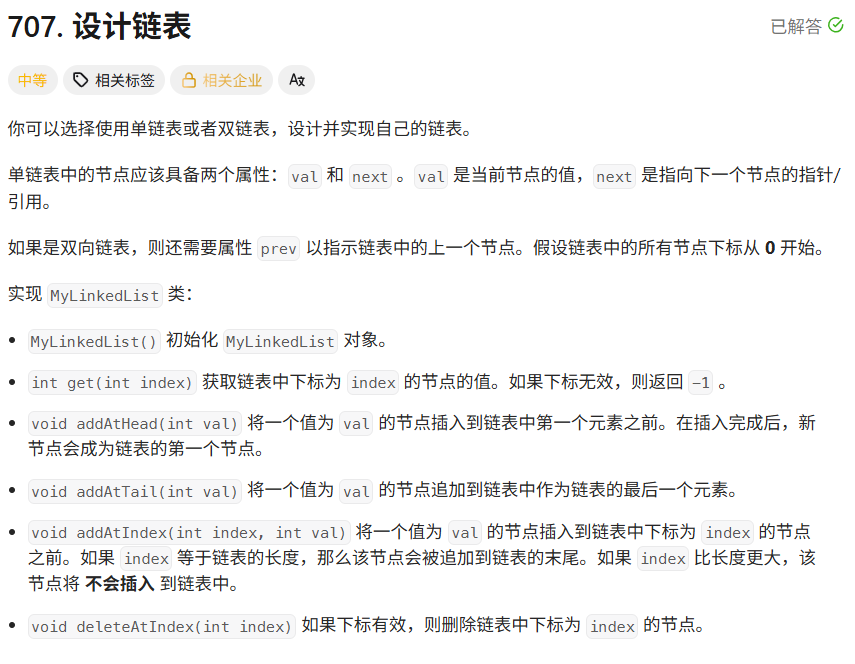
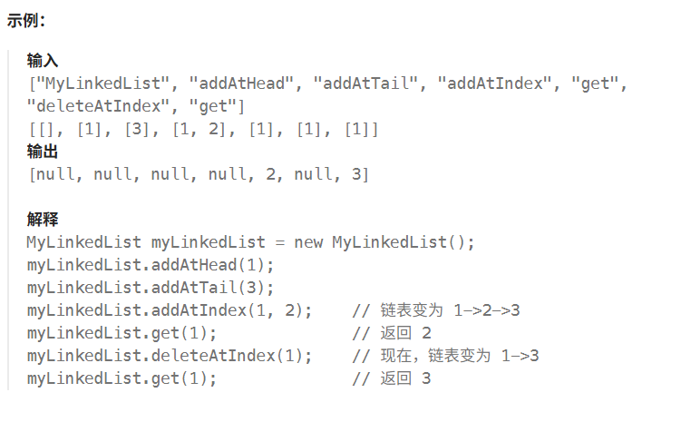
时间95.54%，空间18.23%
```
class MyLinkedList {

    //这个类名其实有点提示的，LinkedList的底层实现就是双向链表

    class ListNode{

        int val;

        ListNode prev;

        ListNode next;

        ListNode(){}

        ListNode(int val){this.val = val;}

    }

  

    private ListNode dHead;

    private ListNode dEnd;

    private int length;

  

    public MyLinkedList() {

        dHead = new ListNode();

        dEnd = new ListNode();

        dHead.next = dEnd;

        dEnd.prev = dHead;

        length = 0;

    }

    public int get(int index) {

        if(index >= length){

            return -1;

        }

        ListNode curr = dHead.next;

        for(int i = 0;i < index;i++){

            curr = curr.next;

        }

        return curr.val;

    }

    public void addAtHead(int val) {

        ListNode node = new ListNode(val);

        node.next = dHead.next;

        node.next.prev = node;

        dHead.next = node;

        node.prev = dHead;

        length++;

    }

    public void addAtTail(int val) {

        ListNode node = new ListNode(val);

        node.prev = dEnd.prev;

        node.prev.next = node;

        dEnd.prev = node;

        node.next = dEnd;

        length++;

    }

    public void addAtIndex(int index, int val) {

        if(index > length) return;

        ListNode curr = null;

        if(index <= length / 2){

            curr = dHead.next;

            for(int i = 0;i < index;i++){

                curr = curr.next;

            }

        }else{

            curr = dEnd;

            for(int i = 0;i < length - index;i++){

                curr = curr.prev;

            }

        }

        ListNode node = new ListNode(val);

        curr.prev.next = node;

        node.next = curr;

        node.prev = curr.prev;

        curr.prev = node;

        length++;

    }

    public void deleteAtIndex(int index) {

        if(index >= length) return;

        ListNode curr = null;

        if(index <= length / 2){

            curr = dHead.next;

            for(int i = 0;i < index;i++){

                curr = curr.next;

            }

        }else{

            curr = dEnd;

            for(int i = 0;i < length - index;i++){

                curr = curr.prev;

            }

        }

        curr.prev.next = curr.next;

        curr.next.prev = curr.prev;

        length--;

    }

}

  

/**

 * Your MyLinkedList object will be instantiated and called as such:

 * MyLinkedList obj = new MyLinkedList();

 * int param_1 = obj.get(index);

 * obj.addAtHead(val);

 * obj.addAtTail(val);

 * obj.addAtIndex(index,val);

 * obj.deleteAtIndex(index);

 */
```
### 反转链表
见hot100
### 24.两两交换链表中的节点
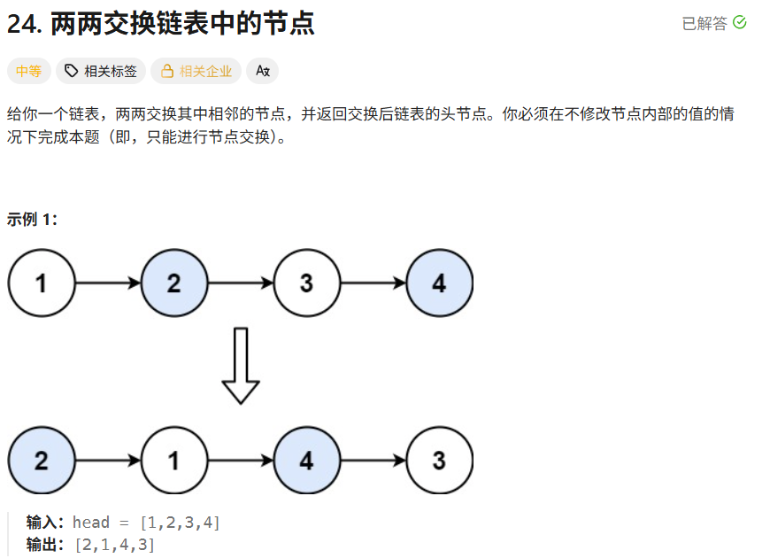时间100.00%，空间5.19%
```
/**

 * Definition for singly-linked list.

 * public class ListNode {

 *     int val;

 *     ListNode next;

 *     ListNode() {}

 *     ListNode(int val) { this.val = val; }

 *     ListNode(int val, ListNode next) { this.val = val; this.next = next; }

 * }

 */

class Solution {

    public ListNode swapPairs(ListNode head) {

        if(head == null || head.next == null){

            return head;

        }

        //先把前两个节点交换了，很多东西会方便一点

        ListNode res = head.next;//要返回的头结点

        head.next = res.next;

        res.next = head;

        ListNode curr = head.next;

        ListNode prev = head;

        //两个两个一组交换前后节点

        while(curr != null && curr.next != null){

            //curr curr.next next

            //curr.next curr next

            ListNode next = curr.next.next;

            prev.next = curr.next;

            prev.next.next = curr;

            curr.next = next;

            prev = curr;

            curr = next;

        }

        return res;

    }

}
```
### 19.删除链表的倒数第N个节点
见hot100
### 面试题02.07.链表相交
见hot100->160.相交链表
### 142.环形链表||
见hot100
## 哈希表
### 理论基础
数组是其底层结构，主要用来等值查询/快速判断一个元素是否出现在集合里
关键在于元素存储位置的计算，计算过程如下图所示。
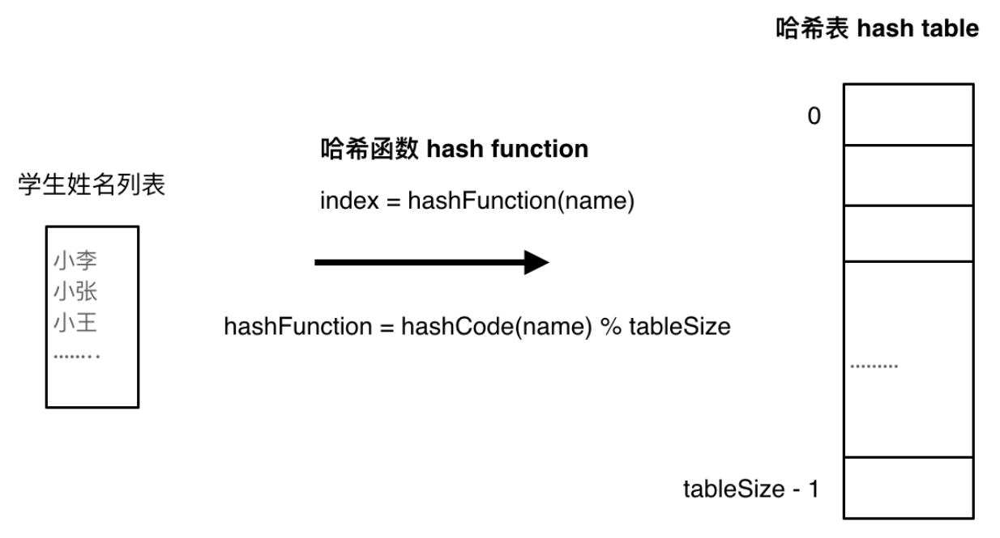
如果多个学生都映射到了同一个索引，就发生了哈希碰撞。解决哈希碰撞的方法有两种，一个是拉链法，一个是线性探测法。
拉链法就是数组+链表，计算到同一个索引就挂到这个位置下的链表就行了。这个方法需要选择适当的哈希表的大小，太大了浪费内存，太小的话一个桶下挂了太多节点查询时间会增加。
线性探测法，发生冲突了就找下一个空的位置存（从该索引开始向后查找，查询的时候也是，从该索引开始查找，直到找到目标键或者空位为止）。
**总结**，当我们遇到了要快速判断一个元素是否出现集合里的时候，就要考虑哈希法。但是哈希法也是牺牲了空间换取了时间，因为我们要使用额外的数组，set或者是map来存放数据，才能实现快速的查找。如果在做面试题目的时候遇到需要判断一个元素是否出现过的场景也应该第一时间想到哈希法！
### 242.有效的字母异位词
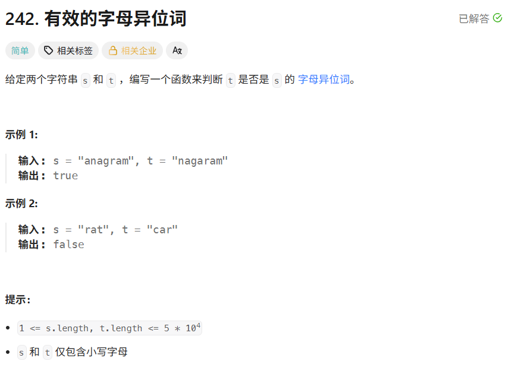时间92.42%，空间45.28%
```
class Solution {

    public boolean isAnagram(String s, String t) {

        int sl = s.length();

        int tl = t.length();

        if(sl != tl) return false;

        int[] sCount = new int[26];

        int[] tCount = new int[26];

        for(int i = 0;i < sl;i++){

            sCount[s.charAt(i) - 'a']++;

        }

        for(int i = 0;i < tl;i++){

            tCount[t.charAt(i) - 'a']++;

        }

        for(int i = 0;i < 26;i++){

            if(tCount[i] != sCount[i]){

                return false;

            }

        }

        return true;

    }

}
```
### 349.两个数组的交集
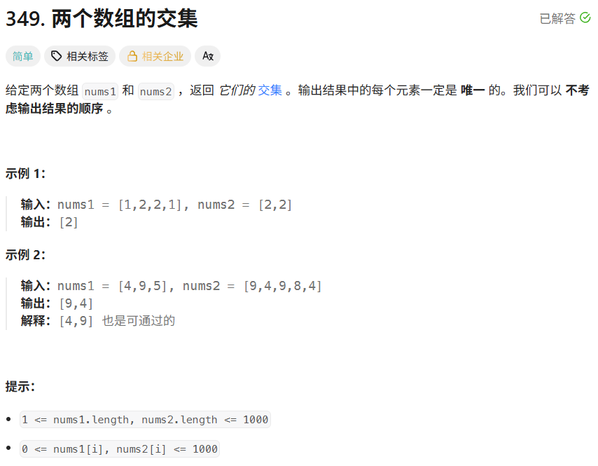时间90.36%，空间13.07%
```
class Solution {

    public int[] intersection(int[] nums1, int[] nums2) {

        //这个交集只是看重复的元素啊，而不是把重复的部分都打出来

        //就是[1,2,2,3,3]交[2,2,3,3]不是[2,2,3,3]而是[2,3]直接哈希表就能做

        Set<Integer> memory = new HashSet<>();//记住nums1中出现的数字

        Set<Integer> resSet = new HashSet<>();//存储结果，用HashSet来去重

        for(int i = 0;i < nums1.length;i++){

            memory.add(nums1[i]);

        }

        for(int i = 0;i < nums2.length;i++){

            if(memory.contains(nums2[i])){

                resSet.add(nums2[i]);

            }

        }

        int[] res = new int[resSet.size()];

        int length = 0;

        for(Integer i:resSet){

            res[length] = i;

            length++;

        }

        return res;

    }

}
```
### ★★★202.快乐数
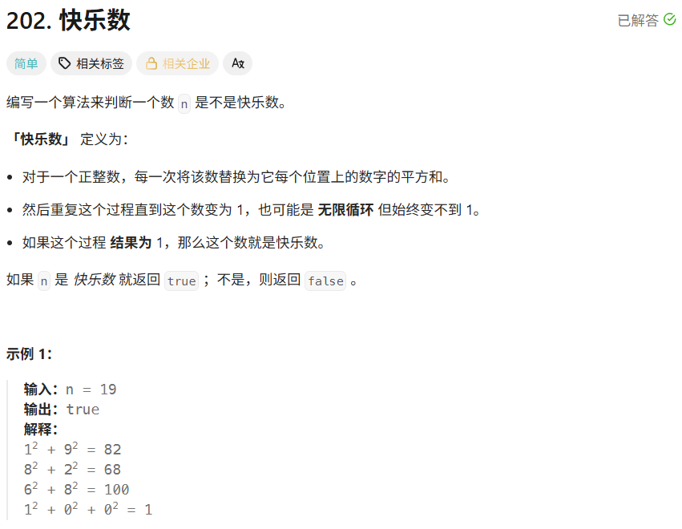这题虽然是在哈希表下的，但是是用双指针做的，这个思路会更好一点，用哈希表实现也简单的。时间85.80%，空间29.91%
```
class Solution {

    public boolean isHappy(int n) {

        //每个数经过一轮轮的变化，可能会有以下三种情况

        //1.最终会得到1 2.最终会进入循环 3.值会越来越大，最后接近无穷大

        //但是实际上每个数经过这样的操作之后都会进入循环，下面是证明

        //9 -> 81   99->162  999->243

        //也就是说三位数经过变化之后不可能操作243，那对于四位数呢，

        //可以验证每个位置上的数平方最大就是81，能得到的最大值就是位数 * 81

        //对于4位及以上的数字，经过一轮这样的变化后都是减小的，最终会被降到3位以内

        //所以任何数最终都会进入到一个循环，可以用快慢指针解决

        //哈希表就是把走过的数都记一下嘛，再走过一次就知道进循环了，直接return false；

        int slow = n;

        int fast = n;

        fast = operation(operation(fast));

        slow = operation(slow);

        while(fast != 1 && slow != 1){

            if(fast == slow) return false;

            fast = operation(operation(fast));

            slow = operation(slow);

        }

        return true;

    }

  

    private int operation(int n){

        int sum = 0;

        while(n > 0){

            int end = n % 10;

            sum += end * end;

            n /= 10;

        }

        return sum;

    }

}
```
### 1.两数之和
见hot100
### ★★★454.四数相加||
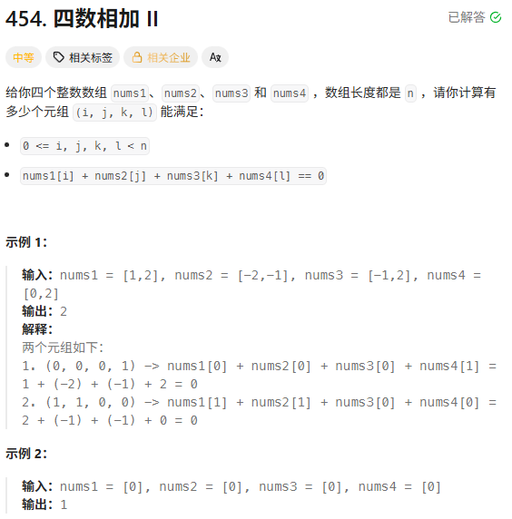
时间78.89%，空间38.58%
```
class Solution {

    public int fourSumCount(int[] nums1, int[] nums2, int[] nums3, int[] nums4) {

        //大概的思路我觉得就是数组两两为一组，然后用两数之和的想法来做

        //key放数组nums1和nums2中元素的和，value是这个和的出现次数

        //那么之后对于每个nums3和nums4中元素的和查找一下加起来就行了

        int n = nums1.length;

        Map<Integer, Integer> AandB = new HashMap<>();

        for(int i = 0;i < n;i++){

            for(int j = 0;j < n;j++){

                int temp = nums1[i] + nums2[j];

                //小小新学一个HashMap的getOrDefault函数

                //有这个key就获取值，没有就给个0

                AandB.put(temp, AandB.getOrDefault(temp, 0) + 1);

            }

        }

        int res = 0;

        for(int i = 0;i < n;i++){

            for(int j = 0;j < n;j++){

                int target = - nums3[i] - nums4[j];

                res += AandB.getOrDefault(target, 0);

            }

        }

        return res;

    }

}
```
### 383.赎金信
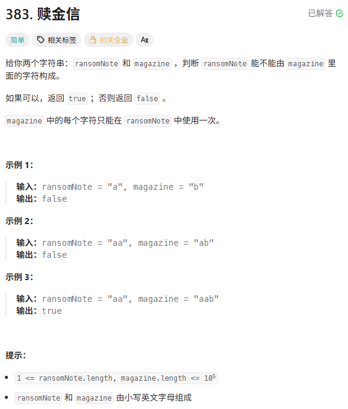
时间99.87%，空间33.95%
```
class Solution {

    public boolean canConstruct(String ransomNote, String magazine) {

        int l1 = ransomNote.length();

        int l2 = magazine.length();

        if(l1 > l2) return false;

        //其实就是要用magazine中的字符把ransomNote拼出来嘛

        //统计magazine出现的字母及其出现次数（就是可使用的字母及其出现次数）

        //要用的字母没次数了或者本来就是没有就return false，其他true

        //注意这里的hashmap可以用int[26]简化

        int[] count = new int[26];

        for(int i = 0;i < l2;i++){

            count[magazine.charAt(i) - 'a']++;

        }

        for(int i = 0;i < l1;i++){

            if(count[ransomNote.charAt(i) - 'a'] == 0) return false;

            count[ransomNote.charAt(i) - 'a']--;

        }

        return true;

    }

}
```
### 15.三数之和
见hot100
### 18.四数之和
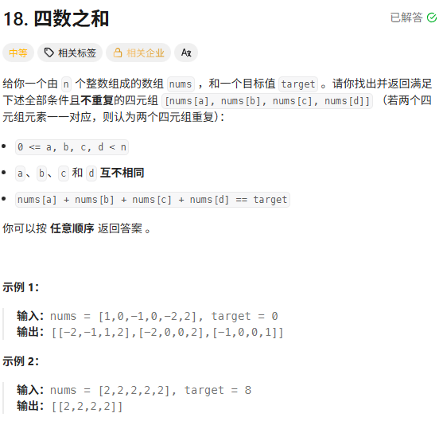
时间33.62%，空间30.55%
```
class Solution {

    public List<List<Integer>> fourSum(int[] nums, int target) {

        Arrays.sort(nums);

        List<List<Integer>> res = new ArrayList<>();

        //其实很好降成三数之和啊我感觉

        //遍历到的当前的数作为第一个数

        //后面找三数之和为target-这个数就行

        int n = nums.length;

        for(int i = 0;i < n - 3;i++){

            if(i > 0 && nums[i] == nums[i - 1]){

                continue;

            }

            for(int j = i + 1;j < n - 2;j++){

                if(j > i + 1 && nums[j] == nums[j - 1]) continue;

                int left = j + 1;

                int right = n - 1;

                while(left < right){

                    int sum = nums[i] + nums[j] + nums[left] + nums[right];

                    //这里是为了处理一个特例，就是加起来溢成负数了

                    if(nums[i] > 0 && nums[j] > 0 && nums[left] > 0 &&

                    nums[right] > 0 && sum < 0){

                        right--;

                        continue;

                    }

                    if(sum == target){

                        List<Integer> temp = new ArrayList<>();

                        temp.add(nums[i]);

                        temp.add(nums[j]);

                        temp.add(nums[left]);

                        temp.add(nums[right]);

                        res.add(temp);

                        left++;

                        while(left < n && nums[left] == nums[left - 1]){

                            left++;

                        }

                        right--;

                        while(right > 0 && nums[right] == nums[right + 1]){

                            right--;

                        }

                    }else if(sum > target){

                        right--;

                    }else{

                        left++;

                    }

                }

            }

        }

        return res;

    }

}
```
## 字符串
### 344.反转字符串
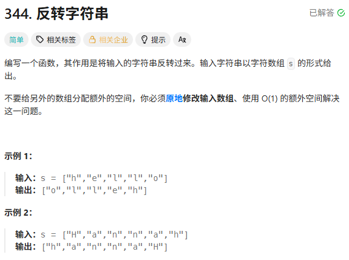
时间100.00%，空间29.81%
```
class Solution {

    public void reverseString(char[] s) {

        int left = 0;

        int right = s.length - 1;

        while(left < right){

            char temp = s[left];

            s[left] = s[right];

            s[right] = temp;

            left++;

            right--;

        }

    }

}
```
### 541.反转字符串||
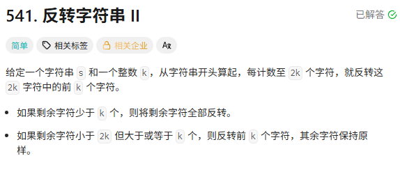
时间18.94%，空间36.06%
先是自己写的，这里找每个反转位置(第2k个数)的时候不用一个个遍历然后判断，直接每次让i+2k就行了，可以优化。
```
class Solution {

    public String reverseStr(String s, int k) {

        char[] sArray = s.toCharArray();

        int sl = sArray.length;

        for(int i = 0;i < sl;i++){

            int count = (i + 1) % (2 * k);

            if(i == sl - 1){

                if(count < k){

                    reverse(sArray, i - count + 1, i);

                }else if(count >= k && count < 2 * k){

                    reverse(sArray, i - count + 1, i - count + k);

                }

            }

            if(count == 0){

                reverse(sArray, i - 2 * k + 1, i - k);

            }

        }

        return new String(sArray);

    }

  

    private void reverse(char[] sArray, int begin, int end){

        int left = begin;

        int right = end;

        while(left < right){

            char temp = sArray[left];

            sArray[left] = sArray[right];

            sArray[right] = temp;

            left++;

            right--;

        }

    }

}
```
时间93.18%，空间14.21%
```
class Solution {

    public String reverseStr(String s, int k) {

        char[] sArray = s.toCharArray();

        int sl = sArray.length;

        for(int i = 0;i < sl;i += 2 * k){

            //这样每次移动都是到新的一组的开头

            //如果这一组数少于k个，全部反转

            if(i + k >= sl){

                reverse(sArray, i, sl - 1);

                break;

            }

            //这组数完整(能凑到2k)或者 2k > length > =k 反转前k个

            reverse(sArray, i, i + k - 1);

        }

        return new String(sArray);

    }

  

    private void reverse(char[] sArray, int begin, int end){

        int left = begin;

        int right = end;

        while(left < right){

            char temp = sArray[left];

            sArray[left] = sArray[right];

            sArray[right] = temp;

            left++;

            right--;

        }

    }

}
```
### LCR 122.路径加密

时间100.00%，空间11.55%
```
class Solution {

    public String pathEncryption(String path) {

        char[] pathArray = path.toCharArray();

        for(int i = 0;i < pathArray.length;i++){

            if(pathArray[i] == '.') pathArray[i] = ' ';

        }

        return new String(pathArray);

    }

}
```
### 151.反转字符串中的单词
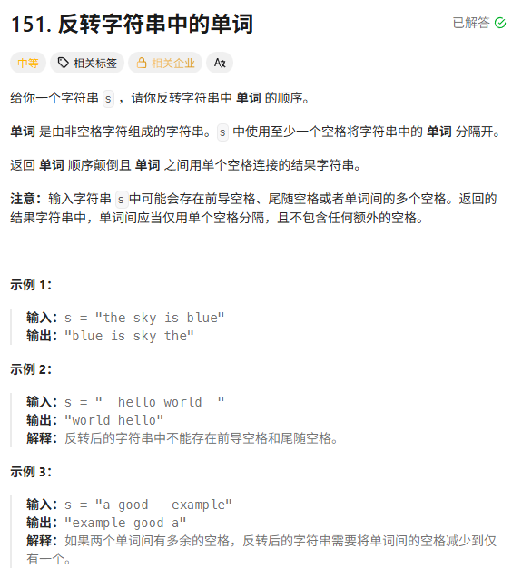
时间5.67%，空间5.03%
```
class Solution {

    public String reverseWords(String s) {

        //后进先出 -> 用栈

        //把每个单词都摘出来然后入栈

        //然后依次出栈即可

        List<String> words = new LinkedList<>();

        int first = 0;

        for(int i = 0;i < s.length();i++){

            //如果前面是空格当前是字符，这个位置就是当前单词的头

            //i > 0放心加，first初值是0，如果0是头的话那么这个会到下个单词才生效

            if(i > 0 && s.charAt(i) != ' ' && s.charAt(i - 1) == ' ') first = i;

            //当前是空格然后前面一个是字符，前一个位置位置就是当前单词的尾

            if(i > 0 && s.charAt(i) == ' ' && s.charAt(i - 1) != ' '){

                words.addFirst(s.substring(first, i));

            }

            //不过到最后可能没有空格，也是到尾了要结算一下

            if(i == s.length() - 1 && s.charAt(i) != ' '){

                words.addFirst(s.substring(first, i + 1));

            }

        }

        String res = new String();

        for(String word : words){

            res = res + word + " ";

        }

        return res.substring(0, res.length() - 1);

    }

}
```
改进：时间82.28%，空间20.11%
```
class Solution {

    public String reverseWords(String s) {

        s = s.trim();//删除首尾空格

        //通过双指针定位单词的首尾 i左指针 j 右指针

        int j = s.length() - 1;

        List<String> words = new LinkedList<>();

        for(int i = s.length() - 1;i >= 0;i--){

            //i向左移动直到找到第一个空格

            if(s.charAt(i) == ' '){

                //那么第一个空格的后一个字符到j就是当前单词，加入到列表里

                words.addLast(s.substring(i + 1,j + 1));

                //把对应的分隔符也给带上

                words.addLast(" ");

                //跳过其他空格，如果有的话

                while(s.charAt(i) == ' '){

                    i--;

                }

                //跳完之后i来到了下一个单词的末尾，把j赋值过来

                j = i;

            }

            //i到边界的情况，也结束了

            if(i == 0){

                words.addLast(s.substring(0,j + 1));

            }

        }

        StringBuilder res = new StringBuilder();

        for(String word : words){

            res.append(word);

        }

        return res.toString();

    }

}
```
### 右旋字符串
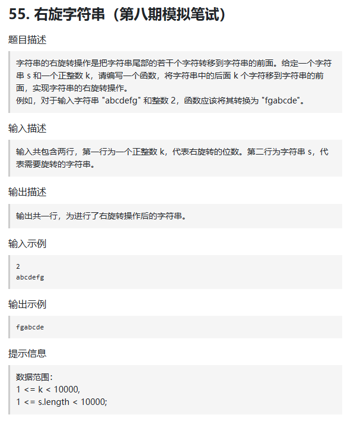
借助字符串数组实现
```
import java.util.Scanner;

public class Main {
    public static void main(String[] args){
        Scanner scanner = new Scanner(System.in);
        //读右旋转的位数k
        int k = scanner.nextInt();
        //读取待操作的字符串
        String s = scanner.next();
        int sl = s.length();
        char[] resArray = new char[sl];
        //右旋你其实可以把每个字符旋转完的坐标算出来
        //然后直接创一个新字符数组放在对应的位置
        //影响就是空间复杂度为O(n)
        for(int i = 0;i < sl;i++){
            int index = (i + k) % sl;
            resArray[index] = s.charAt(i);
        }
        System.out.println(new String(resArray));
    }
}
```
不用创建字符串数组，不过耗时比上面的那个久了一点，空间用的是少了一点
```
import java.util.Scanner;
public class Main {
    public static void main(String[] args){
        Scanner scanner = new Scanner(System.in);
        //读右旋转的位数k
        int k = scanner.nextInt();
        //读取待操作的字符串
        String s = scanner.next();
        int sl = s.length();
        System.out.println(s.substring(sl - k, sl)
        + s.substring(0, sl - k));
    }
}
```
### ★★★28.找出字符串中第一个匹配项的下标
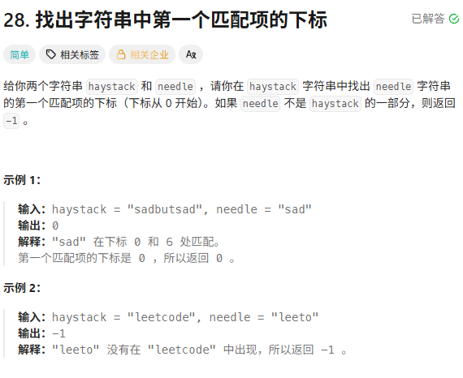
自己写的，差不多纯暴力的写法。时间2.77%，空间22.62%
```
class Solution {
    public int strStr(String haystack, String needle) {
        for(int i = 0;i < haystack.length();i++){
            if(haystack.charAt(i) == needle.charAt(0)){
                //第一个字符相同进入匹配
                int j = 1;
                while(j < needle.length() && i + j < haystack.length()
                && haystack.charAt(i + j) == needle.charAt(j)){
                    j++;
                }
                if(j == needle.length()) return i;
            }
        }
        return -1;
    }
}
```
优化：KMP算法。时间55.65%，空间7.02%
上面的算法是每次遇到开头相同的就进入匹配，一直匹配到不一致或者结束为止，当出现了不一致，回退到上次开头的下一个再继续匹配。那么这个匹配的过程中其实两边都在往后走，我们肯定是得到了一些信息的，能不能利用这些信息避免回退呢。
方法就是KMP算法。它首先是有一个next数组。下标i处的值就代表了到这的子串的最长相同的前后缀长度。
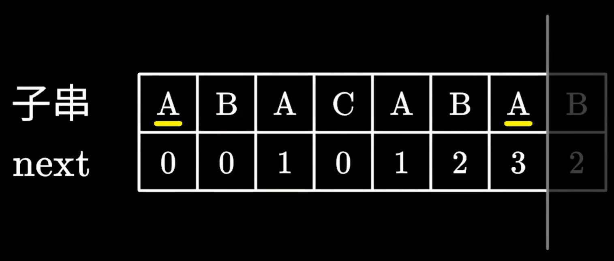
这有什么意义呢，就比如下图是在匹配串的A位置出现了不一致（该位置记为j，原串的对应位置记为i），不想回退，就要从i往前看，然后从匹配串的开头往后看，看i前面的有哪些字符和匹配串前面的字符是相同的（当然这个是要小于j的，不然你移动一下不是还是原样嘛），这样我们直接从相同的位置之后再开始匹配就好了。找下次开始的位置就是通过next数组实现的。
```
j = next[j - 1] 
```
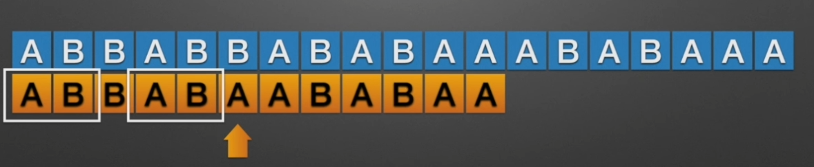
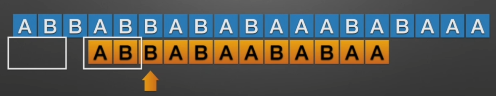
next数组的构建过程(摘自这题的题解) 
i是后缀末尾，j是前缀的末尾，也代表了当前相同前后缀的长度。
如果i和j位置上的字符相同，相同的部分就+1，前后缀指针都往后移动一个位置，同时把这个位置相同前后缀的长度赋值一下。
如果i和j位置上的字符不同，说明当前的前缀尾和后缀尾不同了，相同部分加不了了，同时收缩后缀和前缀，收缩后缀你看不太到就是，因为后缀尾是不变的，收缩前缀怎么收呢，也是每次
```
j = next[j - 1] 
```
目前是知道0到j-1是和i-j到i-1是相同的，就是不断收缩前面的，看能不能让收缩完的前缀尾等于这个b（如果相等的话 b前面和前缀尾前面的都是相同的嘛，按这样收缩的话，长度就可以从这开始加了）不能就继续回退，直到j = 0。
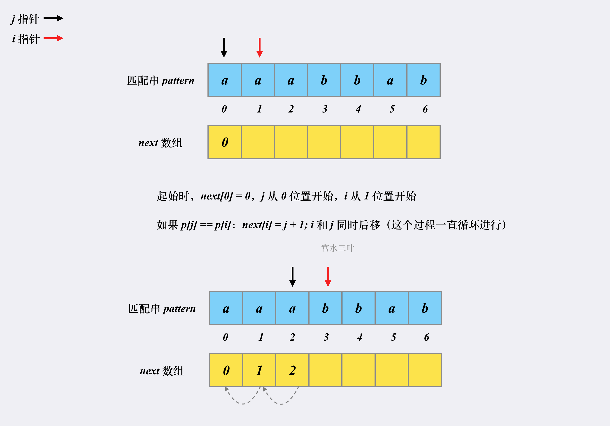
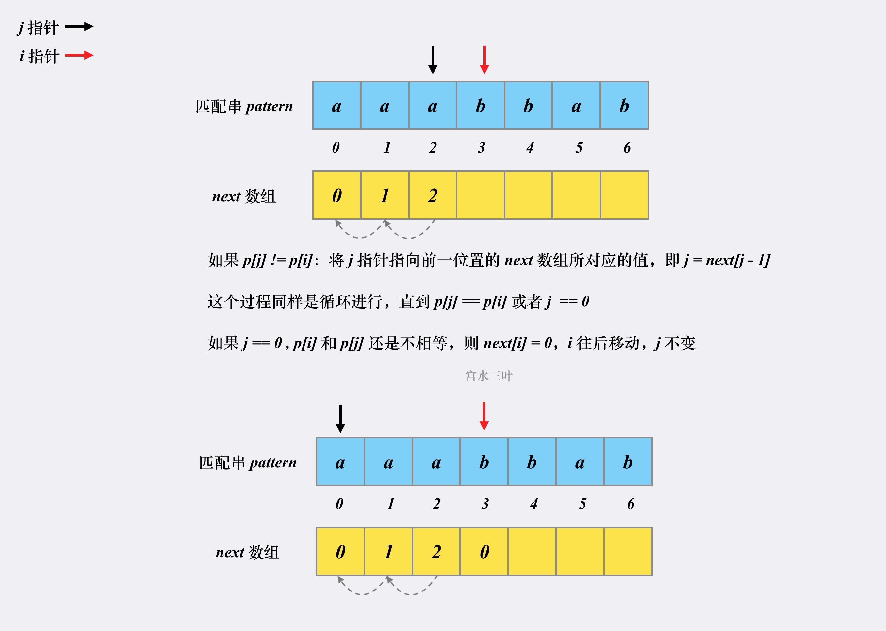
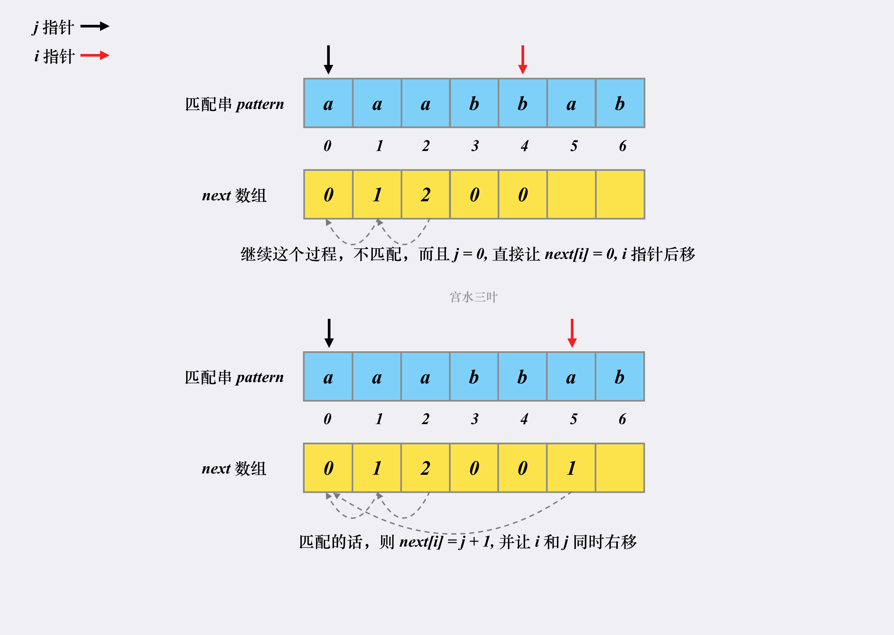
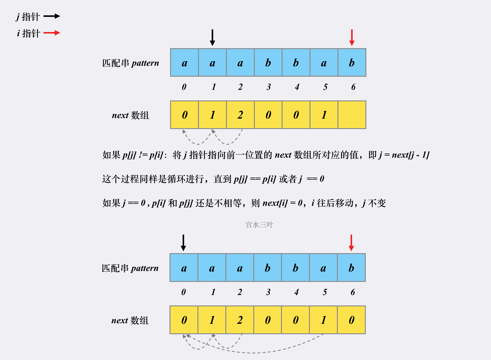
```
class Solution {

    public int strStr(String haystack, String needle) {

        char[] h = haystack.toCharArray();

        char[] n = needle.toCharArray();

        int hl = h.length;

        int nl = n.length;

        //构建next数组

        int[] next = new int[nl];

        for(int i = 1, j = 0;i < nl;i++){

            //如果n[j] != n[i] -> j = next[j - 1]  循环进行，直到j == 0 或者二者相等

            //如果j == 0 二者还是不相等，那么next[i] = 0，i往后移动，j不变

            while(j > 0 && n[i] != n[j]) j = next[j - 1];

            //如果n[j] ==n[i] -> (1)next[i] = j + 1  (2)i和j同时后移（循环进行）

            if(n[i] == n[j]) j++;//循环完i就+1了

            next[i] = j;//next[i] = j + 1

        }

        for(int i = 0, j = 0;i < hl;i++){

            while(j > 0 && h[i] != n[j]) j = next[j - 1];

            //匹配成功往后移动

            if(h[i] == n[j]) j++;

            //一整段匹配成功，直接返回下标

            if(j == nl) return i - nl + 1;

        }

        return -1;

    }

}
```
### ★★★459.重复的子字符串
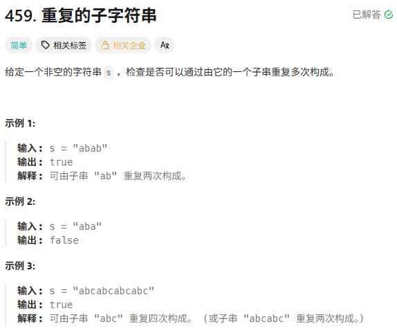
时间92.72%，空间46.57%（不过时间复杂度高，是n^2）
```
class Solution {

    public boolean repeatedSubstringPattern(String s) {

        int sl = s.length();

        boolean res = false;

        for(int i = 1;i <= sl / 2 && !res;i++){

            //假设可以由长度为i的子串构成

            //如果sl != n * i 不可能由长度为i的子串构成，跳过

            if(sl % i != 0) continue;

            //如果可以由长度为i的子串构成，那么

            //第1个到第i个字符，每隔i肯定都会重复，不满足就不是

            boolean flag = true;

            for(int j = 1;j <= i;j++){

                //记录一下第一个字符

                char a = s.charAt(j - 1);

                int k = j - 1 + i;

                while(k < sl){

                   if(s.charAt(k) != a) break;

                   k+=i;

                }

                if(k < sl){

                    flag = false;

                    break;

                }

            }

            res = flag;

        }

        return res;

    }

}
```
通过KMP算法里面的Next数组实现
如果最长相等前后缀不包含的子串的长度不等于0且该长度可以被字符串s的长度整除，那么不包含的子串就是s的最小重复子串。否则就找不到子串重复可以构成原串。
时间99.47%，空间21.72%
```
class Solution {

    public boolean repeatedSubstringPattern(String s) {

        int sl = s.length();

        int[] next = new int[sl];

        char[] sArray = s.toCharArray();

        for(int i = 1, j = 0;i < sl;i++){

            while(j > 0 && sArray[i] != sArray[j]) j = next[j - 1];

            if(sArray[i] == sArray[j]) j++;

            next[i] = j;

        }

        return next[sl - 1] > 0 && sl % (sl - next[sl - 1]) == 0;

    }

}
```
## 双指针法

### 27.移除元素
做过了
### 344.反转字符串
做过了
### 替换数字
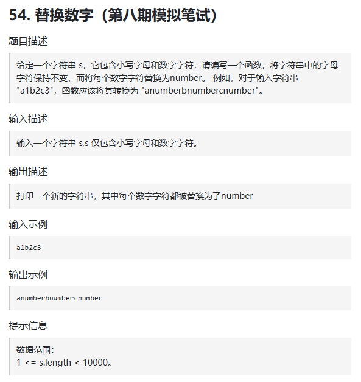
暴力解法，用的不是双指针，感觉双指针还更麻烦
```
import java.util.Scanner;

public class Main{

    public static void main(String[] args){

        Scanner scanner = new Scanner(System.in);

        String s = scanner.next();

        StringBuilder res = new StringBuilder();

        //新开一个StringBuilder，遍历原串的每个字符

        //是字母就原样加上去，是数字就替换

        for(int i = 0;i < s.length();i++){

            char now = s.charAt(i);

            if(now >= '0' && now <= '9'){

                res.append("number");

            }else{

                res.append(now);

            }

        }

        System.out.println(res);

    }

}
```
### 151.反转字符串中的单词
做过了
### 206.反转链表
见hot100
### 19.删除链表的倒数第N个节点
见hot100
### 142.环形链表||
见hot100
### 15.三数之和
见hot100
### 18.四数之和
做过了
## 栈与队列
### 理论基础
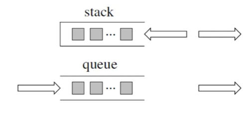
栈：后进先出
队列：先进先出
### 232.用栈实现队列
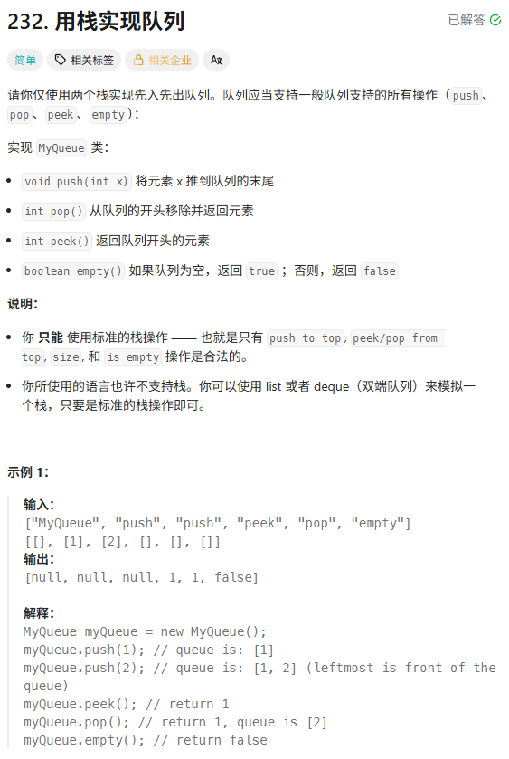
时间100.00%，空间5.05%
```
class MyQueue {

    //搞一个输入栈和一个输出栈

    //输入的话就依次进入到输入栈里面

    //要输出或者要看头部元素的时候，把输入栈的元素倒到输出栈里面（输出栈为空）

    //这样输出栈里面的元素就是按最前到最后排列了，做对应的操作即可

    //输出完或者看完顶部元素是不用把输出栈的元素倒回输入栈的

    //只要在输出栈空了之后再倒元素过来，那么输出栈里面的一直就是最前面的元素

    //输入一直补到输入栈就行

    List<Integer> inStack;

    List<Integer> outStack;

    public MyQueue() {

        inStack = new LinkedList<>();

        outStack = new LinkedList<>();

    }

    public void push(int x) {

        inStack.addFirst(x);

    }

    public int pop() {

        if(outStack.isEmpty()){

            transfer();

        }

        return outStack.removeFirst();

    }

    public int peek() {

        if(outStack.isEmpty()){

            transfer();

        }

        return outStack.getFirst();

    }

    public boolean empty() {

        return inStack.isEmpty() && outStack.isEmpty();

    }

  

    private void transfer(){

        while(!inStack.isEmpty()){

            outStack.addFirst(inStack.removeFirst());

        }

    }

}

  

/**

 * Your MyQueue object will be instantiated and called as such:

 * MyQueue obj = new MyQueue();

 * obj.push(x);

 * int param_2 = obj.pop();

 * int param_3 = obj.peek();

 * boolean param_4 = obj.empty();

 */
```
### 225.用队列实现栈
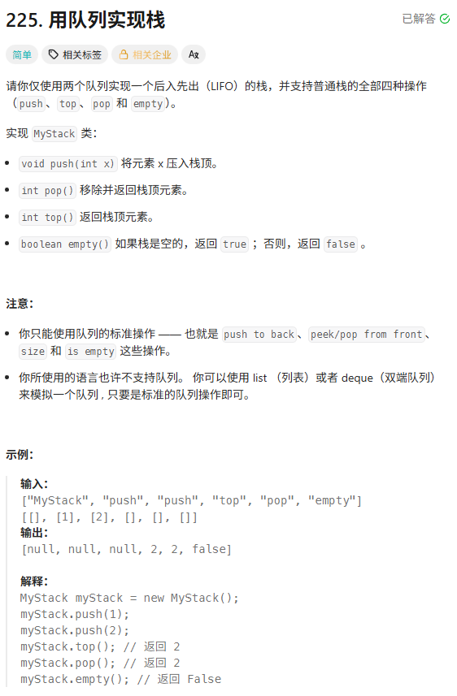
时间100.00%，空间5.10%
```
class MyStack {

    //利用两个队列就和用栈实现队列一样

    //要出的时候把输入队列里面的倒入到输出队列里面就行了（输出队列非空）

    //只用一个队列实现的话就是每次入队列的时候，先统计一下队列的元素个数n

    //然后把新元素入队列，然后把前面n个元素出队列再进来就好了

    List<Integer> queue;

  

    public MyStack() {

        //addLast + removeFirst + getFirst

        queue = new LinkedList<>();

    }

    public void push(int x) {

        int n = queue.size();

        queue.addLast(x);

        for(int i = 0;i < n;i++){

            queue.addLast(queue.removeFirst());

        }

    }

    public int pop() {

        return queue.removeFirst();

    }

    public int top() {

        return queue.getFirst();

    }

    public boolean empty() {

        return queue.isEmpty();

    }

}

  

/**

 * Your MyStack object will be instantiated and called as such:

 * MyStack obj = new MyStack();

 * obj.push(x);

 * int param_2 = obj.pop();

 * int param_3 = obj.top();

 * boolean param_4 = obj.empty();

 */
```
### 20.有效的括号
见hot100
### 1047.删除字符串中的所有相邻重复项
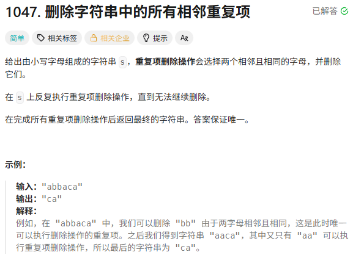
时间72.31%，空间41.30%
```
class Solution {

    public String removeDuplicates(String s) {

        //是用栈的思想实现的，最后整理答案的时候要倒序出

        //所以用了双端队列，核心部分是栈

        //就是依次入栈，每个字符进来的时候看看当前字符和栈顶是不是相同的

        //是就相消了，不是就入栈

        List<Character> deque = new LinkedList<>();

        for(int i = 0;i < s.length();i++){

            char c = s.charAt(i);

            if(!deque.isEmpty() && c == deque.getFirst()){

                deque.removeFirst();

            }else{

                deque.addFirst(c);

            }

        }

        StringBuilder res = new StringBuilder();

        while(!deque.isEmpty()){

            res.append(deque.removeLast());

        }

        return res.toString();

    }

}
```
### 150.逆波兰表达式求值
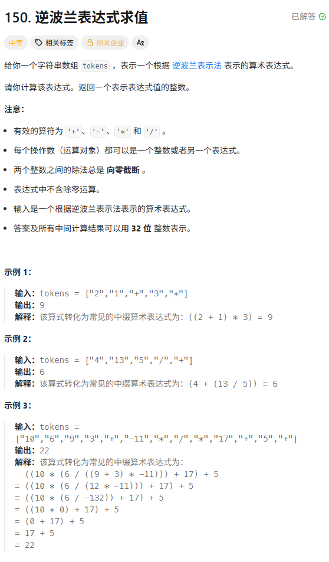
时间30.89%，空间14.82%
```
class Solution {

    public int evalRPN(String[] tokens) {

        //逆波兰表达式：把运算符写在操作数后

        //2  1  + 就是2 + 1

        //2  1  + 3 * 就是先2 + 1 然后再 * 3  

        List<Integer> stack = new LinkedList<>();

        for(int i = 0;i < tokens.length;i++){

            if(tokens[i].equals("+") || tokens[i].equals("-")

            || tokens[i].equals("*") || tokens[i].equals("/")){

                int num2 = stack.removeFirst();

                int num1 = stack.removeFirst();

                switch(tokens[i]){

                    case "+":stack.addFirst(num1 + num2);break;

                    case "-":stack.addFirst(num1 - num2);break;

                    case "*":stack.addFirst(num1 * num2);break;

                    default :stack.addFirst(num1 / num2);break;

                }

            }else{

                stack.addFirst(Integer.parseInt(tokens[i]));

            }

        }

        return stack.getFirst();

    }

}
```
### 239.滑动窗口最大值
见hot100
### 347.前K个高频元素
见hot100
## 二叉树
### 理论基础
#### 题目分类
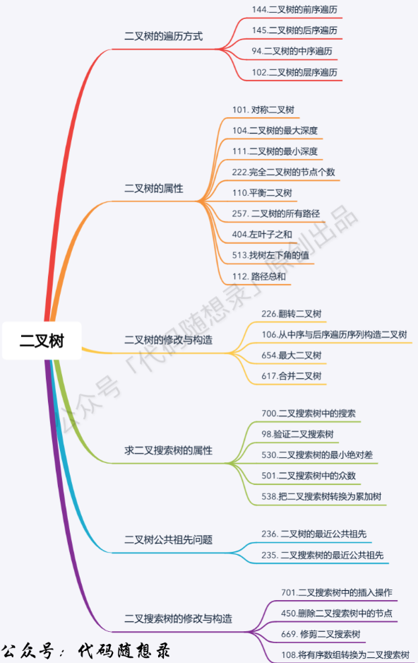
#### 二叉树的种类
满二叉树：如果一颗二叉树只有度为0的结点和度为2的结点，并且度为0的结点在同一层上，则这颗二叉树为满二叉树。
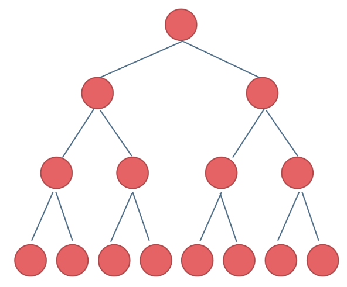
当其深度为k时，节点数目为2<sup>k</sup>-1

完全二叉树：在完全二叉树中，除了最底层节点可能没填满外，其余每层节点数都达到最大值，并且最下面一层的结点都集中在该层最左边的若干位置。若最底层为第h层，则该层包含1-2<sup>h-1</sup>个节点
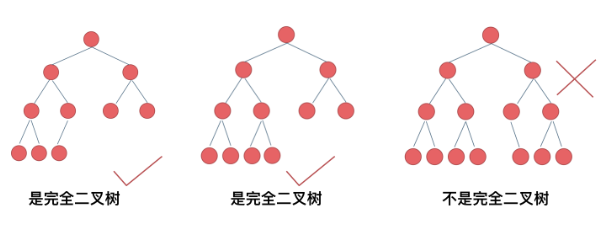
二叉搜索树：
是一个有序树。若它的左子树不空，则左子树上所有节点的值均小于它的根节点的值；若它的右子树不空，则右子树上所有节点的值均大于它的根节点的值；它的左、右子树也分别为二叉排序树。
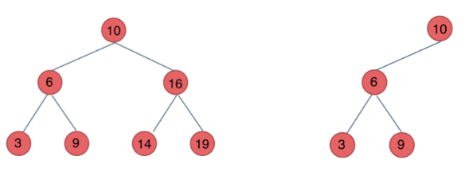
平衡二叉搜索树：
它是一颗空树或它的左右两个子树的高度差的绝对值不超过1，并且左右两个子树都是一颗平衡二叉树。
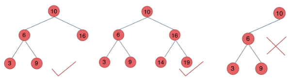
#### 二叉树的存储方式
链式存储
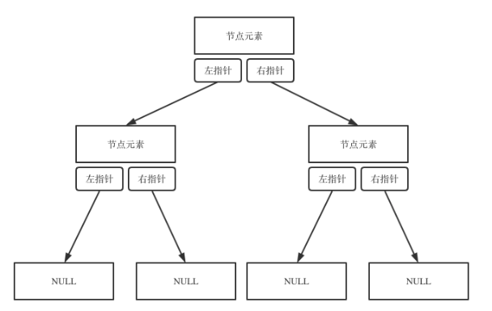
顺序存储
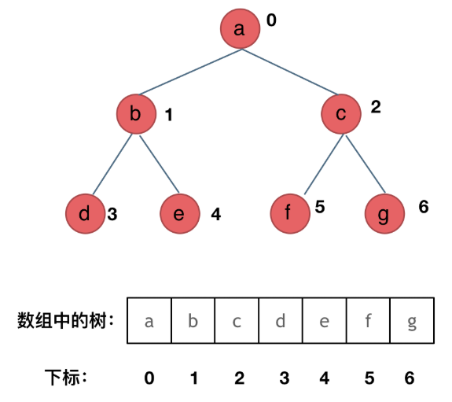
要求是完全二叉树。此时如果父节点的数组下标是i，那么它的左孩子就是i\*2+1，右孩子就是i\*2 +2。
#### 二叉树的遍历方式
深度优先遍历：先往深走，遇到叶子节点再往回走
	前序遍历：根左右；递归法、迭代法
	中序遍历：左根右；递归法、迭代法
	后续遍历：左右根；递归法、迭代法
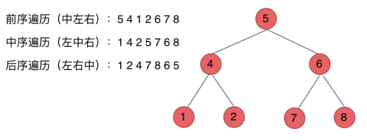
广度优先遍历：一层一层的去遍历
	层次遍历：迭代法、借助栈实现
#### 二叉树的定义
```
public class TreeNode{
	int val;
	TreeNode left;
	TreeNode right;
	
	TreeNode(){}
	TreeNode(int val){this.val = val;}
	TreeNode(int val, TreeNode left, TreeNode right){
		this.val = val;
		this.left = left;
		this.right = right;
	}
}
```
#### 二叉树的递归遍历
递归三要素：
	1.确定递归函数的参数和返回值：确定哪些参数是递归的过程中需要处理的，那么就在递归函数里加上这个参数，并且还要明确每次递归的返回值是什么进而确定递归函数的返回类型。
	2.确定终止条件
	3.确定单层递归的逻辑：确定每一层递归需要处理的信息。在这里也就会重复调用自己来实现递归的过程。
```
// 前序遍历·递归·LC144_二叉树的前序遍历
class Solution {
    public List<Integer> preorderTraversal(TreeNode root) {
        List<Integer> result = new ArrayList<Integer>();
        preorder(root, result);
        return result;
    }

    public void preorder(TreeNode root, List<Integer> result) {
        if (root == null) {
            return;
        }
        result.add(root.val);
        preorder(root.left, result);
        preorder(root.right, result);
    }
}
// 中序遍历·递归·LC94_二叉树的中序遍历
class Solution {
    public List<Integer> inorderTraversal(TreeNode root) {
        List<Integer> res = new ArrayList<>();
        inorder(root, res);
        return res;
    }

    void inorder(TreeNode root, List<Integer> list) {
        if (root == null) {
            return;
        }
        inorder(root.left, list);
        list.add(root.val);             // 注意这一句
        inorder(root.right, list);
    }
}
// 后序遍历·递归·LC145_二叉树的后序遍历
class Solution {
    public List<Integer> postorderTraversal(TreeNode root) {
        List<Integer> res = new ArrayList<>();
        postorder(root, res);
        return res;
    }

    void postorder(TreeNode root, List<Integer> list) {
        if (root == null) {
            return;
        }
        postorder(root.left, list);
        postorder(root.right, list);
        list.add(root.val);             // 注意这一句
    }
}
```
#### 二叉树的迭代遍历
前序遍历：
入栈顺序为根、右、左，根节点出栈了再把右、左子节点放进去，结合栈的特性，出栈顺序就是根、左、右了。这里因为第一个操作的是根节点，带来了很大便利，至于为什么后面会说。
```
class Solution {

    public List<Integer> preorderTraversal(TreeNode root) {

        List<Integer> res = new ArrayList<>();

        if(root == null) return res;

        Stack<TreeNode> stack = new Stack();

        stack.push(root);

        while(!stack.isEmpty()){

            TreeNode node = stack.pop();

            res.add(node.val);

            if(node.right != null){

                stack.push(node.right);

            }

            if(node.left != null){

                stack.push(node.left);

            }

        }

        return res;

    }

}
```
后续遍历：
基于前序遍历实现，先构建一个顺序为根、右、左的二叉树，然后反转结果。这对应的入栈顺序为根|左、右
```
class Solution {

    public List<Integer> postorderTraversal(TreeNode root) {

        List<Integer> res = new ArrayList<>();

        Stack<TreeNode> stack = new Stack();

        if(root == null) return res;

        stack.push(root);

        while(!stack.isEmpty()){

            TreeNode node = stack.pop();

            res.add(node.val);

            if(node.left != null){

                stack.push(node.left);

            }

            if(node.right != null){

                stack.push(node.right);

            }

        }

        Collections.reverse(res);

        return res;

    }

}
```
中序遍历
迭代的过程中涉及到两个操作，一个是遍历节点（访问），一个是把节点的值放到数组里（处理）。访问的话其实都是要先访问根节点再访问左右子节点的，在前序遍历中，处理顺序也是这样的，所以这里访问顺序和处理顺序是一样的就简单一点，而中序遍历的处理顺序和访问顺序是不一致的，需要借助指针来实现。通过指针的遍历来帮助访问节点，栈则用来处理节点上的元素。
```
class Solution {

    public List<Integer> inorderTraversal(TreeNode root) {

        List<Integer> res = new ArrayList<>();

        if(root == null) return res;

        Stack<TreeNode> stack = new Stack<>();

        TreeNode curr = root;

        while(curr != null || !stack.isEmpty()){

            if(curr != null){

                //一直往左走，一路添加根节点

                stack.push(curr);

                curr = curr.left;

            }else{

                //左边走到底了，该回头处理另外一边了

                //每次出的是根节点，它的左子节点就是前面处理的根节点

                //已经搞完了

                curr = stack.pop();

                res.add(curr.val);//根（左）

                curr = curr.right;//右

            }

        }

        return res;

    }

}
```
#### 层序遍历
```
// 102.二叉树的层序遍历
class Solution {
    public List<List<Integer>> resList = new ArrayList<List<Integer>>();

    public List<List<Integer>> levelOrder(TreeNode root) {
        //checkFun01(root,0);
        checkFun02(root);

        return resList;
    }

    //BFS--递归方式
    public void checkFun01(TreeNode node, Integer deep) {
        if (node == null) return;
        deep++;

        if (resList.size() < deep) {
            //当层级增加时，list的Item也增加，利用list的索引值进行层级界定
            List<Integer> item = new ArrayList<Integer>();
            resList.add(item);
        }
        resList.get(deep - 1).add(node.val);

        checkFun01(node.left, deep);
        checkFun01(node.right, deep);
    }

    //BFS--迭代方式--借助队列
    public void checkFun02(TreeNode node) {
        if (node == null) return;
        Queue<TreeNode> que = new LinkedList<TreeNode>();
        que.offer(node);

        while (!que.isEmpty()) {
            List<Integer> itemList = new ArrayList<Integer>();
            int len = que.size();

            while (len > 0) {
                TreeNode tmpNode = que.poll();
                itemList.add(tmpNode.val);

                if (tmpNode.left != null) que.offer(tmpNode.left);
                if (tmpNode.right != null) que.offer(tmpNode.right);
                len--;
            }

            resList.add(itemList);
        }

    }
}
```
### 107.二叉树的层序遍历||
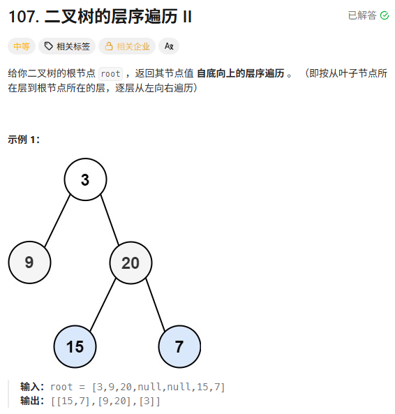
时间95.48%，空间5.23%
```
class Solution {

    public List<List<Integer>> levelOrderBottom(TreeNode root) {

        //这正常的层序遍历 + 逆序一下不就行了

        List<List<Integer>> res = new ArrayList<>();

        Queue<TreeNode> queue = new LinkedList<>();

        if(root == null) return res;

        queue.offer(root);

        while(!queue.isEmpty()){

            List<Integer> temp = new ArrayList<>();

            int length = queue.size();

            for(int i = 0;i < length;i++){

                TreeNode node = queue.poll();

                temp.add(node.val);

                if(node.left != null){

                    queue.offer(node.left);

                }

                if(node.right != null){

                    queue.offer(node.right);

                }

            }

            res.add(temp);

        }

        Collections.reverse(res);

        return res;

    }

}
```
### 199.二叉树的右视图
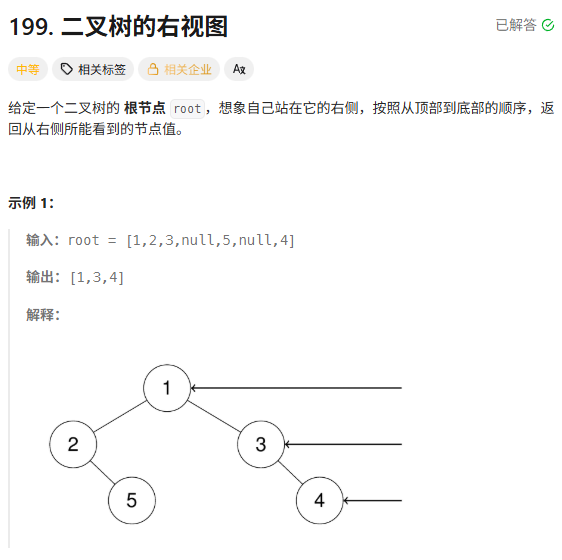
时间79.70%，空间35.92%
```
class Solution {

    public List<Integer> rightSideView(TreeNode root) {

        //其实就是返回每一层最右侧的节点

        //就正常用队列层序遍历，只把每层最后一个节点加到res中就行

        List<Integer> res = new ArrayList<>();

        Queue<TreeNode> queue = new LinkedList<>();

        if(root == null) return res;

        queue.offer(root);

        while(!queue.isEmpty()){

            int length = queue.size();

            for(int i = 0;i < length;i++){

                TreeNode node = queue.poll();

                if(node.left != null){

                    queue.offer(node.left);

                }

                if(node.right != null){

                    queue.offer(node.right);

                }

                if(i == length - 1){

                    res.add(node.val);

                }

            }

        }

        return res;

    }

}
```
### 637.二叉树的层平均值
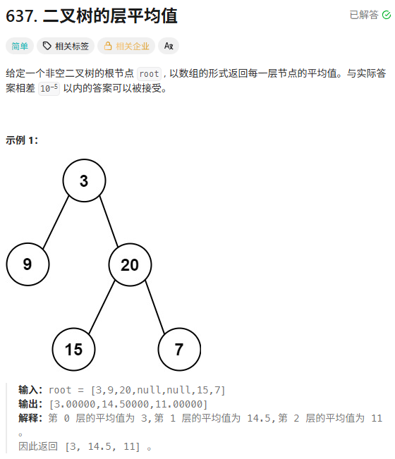
时间97.73%，空间14.85%
```
class Solution {

    public List<Double> averageOfLevels(TreeNode root) {

        List<Double> res = new ArrayList<>();

        if(root == null) return res;

        Queue<TreeNode> queue = new LinkedList<>();

        queue.offer(root);

        while(!queue.isEmpty()){

            double sum = 0;

            int n = queue.size();

            for(int i = 0;i < n;i++){

                TreeNode node = queue.poll();

                sum += node.val;

                if(node.left != null){

                    queue.offer(node.left);

                }

                if(node.right != null){

                    queue.offer(node.right);

                }

            }

            res.add(sum / n);

        }

        return res;

    }

}
```
### 429.N叉树的层序遍历
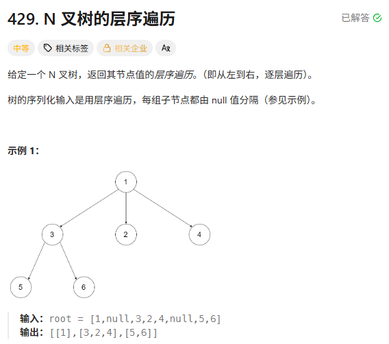
时间92.65%，空间33.32%
```
/*

// Definition for a Node.

class Node {

    public int val;

    public List<Node> children;

  

    public Node() {}

  

    public Node(int _val) {

        val = _val;

    }

  

    public Node(int _val, List<Node> _children) {

        val = _val;

        children = _children;

    }

};

*/

  

class Solution {

    public List<List<Integer>> levelOrder(Node root) {

        List<List<Integer>> res = new ArrayList<>();

        if(root == null) return res;

        Queue<Node> queue = new LinkedList<>();

        queue.offer(root);

        while(!queue.isEmpty()){

            List<Integer> temp = new ArrayList<>();

            int n = queue.size();

            for(int i = 0;i < n;i++){

                Node node = queue.poll();

                temp.add(node.val);

                for(Node subNode:node.children){

                    queue.offer(subNode);

                }

            }

            res.add(temp);

        }

        return res;

    }

}
```
### 515.在每个树行中找最大值
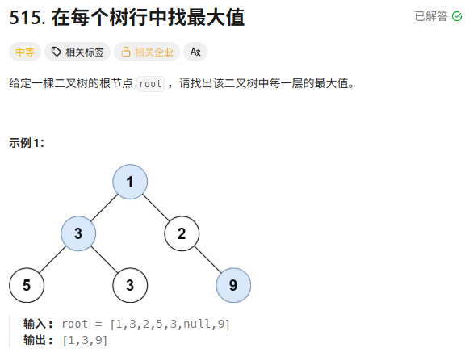
时间93.37%，空间23.25%
```
class Solution {

    public List<Integer> largestValues(TreeNode root) {

        List<Integer> res = new ArrayList<>();

        if(root == null) return res;

        Queue<TreeNode> queue = new LinkedList<>();

        queue.offer(root);

        while(!queue.isEmpty()){

            int max = Integer.MIN_VALUE;

            int n = queue.size();

            for(int i = 0;i < n;i++){

                TreeNode node = queue.poll();

                max = Math.max(max, node.val);

                if(node.left != null){

                    queue.offer(node.left);

                }

                if(node.right != null){

                    queue.offer(node.right);

                }

            }

            res.add(max);

        }

        return res;

    }

}
```
### 116.填充每个节点的下一个右侧节点
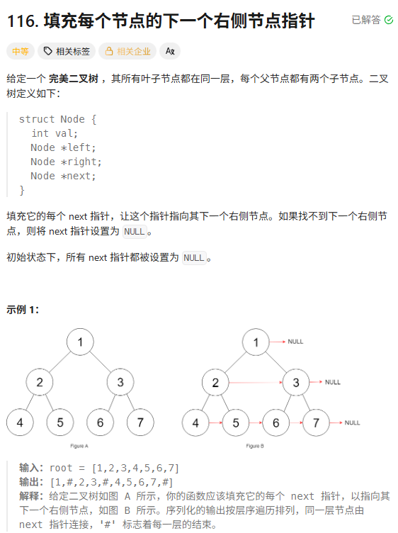
时间82.18%，空间40.93%
```
/*

// Definition for a Node.

class Node {

    public int val;

    public Node left;

    public Node right;

    public Node next;

  

    public Node() {}

    public Node(int _val) {

        val = _val;

    }

  

    public Node(int _val, Node _left, Node _right, Node _next) {

        val = _val;

        left = _left;

        right = _right;

        next = _next;

    }

};

*/

  

class Solution {

    public Node connect(Node root) {

        if(root == null) return root;

        Queue<Node> queue = new LinkedList<>();

        queue.offer(root);

        //这里稍微改一下每一层的顺序，改成从右到左

        //这样遍历的时候把当前节点指向前一个节点就行了

        while(!queue.isEmpty()){

            int n = queue.size();

            Node next = null;

            for(int i = 0;i < n;i++){

                Node node = queue.poll();

                node.next = next;

                next = node;

                if(node.right != null){

                    queue.offer(node.right);

                }

                if(node.left != null){

                    queue.offer(node.left);

                }

            }

        }

        return root;

    }

}
```
### 117.填充每个节点的下一个右侧节点指针||
同116
### 104.二叉树的最大深度
见hot100
### 111.二叉树的最小深度
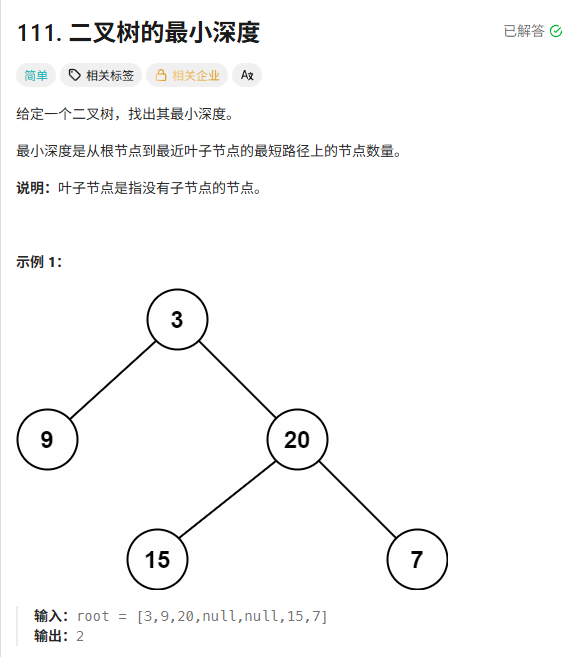
时间98.46%，空间6.98%
```
class Solution {

    public int minDepth(TreeNode root) {
	    //其实就是找层数最低的叶子节点

        //还是照样层序遍历 遍历每个节点

        //找到第一个叶子节点时，返回当前深度

        List<Integer> res = new ArrayList<>();

        if(root == null) return 0;

        Queue<TreeNode> queue = new LinkedList<>();

        queue.offer(root);

        int depth = 0;

        while(!queue.isEmpty()){

            depth++;

            int n = queue.size();

            for(int i = 0;i < n;i++){

                TreeNode node = queue.poll();

                if(node.left == null && node.right == null){

                    return depth;

                }

                if(node.left != null){

                    queue.offer(node.left);

                }

                if(node.right != null){

                    queue.offer(node.right);

                }

            }

        }

        return -1;

    }

}
```
### ★★★222.完全二叉树的节点个数
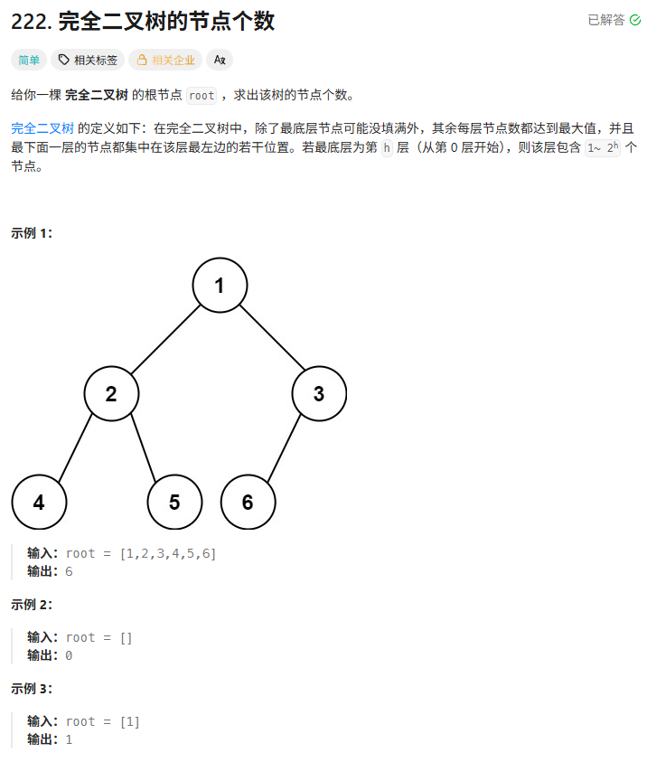
时间100.00%，空间12.42%
```
class Solution {

    //返回传入节点的节点数

    public int countNodes(TreeNode root) {

        //先通过递归判断以当前节点为根节点的树

        //是不是满二叉树

        //判断依据：向左递归的深度 = 向右递归的深度

        //是的话直接可以返回节点数了，不是的话

        //继续递归左右子节点，返回它们的节点数和 + 1

        int[] depth = judge(root);

        if(depth[0] != depth[1]){

            return countNodes(root.left)

            + countNodes(root.right) + 1;

        }else{

            return (int)Math.pow(2, depth[0]) - 1;

        }

    }

    //返回向左、向右递归的深度

    //上层可以很容易的判断是否为满二叉树

    //是的话可以进一步得到深度

    private int[] judge(TreeNode root){

        if(root == null) return new int[]{0, 0};

        int left = 0;

        int right = 0;

        TreeNode leftCurr = root;

        TreeNode rightCurr = root;

        while(leftCurr != null){

            left++;

            leftCurr = leftCurr.left;

        }

        while(rightCurr != null){

            right++;

            rightCurr = rightCurr.right;

        }

        return new int[]{left, right};

    }

}
```
### 110.平衡二叉树
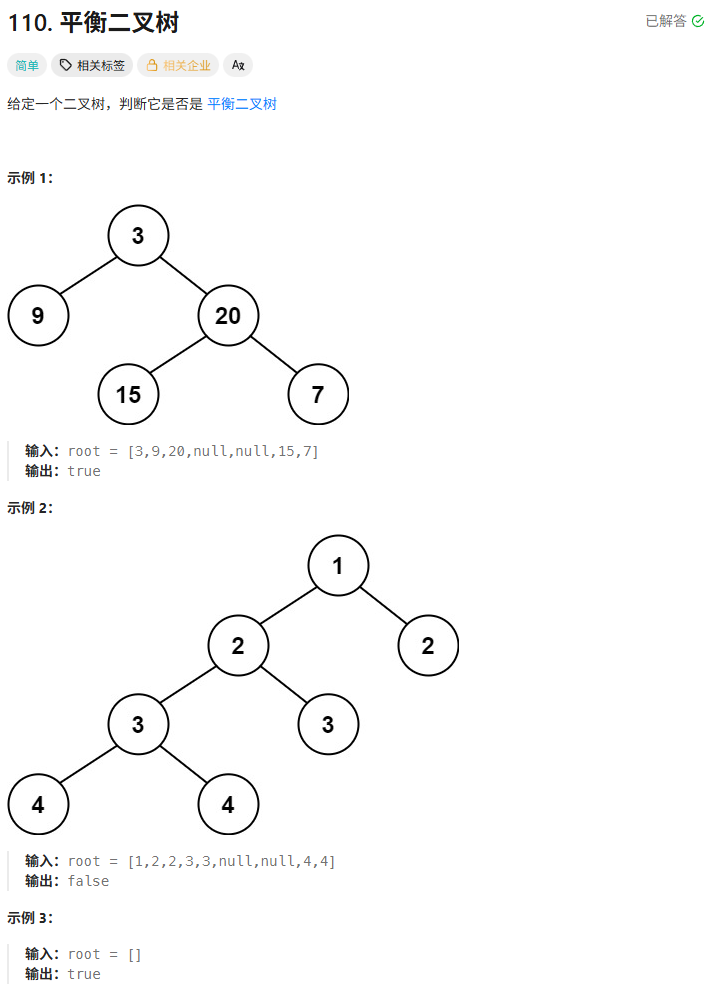
时间69.63%，空间39.01%
```
class Solution {

  

    private boolean res = true;

  

    public boolean isBalanced(TreeNode root) {

        calDepth(root);

        return res;

    }

  

    //返回以当前节点为根节点的树的深度

    private int calDepth(TreeNode root){

        //遍历每个节点

        //比较左右子树深度，如果不满足要求就置res = false

        //满足就把自己的深度返回让上层判断

        if(root == null) return 0;

        int left = calDepth(root.left);

        int right = calDepth(root.right);

        if(Math.abs(left - right) > 1){

            res = false;

        }

        return Math.max(left, right) + 1;

    }

}
```
### 257.二叉树的所有路径
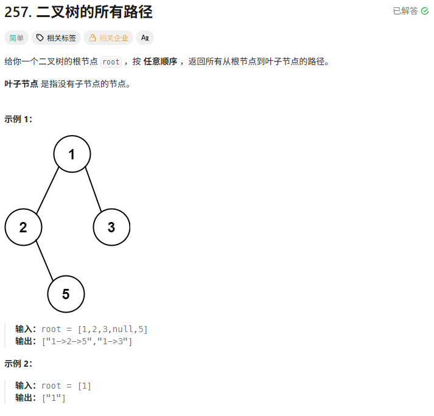
时间65.33%，空间50.32%
```java
class Solution {

    public List<String> binaryTreePaths(TreeNode root) {

        List<String> res = new ArrayList<>();

        dfs(root, new ArrayList<>(), res);

        return res;

    }
  
  

    //这题的思路很简单，就是边遍历边记住走过的节点，然后到叶子节点就把当前的路径加到res里

    //不过中间处理记住节点的地方有很多可以改进的

    //一种是边走边拼接，拼接的时候借助StringBuilder，略快一点

    //一种是搞一个List<Integer> Path来记住走过的节点，到叶子节点了统一拼接字符串然后加到res里

    private void dfs(TreeNode root, List<Integer> path, List<String> res){

        if(root == null) return;

        path.add(root.val);

        if(root.left == null && root.right == null){

            StringBuilder sb = new StringBuilder();

            for(int i = 0;i < path.size() - 1;i++){

                sb.append(path.get(i));

                sb.append("->");

            }

            sb.append(path.get(path.size() - 1));

            res.add(sb.toString());

        }else{

            dfs(root.left, path, res);

            dfs(root.right, path, res);

        }

        path.remove(path.size() - 1);

    }
  
}
```
### 404.左叶子之和
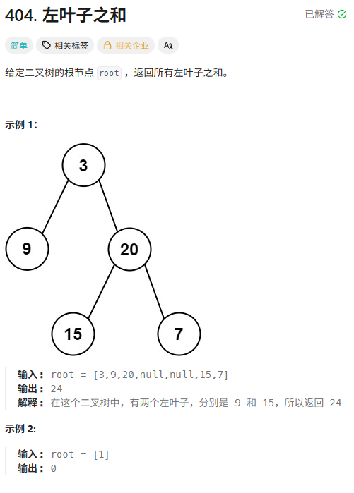
时间100.00%，空间5.03%
```java
class Solution {

    public int sumOfLeftLeaves(TreeNode root) {

        if(root == null) return 0;

        //一个数的左叶子之和 = 左子树左叶子之和/左叶子的值 + 右子树叶子之和

        int sum = 0;

        if(root.left != null && root.left.left == null &&root.left.right == null){

            sum += root.left.val;

        }

        sum += sumOfLeftLeaves(root.left);

        sum += sumOfLeftLeaves(root.right);

        return sum;

    }

}
```
### 513.找树左下角的值
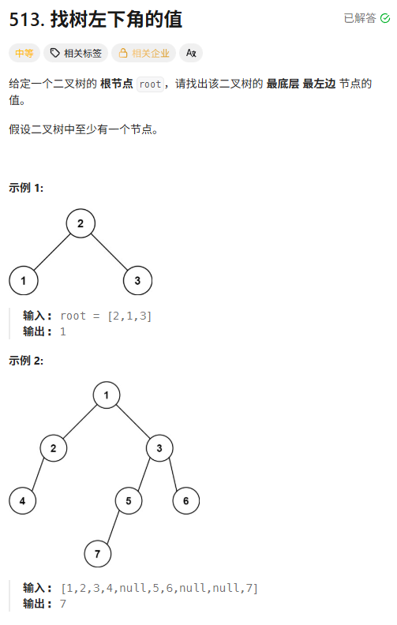
时间16.35%，空间54.58%
```java
class Solution {

    public int findBottomLeftValue(TreeNode root) {

        //左右逆一下的层序遍历，最后一个节点就是所求

        Queue<TreeNode> queue = new LinkedList<>();

        queue.offer(root);

        while(!queue.isEmpty()){

            int n = queue.size();

            for(int i = 0;i < n;i++){

                TreeNode node = queue.poll();

                if(n == 1){

                    if(node.left == null && node.right == null){

                        return node.val;

                    }

                }

                if(node.right != null){

                    queue.offer(node.right);

                }

                if(node.left != null){

                    queue.offer(node.left);

                }

                if(i == n - 1 && queue.isEmpty()){

                    return node.val;

                }

            }

        }

        return -1;

    }

}
```
在判断是否是最后一个节点上在每次循环都用了2个if，有点低效了，用一个变量记住当前节点的值就好了，然后遍历完返回就行。
时间58.81%，空间65.10%
```java
class Solution {

    public int findBottomLeftValue(TreeNode root) {

        //左右逆一下的层序遍历，最后一个节点就是所求

        Queue<TreeNode> queue = new LinkedList<>();

        queue.offer(root);

        int res = -1;

        while(!queue.isEmpty()){

            int n = queue.size();

            for(int i = 0;i < n;i++){

                TreeNode node = queue.poll();

                if(node.right != null){

                    queue.offer(node.right);

                }

                if(node.left != null){

                    queue.offer(node.left);

                }

                res = node.val;

            }

        }

        return res;

    }

}
```
用dfs好像更快啊，不过时间复杂度是一样的（空间复杂度也是一样的）
时间98.76%，空间13.71%
```java
class Solution {

  

    private int maxDepth = 0;

    private int res = 0;

  

    public int findBottomLeftValue(TreeNode root) {

        //用dfs一直往左下，到最深一层时更新一下记录的值，遍历完返回就行了

        dfs(root, 1);

        return res;

    }

    private void dfs(TreeNode root, int depth){

        if(root == null) return;

        if(depth > maxDepth){

            res = root.val;

            maxDepth = depth;

        }

        dfs(root.left, depth + 1);

        dfs(root.right, depth + 1);

    }

}
```
### 112.路径总和
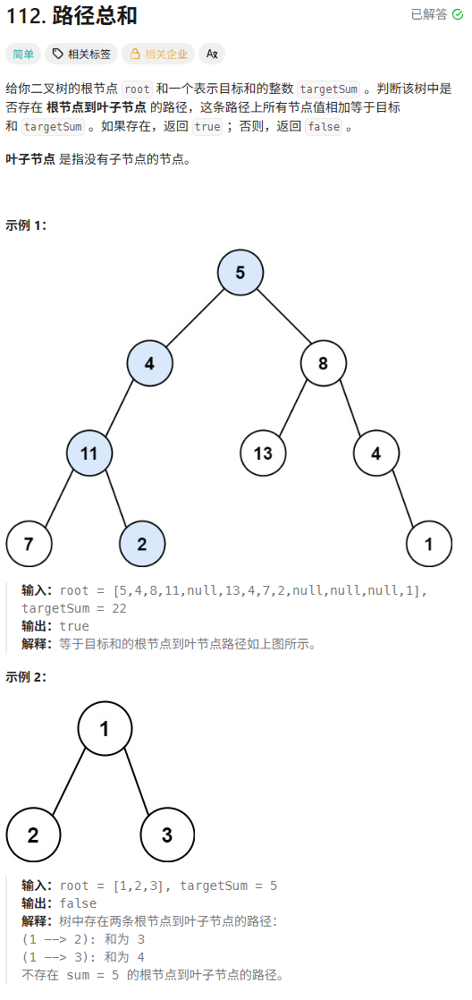
时间100.00%，空间7.81%
```java
class Solution {

    public boolean hasPathSum(TreeNode root, int targetSum) {

        return dfs(root, targetSum, 0);

    }

  

    private boolean dfs(TreeNode root, int targetSum, int pathSum){

        if(root == null) return false;

        pathSum += root.val;

        if(pathSum == targetSum && root.left == null && root.right == null) return true;

        return dfs(root.left, targetSum, pathSum) || dfs(root.right, targetSum, pathSum);

    }

}
```
### 106.从中序遍历与后序遍历序列构造二叉树
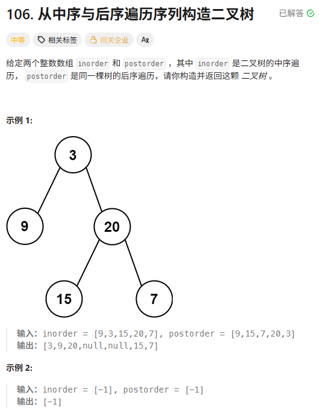
时间98.36%，空间21.74%
```java
class Solution {

    public TreeNode buildTree(int[] inorder, int[] postorder) {

        //中序 左根右  后序 左右根

        //根据后序遍历的最后一个可以找到根节点

        //根据这个根节点在中序遍历中的位置可以确定出左子树和右子树

        Map<Integer, Integer> queryRootIndex = new HashMap<>();

        int n = inorder.length;

        for(int i = 0;i < n;i++){

            queryRootIndex.put(inorder[i], i);

        }

        return buildTreeInRange(inorder, 0, n - 1, postorder, 0, n - 1, queryRootIndex);

    }

  

    private TreeNode buildTreeInRange(int[] inorder, int iBegin, int iEnd,

    int[] postorder, int pBegin, int pEnd, Map<Integer, Integer> queryRootIndex){

        if(iBegin > iEnd || pBegin > pEnd) return null;

        int rootVal = postorder[pEnd];

        int rootIndexIninorder = queryRootIndex.get(rootVal);

        TreeNode root = new TreeNode(rootVal);

        int leftLength = rootIndexIninorder - iBegin;

        int rightLength = iEnd - rootIndexIninorder;

        root.left = buildTreeInRange(inorder, iBegin, rootIndexIninorder - 1, postorder, pBegin, pBegin + leftLength - 1, queryRootIndex);

        root.right = buildTreeInRange(inorder, rootIndexIninorder + 1, iEnd,

        postorder, pBegin + leftLength, pBegin + leftLength + rightLength - 1, queryRootIndex);

        return root;

    }

}
```
### 654.最大二叉树
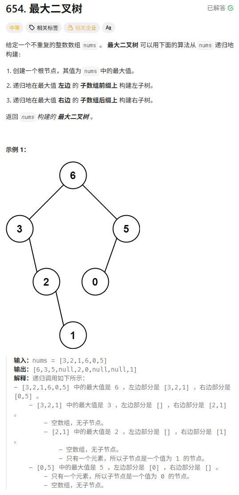
时间99.58%，空间5.07%
```java
class Solution {

    public TreeNode constructMaximumBinaryTree(int[] nums) {

        return constructTreeInRange(nums, 0, nums.length - 1);

    }

  

    private TreeNode constructTreeInRange(int[] nums, int begin, int end){

        if(begin > end) return null;

        int maxIndex = 0;

        int maxValue = -1;

        for(int i = begin;i <= end;i++){

            if(nums[i] > maxValue){

                maxValue = nums[i];

                maxIndex = i;

            }

        }

        TreeNode root = new TreeNode(maxValue);

        root.left = constructTreeInRange(nums, begin, maxIndex - 1);

        root.right = constructTreeInRange(nums, maxIndex + 1, end);

        return root;

    }

}
```
### 617.合并二叉树
见hot100
### 700.二叉搜索树中的搜索
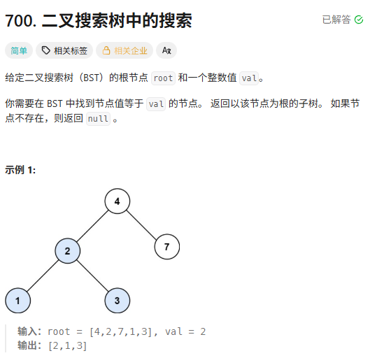
时间100.00%，空间40.86%
```java
class Solution {

  

    TreeNode res = null;

  

    public TreeNode searchBST(TreeNode root, int val) {

        //知道二叉搜索树，比当前节点小的在左子树，大的在右子树就行

        dfs(root, val);

        return res;

    }

  

    private void dfs(TreeNode root, int val){

        if(root == null) return;

        if(root.val == val){

            res = root;

            return;

        }else if(val < root.val) dfs(root.left, val);

        else dfs(root.right, val);

    }

}
```
### 98.验证二叉搜索树
见hot100
### 530.二叉搜索树的最小绝对差
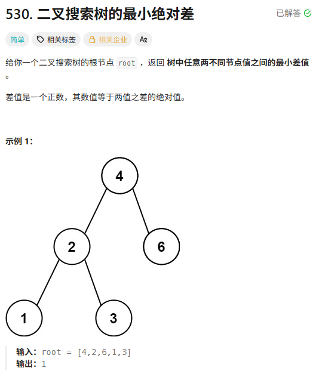
时间100.00%，空间8.38%
```java
class Solution {

  

    private int prev = -1;

    private int res = Integer.MAX_VALUE;

  

    public int getMinimumDifference(TreeNode root) {

        //二叉搜索树的中序遍历就是升序遍历，最小绝对差一定出现在两两之间嘛

        //边遍历边统计就行了

        dfs(root);

        return res;

    }

  

    private void dfs(TreeNode root){

        if(root == null) return;

        dfs(root.left);

        if(prev != -1) res = Math.min(root.val - prev, res);

        prev = root.val;

        dfs(root.right);

    }

}
```
### 501.二叉搜索树中的众数
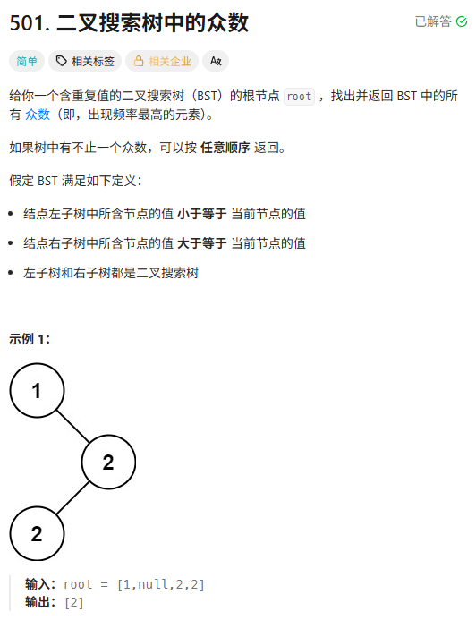
纯暴力，时间24.05%，空间65.97%
```java
class Solution {

    private int max = 0;

  

    public int[] findMode(TreeNode root) {

        //暴力：用HashMap统计出各个数出现次数和最大次数，再遍历一遍HashMap得到结果

        HashMap<Integer, Integer> count = new HashMap<>();

        count(root, count);

        List<Integer> resList = new ArrayList<>();

        count.forEach((k, v) ->{

            if(v == max){

                resList.add(k);

            }

        });

        int n = resList.size();

        int[] res = new int[n];

        for(int i = 0;i < n;i++){

            res[i] = resList.get(i);

        }

        return res;

    }

  

    private void count(TreeNode root, HashMap<Integer, Integer> count){

        if(root == null) return;

        int nowCount = count.getOrDefault(root.val, 0) + 1;

        max = Math.max(nowCount, max);

        count.put(root.val, nowCount);

        count(root.left, count);

        count(root.right, count);

    }

}
```
优化了一下，时间100.00%，空间15.16%
```java
class Solution {

    private List<Integer> resList;

    private int maxCount;

    private int prev = Integer.MAX_VALUE;

    private int count;

  

    public int[] findMode(TreeNode root) {

        //还是中序遍历（小->大）边遍历边统计当前数的出现次数

        //通过prev记住前面出现的数，如果和prev不一样就是出现新的数了嘛

        //prev如果出现次数等于当前最大值，就把它添加到resList里面去

        //如果大于，那么更新最大值，清空resList再放进去

        resList = new ArrayList<>();

        maxCount = 0;

        count = 0;

        dfs(root);

        if(count == maxCount) resList.add(prev);

        else if(count > maxCount){

            resList = new ArrayList<>();

            maxCount = count;

            resList.add(prev);

        }

        int n = resList.size();

        int[] res = new int[n];

        for(int i = 0;i < resList.size();i++){

            res[i] = resList.get(i);

        }

        return res;

    }

  

    private void dfs(TreeNode root){

        if(root == null) return;

        dfs(root.left);

        if(root.val != prev){

            if(count == maxCount) resList.add(prev);

            else if(count > maxCount){

                resList = new ArrayList<>();

                maxCount = count;

                resList.add(prev);

            }

            count = 1;

            prev = root.val;

        }else{

            count++;

        }

        dfs(root.right);

    }

}
```
### 236.二叉树的最近公共祖先
见hot100
### 235.二叉搜索树的最近公共祖先
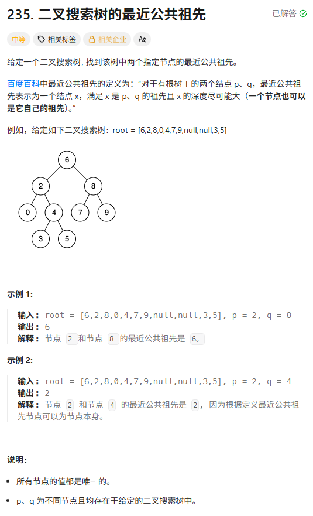
时间100.00%，空间9.57%
```java
class Solution {

  

    TreeNode res = null;

  

    public TreeNode lowestCommonAncestor(TreeNode root, TreeNode p, TreeNode q) {

        flag(root, p, q);

        return res;

    }

  

    //返回自己是否是其中一个节点的祖先

    //那么如果两个子节点都是某个节点的公共祖先/一个子节点 + 自己是另外一个节点

    //那么它就是最近公共祖先

    //此外还要用上二叉搜索树的性质

    private boolean flag(TreeNode root, TreeNode p, TreeNode q){

        if(root == null) return false;

        if(res != null) return false;

        if(p.val < root.val && q.val < root.val){

            return flag(root.left,  p, q);

        }else if(p.val > root.val && q.val > root.val){

            return flag(root.right,  p, q);

        }else{

            boolean left = flag(root.left,  p, q);

            boolean right = flag(root.right, p, q);

            if((left && right) ||((left || right) && (root == p || root == q))){

                res = root;

            }

            return left || right || root == p || root == q;

        }

    }

}
```
### 701.二叉搜索树中的插入操作
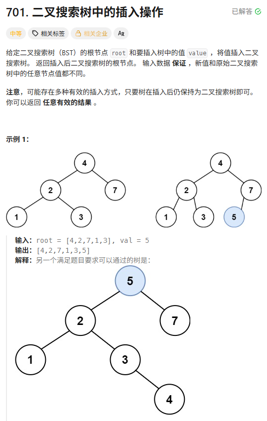
时间100.00%，空间55.39%
```java
class Solution {

    public TreeNode insertIntoBST(TreeNode root, int val) {

        //插入方式为：插入到符合的叶子节点中

        //如果val比当前节点的值小，那么它应该插入到左子树中

        //递归的调用insertIntoBST，比当前节点的值大也是相应的

        //如果当前节点为空，那么这个就是属于它的位置

        if(root == null) return new TreeNode(val);

        if(val < root.val) root.left = insertIntoBST(root.left, val);

        else root.right = insertIntoBST(root.right, val);

        return root;

    }

}
```
### 450.删除二叉搜索树中的节点
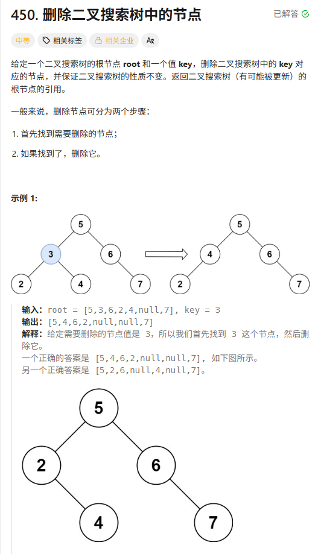
时间100.00%，空间33.58%
```java
class Solution {

    public TreeNode deleteNode(TreeNode root, int key) {

        //删除一个节点后，把它的左节点接到右节点的左边

        //或者把右节点接到左节点的右边，不过也得找个合适的地方插入

        //至于怎么找和701.二叉搜索树中的插入操作一样

        if(root == null) return null;

        if(key < root.val) root.left = deleteNode(root.left, key);

        else if(key > root.val) root.right = deleteNode(root.right, key);

        else{

            if(root.left == null) return root.right;

            if(root.right == null) return root.left;

            return insertIntoBST(root.left, root.right);

        }

        return root;

    }

    private TreeNode insertIntoBST(TreeNode root, TreeNode toBeInsert){

        if(root == null) return toBeInsert;

        if(toBeInsert.val < root.val) root.left = insertIntoBST(root.left, toBeInsert);

        else root.right = insertIntoBST(root.right, toBeInsert);

        return root;

    }

}
```
### 669.修剪二叉搜索树
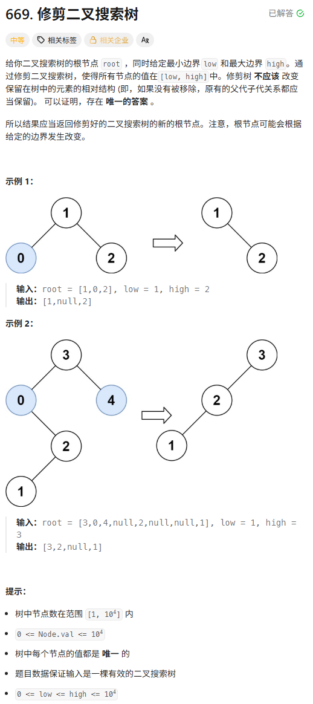
时间100.00%，空间26.17%
```java
class Solution {

    public TreeNode trimBST(TreeNode root, int low, int high) {

        //遇到一个该删的节点类似450删了就行

        if(root == null) return null;

        root.left = trimBST(root.left, low, high);

        root.right = trimBST(root.right, low, high);

        if(root.val < low || root.val > high){

            if(root.left == null) return root.right;

            if(root.right == null) return root.left;

            return insertIntoBST(root.left, root.right);

        }

        return root;

    }

  

    private TreeNode insertIntoBST(TreeNode root, TreeNode toBeInsert){

        if(root == null) return toBeInsert;

        if(toBeInsert.val < root.val) root.left = insertIntoBST(root.left, toBeInsert);

        else root.right = insertIntoBST(root.right, toBeInsert);

        return root;

    }

}
```
### 108.将有序数组转换为二叉搜索树
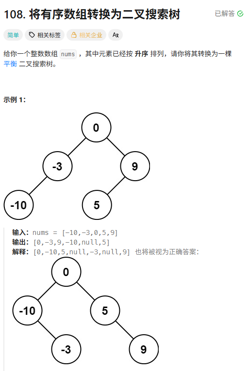
时间100.00%，空间53.72%
```java
class Solution {

    public TreeNode sortedArrayToBST(int[] nums) {

        //其实都没有在意实现这个平衡，这样写就实现了

        //应该和root的取法有关？尽量取在中间

        //两边的节点数尽量的平均，就可以达到平衡了？

        return sortedArrayToBSTInRange(nums, 0, nums.length - 1);

    }

  

    private TreeNode sortedArrayToBSTInRange(int[] nums, int begin, int end){

        if(begin == end) return new TreeNode(nums[begin]);

        if(begin > end) return null;

        int mid = (begin + end) / 2;

        TreeNode root = new TreeNode(nums[mid]);

        root.left = sortedArrayToBSTInRange(nums, begin, mid - 1);

        root.right = sortedArrayToBSTInRange(nums, mid + 1, end);

        return root;

    }

}
```
### 538.把二叉搜索树转换为累加树
见hot100
## 回溯算法
### 理论基础
回溯是递归的副产品，只要有递归就会有回溯。
回溯并不是什么高效的算法，本质是穷举，穷举所有可能，然后选出想要的答案。
回溯法一般可以解决如下几种问题：
	组合问题：N个数里面按一定规则找出k个数的集合
	切割问题：一个字符串按一定规则有几种切割方式
	子集问题：一个N个数的集合里有多少符合条件的子集
	排列问题：N个数按一定规则全排列，有几种排列方式
	棋盘问题：N皇后，解数独等等
组合无序，排列有序
回溯法解决的问题都可以抽象为树形结构，回溯法解决的都是在集合中递归查找子集，集合的大小就构成了树的宽度，递归的深度就构成了树的深度。递归就要有终止条件，所以必然是一颗高度有限的树（N叉树）。
回溯三部曲：
	回溯函数模版返回值以及参数：返回值一般为void，参数边写边确定
	回溯函数终止条件：找到一种组合or当前组合中的数已经不满足要求了
	回溯搜索的遍历过程
	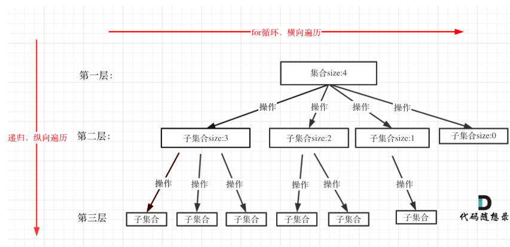
回溯算法模版框架
```
void backtracking(参数) {
    if (终止条件) {
        存放结果;
        return;
    }

    for (选择：本层集合中元素（树中节点孩子的数量就是集合的大小）) {
        处理节点;
        backtracking(路径，选择列表); // 递归
        回溯，撤销处理结果
    }
}
```
### 77.组合
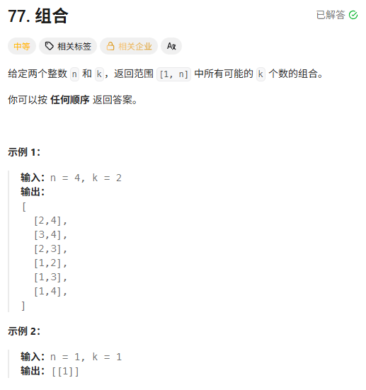
时间51.71%，空间20.08%
```java
class Solution {

  

    private List<List<Integer>> res;

  

    public List<List<Integer>> combine(int n, int k) {

        res = new ArrayList<>();

        backTracking(n, k, new ArrayList<>(), 1);

        return res;

    }

  

    private void backTracking(int n, int k, List<Integer> temp, int begin){

        if(temp.size() == k){

            res.add(new ArrayList<>(temp));

            return;

        }

        for(int i = begin;i <= n;i++){

            temp.add(i);

            backTracking(n, k, temp, i + 1);

            temp.remove(temp.size() - 1);

        }

    }

}
```
是可以通过剪枝优化的，时间94.35%，空间54.38%
```java
class Solution {

  

    private List<List<Integer>> res;

  

    public List<List<Integer>> combine(int n, int k) {

        res = new ArrayList<>();

        backTracking(n, k, new ArrayList<>(), 1);

        return res;

    }

  

    private void backTracking(int n, int k, List<Integer> temp, int begin){

        int size = temp.size();

        if(size == k){

            res.add(new ArrayList<>(temp));

            return;

        }

        //剪枝优化，当前层之后还需要的元素个数为k - size - 1

        //然后这里有个begin嘛，每次会限制后续数的选择空间

        //如果后续都没有k - size - 1这么多元素可选，就没必要再继续了

        //后续元素个数 = n - i

        //应该有n - i >= k - size - 1

        //得i <= n - k + size + 1

        for(int i = begin;i <= n - k + size + 1;i++){

            temp.add(i);

            backTracking(n, k, temp, i + 1);

            temp.remove(temp.size() - 1);

        }

    }

}
```
### 216.组合总和III
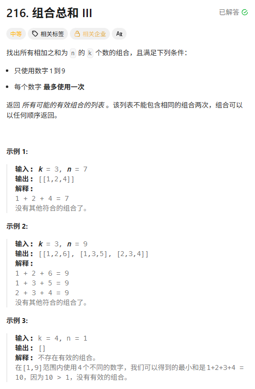
时间100.00%，空间35.55%
```java
class Solution {

  

    List<List<Integer>> res;

  

    public List<List<Integer>> combinationSum3(int k, int n) {

        res = new ArrayList<>();

        find(k, n, new ArrayList<>(), 0, 1);

        return res;

    }

  

    private void find(int k, int n, List<Integer> temp, int sum, int begin){

        int size = temp.size();

        if(sum == n && size == k){

            res.add(new ArrayList<>(temp));

            return;

        }

        if(size >= k) return;

        //包括当前还要找k - size个数，后面的数肯定都大于i的

        //那么应该有(k - size) * i <= n - sum

        //得i < (n - sum) / (k - size) && i <= 9

        for(int i = begin;i <= (n - sum) / (k - size) && i <= 9;i++){

            temp.add(i);

            find(k, n, temp, sum + i, i + 1);

            temp.remove(size);

        }

    }

}
```
### 17.电话号码的字母组合
见hot100
### 39.组合总和
见hot100
### 40.组合总和II
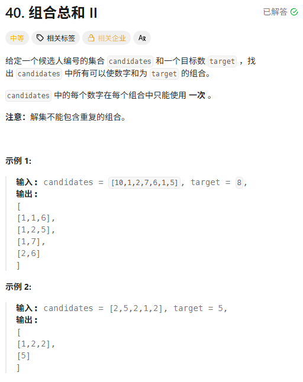
时间80.71%，空间46.03%
```java
class Solution {

  

    List<List<Integer>> res;

  

    public List<List<Integer>> combinationSum2(int[] candidates, int target) {

        res = new ArrayList<>();

        Arrays.sort(candidates);

        backTracking(candidates, target, new ArrayList<>(), 0, 0);

        return res;

    }

  

    private void backTracking(int[] candidates, int target, List<Integer> temp,

     int begin, int sum){

        if(sum == target){

            res.add(new ArrayList<>(temp));

            return;

        }

        for(int i = begin;i < candidates.length;i++){

            if(sum + candidates[i] > target) break;

            //元素不能重复使用，用begin这个变量可以做到

            //但是由于candidates中有相同的元素，如果同层使用多次相同的元素

            //这时候其实只要取同层的相同元素的第一个的结果就好了，后续可以跳过

            //同层后续的结果一定是第一个的真子集的

            //然后注意要是i > begin而不是i > 0不然会把当前层第一个给跳过了后面的时候

            if(i > begin && candidates[i] == candidates[i - 1]) continue;

            temp.add(candidates[i]);

            backTracking(candidates, target, temp, i + 1, sum + candidates[i]);

            temp.remove(temp.size() - 1);

        }

    }

}
```
### ★★★131.分割回文串
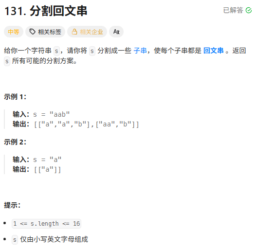

基本思路，时间25.82%，空间13.33%
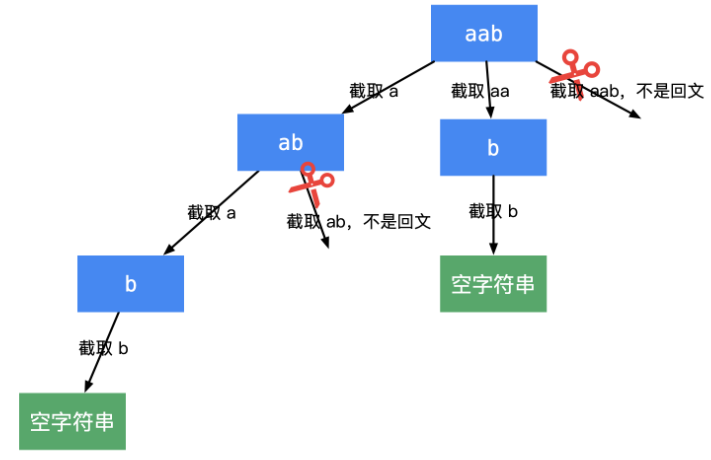
```java
class Solution {

  

    List<List<String>> res;

  

    public List<List<String>> partition(String s) {

        res = new ArrayList<>();

        backTracking(s, new ArrayList<>());

        return res;

    }

  

    //每次对当前字符串进行所有可能的裁剪，看裁剪出来的部分是不是回文串

    //是的话，就继续对剩余子串进行裁剪，能裁到空就是找到一种组合了

    //这里是带有一点剪枝的

    private void backTracking(String s, List<String> temp){

        if(s.isEmpty()){

            res.add(new ArrayList<>(temp));

            return;

        }

        int length = s.length();

        for(int i = 1;i <= length;i++){

            if(!judge(s.substring(0, i))) continue;

            temp.add(s.substring(0, i));

            backTracking(s.substring(i, length), temp);

            temp.remove(temp.size() - 1);

        }

    }  

  

    //判断一个字符串是否是回文串

    private boolean judge(String s){

        int left = 0;

        int right = s.length() - 1;

        while(left <= right){

            if(s.charAt(left) != s.charAt(right)) return false;

            left++;

            right--;

        }

        return true;

    }

}
```
优化，判断所有子串是不是回文串可以用动态规划先提前判断好，其他相应的还要改一下代码
时间87.56%，空间56.64%
```java
class Solution {

  

    List<List<String>> res;

  

    public List<List<String>> partition(String s) {

        res = new ArrayList<>();

        int length = s.length();

        //dp[i][j]表示s中第i个字符到第j个字符是否为回文串

        boolean[][] dp = new boolean[length][length];

        //通过中心扩展法来计算dp中的值

        for(int i = 0;i < 2 * length;i++){

            int left = i / 2;

            int right = left + i % 2;

            while(left >= 0 && right < length && s.charAt(left) == s.charAt(right)){

                dp[left][right] = true;

                left--;

                right++;

            }

        }

        backTracking(s, new ArrayList<>(), 0, dp);

        return res;

    }

  

    //每次对当前字符串进行所有可能的裁剪，看裁剪出来的部分是不是回文串

    //是的话，就继续对剩余子串进行裁剪，能裁到空就是找到一种组合了

    //这里是带有一点剪枝的

    //param begin代表当前子串的开头字符索引

    private void backTracking(String s, List<String> temp, int begin, boolean[][] dp){

        if(begin == s.length()){

            res.add(new ArrayList<>(temp));

            return;

        }

        int length = s.length();

        for(int i = begin;i < length;i++){

            //i为裁剪的末尾字符索引

            if(!dp[begin][i]) continue;

            temp.add(s.substring(begin, i + 1));

            backTracking(s, temp, i + 1, dp);

            temp.remove(temp.size() - 1);

        }

    }  

}
```
### 93.复原IP地址
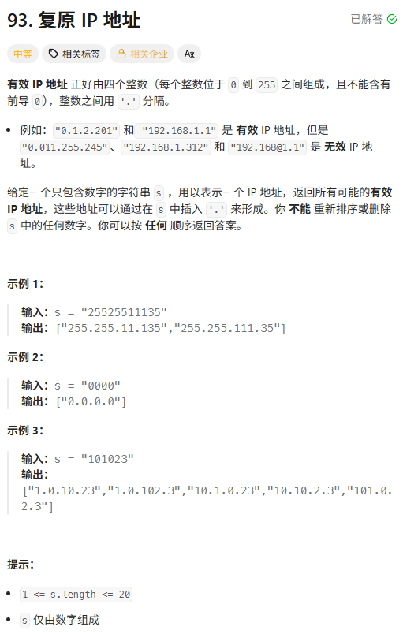
暴力，时间5.76%，空间5.04%
```java
class Solution {

  

    private List<String> res;

  

    public List<String> restoreIpAddresses(String s) {

        res = new ArrayList<>();

        backTracking(s, new ArrayList<>(), 0);

        return res;

    }

  

    private void backTracking(String s, List<String> temp, int begin){

        if(temp.size() == 4 && begin == s.length()){

            combineAndPut(temp);

            return;

        }

        String now = new String();

        //在每一层尝试各种可能的分割：取后面1位，2位或者3位

        for(int i = begin;i < begin + 3 && i < s.length();i++){

            now += s.charAt(i);

            //如果3位了要看看是否小于255

            if(now.length() == 3 && !judge(now)) break;

            temp.add(now);

            backTracking(s, temp, i + 1);

            temp.remove(temp.size() - 1);

            //如果第一位是0，后面就不用再取了，因为不能有前导0

            if(now.length() == 1 && now.charAt(0) == '0') break;

        }

    }

  

    private void combineAndPut(List<String> temp){

        StringBuilder sb = new StringBuilder();

        for(int i = 0;i < 3;i++){

            sb.append(temp.get(i));

            sb.append(".");

        }

        sb.append(temp.get(3));

        res.add(sb.toString());

    }

  

    private boolean judge(String s){

        int num = 0;

        for(int i = 0;i < 3;i++){

            num += (s.charAt(i) - '0') * Math.pow(10, 2 - i);

        }

        return num <= 255;

    }

}
```
稍微优化了一下，时间35.26%，空间10.35%
```java
class Solution {

  

    List<String> res;

  

    public List<String> restoreIpAddresses(String s) {

        int length = s.length();

        res = new ArrayList<>();

        //如果数字个数小于4或者大于12，都无法构成合法的IP段，直接return个空

        if(length < 4 || length > 12) return res;

        backTracking(s, new ArrayList<>(), 0);

        return res;

    }  

  

    private void backTracking(String s, List<String> temp, int begin){

        int n = s.length();

        //找到四个字符串了就可以return了

        if(temp.size() == 4){

            if(begin == n){

                //如果字符全部用完了，那么这就是一个正确的结果了，放入res中

                combineAndPut(temp);

                return;

            } else return;

        }

        //每一个节点截取的方法只有3种，截1/2/3位

        String now = new String();

        for(int i = begin;i < begin + 3 && i < n;i++){

            //第一位是0后面就不能加东西了

            if(i > begin && s.charAt(begin) == '0') break;

            //剩余位数太少了就break了

            if(n - i - 1 < (4 - temp.size() - 1)) break;

            now += s.charAt(i);

            //剩余位数太多了就continue，给当前多安排几位

            if(n - i - 1 > (4 - temp.size() - 1) * 3) continue;

            //3位了要看看是否小于等于255

            if(i == begin + 2 && judge(now)) break;

            temp.add(now);

            backTracking(s, temp, i + 1);

            temp.remove(temp.size() - 1);

        }

    }

  

    private void combineAndPut(List<String> temp){

        StringBuilder sb = new StringBuilder();

        for(int i = 0;i < 3;i++){

            sb.append(temp.get(i));

            sb.append(".");

        }

        sb.append(temp.get(3));

        res.add(sb.toString());

    }

  

    //判断三位字符串是否合法，不合法返回true，合法返回false

    private boolean judge(String sb){

        return sb.charAt(0) > '2' || (sb.charAt(0) == '2' && sb.charAt(1) > '5')

        || (sb.charAt(0) == '2' && sb.charAt(1) == '5' && sb.charAt(2) > '5');

    }

}
```
### 78.子集
见hot100
无序就用begin，每次从begin开始。有序用flag标识一下，没用过的都可以，然后从0开始。
### 90.子集II
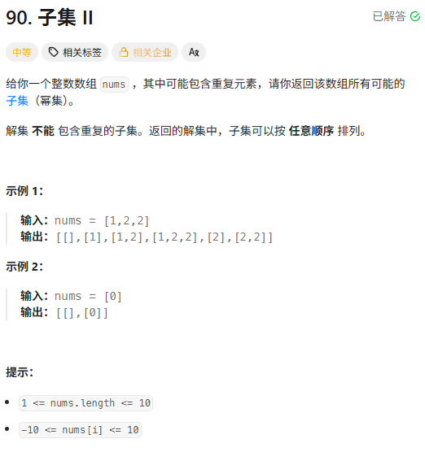
时间85.94%，空间40.82%
```java
class Solution {

  

    private List<List<Integer>> res;

  

    public List<List<Integer>> subsetsWithDup(int[] nums) {

        // 和子集的区别就是其中可能包含重复元素，那么就不只要从begin开始

        // 还要把前面相同的有的给跳过。why？同样位置后面再取重复的元素一定是

        // 前面取这个元素的子集，前面都多一个相同元素可以选了嘛。

        Arrays.sort(nums);

        res = new ArrayList<>();

        res.add(new ArrayList<>());// 加入空集

        backTracking(0, new ArrayList<>(), nums);

        return res;

    }

  

    private void backTracking(int begin, List<Integer> temp, int[] nums){

        for(int i = begin;i < nums.length;i++){

            if(i > begin && nums[i] == nums[i - 1]) continue;

            temp.add(nums[i]);

            res.add(new ArrayList<>(temp));

            backTracking(i + 1, temp, nums);

            temp.remove(temp.size() - 1);

        }

    }

}
```
### 491.非递减子序列
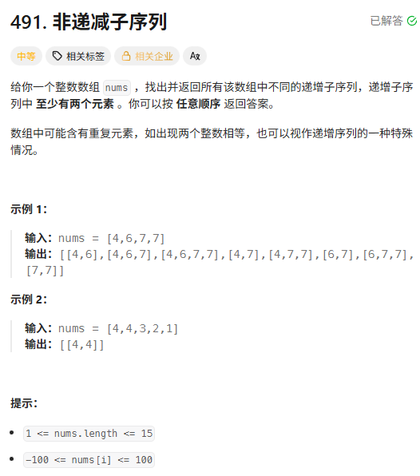
时间90.66%，空间44.18%
```java
class Solution {

  

    List<List<Integer>> res;

  

    public List<List<Integer>> findSubsequences(int[] nums) {

        // 每轮放进来一个数，然后找以当前数为始的非递减子序列

        // 也要用上begin，因为要找子序列不能找前面的数

        // 然后除了begin之外，同层也要把后面的相同的数给跳过了

        // 这里因为不能排序，不能通过和前面相等来跳过

        // 只能通过哈希表来判断当前数是否使用过

        // 后面的只要大于等于前一个数就行了

        res = new ArrayList<>();

        backTracking(nums, 0, new ArrayList<>(), -101);

        return res;

    }

  

    private void backTracking(int[] nums, int begin, List<Integer> temp, int band){

        Set<Integer> tool = new HashSet<>();

        for(int i = begin;i < nums.length;i++){

            if(tool.contains(nums[i]) || nums[i] < band)continue;

            tool.add(nums[i]);

            temp.add(nums[i]);

            if(temp.size() > 1) res.add(new ArrayList<>(temp));

            backTracking(nums, i + 1, temp, nums[i]);

            temp.remove(temp.size() - 1);

        }

    }

}
```
### 46. 全排列
见hot100
### 47.全排列II
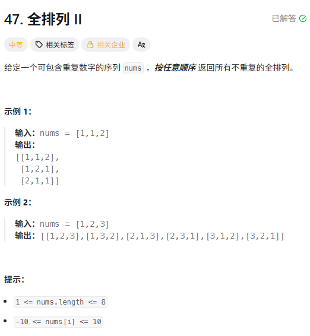
时间80.51%，空间62.81%
```java
class Solution {

  

    private List<List<Integer>> res;

  

    public List<List<Integer>> permuteUnique(int[] nums) {

        // 全排列的过程中去重一下就是，怎么去重呢

        // 同层后面的和前面相同的元素不用放

        Arrays.sort(nums);

        res = new ArrayList<>();

        backTrackging(nums, new ArrayList<>(), 0);

        return res;

    }

  

    private void backTrackging(int[] nums, List<Integer> temp, int length){

        if(length == nums.length){

            res.add(new ArrayList<>(temp));

            return;

        }

        for(int i = 0;i < nums.length;i++){

            if(i > 0 && nums[i] == nums[i - 1]) continue;

            if(nums[i] == -11) continue;

            temp.add(nums[i]);

            int tempInt = nums[i];

            nums[i] = -11;

            backTrackging(nums, temp, length + 1);

            nums[i] = tempInt;

            temp.remove(temp.size() - 1);

        }

    }

}
```
### N皇后
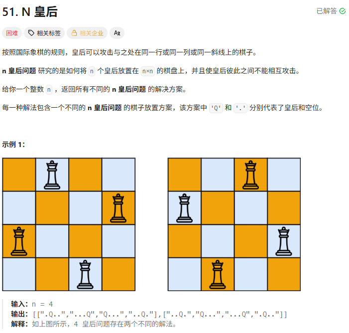
时间52.23%，空间96.41%
```java
class Solution {

    private List<int[]> tool; // 用来记住各种摆放方式/pos n个一组

  

    public List<List<String>> solveNQueens(int n) {

        tool = new ArrayList<>();

        backTracking(n, 0, new int[n]);

        List<List<String>> res = new ArrayList<>();

        char[] tempCharArray = new char[n]; // 用来存放每一行的摆法

        // 初始化为全. "...." 到时候Q选个位置放进去就好了

        for(int i = 0;i < n;i++){

            tempCharArray[i] = '.';

        }

        for(int[] nums : tool){

            List<String> tempList = new ArrayList<>();

            for(int i = 0;i < n;i++){

                tempCharArray[nums[i]] = 'Q';

                tempList.add(new String(tempCharArray));

                tempCharArray[nums[i]] = '.';

            }

            res.add(tempList);

        }

        return res;

    }

  

    // n -> 个数n,,count -> 放好的皇后数,pos -> 用来记住一轮中n个皇后的位置

    private void backTracking(int n, int count, int[] pos){

        // 放好了全部皇后

        if (count == n) {

            tool.add(Arrays.copyOf(pos, pos.length));

            return;

        }

        // 一行一行的遍历，每次找到当前行可以放置的位置

        // 当前行肯定不用判断了，没有放，需要判断斜线和当前列

        for(int j = 0;j < n;j++){

            if (judge(n, count, j, pos)) {

                pos[count] = j;

                backTracking(n, count + 1, pos);

            }

        }

    }

  

    private boolean judge(int n, int i, int j, int[] pos){

        // 列

        for(int k = 0;k < i;k++){

            if(pos[k] == j) return false;

        }

        // 斜线:看上n行左右n个位置有没有放

        for(int k = 0;k < i;k++){

            int diff = i - k;

            if(j - diff >= 0 && pos[k] == j - diff) return false;

            if(j + diff < n && pos[k] == j + diff) return false;

        }

        return true;

    }

}
```
### ★★★37.解数独
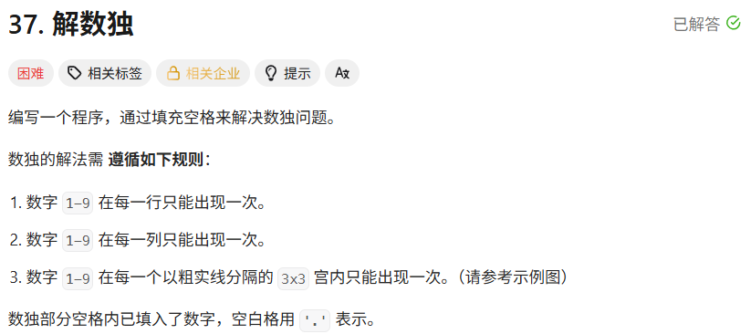
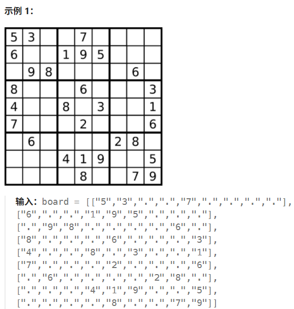
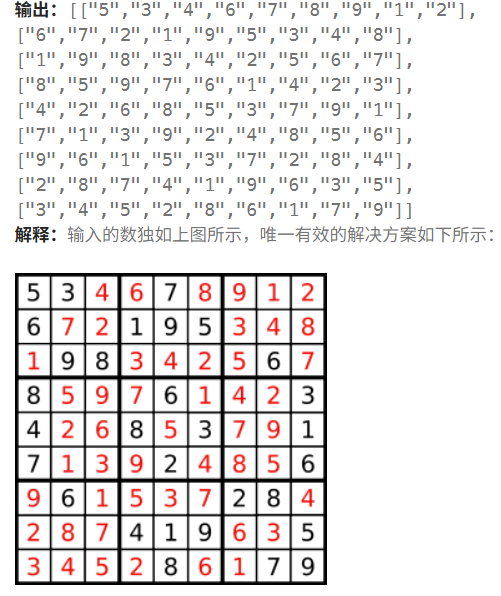
时间69.37%，空间55.68%
```java
class Solution {

    public void solveSudoku(char[][] board) {

        boolean[][] row = new boolean[9][10]; // 标记各行中数字1-9有没有使用过

        boolean[][] column = new boolean[9][10]; // 标记各列中数字1-9有没有使用过

        boolean[][] area = new boolean[9][10]; // 标记各3x3宫内数字1-9有没有使用过

        // 宫格依次编号为

        // 0 1 2

        // 3 4 5

        // 6 7 8

        // 计算方式 行号/3 * 3 + 列号/3

        // 把已经填好的数字标记一下

        for(int i = 0;i < 9;i++){

            for(int j = 0;j < 9;j++){

                if(board[i][j] == '.') continue;

                int num = board[i][j] - '0';

                row[i][num] = true;

                column[j][num] = true;

                area[(i / 3) * 3 + j / 3][num] = true;

            }

        }

        backTracking(board, row, column, area, 0, 0);

    }

  

    // 就是一个大号的回溯，一格格的填、标记，不行了就回退

    private boolean backTracking(char[][] board, boolean[][] row, boolean[][] column, boolean[][] area, int i, int j){

        // i = 9就是找到一种解法了，可以返回true结束了

        if(i == 9) return true;

        // 计算下一格坐标

        int nextJ = (j + 1) % 9;

        int nextI = i + (j == 8 ? 1:0);

        // 之前已经填好了，往下一格走

        if(board[i][j] != '.') return backTracking(board, row, column, area, nextI, nextJ);

        // 尝试填数字

        int areaIndex = (i / 3) * 3 + j / 3;

        for(int k = 1;k <= 9;k++){

            if(row[i][k] || column[j][k] || area[areaIndex][k]) continue;

            board[i][j] = (char) (k + '0');

            row[i][k] = true;

            column[j][k] = true;

            area[areaIndex][k] = true;

            if(backTracking(board, row, column, area, nextI, nextJ)) return true;

            area[areaIndex][k] = false;

            column[j][k] = false;

            row[i][k] = false;

            board[i][j] = '.';

        }

        // 到这说明这个格子填1-9都不行，前面填错了，返回false回溯

        return false;

    }

}
```
## 贪心算法
### 理论基础
通过每轮局部最优 -> 全局最优
例子：有一堆钞票，可以拿走十张，想要达到最大的金额就可以每次都拿当前最大面额的钞票。
如果手动模拟一下感觉可以局部最优推出整体最优，而且想不到反例，那么就试一试贪心。
做题的时候需要考虑的是“局部最优”是怎么样的，如何由局部最优 -> 全局最优。
### 455.分发饼干
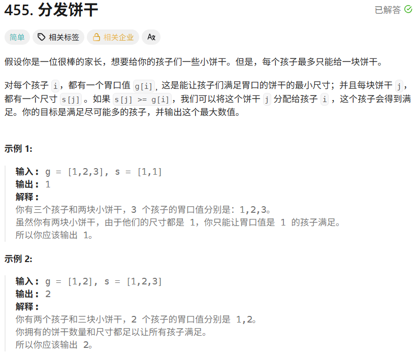
时间99.93%，空间40.38%
```java
class Solution {

    public int findContentChildren(int[] g, int[] s) {

        // 先满足胃口小的孩子，并且用最小尺寸的饼干来满足，由此即可达到最优

        Arrays.sort(g);

        Arrays.sort(s);

        int passed = 0;

        int satisfied = 0;

        while(satisfied < g.length && passed < s.length){

            while(passed < s.length && s[passed] < g[satisfied]){

                passed++;

            }

            if(passed != s.length){

                passed++;

                satisfied++;

            }

        }

        return satisfied;

    }

}
```
### 376.摆动序列
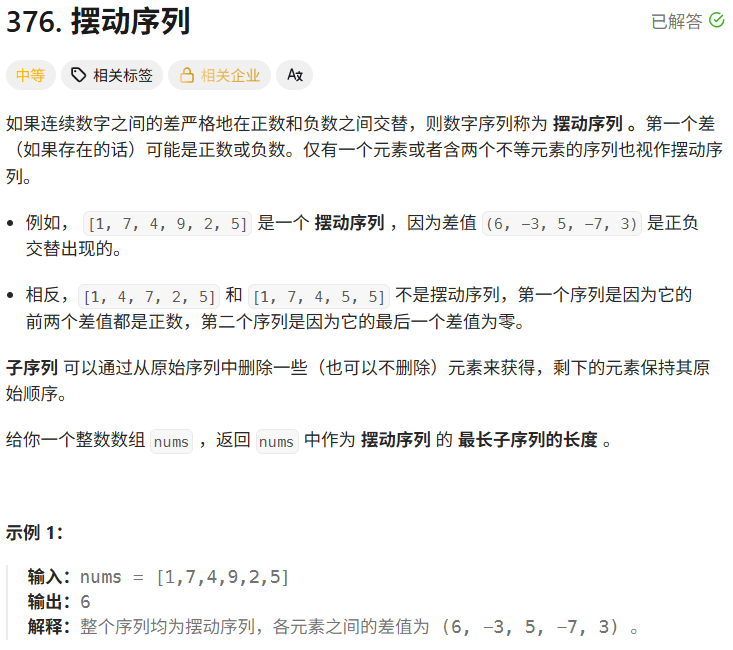
一开始用的回溯写的，就是每个数尝试选或者不选（如果当前数和前面构不成摆动序列则只能不选），然后遍历所有情况找到最大值。不过超时了，代码如下。
```java
class Solution {

  

    private int maxLength = 0;

  

    public int wiggleMaxLength(int[] nums) {

        backTracking(nums, 0, 0, 0, false, true, false);

        return maxLength;

    }

  

    // true -> +  false -> -

    private void backTracking(int[] nums, int i, int length, int pre, boolean preSign, boolean isFirst, boolean isSecond){

        // 剪枝：如果之后的所有数加上，长度都没已知最好的长，那么直接return就行了

        if(nums.length - i + length < maxLength) return;

        maxLength = Math.max(length, maxLength);

        if(i >= nums.length) return;

        if(isFirst){

            // 选

            backTracking(nums, i + 1, length + 1, nums[i], false, false, true);

            // 不选

            backTracking(nums, i + 1, length, 0, false, true, false);

            return;

        }

        boolean currSign = nums[i] - pre > 0;

        if ((currSign && ! preSign) || (!currSign && preSign) || isSecond) {

            // 第二个数特殊情况

            if(isSecond && nums[i] == pre){

                backTracking(nums, i + 1, length, pre, preSign, false, false);

                return;

            }

            // 选

            backTracking(nums, i + 1, length + 1, nums[i], currSign, false, false);

            // 不选

            backTracking(nums, i + 1, length, pre, preSign, false, false);

        } else {

            // 不选

            backTracking(nums, i + 1, length, pre, preSign, false, false);

        }

    }

}
```
基于贪心写的
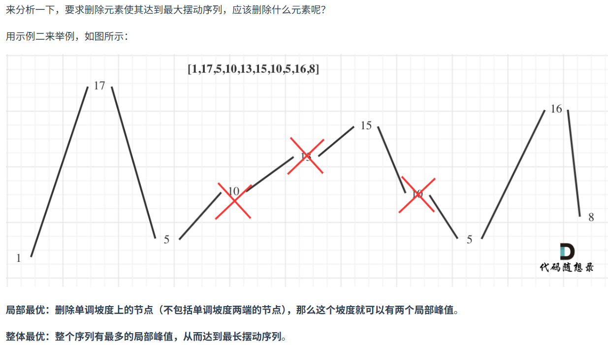
实际操作上，其实连删除的操作都不用做，因为题目要求的是最长摆动子序列的长度，所以只需要统计数组的峰值数量就可以了。
判断峰值：
```java
frontDiff * backDiff < 0 
```
不过会遇到一些情况影响峰值的判断，首先是平坡。
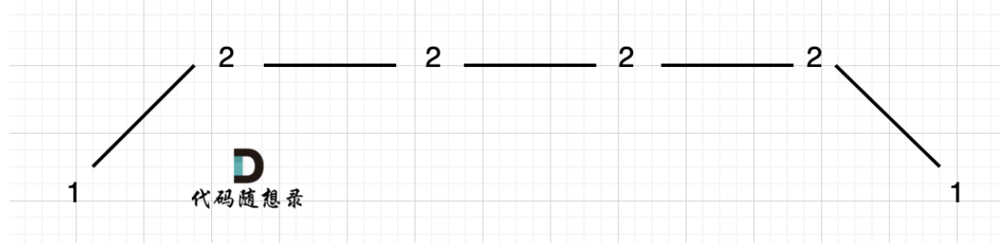
像这张图中，按之前的逻辑，4个2都不会被认为是极值点。但是删除其中3个2明显可以构成一个3个点的摆动序列，所以平坡中删去一些点后可能会有极值点，删的话就是留两边中的一个就可以了，我是留最后一个。
找到平坡的最后一个：
```java
frontDiff == 0 && backDiff != 0
```
但是平坡的最后一个一定是极值点嘛，其实是不一定的。就像上面这个图的最后一个1，如果换成3，是往上翘的，最后一个2就不是极值点。所以这里还需要补一个条件，就是进入平坡和离开平坡那个变化的趋势要不同的。条件变成下面这样
```java
if(frontDiff == 0 && backDiff != 0 && (diffBeforePlane * backDiff < 0))
```
其中diffBeforePlane就是进入平坡前的变化趋势，通过下面代码可以得到
```java
if(backDiff == 0 && frontDiff != 0) diffBeforePlane = frontDiff;
```
第一次backDiff为0时，那么就开始进入平坡了，需要记住变化趋势，不过在平坡走的过程中backDiff总是为0，diffBeforePlane会被覆盖，所以这里还要加一个判断frontDiff不等于0。
时间100.00%，空间10.77%
```java
class Solution {

    public int wiggleMaxLength(int[] nums) {

        int n = nums.length;

        int peakCount = 0;

        int diffBeforePlane = 0;

        for(int i = 1;i < n - 1;i++){

            int frontDiff = nums[i] - nums[i - 1]; // 当前数和前面一个数的差值

            int backDiff = nums[i + 1] - nums[i]; // 后面一个数和当前数的差值

            if(backDiff == 0 && frontDiff != 0) diffBeforePlane = frontDiff;

            if(frontDiff == 0 && backDiff != 0 && (diffBeforePlane * backDiff < 0)){

                peakCount++;

            }

            if(frontDiff * backDiff < 0){

                peakCount++;

            }

        }

        if(peakCount == 0 && nums[0] == nums[n - 1]) return 1;

        return peakCount + 2;

    }

}
```
### 53.最大子数组和
见hot100
### 122.买卖股票的最佳时机II
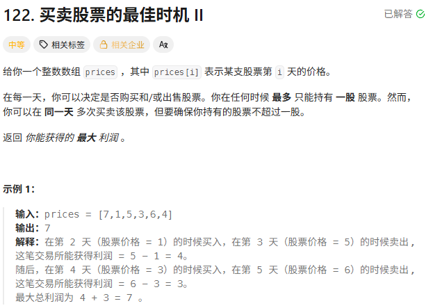
时间100.00%，空间14.71%
```java
class Solution {

    public int maxProfit(int[] prices) {

        int n = prices.length;

        // 最后能获得的最大利润肯定和前面能获得的利润和买入、卖出情况有关

        // 所以想到动态规划，规定dp[i][j]如下

        // dp[i][0]表示截止到第i天且第i天卖出股票所能获得的最大利润

        // dp[i][1]表示截止到第i天且第i天买入股票所能获得的最大利润

        // 递推关系

        // dp[i][0] = 从前面买入中的最大利润 + 当天股票价格

        // dp[i][1] = 从前面卖出中的最大利润 - 当天股票价格

        // 然后因为都只要记住最大值，这个代码可以简化成下面这样

        int sellMax = 0;

        int buyMax = -prices[0];

        for(int i = 1;i < n;i++){

            sellMax = Math.max(sellMax, buyMax + prices[i]);

            buyMax = Math.max(buyMax, sellMax - prices[i]);

        }

        return sellMax;

    }

}
```
### 55.跳跃游戏
见hot100
### 45.跳跃游戏II
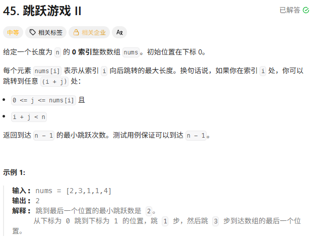
时间99.65%，空间21.93%
```java
class Solution {

    public int jump(int[] nums) {

        // 以 2 3 1 2 4 2 3为例

        // 一开始可以到2，这时候一步可达的索引为1,2

        // 通过它们可以更新处两步可达的最远处，通过两步可达的地方可以更新处三步可达的最远处

        // 当第一次可达的最远处超过n - 1返回步数就好了。

        // 下一步走到哪是不知道的，但是我们会遍历下一步能走的所有格，更新能走到的最远的地方

        // （相当于走最远的那一步了）这就是贪心

        int n = nums.length;

        if(n == 1) return 0;

        int canReach = 0;

        int end = 0;

        int step = 0;

        for(int i = 0;i < n;i++){

            if(canReach >= n - 1) return step + 1;

            if(i > end){

                // 走出下一步

                step += 1;

                end = canReach;

            }

            canReach = Math.max(canReach, i + nums[i]);

        }

        return -1;

    }

}
```
### 1005.K次取反后最大化的数组和
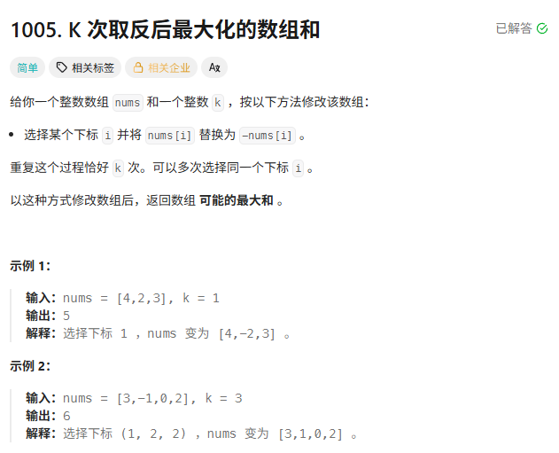
时间66.42%，空间21.41%
```java
class Solution {

    public int largestSumAfterKNegations(int[] nums, int k) {

        // 尽量把变号用在小的负数上，先把数组排序一下

        // 然后按序遍历数组，如果是负数，并且变号次数没用完，那么给它变成正的就是当下最赚的

        // (当前负数就是最小的负数了)，如果到了正数，变号次数还没用完，这时候其实我们就不想用了

        // 得精打细算，如果是偶数，那么对一个数反复变号就可以了，不会变小。

        // 如果是奇数，那么找个绝对值最小的加是最爽的

        Arrays.sort(nums);

        int n = nums.length;

        int absMin = Integer.MAX_VALUE;

        int sum = 0;

        for(int i = 0;i < n;i++){

            absMin = Math.min(absMin, Math.abs(nums[i]));

            if(nums[i] < 0 && k > 0){

                nums[i] = -nums[i];

                k--;

            }

            sum += nums[i];

        }

        // 这一步就相当于是k没用完且是奇数，然后找个绝对值最小的加负号

        // 没用完或者用完了就直接返回了

        if(k % 2 != 0){

            sum -= 2 * absMin;

        }

        return sum;

    }

}
```
### ★★★134.加油站
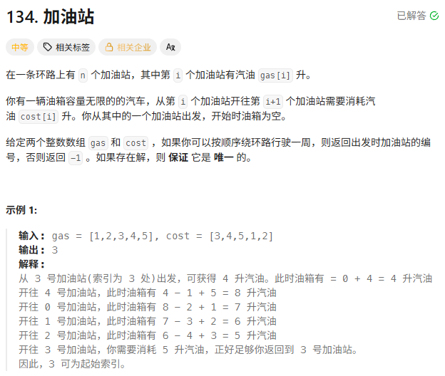
时间100.00%，空间9.21%
太难了，真想不明白，下面给几个结论记住这题先把。
gas之和大于等于cost之和，一定有解。
gas之和小于cost之和，一定没解。
对gas\[i] - cost\[i]求和，记录最低点。
如果有解，那么解就是最低点的下一个。
```java
class Solution {

    public int canCompleteCircuit(int[] gas, int[] cost) {

        int res = 0;

        int min = 0; // 最小油量

        int storage = 0;

        for(int i = 0;i < gas.length;i++){

            storage = storage + gas[i] - cost[i];

            if(storage < min){

                min = storage;

                res = i + 1;

            }

        }

        return storage >= 0 ? res:-1;

    }

}
```
### ★★★135.分发糖果
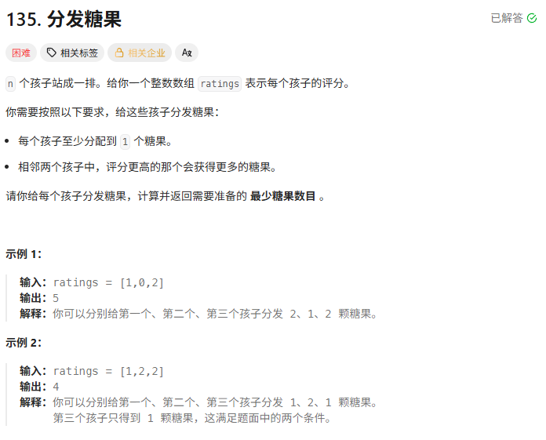
时间33.62%，空间16.22%
```java
class Solution {

    public int candy(int[] ratings) {

        // 规则：相邻的两个孩子中，评分更高的需要获得更多的糖果

        // 拆分成左规则和右规则 设有学生A -> B

        // 左规则：B > A B的糖要多

        // 右规则：A > B A的糖要多

        // 每个学生既要满足左规则也要满足右规则

        // 那么可以这样实现

        // 定义两个数组(left和right)，先给每个学生分配初始的1颗糖

        // 然后从左往右遍历left，如果当前学生得分比左边高，给它比左边多一个，这样left中所有人都满足左规则

        // 接着从右往左遍历right，如果当前学生得分比右边高，给它比右边多一个，这样right中所有人都满足右规则

        // 然后每个人给left和right中的最大值，就可以同时满足左右规则，并且这就是最优解

        // why? 很难理解清楚说实话。先记把，left和right分别是满足左右规则要求的最小值

        // 取它们中的最大值就是同时满足左右规则的最小值

        int n = ratings.length;

        int[] left = new int[n];

        Arrays.fill(left, 1);

        int[] right = new int[n];

        Arrays.fill(right, 1);

        for(int i = 1;i < n;i++){

            if(ratings[i] > ratings[i - 1]) left[i] = left[i - 1] + 1;

        }

        int res = left[n - 1];

        for(int i = n - 2;i >=0;i--){

            if(ratings[i] > ratings[i + 1]) right[i] = right[i + 1] + 1;

            res += Math.max(left[i], right[i]);

        }

        return res;

    }

}
```
### 860.柠檬水找零
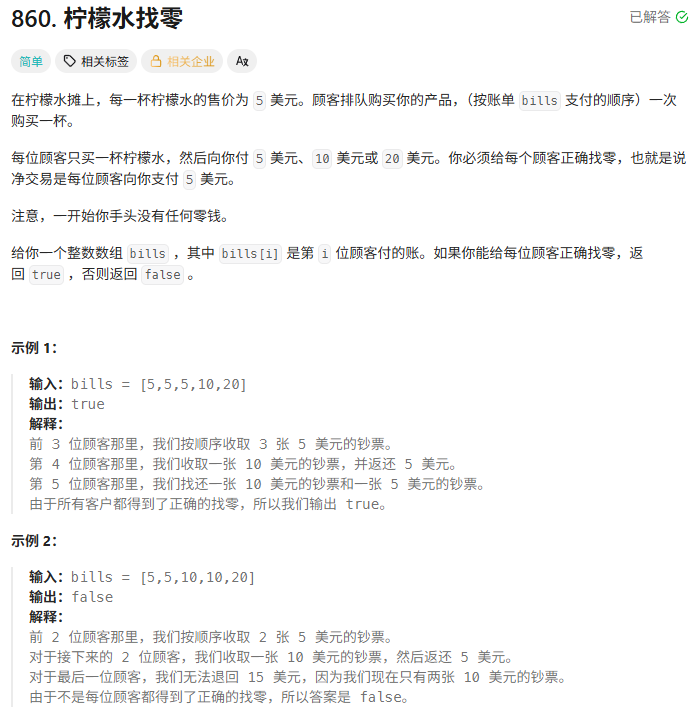
时间100.00%，空间42.46%
```java
class Solution {

    public boolean lemonadeChange(int[] bills) {

        // 就是给20找零的时候尽量先用10

        int fiveNum = 0;

        int TenNum = 0;

        for(int i = 0;i < bills.length;i++){

            if (bills[i] == 5) {

                fiveNum++;

            } else if(bills[i] == 10){

                if(fiveNum == 0) return false;

                fiveNum--;

                TenNum++;

            } else {

                if(fiveNum == 0) return false;

                if(TenNum == 0 && fiveNum < 3) return false;

                if(TenNum > 0){

                    TenNum--;

                    fiveNum--;

                } else {

                    fiveNum -= 3;

                }

            }

        }

        return true;

    }

}
```
### 406.根据身高重建队列
见hot100
### 452.用最少数量的箭引爆气球
时间74.69%，空间45.57%
```java
class Solution {

    public int findMinArrowShots(int[][] points) {

        // 把points看作一个个区间，这个问题翻译一下，就是有重叠的区间都取交集只射一次就好了。

        // 不过一个区间可能和多个区间都有交集，那么应该合到哪个区间去呢。

        // 应该合到前面的区间，前面总是要浪费一次的，不合到前面那一次也要用。

        // 合到后面的话，可能导致区间缩小，原本下一个可以去和别人合并的现在不行了。

        // 所以按区间开头排序一下，尽量和前面的合并就好了。

        Arrays.sort(points, (point1, point2) -> {return Integer.compare(point1[0], point2[0]);});

        int begin = points[0][0];

        int end = points[0][1];

        int areaCount = 0;

        for(int i = 1;i < points.length;i++){

            if (points[i][0] > end) {

                // 无交集

                areaCount ++;

                begin = points[i][0];

                end = points[i][1];

            } else {

                // 有交集取交集

                begin = points[i][0];

                end = Math.min(end, points[i][1]);

            }

        }

        return areaCount + 1;

    }

}
```
### 435.无重叠区间
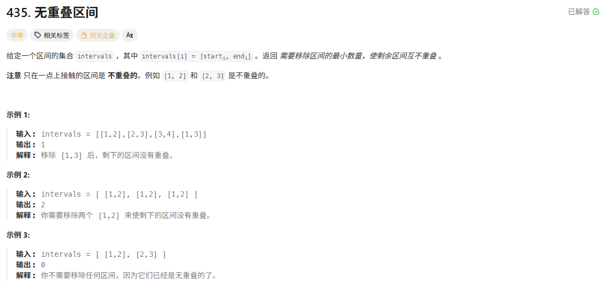
时间63.83%，空间7.28%
```java
class Solution {

    public int eraseOverlapIntervals(int[][] intervals) {

        // 交集情况:1.A包B，删A  2.两个相交，删任意一个都可以 3.多个相交，删中间的嘛

        // 2,3合并一下其实就是，按顺序判断后面的区间和前面有没有交集，有的话删除后面那个  1的话还要单独判断一下

        // 没交集更新一下当前区间

        Arrays.sort(intervals, (int[] interval1, int[] interval2) -> {

            return Integer.compare(interval1[0], interval2[0]);

        });

        int begin = intervals[0][0];

        int end = intervals[0][1];

        int toBeremoved = 0;

        for(int i = 1;i < intervals.length;i++){

            if(intervals[i][0] < end){

                // 和前面的区间有交集，删了

                if(intervals[i][1] <= end){

                    // 1.A包B的情况，把大的删了

                    begin = intervals[i][0];

                    end = intervals[i][1];

                }

                toBeremoved++;

            } else {

                // 无交集，更新当前区间

                begin = intervals[i][0];

                end = intervals[i][1];

            }

        }

        return toBeremoved;

    }

}
```
### 763.划分字母区间
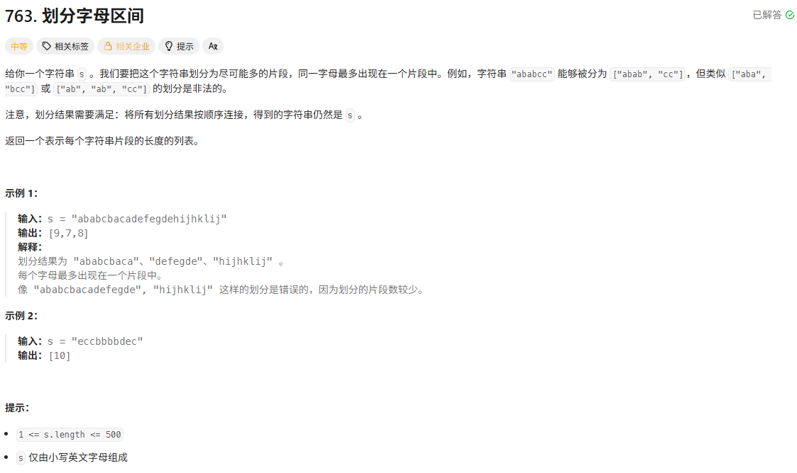
先是按自己的想法写的
时间56.01%，空间16.98%
```java
class Solution {

    public List<Integer> partitionLabels(String s) {

        // 统计每个字母出现的区间，然后把这些区间给合并了，统计一下区间数就是最后的结果了。

        // 为什么会这样想呢，一个字母只能出现在一个片段中，所以一个字母出现的首末位置很重要。对于一个字母来说，

        // 最贪的划分就是区间 = 出现的首末位置嘛，但是如果有别的字母在这个区间，还要把它考虑上，方式就是合并。

        int[][] areaOfEachChar = new int[26][2];

        boolean[] isFirst = new boolean[26];// 判断这个字母是不是第一次出现

        int charCount = 0;// 统计有几个字母出现过了

        for(int i = 0;i < s.length();i++){

            int index = s.charAt(i) - 'a';

            if (!isFirst[index]) {

                // 是第一次出现

                areaOfEachChar[index][0] = i;

                // 末尾也先赋这个值，后面出现反正会覆盖

                areaOfEachChar[index][1] = i;

                isFirst[index] = true;

                charCount++;

            } else {

                // 不是第一次出现

                areaOfEachChar[index][1] = i;

            }

        }

        int[][] intervals = new int[charCount][2];

        charCount = 0; // 复用一下，用来记一下多少个区间放好了

        for(int i = 0;i < 26;i++){

            if (isFirst[i]) {

                intervals[charCount][0] = areaOfEachChar[i][0];

                intervals[charCount][1] = areaOfEachChar[i][1];

                charCount++;

            }

        }

        Arrays.sort(intervals, (int[] interval1, int[] interval2) -> {

            return Integer.compare(interval1[0], interval2[0]);

        });

        // 合并区间

        List<int[]> merged = new ArrayList<>();

        int begin = intervals[0][0];

        int end = intervals[0][1];

        for (int i = 1;i < intervals.length;i++) {

            int currBegin = intervals[i][0];

            int currEnd = intervals[i][1];

            if (currBegin > end){

                merged.add(new int[]{begin, end});

                begin = currBegin;

                end = currEnd;

            } else {

                end = Math.max(end, currEnd);

            }

        }

        merged.add(new int[]{begin, end});

        List<Integer> res = new ArrayList<>();

        for(int[] intervalBeenMerged : merged){

            res.add(intervalBeenMerged[1] - intervalBeenMerged[0] + 1);

        }

        return res;

    }

}
```
题解
时间56.01%，空间75.26%
```java
class Solution {

    public List<Integer> partitionLabels(String s) {

        // 同一个字母的第一次出现的下标位置和最后一次出现的下标位置必须出现在同一个片段。

        // 那么可以先遍历一次字符串，得到每个字母最后一次出现的下标位置。

        // 然后开始划分区间:先初始化当前片段的首尾为[0,0]，然后再遍历当前片段的过程中

        // 对于每个访问到的字母，当前的片段末尾一定是要包括这个字母最后出现的下标位置的

        // ，不然就不符合要求。 据此更新当前片段的末尾，如果走到了片段末尾，那么该片段就完整了。

        // 把长度添加进结果里就好了。这个操作的含义是什么呢，首先初始化为[0, 0].没毛

        // 我们希望每一个字符都能分。我们是希望这个片段尽量短的，我们每次更新片段的末尾

        // 都是在不得不更新的情况下才更新的。这样的做法当然可以找到最优解。

        int[] endIndex = new int[26]; // 记录每个字符最后出现的位置

        for(int i = 0;i < s.length();i++){

            endIndex[s.charAt(i) - 'a'] = i;

        }

        int begin = 0;

        int end = 0;

        List<Integer> res = new ArrayList<>();

        for(int i = 0;i < s.length();i++){

            // 更新片段末尾

            end = Math.max(end, endIndex[s.charAt(i) - 'a']);

            // 走到末尾了

            if(i == end){

                res.add(end - begin + 1);

                begin = end + 1;

                end = begin;

            }

        }

        return res;

    }

}
```
### 56.合并区间
见hot100
### 738.单调递增的数字
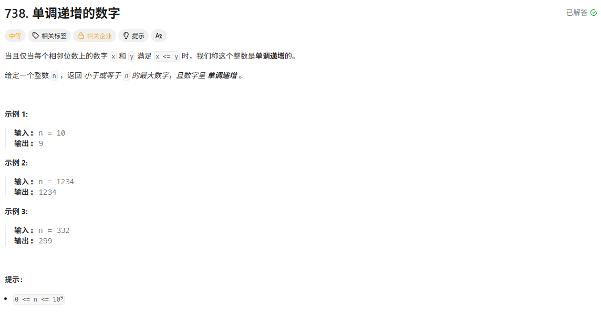
时间100.00%，空间17.33%
```java
class Solution {

    public int monotoneIncreasingDigits(int n) {

        // 我们可以从个位开始遍历当前数，两位两位的看，高位一定是要小于等于低位的，如果不满足

        // 那么我们可以把高位-1，然后把后面的低位都置为9，这样就可以跳到符合要求的最大的数了

        // 然后置9这个操作其实可以等到最后一位不符合要求的再做

        int pos = 0; // 表示当前操作的位数，0 -> 个位 1 -> 十位

        int pre = 10;

        int curr = n;

        while(curr > 0){

            int temp = curr % 10; // 当前位置的数

            curr /= 10;

            if (temp > pre){

                // 高位大于低位了，把高位-1，然后后面全置9

                n = n - (int)Math.pow(10, pos);

                n = n - n % (int)Math.pow(10, pos) + (int)Math.pow(10, pos) - 1;

                pre = temp - 1;

            } else {

                pre = temp;

            }

            pos++;

        }

        return n;

    }

}
```
### ★★★968.监控二叉树
看了一个动态规划的题解
时间25.21%，空间10.58%
```java
/**

 * Definition for a binary tree node.

 * public class TreeNode {

 *     int val;

 *     TreeNode left;

 *     TreeNode right;

 *     TreeNode() {}

 *     TreeNode(int val) { this.val = val; }

 *     TreeNode(int val, TreeNode left, TreeNode right) {

 *         this.val = val;

 *         this.left = left;

 *         this.right = right;

 *     }

 * }

 */

class Solution {

    public int minCameraCover(TreeNode root) {

        // 一个节点有几种状态呢，装or不装，覆盖or没被覆盖，组合一下是有三种

        // 因为装的话这个节点一定会被覆盖的，少了一种组合

        // 定义 状态0：当前节点安装相机的时候，需要的最少相机数

        // 状态1：当前节点不安装相机，但是能被覆盖到的时候，需要的最少相机数

        // 状态2：当前节点不安装相机，也不能被覆盖到的时候，需要的最少相机数

        // 三种状态都应保证子节点被覆盖，这时回到根节点的时候选0,1整个树就会被覆盖了

        // 不然的话再往上走管不到了都

        // 0，1状态中的最小值就是所求了（全集 - 不符合要求的集合中的最小值）

        // dp[0] = left 三种状态最小 + right 三种状态最小

        // dp[1] = 左装 + 右 0，1中的最小；右装，左0,1中的最小； 取这两种情况的最小值

        // dp[2] = left 1 + right 1

        int[] res = dfs(root);

        return Math.min(res[0], res[1]);

    }

  

    private int[] dfs(TreeNode root){

        // 如果当前节点为空，那么它的状态应该是没装且被覆盖了

        // 那么另外两个状态应该尽量设得大点，让后续不会考虑它们

        if(root == null) return new int[]{Integer.MAX_VALUE / 2, 0, Integer.MAX_VALUE / 2};

        int[] dp = new int[3];

        int[] left = dfs(root.left);

        int[] right = dfs(root.right);

        dp[0] = Math.min(Math.min(left[0], left[1]), left[2]) + Math.min(Math.min(right[0], right[1]), right[2]) + 1;

        dp[1] = Math.min(left[0] + Math.min(right[0], right[1]), right[0] + Math.min(left[0], left[1]));

        dp[2] = left[1] + right[1];

        return dp;

    }

}
```
看了一个0ms的示例，贪心做的
思路就是能不装就不装（被覆盖就不装），二叉树的递归是从下往上的，如果子节点有一个没被覆盖，那么当前节点就一定要装了，不然后面管不到了。如果子节点都被覆盖了，那么我这个就不装了，让后面再看怎么装。有一个子节点装了就返回被覆盖了，然后也不装。
```java
/**

 * Definition for a binary tree node.

 * public class TreeNode {

 *     int val;

 *     TreeNode left;

 *     TreeNode right;

 *     TreeNode() {}

 *     TreeNode(int val) { this.val = val; }

 *     TreeNode(int val, TreeNode left, TreeNode right) {

 *         this.val = val;

 *         this.left = left;

 *         this.right = right;

 *     }

 * }

 */

  

//0:无覆盖

//1：摄像头

//2：有覆盖

class Solution {

    int res = 0;

    public int minCameraCover(TreeNode root) {

        if(Tracking(root) == 0){

            res++;

        }

        return res;

    }

  

    private int Tracking(TreeNode node){

        if(node == null){

            return 2;

        }

        int left = Tracking(node.left);

        int right = Tracking(node.right);

        if(right == 2 && left == 2){

            return 0;

        }else if(right == 0 || left == 0){

            res++;

            return 1;

        }else{

            return 2;

        }

    }

}
```
## 动态规划
### 理论基础
动态规划：从前一个步的多个状态（or最优状态）推导当前步骤的多个状态（or最优状态）
贪心：一直选择局部最优
我觉得，如果一个问题可以由子问题一步步推来，那么就用贪心或者动态规划，如果只需要一直选最优就是贪心，每一步的多个状态都需要考虑就用动态规划。
步骤：
1.确定dp数组（dp table）以及下标的含义
2.确定递推公式
3.dp数组如何初始化
4.确定遍历顺序
5.举例推导dp数组
debug：打印dp数组，看看推导的过程对不对
### 509.斐波那契数
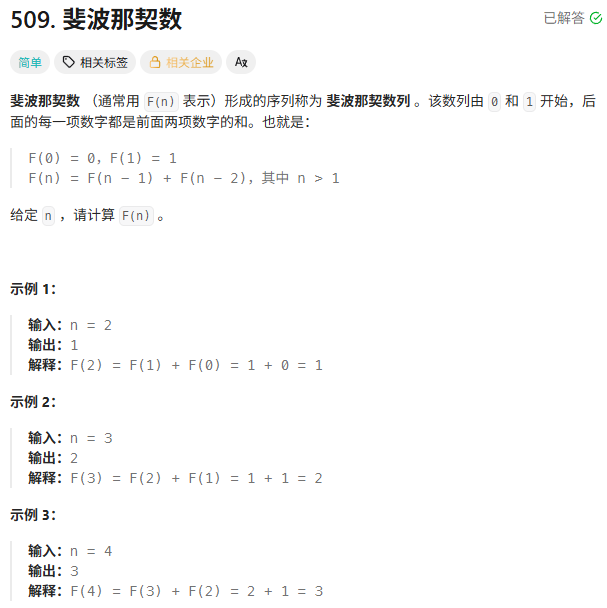
时间100.00%，空间87.15%
```java
class Solution {

    public int fib(int n) {

        if(n < 2) return n;

        int[] dp = new int[n + 1];

        dp[0] = 0;

        dp[1] = 1;

        for(int i = 2;i <= n;i++){

            dp[i] = dp[i - 1] + dp[i - 2];

        }

        return dp[n];

    }

}
```
### 70.爬楼梯
见hot100
### 746.使用最小花费爬楼梯
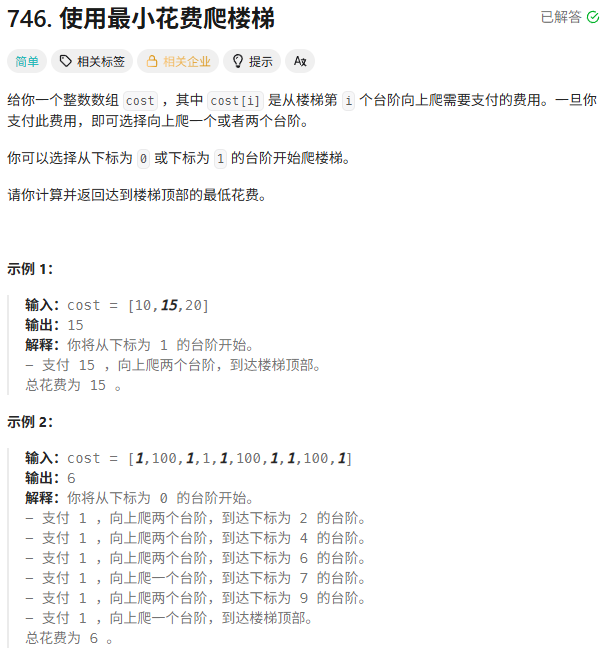
时间100.00%，空间32.79%
```java
class Solution {

    public int minCostClimbingStairs(int[] cost) {

        int n = cost.length;

        if(n < 2) return 0;

        // dp[i] 表示爬到第i个楼梯所需的最小花费

        // dp[i] = Math.min(dp[i - 2] + cost[i - 2], dp[i - 1] + cost[i - 1])

        int[] dp = new int[n + 1];

        for(int i = 2;i <= n;i++){

            dp[i] = Math.min(dp[i - 2] + cost[i - 2], dp[i - 1] + cost[i - 1]);

        }

        return dp[n];

    }

}
```
### 62.不同路径
见hot100
### 63.不同路径II
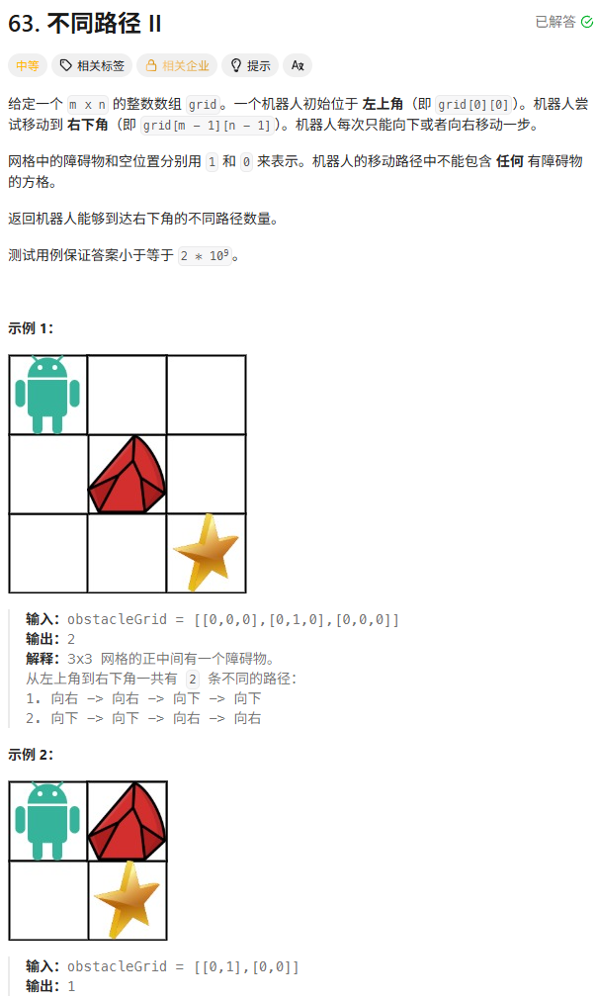
时间100.00%，空间39.01%
```java
class Solution {

    public int uniquePathsWithObstacles(int[][] obstacleGrid) {

        int m = obstacleGrid.length;

        int n = obstacleGrid[0].length;

        int[][] dp = new int[m][n];

        // dp[i][j] 表示走到(i, j)不同的路径数

        // dp[i][j] = 上 + 左

        // 障碍物直接置0就可以了，其他不用变

        int preM = 0;

        // 初始化，第一行的各个格子只能从左边过来，障碍物之前的都是可达的置1

        // 障碍物之后的都不可达，放0，第一列同理

        for(int i = 0;i < m;i++){

            if(obstacleGrid[i][0] == 1) break;

            dp[i][0] = 1;

        }

        for(int j = 0;j < n;j++){

            if(obstacleGrid[0][j] == 1) break;

            dp[0][j] = 1;

        }

        for(int i = 1;i < m;i++){

            for(int j = 1;j < n;j++){

                if(obstacleGrid[i][j] == 1){

                    dp[i][j] = 0;

                    continue;

                }

                dp[i][j] = dp[i - 1][j] + dp[i][j - 1];

            }

        }

        return dp[m - 1][n - 1];

    }

}
```
### 343.整数拆分
```java
class Solution {

    public int integerBreak(int n) {

        if(n == 2) return 1;

        if(n == 3) return 2;

        // dp[i]表示对正整数i操作后可以得到的最大乘积

        // i 可以拆分为两数之和或者多数之和

        // 但是这样考虑太麻烦了，你可以先把它拆成两数之和p + q

        // 如果进一步拆分能更大的话，那么一定是用dp[p]替换掉p

        // 或者dp[q]替换掉q，或者都替换，选其中最大的就可以了

        int[] dp = new int[n + 1];

        dp[1] = 1; // 是无意义的，补充一下后面好用就是

        dp[2] = 1;

        dp[3] = 2;

        for(int i = 4;i <= n;i++){

            for(int j = 1;j <= i / 2;j++){

                dp[i] = Math.max(Math.max(j, dp[j]) * Math.max(i - j, dp[i - j]), dp[i]);

            }

        }

        return dp[n];

    }

}
```
### 96.不同的二叉搜索树
见hot100
### 0-1背包理论基础
题目：有n件物品和一个最多能背重量为w的背包。第i件物品的重量是weight\[i]，得到的价值是value\[i] 。每件物品只能用一次，求解将哪些物品装入背包里物品价值总和最大。
思路：定义dp\[i]\[j]表示从下标\[0-i]的物品里任意取，放进容量为j的背包，价值总和最大是多少。
dp\[i]\[j] = Math.max(dp\[i - 1]\[j], dp\[i - 1]\[j - weight\[i] + value\[i]])
其实就是考虑当前物品放or不放
放的话要把当前物品的位置给留出来
初始化：
```java
for (int i = 1; i < weight.size(); i++) {  // 当然这一步，如果把dp数组预先初始化为0了，这一步就可以省略，但很多同学应该没有想清楚这一点。
    dp[i][0] = 0;
}
// 正序遍历
for (int j = weight[0]; j <= bagweight; j++) {
    dp[0][j] = value[0];
}
```
然后从递推公式中可以看出，每一个状态只依赖于前一个状态，那么用一维数组其实就可以了。
改为如下：
dp\[j]表示，截止到当前，容量为j的背包，所背的物品价值最大是多少
dp\[j] = Math.max(dp\[j], dp\[j - weight\[i] + value\[i]])
然后不用初始化等后面一起填也是可以的

### 416.分割等和子集
见hot100
### ★★★1049.最后一块石头的重量II
时间79.55%，空间33.41%
```java
class Solution {

    public int lastStoneWeightII(int[] stones) {

        // 这题其实只要尽量的均分石头为两堆，然后返回它们之间的差就好了

        // 因为两堆石头它们碰来碰去，最后碰撞的结果就会是它们的差值的

        // 转化成背包问题就是，定义一个大小为总重量一半的背包，尽量把它装满

        // 这时候重量 = 价值

        int sum = 0;

        for(int stone:stones){

            sum += stone;

        }

        int target = sum / 2;

        int[] dp = new int[target + 1];

        for(int i = 0;i < stones.length;i++){

            // 注意这里应该用的是倒序

            // 要用到的dp[j]和dp[j - stones[i]]应该都是上一轮的数据

            // 所以填当前轮次的时候，比j小的应该还没变

            // 所以应该是倒序遍历

            for(int j = target;j >= stones[i];j--){

                dp[j] = Math.max(dp[j], dp[j - stones[i]] + stones[i]);

            }

        }

        return sum - 2 * dp[target];

    }

}
```
### 494.目标和
见hot100
### 474.一和零
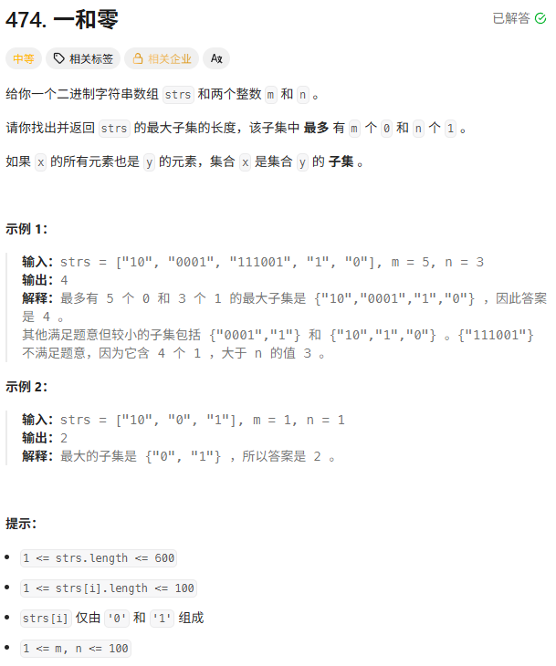
时间60.07%，空间69.79%
```java
class Solution {

    public int findMaxForm(String[] strs, int m, int n) {

        int sl = strs.length;

        // 就是背包问题，物体就是字符串，价值就是1个子集

        // 体积就是1和0的个数，是个二维的消耗

        // dp[j][k]表示当前最多有j个0和k个1时，最大子集数

        // 省了一维i，整体是表示从[0,i]中任选字符串，不超过容量要求下的最大值

        // dp[j][k] = dp[j][k] + dp[j - count0][k - count1]

        // 就是看要不要选当前字符串

        int[][] dp = new int[m + 1][n + 1];

        for(int i = 0;i < sl;i++){

            int count0 = 0;

            int count1 = 0;

            for(char c : strs[i].toCharArray()){

                if(c == '0') count0++;

                else count1++;

            }

            for(int j = m;j >= count0;j--){

                for(int k = n;k >= count1;k--){

                    dp[j][k] = Math.max(dp[j][k], dp[j - count0][k - count1] + 1);

                }

            }

        }

        return dp[m][n];

    }

}
```
### 完全背包理论基础
题目：有N件物品和一个最多能背重量为W的背包。第i件物品的重量是weight\[i]，得到的价值是value\[i] 。每件物品都有无限个（也就是可以放入背包多次），求解将哪些物品装入背包里物品价值总和最大。
思路：完全背包和01背包问题唯一不同的地方就是，每种物品有无限件。
dp\[i]\[j]表示从下标为\[0-i]的物品，每个物品可以取无限次，放进容量为j的背包，价值总和最大是多少。
dp\[i]\[j] = max(dp\[i - 1]\[j], dp\[i]\[j - weight\[i]] + value\[i]);
也是每一轮决定要不要放下标为i的这个物品，不过区别就是后面的从dp\[i - 1]\[j - weight\[i]] + value\[i] -> dp\[i]\[j - weight\[i]] + value\[i]，含义就是因为当前每个物品是无限个的，放了一个之后后续还可以继续选。
初始化：
```java
for (int i = 1; i < weight.size(); i++) {  // 当然这一步，如果把dp数组预先初始化为0了，这一步就可以省略，但很多同学应该没有想清楚这一点。
    dp[i][0] = 0;
}

// 正序遍历，如果能放下就一直装物品0
for (int j = weight[0]; j <= bagWeight; j++){
    dp[0][j] = dp[0][j - weight[0]] + value[0];
}
```
一维形式
dp\[j]表示一直到当前的物品，每个物品可以取无限次，放进容量为j的背包，价值总和最大是多少。
dp\[j] = max(dp\[j], dp\[j - weight\[i]] + value\[i]);
不用初始化什么可以
注意j要从小往大，因为dp\[j]要用的是之前的，这个无关顺序一定用的是之前的，而dp\[j - weight\[i]]用的是当前的比较小的，所以小的要先更新
### 518.零钱兑换II
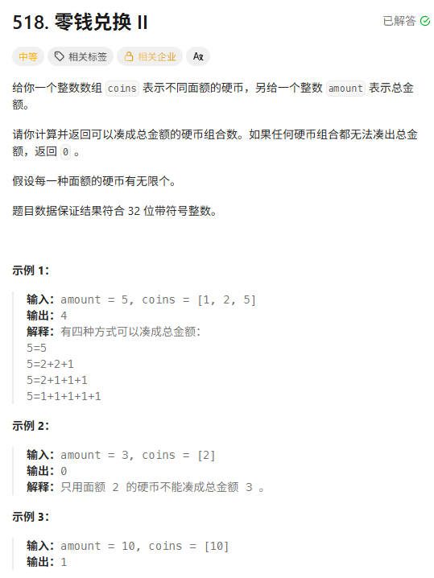
时间100.00%，空间94.37%
```java
class Solution {

    public int change(int amount, int[] coins) {

        // 定义dp[i][j]表示在[0-i]中任选硬币能凑到面额j的组合数

        // dp[i][j] = dp[i - 1][j] + dp[i][j - coins[i]]

        // 转成一维dp[j] 、 dp[j] +=  dp[j - coins[i]]

        int[] dp = new int[amount + 1];

        // 初始化

        dp[0] = 1;// 当j = coins[i]时要用到dp[0]，这时候就是多一种

        // 用这一个硬币达成目标的组合，所以搞个1，这个本身是无意义的

        for(int i = 0;i < coins.length;i++){

            for(int j = coins[i];j <= amount;j++){

                    dp[j] += dp[j - coins[i]];

            }

        }

        return dp[amount];

    }

}
```
### ★★★377.组合总和IV
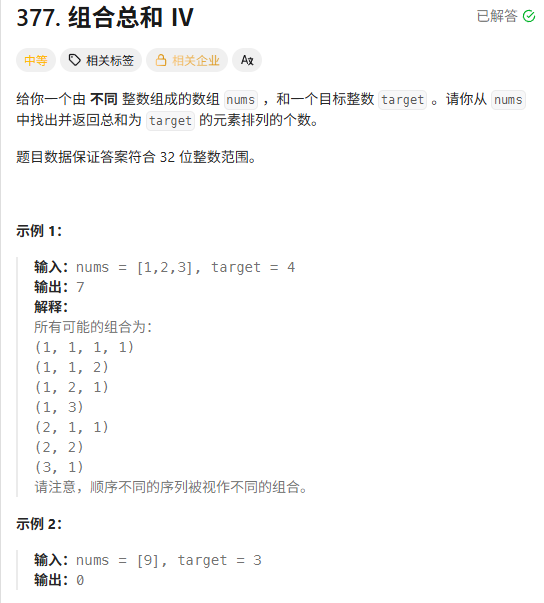
这一题可以和上面一题对照起来看，本质上都是装满背包的问题
递推公式
dp\[i] += dp\[i - nums\[j]]
初始化
dp\[0] = 1;
但是一个是求组合（不考虑顺序），一个是求排列（考虑顺序），区别总结如下
如果求组合数就是外层for循环遍历物品，内层for遍历背包。
如果求排列数就是外层for遍历背包，内层for循环遍历物品。
物品放外层的话，那么物品肯定都是按顺序放的
放内层的话，外层是背包容量然后内层是物品，结合递推公式dp\[j] += dp\[j - nums\[i]]，这时候其实就是，对于每个背包容量，最后一个放nums\[i]都试了一下，所以可以得到各种排列。
时间92.80%，空间58.50%
```java
class Solution {

    public int combinationSum4(int[] nums, int target) {

        // dp[j] 表示在[0,i]中任选数能凑到j的组合数

        // dp[j] += dp[j - nums[i]]

        int[] dp = new int[target + 1];

        dp[0] = 1;

        for(int j = 0;j <= target;j++){

            for(int i = 0;i < nums.length;i++){

                if(j >= nums[i]) dp[j] += dp[j - nums[i]];

            }

        }

        return dp[target];

    }

}
```
### 322.零钱兑换
见hot100
### 279.完全平方数
见hot100
### 139.单词拆分
见hot100
### 多重背包理论基础
题目：有N种物品和一个容量为V 的背包。第i种物品最多有Mi件可用，每件耗费的空间是Ci ，价值是Wi 。求解将哪些物品装入背包可使这些物品的耗费的空间 总和不超过背包容量，且价值总和最大。
思路：每件物品最多有Mi件可用，把Mi件摊开，其实就是一个01背包问题了。01背包里面在加一个for循环遍历一个每种商品的数量就可以了。
```java
//先遍历物品再遍历背包，作为01背包处理
        for (int i = 0; i < n; i++) {
            for (int j = bagWeight; j >= weight[i]; j--) {
                //遍历每种物品的个数
                for (int k = 1; k <= nums[i] && (j - k * weight[i]) >= 0; k++) {
                    dp[j] = Math.max(dp[j], dp[j - k * weight[i]] + k * value[i]);
                }
            }
        }
```
### 198.打家劫舍
见hot100
### 213.打家劫舍II
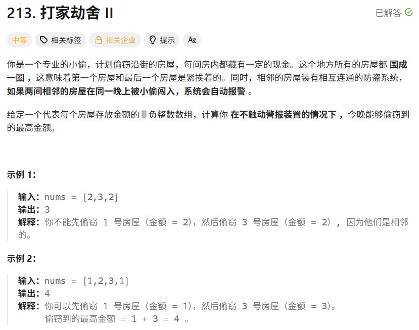
时间100.00%，空间34.41%
```java
class Solution {

    public int rob(int[] nums) {

        // dp[i][j] 表示在[0, i]中偷(j = 0)/不偷(j = 1)当前房屋能获得的最高金额

        // dp[i][0] = dp[i - 1][1] + nums[i]

        // dp[i][1] = Math.max(dp[i - 1][0], dp[i - 1][1])

        // 和I的区别就在于最后一个位置，它需要同时考虑两边的情况

        // 最后一个位置偷，那么第一个就不能偷，这个在一步步往后算的过程中是限制不住的

        // 所以只能在一开始就定死，第一个要么偷，要么不偷，这里分类讨论一下

        int n = nums.length;

        if(n == 1) return nums[0];

        int[][] dp = new int[n][2];

        // 偷第一个

        dp[0][0] = nums[0];

        dp[1][1] = nums[0];

        for(int i = 2;i < n;i++){

            if(i == n - 1){

                dp[i][1] = Math.max(dp[i - 1][0], dp[i - 1][1]);  

                continue;

            }

            dp[i][0] = dp[i - 1][1] + nums[i];

            dp[i][1] = Math.max(dp[i - 1][0], dp[i - 1][1]);

        }

        int temp = dp[n - 1][1];

        // 不偷第一个

        dp[1][0] = nums[1];

        dp[1][1] = 0;

        for(int i = 2;i < n;i++){

            dp[i][0] = dp[i - 1][1] + nums[i];

            dp[i][1] = Math.max(dp[i - 1][0], dp[i - 1][1]);

        }

        return Math.max(Math.max(dp[n - 1][0], dp[n - 1][1]), temp);

    }

}
```
### 337.打家劫舍III
见hot100
### 121.买卖股票的最佳时机
见hot100
### 122.买卖股票的最佳时机II
见贪心算法
### ★★★123.买卖股票的最佳时机III
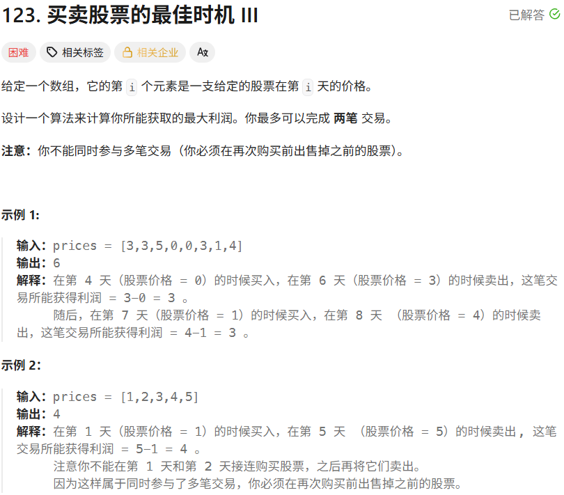
时间97.13%，空间75.85%
```java
class Solution {

    public int maxProfit(int[] prices) {

        // 每一天可能是下面五种状态之一，记住每天处于每个状态的利润最大值

        // 返回最后一天进行卖出操作的利润最大值（第一次卖出也可以的）就好了

        // 1.什么都没操作过  恒为0

        // 2.第一次买入   max(buy1, -prices[i]) 如果前面买的更便宜，今天这个就不用记住了，按前面的来操作

        // 3.第一次卖出   max(sell1, buy1 + prices[i]) 同理

        // 4.第二次买入   max(buy2, sell1 - prices[i])

        // 5.第二次卖出   max(sell2, buy2 + prices[i])

        // 通过上面的操作就可以得到每一步在哪里坐是最优的

        // 初始化 sell 设置为0就好了，影响不到后面的，有大于0的就覆盖了

        // 小于0的那些被挤掉也无所谓，不如不操作

        // buy1 也很简单，buy2也可以设为第一天，如果它影响到了后面，那么就只要做一次买卖嘛

        // 这时候1 2应该是相同的

        int buy1 = -prices[0];

        int sell1 = 0;

        int buy2 = -prices[0];

        int sell2 = 0;

        for(int i = 1;i < prices.length;i++){

            buy1 = Math.max(buy1, -prices[i]);

            sell1 = Math.max(sell1, buy1 + prices[i]);

            buy2 = Math.max(buy2, sell1 - prices[i]);

            sell2 = Math.max(sell2, buy2 + prices[i]);

        }

        return Math.max(sell1, sell2);

    }

}
```
### 188.买卖股票的最佳时间IV
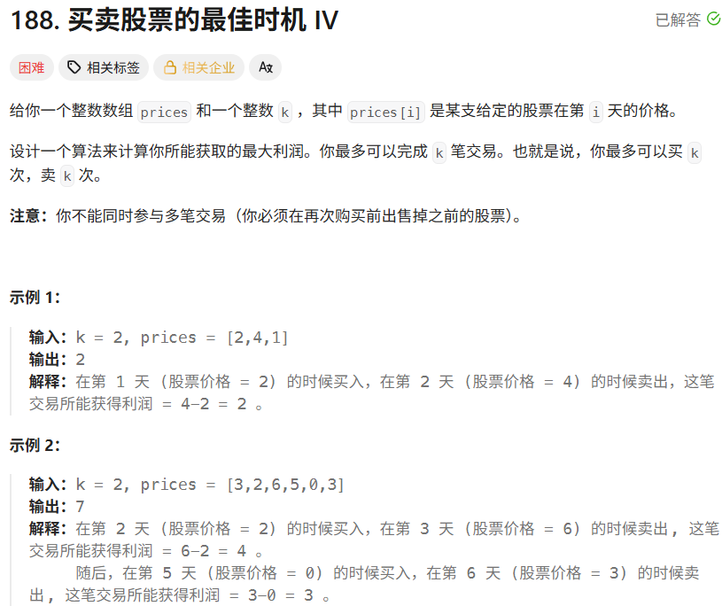
时间85.52%，空间70.07%
```java
class Solution {

    public int maxProfit(int k, int[] prices) {

        // 参考II的思路做的

        // 对于每天，可能处于的状态就是 不做任何操作or处于第j次买卖中

        // 用dp[j - 1][0/1]记住第j次买/卖能获得的最大利润

        // dp[j][0] = Math.max(dp[j][0], dp[j - 1][1] - prices[i]);

        // dp[j][1] = Math.max(dp[j][1], dp[j][0] + prices[i]);

        int[][] dp = new int[k][2];

        // 初始化

        for(int i = 0;i < k;i++){

            dp[i][0] = -prices[0];

        }

        for(int i = 0;i < prices.length;i++){

            dp[0][0] = Math.max(dp[0][0], -prices[i]);

            dp[0][1] = Math.max(dp[0][1], dp[0][0] + prices[i]);

            for(int j = 1;j < k;j++){

                dp[j][0] = Math.max(dp[j][0], dp[j - 1][1] - prices[i]);

                dp[j][1] = Math.max(dp[j][1], dp[j][0] + prices[i]);

            }

        }

        int max = 0;

        for(int i = 0;i < k;i++){

            max = Math.max(max, dp[i][1]);

        }

        return max;

    }

}
```
### 309.买卖股票的最佳时间含冷冻期
见hot100
### 714.买卖股票的最佳时间含手续费
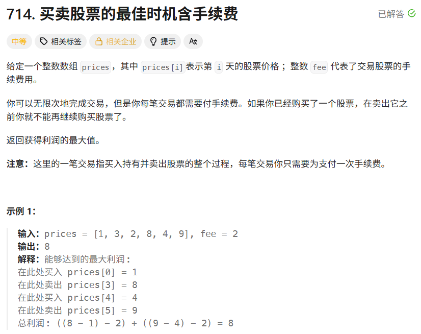
时间99.76%，空间80.96%
```java
class Solution {

    public int maxProfit(int[] prices, int fee) {

        // 每天要么在买，要么在卖

        // 每一天的没必要都记住，记住最大的就行了，所以其实只要两个变量

        // 和II的区别就是有个手续费了，感觉在每次买的时候考虑一下手续费就好了

        // 买的话能获得的最大利润 = max(之前买的最大利润, 前面卖的最大利润 - 当天股票价格 - 手续费)

        // 卖的话能获得的最大利润 = max(之前卖的最大利润, 前面买的最大利润 + 当天股票价格)

        // 当天确实也可以多次买卖，不过不是白亏手续费嘛，没必要

        int sellMax = 0;

        int buyMax = -prices[0] - fee;

        for(int i = 1;i < prices.length;i++){

            buyMax = Math.max(buyMax, sellMax - prices[i] - fee);

            sellMax = Math.max(sellMax, buyMax + prices[i]);

        }

        return sellMax;

    }

}
```
### 300.最长递增子序列
见hot100
### 674.最长连续递增子序列
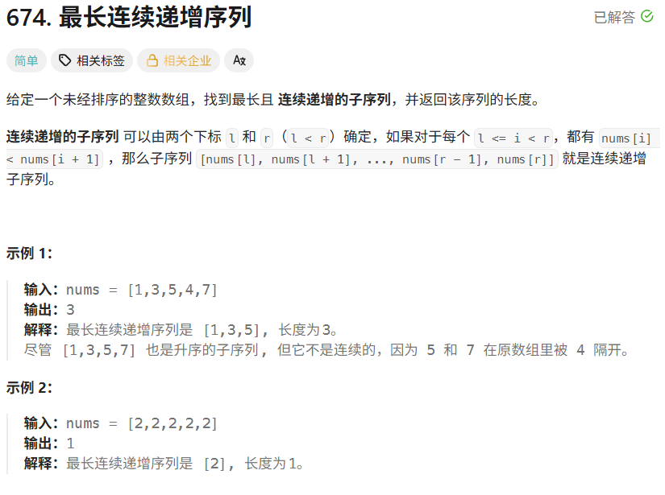
时间47.66%，空间26.47%
```java
class Solution {

    public int findLengthOfLCIS(int[] nums) {

        // 定义dp[i]为以下标i为结尾的最长连续递增序列的长度

        // if nums[i] > nums[i - 1] dp[i] = dp[i - 1] + 1;

        // else dp[i] = 1;

        int n = nums.length;

        int[] dp = new int[n];

        dp[0] = 1;

        int max = 1;

        for(int i = 1;i < n;i++){

            if (nums[i] > nums[i - 1]) {

                dp[i] = dp[i - 1] + 1;

            } else {

                dp[i] = 1;

            }

            max = Math.max(max, dp[i]);

        }

        return max;

    }

}
```
dp\[i]只和前一个有关可以简化到只用一个变量
时间100.00%，空间13.05%
```java
class Solution {

    public int findLengthOfLCIS(int[] nums) {

        int n = nums.length;

        int curr = 1;

        int max = 1;

        for(int i = 1;i < n;i++){

            if (nums[i] > nums[i - 1]) {

                curr++;

            } else {

                curr = 1;

            }

            max = Math.max(max, curr);

        }

        return max;

    }

}
```
### ★★★718.最长重复子数组
```java
class Solution {

    public int findLength(int[] nums1, int[] nums2) {

        // 定义dp[i][j] 表示 nums1[0:i] nums2[0:j]的最长公共后缀

        // 直接定义两个区间的公共子数组不好搞，转到公共前/后缀就可以了

        // 如果nums1[i] = nums2[j] 那么dp[i][j] = dp[i - 1][j - 1] + 1

        // 否则就为0，其中的最大值就是所求

        int max = 0;

        int n1 = nums1.length;

        int n2 = nums2.length;

        int[][] dp = new int[n1][n2];

        for(int i = 0;i < n1;i++){

            if(nums1[i] == nums2[0]){

                dp[i][0] = 1;

                max = 1;

            }

        }

        for(int j = 0;j < n2;j++){

            if(nums1[0] == nums2[j]){

                dp[0][j] = 1;

                max = 1;

            }

        }

        for(int i = 1;i < n1;i++){

            for(int j = 1;j < n2;j++){

                if(nums1[i] == nums2[j]){

                    dp[i][j] = dp[i - 1][j - 1] + 1;

                    max = Math.max(max, dp[i][j]);

                }

            }

        }

        return max;

    }

}
```
### ★★★1143.最长公共子序列
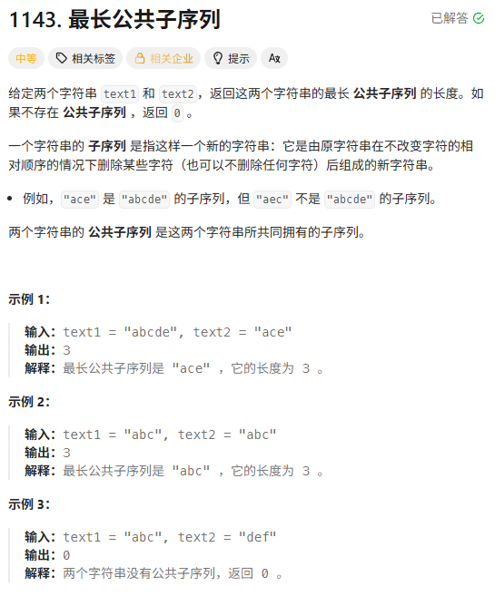
时间93.81%，空间87.10%
```java
class Solution {

    public int longestCommonSubsequence(String text1, String text2) {

        // 定义dp[i][j]表示text1[0:i]和text2[0:j]的最长公共子序列的长度

        // 如果有text1[i] == text2[j] 有dp[i][j] = dp[i - 1][j - 1] + 1

        // 如果不等于呢，这时候其中一个字符串可能引入了另外一个前面的字符(以j+为例)

        // 最长公共子序列还是会加，这种情况包括在了dp[i - 1][j]

        // 和dp[i][j - 1]中了，取其中最大的就行了

        // 可以理解为，j是多引入了另外一个的前面的字符嘛

        // 那么这个情况是在前面（dp[前面的相同字符处][j]）是会记录到的

        // 而这个情况是会一直传递到后面

        // dp[i - 1][j]和dp[i][j - 1]就是取前面的情况了

        int l1 = text1.length();

        int l2 = text2.length();

        int[][] dp = new int[l1][l2];

        char[] c1 = text1.toCharArray();

        char[] c2 = text2.toCharArray();

        dp[0][0] = c1[0] == c2[0] ? 1:0;

        for(int i = 1;i < l1;i++){

            if(c1[i] == c2[0]) dp[i][0] = 1;

            else dp[i][0] = dp[i - 1][0];

        }

        for(int j = 1;j < l2;j++){

            if(c1[0] == c2[j]) dp[0][j] = 1;

            else dp[0][j] = dp[0][j - 1];

        }

        for(int i = 1;i < l1;i++){

            for(int j = 1;j < l2;j++){

                if(c1[i] == c2[j]) dp[i][j] = dp[i - 1][j - 1] + 1;

                else dp[i][j] = Math.max(dp[i - 1][j], dp[i][j - 1]);

            }

        }

        return dp[l1 - 1][l2 - 1];

    }

}
```
### 1035.不相交的线
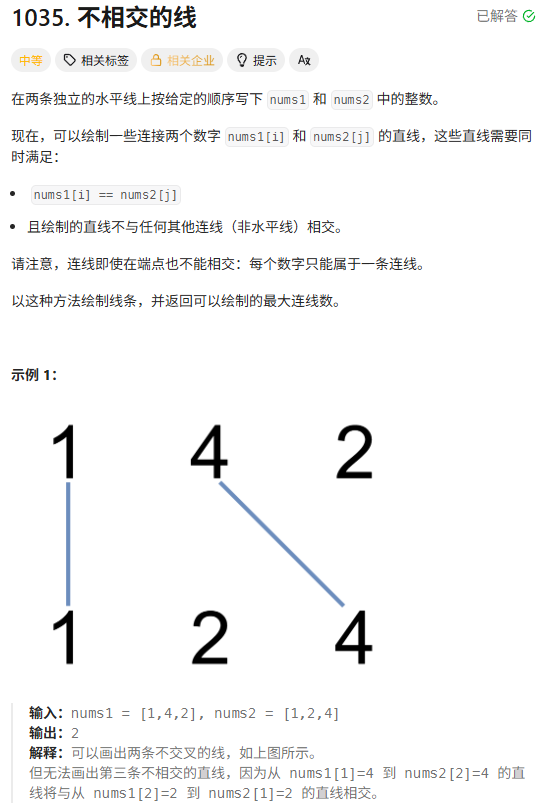
时间93.32%，空间91.95%
```java
class Solution {

    public int maxUncrossedLines(int[] nums1, int[] nums2) {

        // 只要一个个按顺序连，那么线之间就不会相交

        // 这其实就可以转化为1143.最长公共子序列

        // 定义dp[i][j] 表示nums1[0:i]和nums2[0:j]的最长公共子序列

        // nums1[i] == nums2[j] dp[i][j] = dp[i - 1]dp[j - 1] + 1

        // != -> dp[i][j] = Math.max(dp[i][j - 1], dp[i - 1][j])

        int n1 = nums1.length;

        int n2 = nums2.length;

        int[][] dp = new int[n1][n2];

        dp[0][0] = nums1[0] == nums2[0] ? 1:0;

        for(int i = 1;i < n1;i++){

            if(nums1[i] == nums2[0]) dp[i][0] = 1;

            else dp[i][0] = dp[i - 1][0];

        }

        for(int j = 1;j < n2;j++){

            if(nums1[0] == nums2[j]) dp[0][j] = 1;

            else dp[0][j] = dp[0][j - 1];

        }

        for(int i = 1;i < n1;i++){

            for(int j = 1;j < n2;j++){

                if(nums1[i] == nums2[j]) dp[i][j] = dp[i - 1][j - 1] + 1;

                else dp[i][j] = Math.max(dp[i- 1][j], dp[i][j - 1]);

            }

        }

        return dp[n1 - 1][n2 - 1];

    }

}
```
### 53.最大子数组和
见hot100
### 392.判断子序列
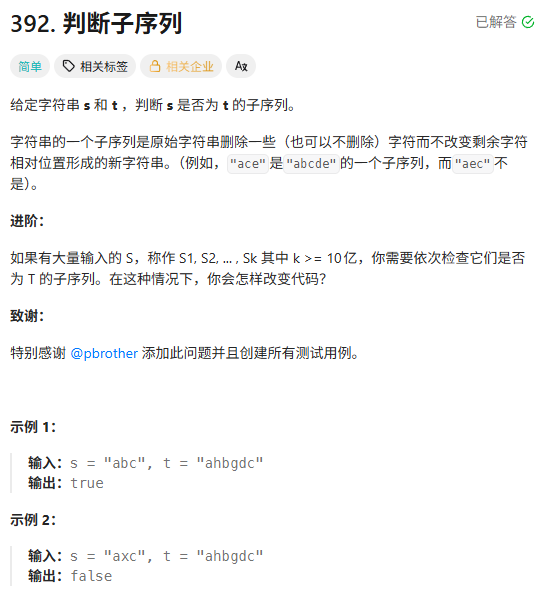
时间92.25%，空间33.62%
```java
class Solution {

    public boolean isSubsequence(String s, String t) {

       // t中能按顺序出现s中的字符，那么s就是t的子序列了

       // 哪怕有重复也是没关系的，比如s = abc  t = ababc

       // 前两个ab把find移动到2了也是没事的，没影响，后面只要还有c就行

       int sl = s.length();

       int tl = t.length();

       if(sl > tl) return false;

       int find = 0; // t中按顺序来也已经有了s中的多少个字符

       for(int i = 0;i < tl;i++){

            if(find == sl) return true;

            if(t.charAt(i) == s.charAt(find)) find++;

       }

       return find == sl;

    }

}
```
### ★★★115.不同的子序列
思路：
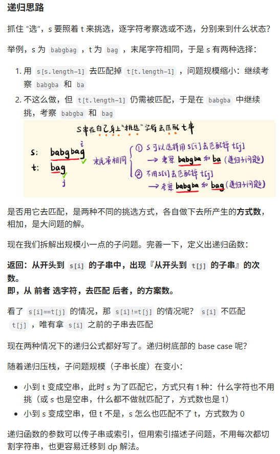
时间54.34%，空间34.91%
```java
class Solution {

    public int numDistinct(String s, String t) {

        int sl = s.length();

        int tl = t.length();

        if(sl < tl) return 0;

        int[][] dp = new int[sl][tl];

        int count = 0;

        for(int i = 0;i < sl;i++){

            if(s.charAt(i) == t.charAt(0)) count++;

            dp[i][0] = count;

        }

        for(int i = 1;i < sl;i++){

            for(int j = 1;j < tl;j++){

                if(s.charAt(i) == t.charAt(j)){

                    dp[i][j] = dp[i - 1][j - 1] + dp[i - 1][j];

                } else dp[i][j] = dp[i - 1][j];

            }

        }

        return dp[sl - 1][tl - 1];

    }

}
```
### 583.两个字符串的删除操作
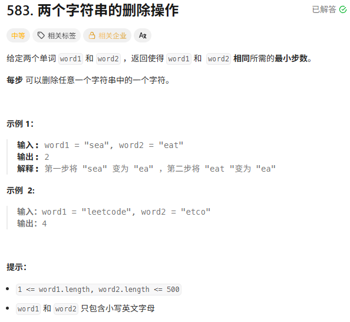
时间70.50%，空间5.19%
```java
class Solution {

    public int minDistance(String word1, String word2) {

        // 还是找最长公共子序列，求出其长度

        // 然后两个字符串都减去这个长度再相加就可以了

        int l1 = word1.length();

        int l2 = word2.length();

        int[][] dp = new int[l1][l2];

        dp[0][0] = word1.charAt(0) == word2.charAt(0) ? 1:0;

        for(int i = 1;i < l1;i++){

            if(word1.charAt(i) == word2.charAt(0)) dp[i][0] = 1;

            else dp[i][0] = dp[i - 1][0];

        }

        for(int j = 1;j < l2;j++){

            if(word1.charAt(0) == word2.charAt(j)) dp[0][j] = 1;

            else dp[0][j] = dp[0][j - 1];

        }

        for(int i = 1;i < l1;i++){

            for(int j = 1;j < l2;j++){

                if(word1.charAt(i) == word2.charAt(j)) dp[i][j] = dp[i - 1][j - 1] + 1;

                else dp[i][j] = Math.max(dp[i - 1][j], dp[i][j - 1]);

            }

        }

        return l1 + l2 - 2 * dp[l1 - 1][l2 - 1];

    }

}
```
### 72.编辑距离
见hot100
### 647.回文子串
见hot100
### 516.最长回文子序列
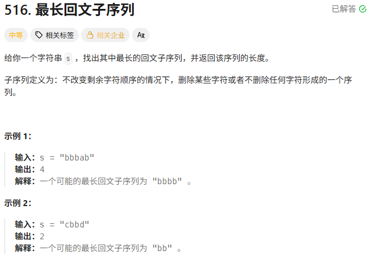
时间90.50%，空间32.08%
```java
class Solution {

    public int longestPalindromeSubseq(String s) {

        // 定义dp[i][j] 表示[i:j]区间上的最长回文子序列

        // 如果s[i] = s[j] 那么dp[i][j] = dp[i + 1][j - 1] + 2

        // 如果s[i] != s[j] 那么i,j不可能同时作为[i + 1:j - 1]内任何一个回文子序列的首尾

        // 这时dp[i][j] = Math.max(dp[i + 1][j],  dp[i][j - 1])

        // 两边的可能有一个使原来的回文子序列发生了扩展

        char[] sa = s.toCharArray();

        int length = sa.length;

        int[][] dp = new int[length][length];

        for(int i = 0;i <length;i++){

            dp[i][i] = 1;

        }

        for(int i = length - 1;i >= 0;i--){

            for(int j = i + 1;j < length;j++){

                if(sa[i] == sa[j]) dp[i][j] = dp[i + 1][j - 1] + 2;

                else dp[i][j] = Math.max(dp[i + 1][j], dp[i][j - 1]);

            }

        }

        return dp[0][length - 1];

    }

}
```
## 单调栈
### 739.每日温度
见hot100
### 496.下一个更大元素I
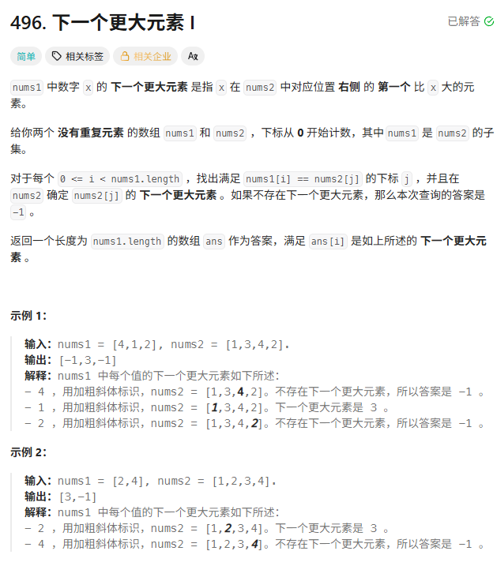
自己想的
时间99.01%，空间88.19%
```java
class Solution {

    public int[] nextGreaterElement(int[] nums1, int[] nums2) {

        // 找到位置后再往后找下一个更大元素

        // 没有重复的话可以用哈希表记住位置

        Map<Integer, Integer> queryPos = new HashMap<>();

        for(int i = 0;i < nums2.length;i++){

            queryPos.put(nums2[i], i);

        }

  

        int[] res = new int[nums1.length];

        for(int i = 0;i < nums1.length;i++){

            res[i] = findNext(nums1[i], nums2, queryPos.get(nums1[i]));

        }

        return res;

    }

  

    private int findNext(int num, int[] nums2, int pos){

        for(int i = pos + 1;i < nums2.length;i++){

            if(nums2[i] > num) return nums2[i];

        }

        return -1;

    }

}
```
题解：单调栈+哈希表
时间80.28%，空间78.94%
```java
class Solution {

    public int[] nextGreaterElement(int[] nums1, int[] nums2) {

        // 借助单调栈把nums2中每个数的下一个更大元素找出来，用哈希表存一下

        // 然后遍历nums1，把结果查出来组织一下就是

        Map<Integer, Integer> queryRes = new HashMap<>();

        Stack<Integer> tool = new Stack<>();

        // 每个元素把前面小的元素都弹出栈去（栈内元素是 小->大）

        // 被弹元素一定是被它的下一个更大的元素弹的（而且是一定能弹出去的）

        // 记住它们两个就行了

        for(int i = 0;i < nums2.length;i++){

            while(!tool.isEmpty() && tool.peek() < nums2[i]){

                queryRes.put(tool.pop(), nums2[i]);

            }

            tool.push(nums2[i]);

        }

        int[] res = new int[nums1.length];

        for(int i = 0;i < nums1.length;i++){

            if(queryRes.containsKey(nums1[i])) res[i] = queryRes.get(nums1[i]);

            else res[i] = -1;

        }

        return res;

    }

}
```
### 503.下一个更大元素II
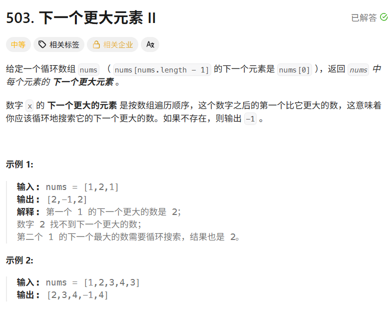
时间35.13%，空间12.08%
```java
class Solution {

    public int[] nextGreaterElements(int[] nums) {

        // 这里需要按索引来填下一个最大的数

        // 所以stack里面放索引会好一点，毕竟数有重复了，而且数可以通过索引获得

        int n = nums.length;

        int[] res = new int[n];

        Stack<Integer> tool = new Stack<>();

        for(int i = 0;i < n;i++){

            while(!tool.isEmpty() && nums[tool.peek()] < nums[i]){

                res[tool.pop()] = nums[i];

            }

            tool.push(i);

        }

        // II是循环数组，所以后面没排出去的元素需要再遍历一次找到第一个比他们大的数

        // 把他们排出去，这里第二轮的数不用入栈，只需要排别人

        for(int i = 0;i < n;i++){

            while(!tool.isEmpty() && nums[i] > nums[tool.peek()]){

                res[tool.pop()] = nums[i];

            }

        }

        // 会剩下最大的数，把它们置为-1

        while(!tool.isEmpty()){

            res[tool.pop()] = -1;

        }

        return res;

    }

}
```
### 42.接雨水
见hot100
### 84.柱状图中的最大矩形
见hot100


