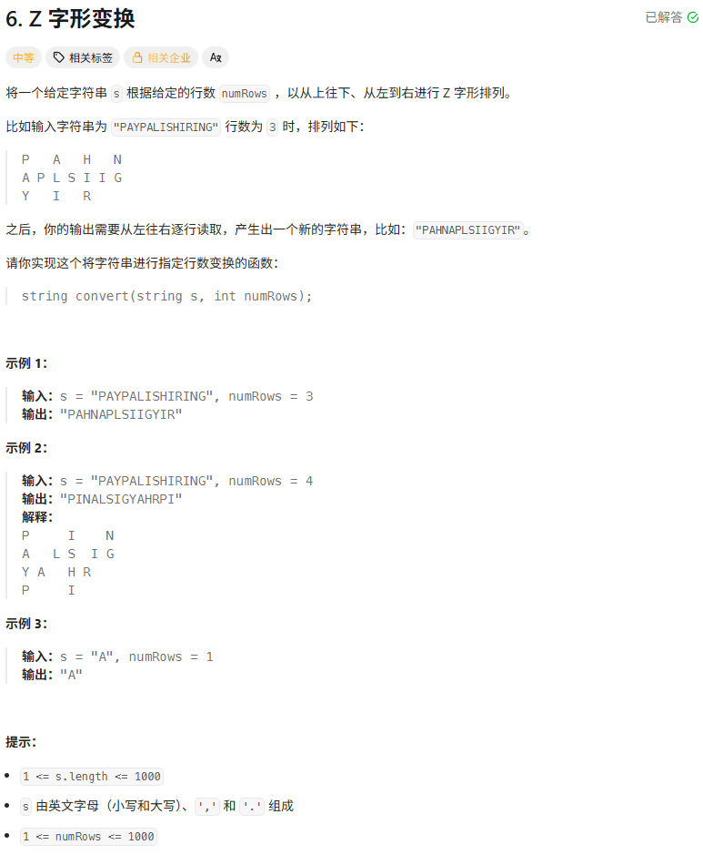
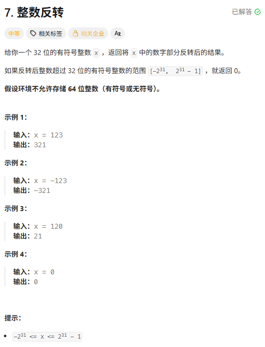
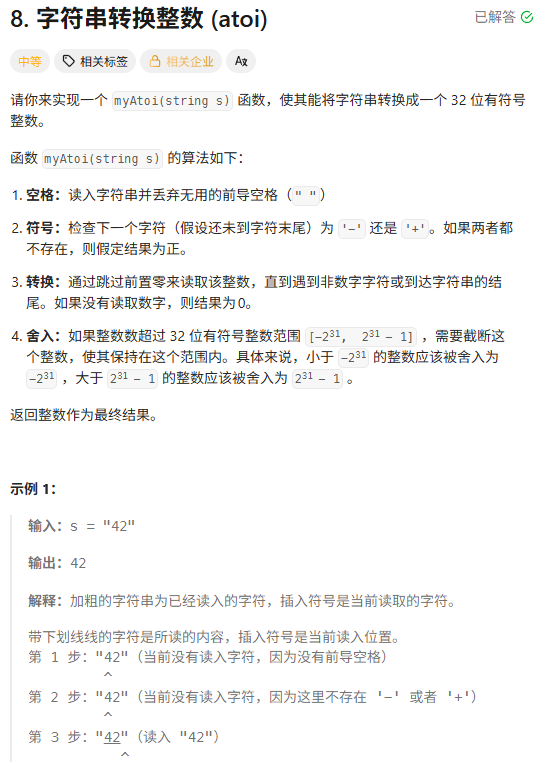
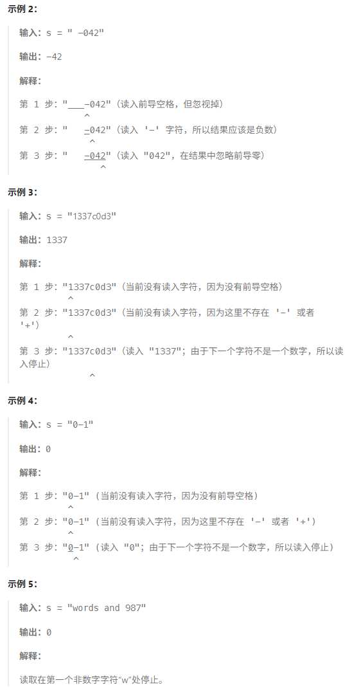
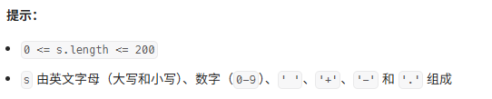

### 6.Z字形变换
题目：

第一版
思路：模拟反N字形排列，计算出每个字符应该在的位置，用一个数组先存着然后再依次读取字符拼接。
时空：时间16.94%，空间13.37%
代码：
```java
class Solution {

    public String convert(String s, int numRows) {

        if(numRows == 1) return s;

        // 其实是反N排列

        // 大概分为两种行走路线  竖直下行 斜向上行

        // down numRows个  up numRows - 2个

        // 2 * numRows - 2 为一组 对其取余后再计算位置

        char[] sArray = s.toCharArray();

        if(numRows == 2) {

            StringBuilder sb = new StringBuilder();

            for(int i = 0;i < sArray.length;i+=2){

                sb.append(sArray[i]);

            }

            for(int i = 1;i < sArray.length;i+=2){

                sb.append(sArray[i]);

            }

            return sb.toString();

        }

        int group = 2 * (numRows - 1); // 一组有多少个数

        char[][] memory = new char[numRows][(sArray.length / group + 1) * (group - numRows + 1)];

        int i = 0; // 排到第几个字母了

        int row = 0; // 行号

        int column = 0;  // 列号

        while(i < sArray.length){

            int index = i % group; // 在一组中的序号

            if(index < numRows){

                // down

                memory[row][column] = sArray[i];

                row++;

            } else {

                // up

                if(index == numRows){

                    column++;

                    row -= 2;

                } else {

                    column++;

                    row--;

                }

                memory[row][column] = sArray[i];

                if(index == 2 * (numRows - 1) - 1){

                    column++;

                    row--;

                }

            }

            i++;

        }

  

        StringBuilder sb = new StringBuilder();

        int k = 0; // 记了多少了

        for(int p = 0;p < numRows;p++){

            if(k == sArray.length) break;

            for(int q = 0;q <= column;q++){

                if(k == sArray.length) break;

                if(memory[p][q] != '\u0000') sb.append(memory[p][q]);

            }

        }

        return sb.toString();

    }

}
```
第二版
思路：最后的拼接其实遍历的很多空位置，浪费时间，可以直接在计算出每个字符的位置的时候拼接上去。（因为每一行的字符都是按原始索引大小依次出现的，小的在行中也排在前面）
时空：时间37.12%，空间12.96%
代码：
```java
class Solution {

    public String convert(String s, int numRows) {

        if(numRows == 1) return s;

        // 其实是反N排列

        // 大概分为两种行走路线  竖直下行 斜向上行

        // down numRows个  up numRows - 2个

        // 2 * numRows - 2 为一组 对其取余后再计算位置

        char[] sArray = s.toCharArray();

        if(numRows == 2) {

            StringBuilder sb = new StringBuilder();

            for(int i = 0;i < sArray.length;i+=2){

                sb.append(sArray[i]);

            }

            for(int i = 1;i < sArray.length;i+=2){

                sb.append(sArray[i]);

            }

            return sb.toString();

        }

        int group = 2 * (numRows - 1); // 一组有多少个数

        char[][] memory = new char[numRows][(sArray.length / group + 1) * (group - numRows + 1)];

        int i = 0; // 排到第几个字母了

        int row = 0; // 行号

        int column = 0;  // 列号

        StringBuilder[] sbs = new StringBuilder[numRows];// 用来存每一行的字母

        for(int u = 0;u < numRows;u++){

            sbs[u] = new StringBuilder();

        }

        while(i < sArray.length){

            int index = i % group; // 在一组中的序号

            if(index < numRows){

                // down

                memory[row][column] = sArray[i];

                sbs[row].append(sArray[i]);

                row++;

            } else {

                // up

                if(index == numRows){

                    column++;

                    row -= 2;

                } else {

                    column++;

                    row--;

                }

                sbs[row].append(sArray[i]);

                memory[row][column] = sArray[i];

                if(index == 2 * (numRows - 1) - 1){

                    column++;

                    row--;

                }

            }

            i++;

        }

        StringBuilder sb = new StringBuilder();

        for(int u = 0;u < numRows;u++){

            sb.append(sbs[u]);

        }

        return sb.toString();

    }

}
```
第三版
思路：在第二版的基础上发现，其实都不用完全模拟，不用计算出每个字符的确切位置，不用知道列号，算出行号就可以了。
时空：时间82.66%，空间73.76%
代码：
```java
class Solution {

    public String convert(String s, int numRows) {

        if(numRows == 1) return s;

        char[] sArray = s.toCharArray();

        if(numRows == 2) {

            StringBuilder sb = new StringBuilder();

            for(int i = 0;i < sArray.length;i+=2){

                sb.append(sArray[i]);

            }

            for(int i = 1;i < sArray.length;i+=2){

                sb.append(sArray[i]);

            }

            return sb.toString();

        }

        int group = 2 * (numRows - 1); // 一组有多少个数

        int i = 0; // 排到第几个字母了

        int row = 0; // 行号

        StringBuilder[] sbs = new StringBuilder[numRows];// 用来存每一行的字母

        for(int u = 0;u < numRows;u++){

            sbs[u] = new StringBuilder();

        }

        while(i < sArray.length){

            int index = i % group; // 在一组中的序号

            if(index < numRows){

                // down

                sbs[row].append(sArray[i]);

                row++;

            } else {

                // up

                if(index == numRows){

                    row -= 2;

                } else {

                    row--;

                }

                sbs[row].append(sArray[i]);

                if(index == 2 * (numRows - 1) - 1){

                    row--;

                }

            }

            i++;

        }

        StringBuilder sb = new StringBuilder();

        for(int u = 0;u < numRows;u++){

            sb.append(sbs[u]);

        }

        return sb.toString();

    }

}
```
### 7.整数反转
题目：

实现1
思路：先转字符串反转，然后再转回去
时空：时间21.77%，空间55.90%
代码：
```java
class Solution {

    public int reverse(int x) {

        char[] xca = Integer.toString(x).toCharArray();

        int left = x < 0 ? 1:0;

        int right = xca.length - 1;

        while(left < right){

            char temp = xca[left];

            xca[left] = xca[right];

            xca[right] = temp;

            left++;

            right--;

        }

        int res = 0;

        // .parseInt抛异常就是超出了整数范围了，返回0

        try{

            res = Integer.parseInt(new String(xca));

        }catch(Exception e){

            return res;

        }

        return res;

    }

}
```
实现2
思路：获取到新的一位后，把前面的 * 10 + 新的一位就好了，这样最终可以获取到反转后的结果。然后每次乘之前判断一下乘完会不会溢出。
时空：时间97.31%，空间77.13%
代码：
```java
class Solution {

    public int reverse(int x) {

        int xabs = Math.abs(x);

        int res = 0;

        while(xabs > 0){

            int pop = xabs % 10;

            // 如果 res > Integer.MAX_VALUE / 10，那么 *10 必定溢出

            // 如果 res == Integer.MAX_VALUE / 10，且 pop > 7

            // (因为 MAX_VALUE 最后一位是7)，则溢出

            if (res > Integer.MAX_VALUE / 10

                || (res == Integer.MAX_VALUE / 10 && pop > 7)) {

                return 0;

            }

            res = res * 10 + pop;

            xabs /= 10;

        }

        return x < 0 ? -1 * res:res;

    }

}
```
### 8.字符串转换整数（atoi）
题目：



思路：按题目说的步骤一步步模拟就是
时空：时间100.00%，空间88.70%
代码：
```java
class Solution {

    public int myAtoi(String s) {

        char[] sa = s.toCharArray();

        int l = sa.length;

        int i = 0; // 当前处理到第几位了

        // 空格

        while(i < l && sa[i] == ' '){

            i++;

        }

  

        // 符号

        boolean flag = true; // 看是正数还是负数 true -> 正数 false -> 负数

        if (i < l && sa[i] == '+') {

            i++;

        } else if (i < l && sa[i] == '-') {

            i++;

            flag = false;

        }

        // 转换

        int res = 0;

        // 跳过前导0

        while(i < l && sa[i] == '0'){

            i++;

        }

        while(i < l){

            // 是数字

            if (sa[i] >= '0' && sa[i]<= '9') {

                int now = sa[i] - '0';

                if (flag) {

                    if(res > Integer.MAX_VALUE / 10 ||

                    (res == Integer.MAX_VALUE / 10 && now >= 7)){

                        return Integer.MAX_VALUE;

                    }

                } else {

                    if(res > Integer.MAX_VALUE / 10 ||

                    (res == Integer.MAX_VALUE / 10 && now >= 8)){

                        return Integer.MIN_VALUE;

                    }

                }

                res = res * 10 + now;

            } else break;

            i++;

        }

        if (flag) return res;

        else return -1 * res;

    }

}
```
### XXX.XXXX
题目：
思路：
时空：
代码：
```java

```