### 6.Z字形变换
题目：

第一版
思路：模拟反N字形排列，计算出每个字符应该在的位置，用一个数组先存着然后再依次读取字符拼接。
时空：时间16.94%，空间13.37%
代码：
```java
class Solution {

    public String convert(String s, int numRows) {

        if(numRows == 1) return s;

        // 其实是反N排列

        // 大概分为两种行走路线  竖直下行 斜向上行

        // down numRows个  up numRows - 2个

        // 2 * numRows - 2 为一组 对其取余后再计算位置

        char[] sArray = s.toCharArray();

        if(numRows == 2) {

            StringBuilder sb = new StringBuilder();

            for(int i = 0;i < sArray.length;i+=2){

                sb.append(sArray[i]);

            }

            for(int i = 1;i < sArray.length;i+=2){

                sb.append(sArray[i]);

            }

            return sb.toString();

        }

        int group = 2 * (numRows - 1); // 一组有多少个数

        char[][] memory = new char[numRows][(sArray.length / group + 1) * (group - numRows + 1)];

        int i = 0; // 排到第几个字母了

        int row = 0; // 行号

        int column = 0;  // 列号

        while(i < sArray.length){

            int index = i % group; // 在一组中的序号

            if(index < numRows){

                // down

                memory[row][column] = sArray[i];

                row++;

            } else {

                // up

                if(index == numRows){

                    column++;

                    row -= 2;

                } else {

                    column++;

                    row--;

                }

                memory[row][column] = sArray[i];

                if(index == 2 * (numRows - 1) - 1){

                    column++;

                    row--;

                }

            }

            i++;

        }

  

        StringBuilder sb = new StringBuilder();

        int k = 0; // 记了多少了

        for(int p = 0;p < numRows;p++){

            if(k == sArray.length) break;

            for(int q = 0;q <= column;q++){

                if(k == sArray.length) break;

                if(memory[p][q] != '\u0000') sb.append(memory[p][q]);

            }

        }

        return sb.toString();

    }

}
```
第二版
思路：最后的拼接其实遍历的很多空位置，浪费时间，可以直接在计算出每个字符的位置的时候拼接上去。（因为每一行的字符都是按原始索引大小依次出现的，小的在行中也排在前面）
时空：时间37.12%，空间12.96%
代码：
```java
class Solution {

    public String convert(String s, int numRows) {

        if(numRows == 1) return s;

        // 其实是反N排列

        // 大概分为两种行走路线  竖直下行 斜向上行

        // down numRows个  up numRows - 2个

        // 2 * numRows - 2 为一组 对其取余后再计算位置

        char[] sArray = s.toCharArray();

        if(numRows == 2) {

            StringBuilder sb = new StringBuilder();

            for(int i = 0;i < sArray.length;i+=2){

                sb.append(sArray[i]);

            }

            for(int i = 1;i < sArray.length;i+=2){

                sb.append(sArray[i]);

            }

            return sb.toString();

        }

        int group = 2 * (numRows - 1); // 一组有多少个数

        char[][] memory = new char[numRows][(sArray.length / group + 1) * (group - numRows + 1)];

        int i = 0; // 排到第几个字母了

        int row = 0; // 行号

        int column = 0;  // 列号

        StringBuilder[] sbs = new StringBuilder[numRows];// 用来存每一行的字母

        for(int u = 0;u < numRows;u++){

            sbs[u] = new StringBuilder();

        }

        while(i < sArray.length){

            int index = i % group; // 在一组中的序号

            if(index < numRows){

                // down

                memory[row][column] = sArray[i];

                sbs[row].append(sArray[i]);

                row++;

            } else {

                // up

                if(index == numRows){

                    column++;

                    row -= 2;

                } else {

                    column++;

                    row--;

                }

                sbs[row].append(sArray[i]);

                memory[row][column] = sArray[i];

                if(index == 2 * (numRows - 1) - 1){

                    column++;

                    row--;

                }

            }

            i++;

        }

        StringBuilder sb = new StringBuilder();

        for(int u = 0;u < numRows;u++){

            sb.append(sbs[u]);

        }

        return sb.toString();

    }

}
```
第三版
思路：在第二版的基础上发现，其实都不用完全模拟，不用计算出每个字符的确切位置，不用知道列号，算出行号就可以了。
时空：时间82.66%，空间73.76%
代码：
```java
class Solution {

    public String convert(String s, int numRows) {

        if(numRows == 1) return s;

        char[] sArray = s.toCharArray();

        if(numRows == 2) {

            StringBuilder sb = new StringBuilder();

            for(int i = 0;i < sArray.length;i+=2){

                sb.append(sArray[i]);

            }

            for(int i = 1;i < sArray.length;i+=2){

                sb.append(sArray[i]);

            }

            return sb.toString();

        }

        int group = 2 * (numRows - 1); // 一组有多少个数

        int i = 0; // 排到第几个字母了

        int row = 0; // 行号

        StringBuilder[] sbs = new StringBuilder[numRows];// 用来存每一行的字母

        for(int u = 0;u < numRows;u++){

            sbs[u] = new StringBuilder();

        }

        while(i < sArray.length){

            int index = i % group; // 在一组中的序号

            if(index < numRows){

                // down

                sbs[row].append(sArray[i]);

                row++;

            } else {

                // up

                if(index == numRows){

                    row -= 2;

                } else {

                    row--;

                }

                sbs[row].append(sArray[i]);

                if(index == 2 * (numRows - 1) - 1){

                    row--;

                }

            }

            i++;

        }

        StringBuilder sb = new StringBuilder();

        for(int u = 0;u < numRows;u++){

            sb.append(sbs[u]);

        }

        return sb.toString();

    }

}
```
### 7.整数反转
题目：

实现1
思路：先转字符串反转，然后再转回去
时空：时间21.77%，空间55.90%
代码：
```java
class Solution {

    public int reverse(int x) {

        char[] xca = Integer.toString(x).toCharArray();

        int left = x < 0 ? 1:0;

        int right = xca.length - 1;

        while(left < right){

            char temp = xca[left];

            xca[left] = xca[right];

            xca[right] = temp;

            left++;

            right--;

        }

        int res = 0;

        // .parseInt抛异常就是超出了整数范围了，返回0

        try{

            res = Integer.parseInt(new String(xca));

        }catch(Exception e){

            return res;

        }

        return res;

    }

}
```
实现2
思路：获取到新的一位后，把前面的 * 10 + 新的一位就好了，这样最终可以获取到反转后的结果。然后每次乘之前判断一下乘完会不会溢出。
时空：时间97.31%，空间77.13%
代码：
```java
class Solution {

    public int reverse(int x) {

        int xabs = Math.abs(x);

        int res = 0;

        while(xabs > 0){

            int pop = xabs % 10;

            // 如果 res > Integer.MAX_VALUE / 10，那么 *10 必定溢出

            // 如果 res == Integer.MAX_VALUE / 10，且 pop > 7

            // (因为 MAX_VALUE 最后一位是7)，则溢出

            if (res > Integer.MAX_VALUE / 10

                || (res == Integer.MAX_VALUE / 10 && pop > 7)) {

                return 0;

            }

            res = res * 10 + pop;

            xabs /= 10;

        }

        return x < 0 ? -1 * res:res;

    }

}
```
### 8.字符串转换整数（atoi）
题目：


思路：按题目说的步骤一步步模拟就是
时空：时间100.00%，空间88.70%
代码：
```java
class Solution {

    public int myAtoi(String s) {

        char[] sa = s.toCharArray();

        int l = sa.length;

        int i = 0; // 当前处理到第几位了

        // 空格

        while(i < l && sa[i] == ' '){

            i++;

        }

  

        // 符号

        boolean flag = true; // 看是正数还是负数 true -> 正数 false -> 负数

        if (i < l && sa[i] == '+') {

            i++;

        } else if (i < l && sa[i] == '-') {

            i++;

            flag = false;

        }

        // 转换

        int res = 0;

        // 跳过前导0

        while(i < l && sa[i] == '0'){

            i++;

        }

        while(i < l){

            // 是数字

            if (sa[i] >= '0' && sa[i]<= '9') {

                int now = sa[i] - '0';

                if (flag) {

                    if(res > Integer.MAX_VALUE / 10 ||

                    (res == Integer.MAX_VALUE / 10 && now >= 7)){

                        return Integer.MAX_VALUE;

                    }

                } else {

                    if(res > Integer.MAX_VALUE / 10 ||

                    (res == Integer.MAX_VALUE / 10 && now >= 8)){

                        return Integer.MIN_VALUE;

                    }

                }

                res = res * 10 + now;

            } else break;

            i++;

        }

        if (flag) return res;

        else return -1 * res;

    }

}
```
### 9.回文数
题目：
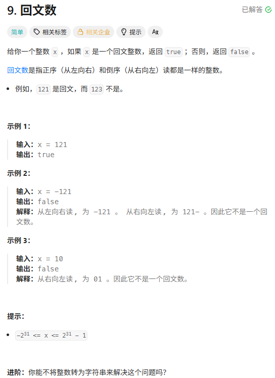
思路：把x倒转一下看和原来的x相不相等就好了
时空：时间93.37%，空间98.64%
代码：
```java
class Solution {

    public boolean isPalindrome(int x) {

        if (x < 0) return false;

        int xCopy = x;

        int revert = 0;

        while(xCopy > 0){

            int now = xCopy % 10;

            revert = revert * 10 + now;

            xCopy /= 10;

        }

        return revert == x;

    }

}
```
### 12.整数转罗马数字
题目：
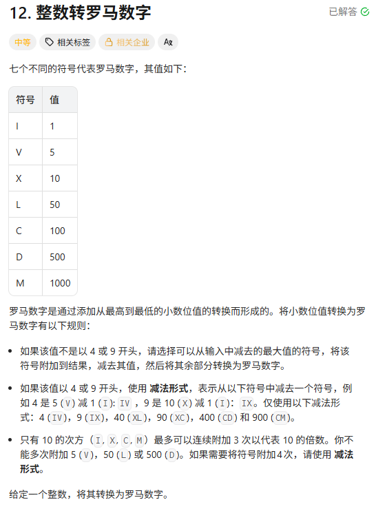
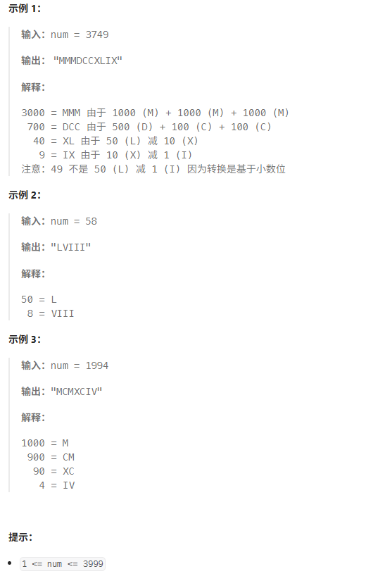
思路：模拟，每个位置按规则转换就是
时空：时间99.69%，空间87.02%
代码：
```java
class Solution {

    public String intToRoman(int num) {

        StringBuilder sb = new StringBuilder();

        int pos = 1; // 1 个位 2 十位 3 百位 4 千位

        while (num > 0) {

            int now = num % 10;

            // 4 -> 5 - 1 | 9 -> 10 - 1 | 其他用5和1加

            if (now == 4) {

                if (pos == 1) sb.insert(0, "IV");

                else if (pos == 2) sb.insert(0, "XL");

                else if (pos == 3) sb.insert(0, "CD");

                else sb.insert(0, "MMMM");

            } else if (now == 9) {

                if (pos == 1) sb.insert(0, "IX");

                else if (pos == 2) sb.insert(0, "XC");

                else if (pos == 3) sb.insert(0, "CM");

                else sb.insert(0, "MMMMMMMMM");

            } else{

                int oneCount = now >= 5 ? now - 5:now;

                String fiveChar;

                String oneChar;

                switch (pos) {

                    case 1:

                        fiveChar = "V";

                        oneChar = "I";

                        break;

                    case 2:

                        fiveChar = "L";

                        oneChar = "X";  

                        break;

                    case 3:

                        fiveChar = "D";

                        oneChar = "C";

                        break;

                    default :

                        fiveChar = "MMMMM";

                        oneChar = "M";

                }

                for (int i = 0;i < oneCount;i++) {

                    sb.insert(0, oneChar);

                }

                if( now >= 5 ) sb.insert(0, fiveChar);

            }

            num /= 10;

            pos++;

        }

        return sb.toString();

    }

}
```
### 13.罗马数字转整数
题目：
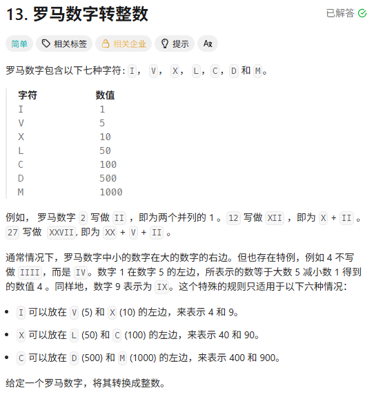
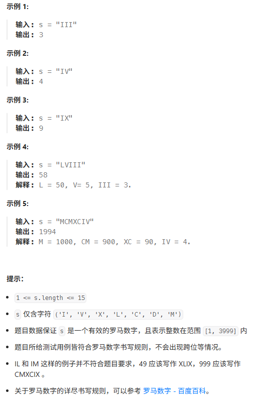
思路：除了1+5和1+10的组合是要减的，其他情况都遇到什么字符加起来就好了，所以遇到每个字符可以先判断和后面的字符组合是不是1+5和1+10的组合，是就加上它们相减，不是就看自己这个字符是什么，加起来就好了。
时空：时间76.31%，空间95.56%
代码：
```java
class Solution {

    public int romanToInt(String s) {

        int sum = 0;

        int i = 0;

        while(i < s.length()){

            int now = 0;

            // 遇到1 + 5  1 + 10的组合就知道是减

            if(i < s.length() - 1){

                switch (s.substring(i, i + 2)){

                case "IV" : now += 4;i += 2;break;

                case "IX" : now += 9;i += 2;break;

                case "XL" : now += 40;i += 2;break;

                case "XC" : now += 90;i += 2;break;

                case "CD" : now += 400;i += 2;break;

                case "CM" : now += 900;i += 2;break;

                }

            }

            // 没找到组合,是单个的

            if (now == 0) {

                switch (s.charAt(i)){

                    case 'I' : now += 1;i++;break;

                    case 'V' : now += 5;i++;break;

                    case 'X' : now += 10;i++;break;

                    case 'L' : now += 50;i++;break;

                    case 'C' : now += 100;i++;break;

                    case 'D' : now += 500;i++;break;

                    case 'M' : now += 1000;i++;break;

                }

            }

            sum += now;

        }

        return sum;

    }

}
```
### 14.最长公共前缀
题目：
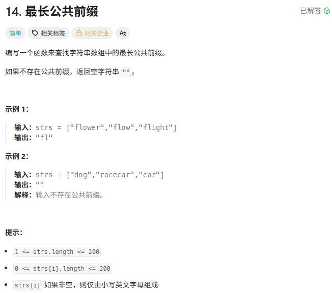
思路：就每个字符串的第一个位置、第二个位置、...一个个比下去，比到一个字符串的末尾或者不一样了就return了。每次可以以第一个字符串的那个字符为基准，看后面的字符串和不和他相等。
时空：时间78.11%，空间97.30%
代码：
```java
class Solution {

    public String longestCommonPrefix(String[] strs) {

        if(strs.length == 0) return "";

        if(strs.length == 1) return strs[0];

        StringBuilder sb = new StringBuilder();

        int l = strs.length;

        int j = 0;

        boolean finishFlag = false;

        while(true){

            if(j == strs[0].length()){

                break;

            }

            char now = strs[0].charAt(j);

            for(int i = 1;i < l;i++){

                if(j == strs[i].length() || strs[i].charAt(j) != now){

                    finishFlag = true;

                    break;

                }

            }

            if(finishFlag) break;

            sb.append(now);

            j++;

        }

        return sb.toString();

    }

}
```
### 16.最接近的三数之和
题目：
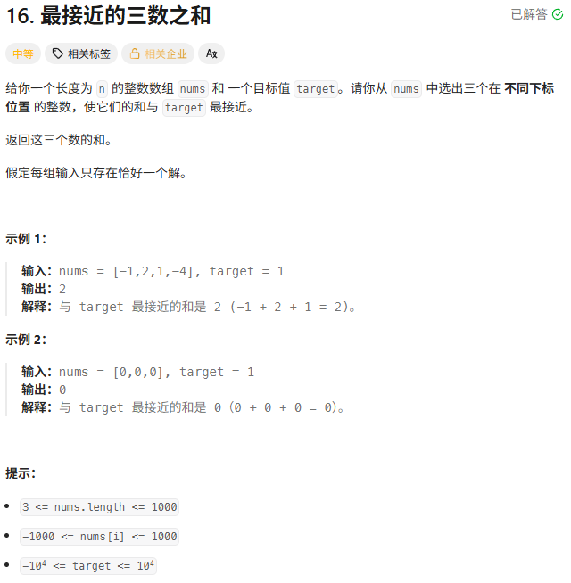
思路：借鉴三数之和的思路，目标是找到最接近target的三个数之和，那么对于每个数（设为a），那么另外两个数就要尽量接近target - a。另外两个数可以用排序完用双指针找，如果小于target - a就小数往大移，大了大数往小移（看起来还是遍历，但是过程中少了很多组合：排除掉的数和右边其他数的组合），复杂度可以降一次。
时空：时间77.91%，空间15.90%
代码：
```java
class Solution {

    public int threeSumClosest(int[] nums, int target) {

        int n = nums.length;

        int minDiff = Integer.MAX_VALUE;

        int res = 0;

        Arrays.sort(nums);

        for(int i = 0;i < n - 2;i++){

            if(i > 0 && nums[i] == nums[i - 1]) continue;

            int nowTarget = target - nums[i];

            int left = i + 1;

            int right = n - 1;

            while(left < right){

                if(Math.abs(target - nums[i] - nums[left] - nums[right]) < minDiff){

                    minDiff = Math.abs(target - nums[i] - nums[left] - nums[right]);

                    res = nums[i] + nums[left] + nums[right];

                }

                if (nums[left] + nums[right] == nowTarget)  return target;

                else if (nums[left] + nums[right] < nowTarget) left++;

                else right--;

            }

        }

        return res;

    }

}
```
### 25.K个一组翻转链表
题目：
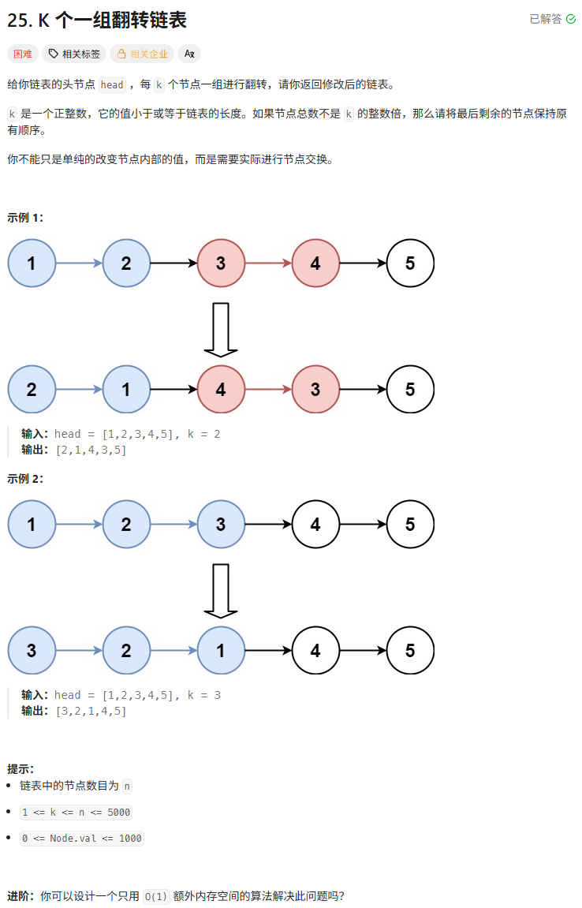
思路：核心就是k个一组，依次翻转然后往下一个节点走，然后到达一组的末尾时，让上一组的第一个节点（翻转完也就是最后一个，所以每组第一个节点要记录一下）指向它（当前节点翻转完就是第一个节点了），然后如果到了末尾发现这一组没有k个，那么把这一组前面翻转的恢复一下就好。
时空：时间100.00%，空间80.82%
代码：
```java
/**

 * Definition for singly-linked list.

 * public class ListNode {

 *     int val;

 *     ListNode next;

 *     ListNode() {}

 *     ListNode(int val) { this.val = val; }

 *     ListNode(int val, ListNode next) { this.val = val; this.next = next; }

 * }

 */

class Solution {

    public ListNode reverseKGroup(ListNode head, int k) {

        // 特判，一个一组的时候不用翻转，直接返回

        if (k == 1) return head;

  

        ListNode curr = head;

        ListNode pre = null;

        int i = 0;

        ListNode begin = null; // 当前k个节点中的第一个，翻转完它也是k个中的最后一个，后续要指向下一组的最后一个

        ListNode prevBegin = null; // 前一组节点的第一个

        ListNode resHead = head;

        while (curr != null) {

            if (i == 0) {

                // 是最新一组的第一个节点，更新一下prevBegin和begin

                prevBegin = begin;

                // 这个节点是最后一个

                if (curr.next == null) {

                    prevBegin.next = curr;

                    break;

                }

                begin = curr;

                pre = curr;

                curr = curr.next;

                i++;

  

                // 当前为最后一个

            } else if (i == k - 1) {

                // prevBegin = null 代表是第一组，第一组的最后一个是将来要返回的头节点

                if (prevBegin == null){

                    resHead = curr;

                }

                // 不是第一组就把前一组第一个接过来

                if (prevBegin != null){

                    prevBegin.next = curr;

                }

                // 翻转 + 往下走

                ListNode next = curr.next;

                curr.next = pre;

                pre = curr;

                curr = next;

                i = 0;

  

                // 目前是最后一个了，begin还等着连下一组的最后一个呢，不过已经没有了，置为null，不然会有环

                if (curr == null) {

                    begin.next = null;

                }

            } else {

                // 翻转 + 往下走

                ListNode next = curr.next;

                curr.next = pre;

                pre = curr;

                curr = next;

                i++;

  

                // 当前这组不满k个,把这组复原一下

                if (curr == null) {

                    ListNode backCurr = pre;

                    ListNode backPre = null;

                    while (backCurr != begin) {

                        ListNode temp = backCurr.next;

                        backCurr.next = backPre;

                        backPre = backCurr;

                        backCurr = temp;

                    }

                    prevBegin.next = begin;

                }

            }

        }

  

        return resHead;

    }

}
```
### 26.删除有序数组中的重复项
题目：
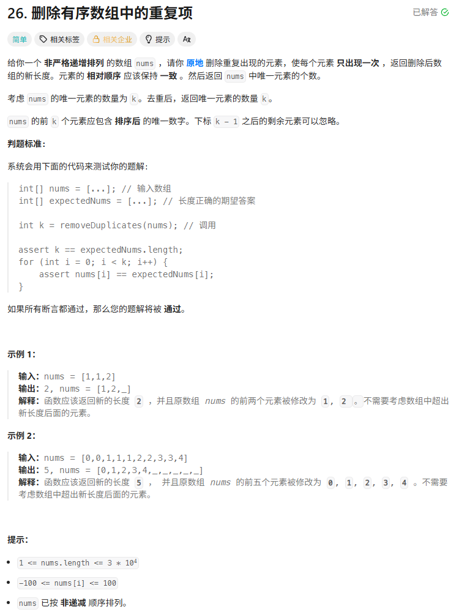
思路：把每个数字的第一个都放到前面去就好
时空：时间68.68%，空间98.06%
代码：
```java
class Solution {

    public int removeDuplicates(int[] nums) {

        int realIndex = 1; // 去重后，当前最新的数字应该放在哪个位置

        for(int i = 1;i < nums.length;i++){

            if(nums[i] == nums[i - 1]) continue;

            nums[realIndex] = nums[i];

            realIndex++;

        }

        return realIndex;

    }

}
```
### 29.两数相除
题目：
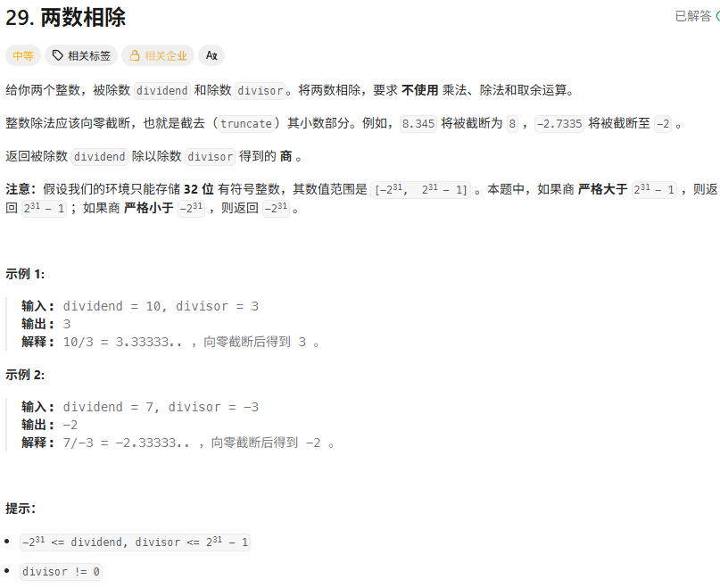
思路：
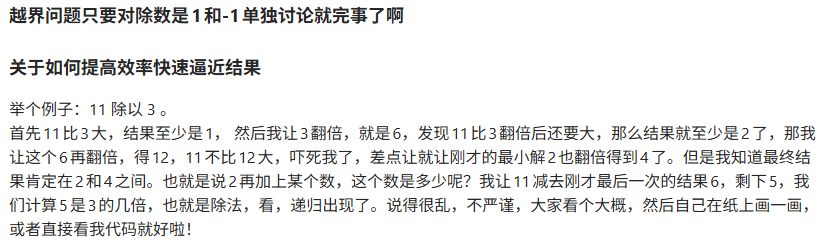
时空：时间94.63%，空间88.66%
代码：
```java
class Solution {

    public int divide(int dividend, int divisor) {

        if (dividend == 0) return 0;

        if (divisor == 1) return dividend;

        if (divisor == -1) {

            if (dividend == Integer.MIN_VALUE) return Integer.MAX_VALUE;

            else return -dividend;

        }

        int sign = 1;

        if( (dividend < 0 && divisor > 0) || (dividend > 0 && divisor < 0) ) sign = -1;

        // 转long防止一些奇奇怪怪的溢出问题，比如负数取绝对值转为正数溢出了，又变为负数

        // 还有 循环中 a + a可能会溢出

        int value = function(Math.abs((long)dividend), Math.abs((long)divisor));

        return sign * value;

    }

  

    private int function(long dividend,  long divisor){

        // 是要向下取整的

        if(dividend < divisor) return 0;

        int count = 1;

        long a = divisor;

        while (a + a <= dividend){

            count += count;

            a += a;

        }

        return count + function(dividend - a,  divisor);

    }

}
```
### 30.串联所有单词的子串
题目：
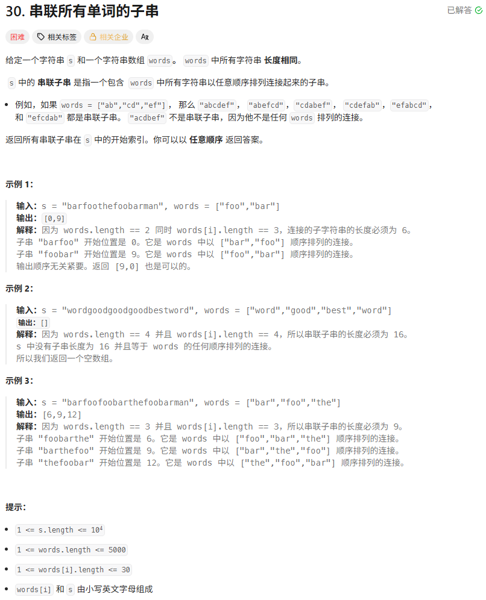
思路：其实和找字母的异位词的思路差不多，一个是统计字母的出现次数是否相等，这里是统计单词的数量是否相等。words里面的字符串长度都相等的，设长度为wl，所以你可以把s划分成wl、wl、... 这样一组单词（开头和结尾多的一些肯定不要了，然后划分方式就是按开头，开头选0-wl-1，就对应了wl种划分方式），划分好之后，以其中words.length个单词为一组，先把一组的单词放进去，记录每个单词出现了几次，后面用words里面的单词看看能不能把这些单词出现次数->0,可以的话就找到一个满足要求的了，words如果抵不掉也要放-1进去记住一下。然后移动窗口看看当前划分方式下的每一组行不行就好了。
时空：时间58.88%，空间76.88%
代码：
```java
class Solution {

    public List<Integer> findSubstring(String s, String[] words) {

        int sl = s.length(); // 字符串长度

        int wl = words[0].length(); // 单词长度

        int num = words.length; // 单词数量

        List<Integer> res = new ArrayList<>();

  

        // 划分s，总过有n种方式，从第一个开始算 wl wl个字母划分 从第二个开始算...

        for(int i = 0;i < wl;i++){

            if(i + num * wl > sl) break; // 字母不够划分num个单词，肯定没结果了，break了

  

            // 不同划分下，可以有多个长度为num的单词组

            // 把当前划分下的第一个单词组里的单词都放进map里

            // 后面看能不能用words里面的单词把它们扣到0

            Map<String, Integer> diff = new HashMap<>();

            for (int j = 0;j < num;j++) {

                String nowWord = s.substring(i + j * wl, i + (j + 1) * wl);

                diff.put(nowWord, diff.getOrDefault(nowWord, 0) + 1);

            }

            // 用words里面的单词把当前单词组里的单词扣一扣

            // 没有的先用-1 “存储”起来，后面用

            // 没有用的肯定就有多的，这个-1没用后面肯定也是对不上的，所以这样没毛

            for (String word : words) {

                diff.put(word, diff.getOrDefault(word, 0) - 1);

                if (diff.get(word) == 0) {

                    diff.remove(word);

                }

            }

  

            // 滑动窗口，改变单词组

            for (int k = i;k < sl - num * wl + 1;k += wl) {

                // 第一个窗口已经加减过了，所以start==i的时候直接到下面去判断满不满足就行了

                if (k != i) {

                    //  把下一个单词移进来，开头单词移出去

                    String add = s.substring(k + (num - 1) * wl, k + num * wl);

                    diff.put(add, diff.getOrDefault(add, 0) + 1);

                    // 把前面“存储”的用上了就搞好抵消了

                    if (diff.get(add) == 0) diff.remove(add);

  

                    String head = s.substring(k - wl, k);

                    // 如果get(head) = 0 那么就说明是被words中的单词搞掉了，这里又移出去了，可以再转为“存储”

                    diff.put(head, diff.getOrDefault(head, 0) - 1);

                    if (diff.get(head) == 0) diff.remove(head);

                }

  

                if (diff.isEmpty()) {

                   res.add(k);

                }

            }

        }

        return res;

    }

}
```
### 35.搜索插入位置
题目：
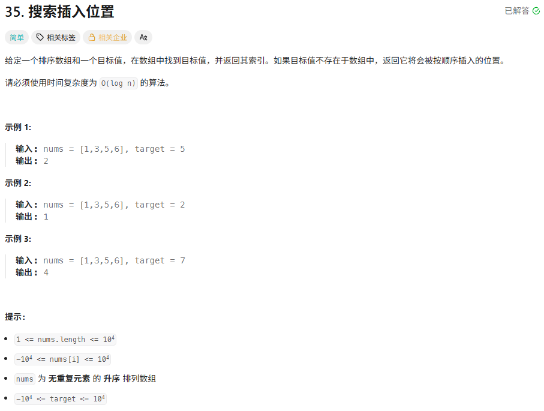
思路：对二分查找改进一下就是，保留原本二分查找的逻辑，如果数组中存在目标值的话，可以找到它，如果没有的话，那么搜索区间最终会收缩到一个数或者两个数，根据大小关系判断放在这一个数或者两个数的哪个位置。
时空：时间100.00%，空间50.13%
代码：
```java
class Solution {

    public int searchInsert(int[] nums, int target) {

        int n = nums.length;

        int left = 0;

        int right = n - 1;

        while(left <= right){

            int mid = (left + right) / 2;

            if (nums[mid] == target) return mid;

  

            if (right - left == 1) {

                if (target < nums[left]) return left;

                // 注意要先放right，因为大于right的话肯定也大于left，在left那就直接返回了

                if (target > nums[right]) return right + 1;

                if (target > nums[left]) return left + 1;

            }

  

            if (left == right) {

                if (target > nums[mid]) return left + 1;

                else return left;

            }

  

            if (target < nums[mid]) right = mid - 1;

            else left = mid + 1;

        }

        return -1;

    }

}
```
### 36.有效的数独
题目：
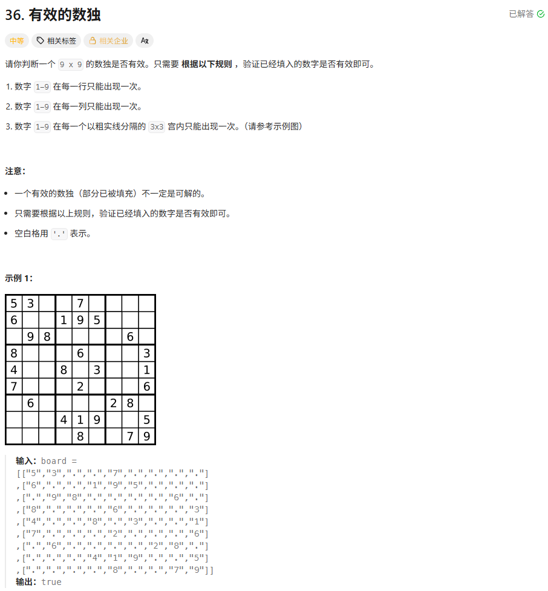
思路：遍历 + 标记 + 判重
时空：时间100.00%，空间59.89%
代码：
```java
class Solution {

    public boolean isValidSudoku(char[][] board) {

        boolean[][] row = new boolean[9][10];    // 标记一行中各个数字用过没有

        boolean[][] column = new boolean[9][10]; // 标记一列中各个数字用过没有

        boolean[][] square = new boolean[9][10]; // 标记一宫内各个数字用过没有

        // 宫从左到右 从上到下依次标记为 0 1 2   3 4 5   6 7 8

  

        for (int i = 0;i < 9;i++) {

            for (int j = 0;j < 9;j++) {

                if(board[i][j] == '.') continue;

                int num = board[i][j] - '0';

                int pos = (i / 3) * 3 + j / 3;

                if (row[i][num] || column[j][num] || square[pos][num]) return false;

                row[i][num] = true;

                column[j][num] = true;

                square[pos][num] = true;

            }

        }

  

        return true;

    }

}
```
### XXX.XXXX
题目：
思路：
时空：
代码：
```java

```