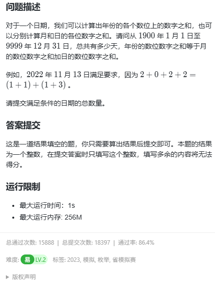
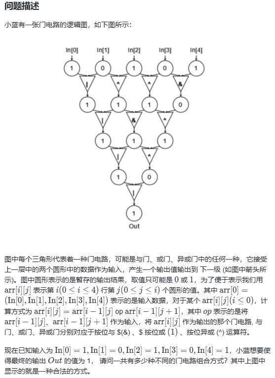
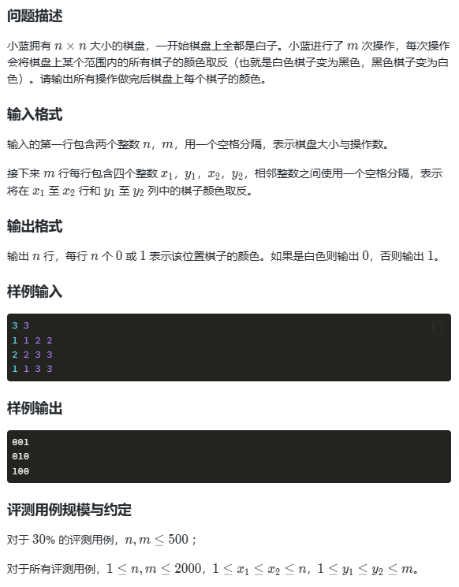
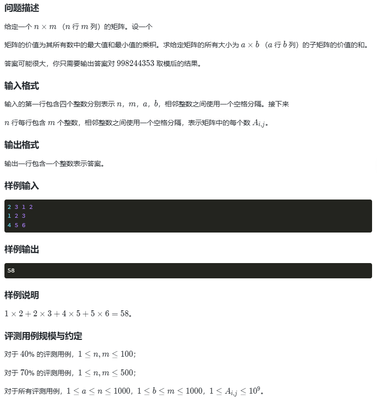
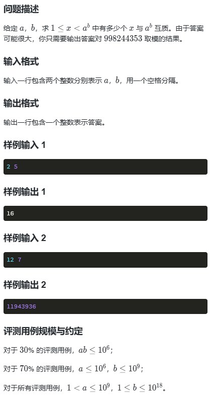
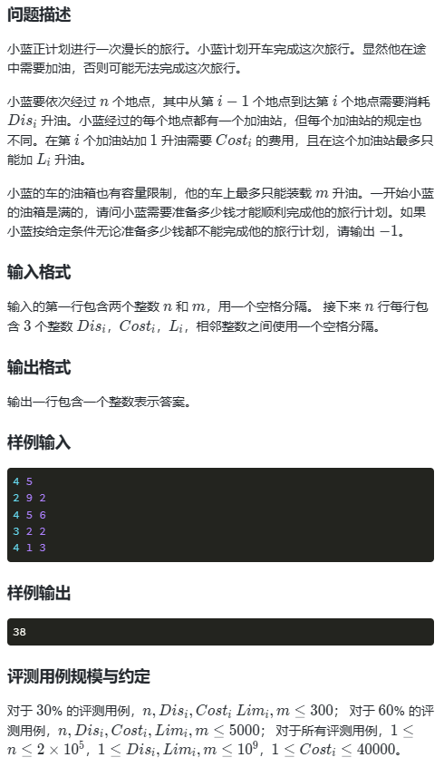
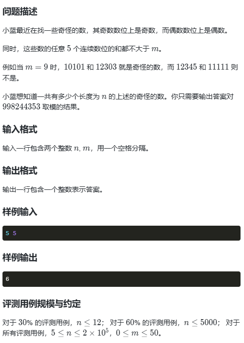

## ACM模式
### 常用包导入
```java
import java.util.*;
```
### 类型转换
```java
// char -> int
char c = '1';
int num = c - '0'; // num = 1

// int -> char
int num = 1;
char c = (char) (num + '0');
```
### 时间复杂度控制
一般要在10的8次方以内这样
如果测试用例是200，那么写个4次方的复杂度算法也没事
如果测试用例是10000，那么最多只能写个2次方的复杂度了
如果测试用例是10^5，那么大概率要求nlogn的复杂度
## 省赛
### 第十四届省赛真题
#### 1.特殊日期


穷举，每天都遍历一下试一下是否满足条件
注意闰年的判断：
```java
(year % 4 == 0 && year % 100 != 0) || year % 400 == 0
```
实现代码
5/5
```java
import java.util.Scanner;  
// 1:无需package  
// 2: 类名必须Main, 不可修改  
  
public class Main {  
    public static void main(String[] args) {  
        int sum = 0;  
        for(int year = 1900;year <= 9999;year++){  
            for(int month = 1;month <= 12;month++){  
                int dayMax = 30;  
                if(month == 1 || month == 3 || month == 5 || month == 7 || month == 8 || month == 10 || month == 12){  
                    dayMax = 31;  
                } else if(month == 2){  
                    if((year % 4 == 0 && year % 100 != 0) || year % 400 == 0){  
                        dayMax = 29;  
                    } else dayMax = 28;  
                }  
                for(int day = 1;day <= dayMax;day++){  
                    if(calSum(year) == calSum(month) + calSum(day)) sum++;  
                }  
            }  
        }  
        System.out.println(sum);  
    }  
  
    private static int calSum(int num){  
        int sum = 0;  
        while(num > 0){  
            sum += num % 10;  
            num /= 10;  
        }  
        return sum;  
    }  
}
```
#### 2.与或异或

就是遍历各个门取与或非的情况
5/5
```java
import java.util.Scanner;  
// 1:无需package  
// 2: 类名必须Main, 不可修改  
  
public class Main {  
  
    private static int count = 0;  
  
    public static void main(String[] args) {  
        Scanner scan = new Scanner(System.in);  
        int[][] nums = new int[5][5];  
        nums[0][0] = 1;  
        nums[0][1] = 0;  
        nums[0][2] = 1;  
        nums[0][3] = 0;  
        nums[0][4] = 1;  
        dfs(nums, 0, 0);  
        System.out.println(count);  
        scan.close();  
    }  
  
    // 一次迭代函数中只能尝试一个位置的各种情况，不能尝试一排  
    // nums存放各层数字  
    // i,j表示各个门的坐标 从0开始  
    // 不用回溯的原因是，计算下一层的时候都是用的上层的数据  
    // 上层是没被修改过的，当前层虽然被修改过，但是马上就被覆盖了  
    private static void dfs(int[][] nums, int i, int j) {  
        if(i == 4){  
            if(nums[i][0] == 1) count++;  
            return;  
        }  
        for(int k = 0; k < 3; k++) {  
            if (k == 0) nums[i + 1][j] = nums[i][j] & nums[i][j + 1];  
            else if (k == 1) nums[i + 1][j] = nums[i][j] | nums[i][j + 1];  
            else nums[i + 1][j] = nums[i][j] ^ nums[i][j + 1];  
            if(j == 4 - i - 1){  
                // 到本层末尾了  
                dfs(nums, i + 1, 0);  
            } else dfs(nums, i, j + 1);  
        }  
    }  
}
```
#### 3.棋盘

这题输入给的大小很小，暴力基本就能过完
10/10
```java
import java.util.Scanner;

// 1:无需package

// 2: 类名必须Main, 不可修改

  

public class Main {

    public static void main(String[] args) {

        Scanner scan = new Scanner(System.in);

        //在此输入您的代码...

        int n = scan.nextInt();

        int m = scan.nextInt();

        int[][] operations = new int[m][4];

        for(int i = 0;i < m;i++){

            operations[i][0] = scan.nextInt();

            operations[i][1] = scan.nextInt();

            operations[i][2] = scan.nextInt();

            operations[i][3] = scan.nextInt();

        }

        int[][] qis = new int[n][n];

        for(int i = 0;i < m;i++){

            for(int j = operations[i][0];j <= operations[i][2];j++){

                for(int k = operations[i][1];k <= operations[i][3];k++){

                    if(qis[j - 1][k - 1] == 1) qis[j - 1][k - 1] = 0;

                    else qis[j - 1][k - 1] = 1;

                }

            }

        }

        for(int i = 0;i < n;i++){

            for(int j = 0;j < n - 1;j++){

                System.out.print(qis[i][j]);

            }

            System.out.println(qis[i][n - 1]);

        }

        scan.close();

    }

}
```
#### 4.子矩阵

70%样例都是500，暴力可以直接过。
8/10
```java
import java.util.Scanner;

// 1:无需package

// 2: 类名必须Main, 不可修改

  

public class Main {

    public static void main(String[] args) {

        Scanner scan = new Scanner(System.in);

        //在此输入您的代码...

        int n = scan.nextInt();

        int m = scan.nextInt();

        int a = scan.nextInt();

        int b = scan.nextInt();

        int[][] matix = new int[n][m];

        for(int i = 0;i < n;i++){

            for(int j = 0;j < m;j++){

                matix[i][j] = scan.nextInt();

            }

        }

        int sum = 0;

        // 每个子矩阵的左上角肯定是不同的，可以以此遍历

        for(int i = 0;i < n;i++){

            for(int j = 0;j < m;j++){

                // 判断以当前位置为左上角的是否可以构成子矩阵

                if(i + a > n || j + b > m) continue;

                int min = matix[i][j];

                int max = matix[i][j];

                for(int p = i;p <= i + a - 1;p++){

                    for(int q = j;q <= j + b - 1;q++){

                        min = Math.min(min, matix[p][q]);

                        max = Math.max(max, matix[p][q]);

                    }

                }

                sum += min * max;

            }

        }

        System.out.println(sum % 998244353);

        scan.close();

    }

}
```
#### ★★★5.互质数的个数

互质：公因数只有1
输入给的很大，肯定要想办法用算法优化了
一开始写的，稍微优化了一点（把a^b的因数存起来了，后续在因数中遍历）
4/10
```java
import java.util.*;

// 1:无需package

// 2: 类名必须Main, 不可修改

  

public class Main {

    public static void main(String[] args) {

        Scanner scan = new Scanner(System.in);

        long a = scan.nextLong();

        long b = scan.nextLong();

        long ab = (long)Math.pow(a, b);

        // 可以先把ab的非1因数存一下

        // 如果x可以用ab的因数整除，那么x就不互质

        List<Long> tool = new ArrayList<>();

        for(long i = 2;i <= Math.sqrt(ab);i++){

            if(ab % i == 0) tool.add(i);

        }

        int sum = 0;

        for(long i = 1;i < ab;i++){

            if(judge(tool, i)) sum++;

        }

        System.out.println(sum);

        scan.close();

    }

  

    private static boolean judge(List<Long> tool, long x){

        for(Long t:tool){

            if(t > x) break;

            if(x % t == 0) return false;

        }

        return true;

    }

}
```
要继续优化需要用到下面这些知识
1.欧拉函数
若 $n$ 的标准素因数分解形式为：

$$n = p_1^{a_1} p_2^{a_2} \cdots p_k^{a_k}$$
则欧拉函数的计算公式为：

$$\varphi(n) = n \cdot \prod_{i=1}^{k} \left(1 - \frac{1}{p_i}\right)$$
也可以写成更适合编程计算的形式：

$$\varphi(n) = n \cdot \frac{p_1-1}{p_1} \cdot \frac{p_2-1}{p_2} \cdots \frac{p_k-1}{p_k}$$
2.$a^b$ 的质因子与 $a$ 完全相同
公式可以演变为：

$$\varphi(a^b) = a^b \cdot \prod_{p|a} \frac{p-1}{p} = a^{b-1} \cdot \varphi(a)$$
3.质因数分解思路：从最小的质数2开始往后除，只要能整除，就一直除下去，直到除不动为止。
这里的i * i <= n -> 只考虑因数中的小的，因为除完小的，大的其实就是现在的n了，它如果能分解成因子，就继续分了，不能的话就把它本身拿来用了。
求因数也是i * i <= n，不过这里同时要记录两个数，一个是i，一个是n/i。
```java
public void divide(long n) {
    // 从 2 开始，到根号 n 结束
    for (long i = 2; i * i <= n; i++) {
        if (n % i == 0) {
            // i 是一个质因子
            System.out.print(i + " ");
            // 把 n 里面所有的 i 都除干净
            while (n % i == 0) {
                n /= i;
            }
        }
    }
    // 最后如果 n > 1，剩下的 n 也是一个质因子
    if (n > 1) {
        System.out.print(n);
    }
}
```
这样看起来i会到4、6这样的非质数，不过其实没事的，因为i = 2的时候，已经把全部2除了，此时的n根本不会被4整除了，后面的也是一样的。
4.模运算对加法、减法和乘法具有分配率
乘法分配律： $(A \times B) \pmod M = [(A \pmod M) \times (B \pmod M)] \pmod M$
加法分配律： $(A + B) \pmod M = [(A \pmod M) + (B \pmod M)] \pmod M$
5.快速幂算法
利用了“二进制拆分”的思想。
例如计算 $a^{13}$，由于 $13$ 的二进制是 $1101_2$（即 $8 + 4 + 1$），我们可以写成：
$$a^{13} = a^8 \cdot a^4 \cdot a^1$$
10/10
```java
import java.util.*;  
  
public class Main {  
    private static final long MOD = 998244353;  
  
    public static void main(String[] args) {  
        Scanner scan = new Scanner(System.in);  
        long a = scan.nextLong();  
        long b = scan.nextLong();  
  
        // 1. 直接计算 phi(a) 的整数值  
        // 公式：phi(a) = a / p1 * (p1-1) / p2 * (p2-1) ...  
        long phiA = a;  
        long tempA = a;  
        for (long i = 2; i * i <= tempA; i++) {  
            if (tempA % i == 0) {  
                // 因为 i 是 tempA 的因子，所以 i 也一定是当前 phiA 的因子  
                // 先除后乘可以保证结果永远是整数，且不会溢出 long                phiA = phiA / i * (i - 1);  
                while (tempA % i == 0) tempA /= i;  
            }  
        }  
        // 最后如果 n > 1，剩下的 n 也是一个质因子  
        if (tempA > 1) {  
            phiA = phiA / tempA * (tempA - 1);  
        }  
  
        // 此时 phiA 已经是 a 的欧拉函数值，对其取模  
        phiA %= MOD;  
  
        // 2. 计算 a^(b-1) % MOD        
        long aPower = power(a % MOD, b - 1);  
  
        // 3. 最终结果 = (a^(b-1) % MOD) * (phi(a) % MOD) % MOD        
        long ans = (aPower * phiA) % MOD;  
        System.out.println(ans);  
  
        scan.close();  
    }  
  
    private static long power(long base, long exp) {  
        if (exp == 0) return 1;  
        long res = 1;  
        base %= MOD;  
        while (exp > 0) {  
            if (exp % 2 == 1) res = (res * base) % MOD;  
            base = (base * base) % MOD; // a -> a^2 -> a^4这样 遇到1就和前面累积的成一下  
            exp /= 2;  
        }  
        return res;  
    }  
}
```
#### ★★★6.小蓝的旅行计划

看题解的，用的贪心，太牛了
9/10
```java
import java.util.*;  
// 1:无需package  
// 2: 类名必须Main, 不可修改  
  
public class Main {  
    public static void main(String[] args) {  
        // 读取数据  
        Scanner scan = new Scanner(System.in);  
        long n = scan.nextLong(); // 地点数  
        long m = scan.nextLong(); // 油箱容量  
        long curr = m; // 当前油量  
        long totalCost = 0; // 总消费  
        // 核心思路：如果到不了一个点，那么再去前面已经到达的加油站加油  
        // 并且只加最便宜的，刚好到这个站点的油  
        // 到达一个站点后，把这个加油站放进去  
  
        // 存放加油站，油价低的排队首 (油价，剩余油量)  
        PriorityQueue<long[]> stations = new PriorityQueue<>((a, b) -> Long.compare(a[0], b[0]));  
  
        // 遍历各个站点  
        for(int i = 0; i < n; i++){  
            // 读取该站点信息  
            long dis =  scan.nextLong();  
            long cost = scan.nextLong();  
            long limit = scan.nextLong();  
  
            // 如果油箱总量都不够过去，那肯定到不了的  
            if(m < dis){  
                totalCost = -1;  
                break;  
            }  
  
            long need = dis - curr;  
            // 油不够行驶到当前地点，去前面加油  
            while(need > 0 && !stations.isEmpty()){  
                // 数组的话读的是引用，可以直接用这个更新  
                long[] cheapestStation = stations.peek();  
                if (cheapestStation[1] >= need) {  
                    // 这个加油站就可以覆盖剩下的need  
                    cheapestStation[1] -= need;  
                    curr += need;  
                    totalCost += cheapestStation[0] * need;  
                    need = 0;  
                } else {  
                    // 不能覆盖  
                    need -= cheapestStation[1];  
                    curr += cheapestStation[1];  
                    totalCost += cheapestStation[0] * cheapestStation[1];  
                    stations.poll();  
                }  
            }  
  
            // 所有加油站都加完了还不够，到不了  
            if(need > 0){  
                totalCost = -1;  
                break;  
            }  
  
            // 到这就是够了，把当前站点的加油站加进去  
            curr -= dis;  
            stations.add(new long[]{cost, limit});  
        }  
        System.out.println(totalCost);  
        scan.close();  
    }  
}
```
#### ★★★7.奇怪的数

自己写的暴力
6/10
```java
import java.util.Scanner;

// 1:无需package

// 2: 类名必须Main, 不可修改

  

public class Main {

  

    private static int sum = 0;

  

    public static void main(String[] args) {

        Scanner scan = new Scanner(System.in);

        //在此输入您的代码...

        int n = scan.nextInt();

        int m = scan.nextInt();

        dfs(n, 1, new int[n], m, 0);

        System.out.println(sum);

        scan.close();

    }

  

    private static void dfs(int n, int now, int[] eachNum, int m, int currSum){

        if(now > 5){

            if(currSum > m) return;

            currSum -= eachNum[now - 5 - 1];

        }

        if(now == n + 1){

            sum++;

            return;

        }

        if(now % 2 == 1){

            for(int i = 1;i <= 9;i += 2){

                eachNum[now - 1] = i;

                dfs(n, now + 1, eachNum, m, currSum + i);

            }

        } else {

            for(int i = 0;i <= 8;i += 2){

                eachNum[now - 1] = i;

                dfs(n, now + 1, eachNum, m, currSum + i);

            }

        }

    }

}
```
看的题解 动态规划
10/10
```java
import java.util.Scanner;  
  
public class Main {  
    private static final int MOD = 998244353;  
  
    public static void main(String[] args) {  
        Scanner scanner = new Scanner(System.in);  
        int n = scanner.nextInt();  
        int m = scanner.nextInt();  
  
        // 定义dp[a][b][c][d] 表示当前最后4位是a,b,c,d的合法的奇怪的数的数量
        int[][][][] dp = new int[10][10][10][10];  
        // 初始化  
        for(int a = 1;a <= 9;a += 2){  
            for(int b = 0;b <= 9 && b <= (m - a);b += 2){  
                for(int c = 1;c <= 9 && c <= (m - a - b);c += 2){  
                    for(int d = 0;d <= 9 && d <= (m - a - b - c);d += 2){  
                        dp[a][b][c][d] = 1;  
                    }  
                }  
            }  
        }  
  
        // 从第五位开始填最后一位  
        for(int i = 5;i <= n;i++){  
            int[] begin = new int[2]; // 定义四位的起始，也就是寄偶其实  
            if (i % 2 == 0) begin[1] = 1;  
            else begin[0] = 1;  
            // 遍历四位中的第一、二、三、四位 以及符合要求的第五位  
            for(int a = begin[0];a <= 9;a += 2){  
                for(int b = begin[1];b <= 9 && b <= (m - a);b += 2){  
                    for(int c = begin[0];c <= 9 && c <= (m - a - b);c += 2){  
                        for(int d = begin[1];d <= 9 && d <= (m - a - b - c);d += 2){  
                            for(int e = begin[0];e <= 9 && e <= (m - a - b - c - d);e += 2){  
                                // 原来有那么多种序列是合法的嘛，那现在又加了一个合法的e
                                // 所以到这就有那么多种合法的，然后因为同个bcde
                                // a其实可以取多种的，对应不同的dp[a][b][c][d]
                                // 所以这里是 += 
                                dp[b][c][d][e] += dp[a][b][c][d];  
                                dp[b][c][d][e] %= MOD;  
                            }  
                        }  
                    }  
                }  
            }  
        }  
  
        // 计算结果  
        int res = 0;  
        int[] begin = new int[2]; // 定义四位的起始，也就是寄偶其实  
  
        if (n % 2 == 0) begin[0] = 1;  
        else begin[1] = 1;  
  
        for(int a = begin[0];a <= 9;a += 2){  
            for(int b = begin[1];b <= 9 && b <= (m - a);b += 2){  
                for(int c = begin[0];c <= 9 && c <= (m - a - b);c += 2){  
                    for(int d = begin[1];d <= 9 && d <= (m - a - b - c);d += 2){  
                        res += dp[a][b][c][d];  
                        res %= MOD;  
                    }  
                }  
            }  
        }  
        System.out.println(res);  
    }  
}
```
注意一下下面的问题
```java
for(int b = begin[1];b <= 9 && b <= (m - a);b += 2)
// 这个m - a加括号和不加括号居然有区别，理论上是没有的，但是比赛还是都加上吧
```
#### 8.太阳
#### 9.高塔
#### 10.反异或01串

### 第十五届省赛真题
### 第十六届省赛真题
