## ACM模式
### 常用包导入
```java
import java.util.*;
```
### 类型转换
```java
// char -> int
char c = '1';
int num = c - '0'; // num = 1

// int -> char
int num = 1;
char c = (char) (num + '0');
```
### 范围
int    -> **$2 \times 10^9$**      $2 \times ^{31}-1$
long -> $9 \times 10^{18}$     $2 \times ^{63}-1$
### 时间复杂度控制
一般要在10的8次方以内这样
如果测试用例是200，那么写个4次方的复杂度算法也没事
如果测试用例是10000，那么最多只能写个2次方的复杂度了
如果测试用例是10^5，那么大概率要求nlogn的复杂度
## 省赛
### 第十四届省赛真题
#### 1.特殊日期
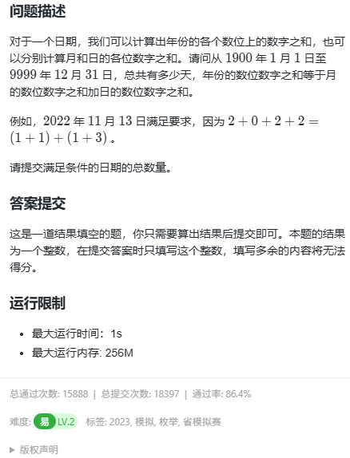

穷举，每天都遍历一下试一下是否满足条件
注意闰年的判断：
```java
(year % 4 == 0 && year % 100 != 0) || year % 400 == 0
```
实现代码
5/5
```java
import java.util.Scanner;  
// 1:无需package  
// 2: 类名必须Main, 不可修改  
  
public class Main {  
    public static void main(String[] args) {  
        int sum = 0;  
        for(int year = 1900;year <= 9999;year++){  
            for(int month = 1;month <= 12;month++){  
                int dayMax = 30;  
                if(month == 1 || month == 3 || month == 5 || month == 7 || month == 8 || month == 10 || month == 12){  
                    dayMax = 31;  
                } else if(month == 2){  
                    if((year % 4 == 0 && year % 100 != 0) || year % 400 == 0){  
                        dayMax = 29;  
                    } else dayMax = 28;  
                }  
                for(int day = 1;day <= dayMax;day++){  
                    if(calSum(year) == calSum(month) + calSum(day)) sum++;  
                }  
            }  
        }  
        System.out.println(sum);  
    }  
  
    private static int calSum(int num){  
        int sum = 0;  
        while(num > 0){  
            sum += num % 10;  
            num /= 10;  
        }  
        return sum;  
    }  
}
```
#### 2.与或异或
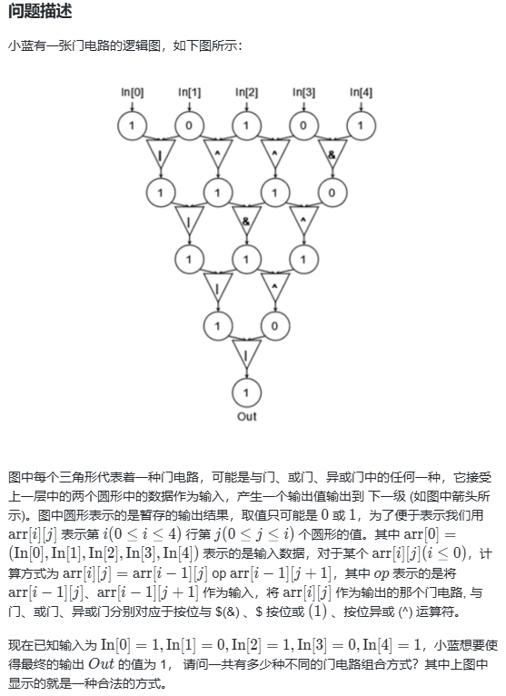
就是遍历各个门取与或非的情况
5/5
```java
import java.util.Scanner;  
// 1:无需package  
// 2: 类名必须Main, 不可修改  
  
public class Main {  
  
    private static int count = 0;  
  
    public static void main(String[] args) {  
        Scanner scan = new Scanner(System.in);  
        int[][] nums = new int[5][5];  
        nums[0][0] = 1;  
        nums[0][1] = 0;  
        nums[0][2] = 1;  
        nums[0][3] = 0;  
        nums[0][4] = 1;  
        dfs(nums, 0, 0);  
        System.out.println(count);  
        scan.close();  
    }  
  
    // 一次迭代函数中只能尝试一个位置的各种情况，不能尝试一排  
    // nums存放各层数字  
    // i,j表示各个门的坐标 从0开始  
    // 不用回溯的原因是，计算下一层的时候都是用的上层的数据  
    // 上层是没被修改过的，当前层虽然被修改过，但是马上就被覆盖了  
    private static void dfs(int[][] nums, int i, int j) {  
        if(i == 4){  
            if(nums[i][0] == 1) count++;  
            return;  
        }  
        for(int k = 0; k < 3; k++) {  
            if (k == 0) nums[i + 1][j] = nums[i][j] & nums[i][j + 1];  
            else if (k == 1) nums[i + 1][j] = nums[i][j] | nums[i][j + 1];  
            else nums[i + 1][j] = nums[i][j] ^ nums[i][j + 1];  
            if(j == 4 - i - 1){  
                // 到本层末尾了  
                dfs(nums, i + 1, 0);  
            } else dfs(nums, i, j + 1);  
        }  
    }  
}
```
#### 3.棋盘
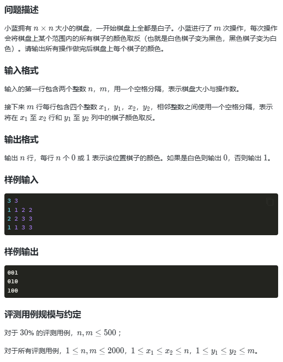
这题输入给的大小很小，暴力基本就能过完
10/10
```java
import java.util.Scanner;

// 1:无需package

// 2: 类名必须Main, 不可修改

  

public class Main {

    public static void main(String[] args) {

        Scanner scan = new Scanner(System.in);

        //在此输入您的代码...

        int n = scan.nextInt();

        int m = scan.nextInt();

        int[][] operations = new int[m][4];

        for(int i = 0;i < m;i++){

            operations[i][0] = scan.nextInt();

            operations[i][1] = scan.nextInt();

            operations[i][2] = scan.nextInt();

            operations[i][3] = scan.nextInt();

        }

        int[][] qis = new int[n][n];

        for(int i = 0;i < m;i++){

            for(int j = operations[i][0];j <= operations[i][2];j++){

                for(int k = operations[i][1];k <= operations[i][3];k++){

                    if(qis[j - 1][k - 1] == 1) qis[j - 1][k - 1] = 0;

                    else qis[j - 1][k - 1] = 1;

                }

            }

        }

        for(int i = 0;i < n;i++){

            for(int j = 0;j < n - 1;j++){

                System.out.print(qis[i][j]);

            }

            System.out.println(qis[i][n - 1]);

        }

        scan.close();

    }

}
```
#### 4.子矩阵
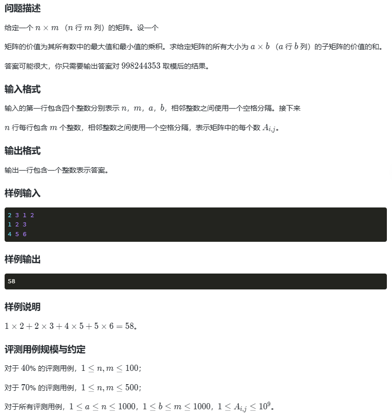
70%样例都是500，暴力可以直接过。
8/10
```java
import java.util.Scanner;

// 1:无需package

// 2: 类名必须Main, 不可修改

  

public class Main {

    public static void main(String[] args) {

        Scanner scan = new Scanner(System.in);

        //在此输入您的代码...

        int n = scan.nextInt();

        int m = scan.nextInt();

        int a = scan.nextInt();

        int b = scan.nextInt();

        int[][] matix = new int[n][m];

        for(int i = 0;i < n;i++){

            for(int j = 0;j < m;j++){

                matix[i][j] = scan.nextInt();

            }

        }

        int sum = 0;

        // 每个子矩阵的左上角肯定是不同的，可以以此遍历

        for(int i = 0;i < n;i++){

            for(int j = 0;j < m;j++){

                // 判断以当前位置为左上角的是否可以构成子矩阵

                if(i + a > n || j + b > m) continue;

                int min = matix[i][j];

                int max = matix[i][j];

                for(int p = i;p <= i + a - 1;p++){

                    for(int q = j;q <= j + b - 1;q++){

                        min = Math.min(min, matix[p][q]);

                        max = Math.max(max, matix[p][q]);

                    }

                }

                sum += min * max;

            }

        }

        System.out.println(sum % 998244353);

        scan.close();

    }

}
```
#### ★★★5.互质数的个数
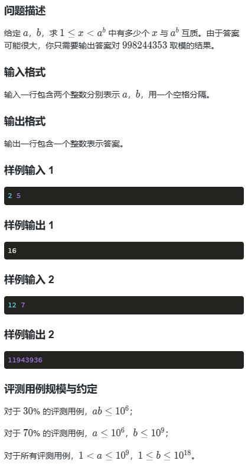
互质：公因数只有1
输入给的很大，肯定要想办法用算法优化了
一开始写的，稍微优化了一点（把a^b的因数存起来了，后续在因数中遍历）
4/10
```java
import java.util.*;

// 1:无需package

// 2: 类名必须Main, 不可修改

  

public class Main {

    public static void main(String[] args) {

        Scanner scan = new Scanner(System.in);

        long a = scan.nextLong();

        long b = scan.nextLong();

        long ab = (long)Math.pow(a, b);

        // 可以先把ab的非1因数存一下

        // 如果x可以用ab的因数整除，那么x就不互质

        List<Long> tool = new ArrayList<>();

        for(long i = 2;i <= Math.sqrt(ab);i++){

            if(ab % i == 0) tool.add(i);

        }

        int sum = 0;

        for(long i = 1;i < ab;i++){

            if(judge(tool, i)) sum++;

        }

        System.out.println(sum);

        scan.close();

    }

  

    private static boolean judge(List<Long> tool, long x){

        for(Long t:tool){

            if(t > x) break;

            if(x % t == 0) return false;

        }

        return true;

    }

}
```
要继续优化需要用到下面这些知识
1.欧拉函数
若 $n$ 的标准素因数分解形式为：

$$n = p_1^{a_1} p_2^{a_2} \cdots p_k^{a_k}$$
则欧拉函数的计算公式为：

$$\varphi(n) = n \cdot \prod_{i=1}^{k} \left(1 - \frac{1}{p_i}\right)$$
也可以写成更适合编程计算的形式：

$$\varphi(n) = n \cdot \frac{p_1-1}{p_1} \cdot \frac{p_2-1}{p_2} \cdots \frac{p_k-1}{p_k}$$
2.$a^b$ 的质因子与 $a$ 完全相同
公式可以演变为：

$$\varphi(a^b) = a^b \cdot \prod_{p|a} \frac{p-1}{p} = a^{b-1} \cdot \varphi(a)$$
3.质因数分解思路：从最小的质数2开始往后除，只要能整除，就一直除下去，直到除不动为止。
这里的i * i <= n -> 只考虑因数中的小的，因为除完小的，大的其实就是现在的n了，它如果能分解成因子，就继续分了，不能的话就把它本身拿来用了。
求因数也是i * i <= n，不过这里同时要记录两个数，一个是i，一个是n/i。
```java
public void divide(long n) {
    // 从 2 开始，到根号 n 结束
    for (long i = 2; i * i <= n; i++) {
        if (n % i == 0) {
            // i 是一个质因子
            System.out.print(i + " ");
            // 把 n 里面所有的 i 都除干净
            while (n % i == 0) {
                n /= i;
            }
        }
    }
    // 最后如果 n > 1，剩下的 n 也是一个质因子
    if (n > 1) {
        System.out.print(n);
    }
}
```
这样看起来i会到4、6这样的非质数，不过其实没事的，因为i = 2的时候，已经把全部2除了，此时的n根本不会被4整除了，后面的也是一样的。
4.模运算对加法、减法和乘法具有分配率
乘法分配律： $(A \times B) \pmod M = [(A \pmod M) \times (B \pmod M)] \pmod M$
加法分配律： $(A + B) \pmod M = [(A \pmod M) + (B \pmod M)] \pmod M$
5.快速幂算法
利用了“二进制拆分”的思想。
例如计算 $a^{13}$，由于 $13$ 的二进制是 $1101_2$（即 $8 + 4 + 1$），我们可以写成：
$$a^{13} = a^8 \cdot a^4 \cdot a^1$$
10/10
```java
import java.util.*;  
  
public class Main {  
    private static final long MOD = 998244353;  
  
    public static void main(String[] args) {  
        Scanner scan = new Scanner(System.in);  
        long a = scan.nextLong();  
        long b = scan.nextLong();  
  
        // 1. 直接计算 phi(a) 的整数值  
        // 公式：phi(a) = a / p1 * (p1-1) / p2 * (p2-1) ...  
        long phiA = a;  
        long tempA = a;  
        for (long i = 2; i * i <= tempA; i++) {  
            if (tempA % i == 0) {  
                // 因为 i 是 tempA 的因子，所以 i 也一定是当前 phiA 的因子  
                // 先除后乘可以保证结果永远是整数，且不会溢出 long                phiA = phiA / i * (i - 1);  
                while (tempA % i == 0) tempA /= i;  
            }  
        }  
        // 最后如果 n > 1，剩下的 n 也是一个质因子  
        if (tempA > 1) {  
            phiA = phiA / tempA * (tempA - 1);  
        }  
  
        // 此时 phiA 已经是 a 的欧拉函数值，对其取模  
        phiA %= MOD;  
  
        // 2. 计算 a^(b-1) % MOD        
        long aPower = power(a % MOD, b - 1);  
  
        // 3. 最终结果 = (a^(b-1) % MOD) * (phi(a) % MOD) % MOD        
        long ans = (aPower * phiA) % MOD;  
        System.out.println(ans);  
  
        scan.close();  
    }  
  
    private static long power(long base, long exp) {  
        if (exp == 0) return 1;  
        long res = 1;  
        base %= MOD;  
        while (exp > 0) {  
            if (exp % 2 == 1) res = (res * base) % MOD;  
            base = (base * base) % MOD; // a -> a^2 -> a^4这样 遇到1就和前面累积的成一下  
            exp /= 2;  
        }  
        return res;  
    }  
}
```
#### ★★★6.小蓝的旅行计划
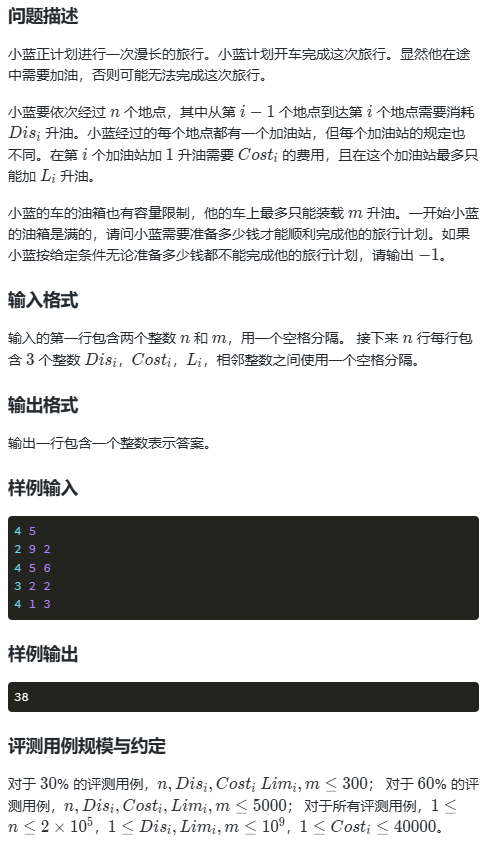
看题解的，用的贪心，太牛了
9/10
```java
import java.util.*;  
// 1:无需package  
// 2: 类名必须Main, 不可修改  
  
public class Main {  
    public static void main(String[] args) {  
        // 读取数据  
        Scanner scan = new Scanner(System.in);  
        long n = scan.nextLong(); // 地点数  
        long m = scan.nextLong(); // 油箱容量  
        long curr = m; // 当前油量  
        long totalCost = 0; // 总消费  
        // 核心思路：如果到不了一个点，那么再去前面已经到达的加油站加油  
        // 并且只加最便宜的，刚好到这个站点的油  
        // 到达一个站点后，把这个加油站放进去  
  
        // 存放加油站，油价低的排队首 (油价，剩余油量)  
        PriorityQueue<long[]> stations = new PriorityQueue<>((a, b) -> Long.compare(a[0], b[0]));  
  
        // 遍历各个站点  
        for(int i = 0; i < n; i++){  
            // 读取该站点信息  
            long dis =  scan.nextLong();  
            long cost = scan.nextLong();  
            long limit = scan.nextLong();  
  
            // 如果油箱总量都不够过去，那肯定到不了的  
            if(m < dis){  
                totalCost = -1;  
                break;  
            }  
  
            long need = dis - curr;  
            // 油不够行驶到当前地点，去前面加油  
            while(need > 0 && !stations.isEmpty()){  
                // 数组的话读的是引用，可以直接用这个更新  
                long[] cheapestStation = stations.peek();  
                if (cheapestStation[1] >= need) {  
                    // 这个加油站就可以覆盖剩下的need  
                    cheapestStation[1] -= need;  
                    curr += need;  
                    totalCost += cheapestStation[0] * need;  
                    need = 0;  
                } else {  
                    // 不能覆盖  
                    need -= cheapestStation[1];  
                    curr += cheapestStation[1];  
                    totalCost += cheapestStation[0] * cheapestStation[1];  
                    stations.poll();  
                }  
            }  
  
            // 所有加油站都加完了还不够，到不了  
            if(need > 0){  
                totalCost = -1;  
                break;  
            }  
  
            // 到这就是够了，把当前站点的加油站加进去  
            curr -= dis;  
            stations.add(new long[]{cost, limit});  
        }  
        System.out.println(totalCost);  
        scan.close();  
    }  
}
```
#### ★★★7.奇怪的数
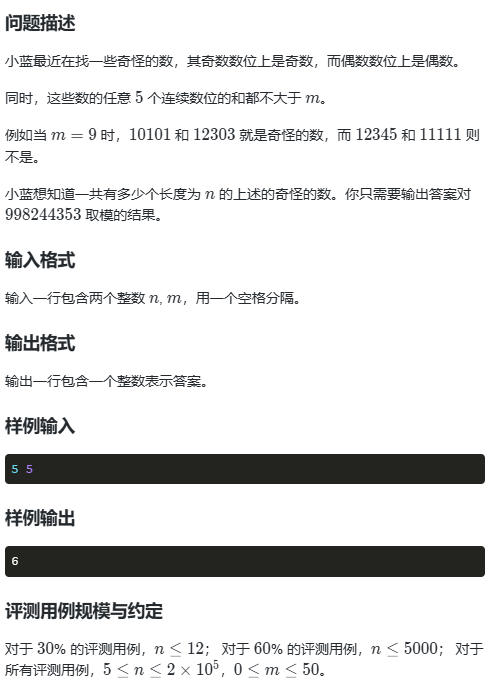
自己写的暴力
6/10
```java
import java.util.Scanner;

// 1:无需package

// 2: 类名必须Main, 不可修改

  

public class Main {

  

    private static int sum = 0;

  

    public static void main(String[] args) {

        Scanner scan = new Scanner(System.in);

        //在此输入您的代码...

        int n = scan.nextInt();

        int m = scan.nextInt();

        dfs(n, 1, new int[n], m, 0);

        System.out.println(sum);

        scan.close();

    }

  

    private static void dfs(int n, int now, int[] eachNum, int m, int currSum){

        if(now > 5){

            if(currSum > m) return;

            currSum -= eachNum[now - 5 - 1];

        }

        if(now == n + 1){

            sum++;

            return;

        }

        if(now % 2 == 1){

            for(int i = 1;i <= 9;i += 2){

                eachNum[now - 1] = i;

                dfs(n, now + 1, eachNum, m, currSum + i);

            }

        } else {

            for(int i = 0;i <= 8;i += 2){

                eachNum[now - 1] = i;

                dfs(n, now + 1, eachNum, m, currSum + i);

            }

        }

    }

}
```
看的题解 动态规划
10/10
```java
import java.util.Scanner;  
  
public class Main {  
    private static final int MOD = 998244353;  
  
    public static void main(String[] args) {  
        Scanner scanner = new Scanner(System.in);  
        int n = scanner.nextInt();  
        int m = scanner.nextInt();  
  
        // 定义dp[a][b][c][d] 表示当前最后4位是a,b,c,d的合法的奇怪的数的数量
        int[][][][] dp = new int[10][10][10][10];  
        // 初始化  
        for(int a = 1;a <= 9;a += 2){  
            for(int b = 0;b <= 9 && b <= (m - a);b += 2){  
                for(int c = 1;c <= 9 && c <= (m - a - b);c += 2){  
                    for(int d = 0;d <= 9 && d <= (m - a - b - c);d += 2){  
                        dp[a][b][c][d] = 1;  
                    }  
                }  
            }  
        }  
  
        // 从第五位开始填最后一位  
        for(int i = 5;i <= n;i++){  
            int[] begin = new int[2]; // 定义四位的起始，也就是寄偶其实  
            if (i % 2 == 0) begin[1] = 1;  
            else begin[0] = 1;  
            // 遍历四位中的第一、二、三、四位 以及符合要求的第五位  
            for(int a = begin[0];a <= 9;a += 2){  
                for(int b = begin[1];b <= 9 && b <= (m - a);b += 2){  
                    for(int c = begin[0];c <= 9 && c <= (m - a - b);c += 2){  
                        for(int d = begin[1];d <= 9 && d <= (m - a - b - c);d += 2){  
                            for(int e = begin[0];e <= 9 && e <= (m - a - b - c - d);e += 2){  
                                // 原来有那么多种序列是合法的嘛，那现在又加了一个合法的e
                                // 所以到这就有那么多种合法的，然后因为同个bcde
                                // a其实可以取多种的，对应不同的dp[a][b][c][d]
                                // 所以这里是 += 
                                dp[b][c][d][e] += dp[a][b][c][d];  
                                dp[b][c][d][e] %= MOD;  
                            }  
                        }  
                    }  
                }  
            }  
        }  
  
        // 计算结果  
        int res = 0;  
        int[] begin = new int[2]; // 定义四位的起始，也就是寄偶其实  
  
        if (n % 2 == 0) begin[0] = 1;  
        else begin[1] = 1;  
  
        for(int a = begin[0];a <= 9;a += 2){  
            for(int b = begin[1];b <= 9 && b <= (m - a);b += 2){  
                for(int c = begin[0];c <= 9 && c <= (m - a - b);c += 2){  
                    for(int d = begin[1];d <= 9 && d <= (m - a - b - c);d += 2){  
                        res += dp[a][b][c][d];  
                        res %= MOD;  
                    }  
                }  
            }  
        }  
        System.out.println(res);  
    }  
}
```
注意一下下面的问题
```java
for(int b = begin[1];b <= 9 && b <= (m - a);b += 2)
// 这个m - a加括号和不加括号居然有区别，理论上是没有的，但是比赛还是都加上吧
```
#### ★★★8.太阳
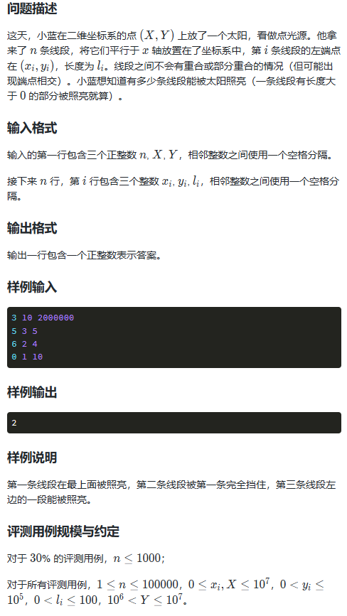
看了题解后写的
20/20
```java
import java.util.*;  
  
public class Main {  
  
    // 区间树，储存影子的区间  
    private static TreeMap<Double, Double> intervals = new TreeMap<>();  
    // 补充几个相关函数  
    // floorEntry(k) 找key的值小于等于k的最大元素  
    // .subMap(s, e) 截取原Map中所有键在[s, e)范围内的元素  
    // .clear() 清空map中的所有元素  
    // .put(k,v)  
  
    public static void main(String[] args) {  
        Scanner scanner = new Scanner(System.in);  
        // 核心思想：太阳照射线段，不考虑下面的物体体积时，总会在x轴上产生影子，  
        // 如果下面一条线产生的影子被上面的线的影子覆盖的话，那么这条线就会被上面的线遮挡  
        // 所以按y从上往下遍历，判断当前线产生的影子会不会被挡住  
        // 从而判断当前线会不会被挡住，然后把影子合并到前面的影子上去（合并区间）  
        int n = scanner.nextInt();  
        int x = scanner.nextInt();  
        int y = scanner.nextInt();  
        int[][] lines = new int[n][3]; // xi, yi, li  
        for(int i = 0;i < n;i++){  
            lines[i][0] = scanner.nextInt();  
            lines[i][1] = scanner.nextInt();  
            lines[i][2] = scanner.nextInt();  
        }  
        int count = 0;  
        // 按纵坐标排序 高 -> 低  
        Arrays.sort(lines, (line1, line2) -> Integer.compare(line2[1],line1[1]));  
        for(int[] line : lines){  
            double[] interval = calInterval(x, y, line);  
            if(!judge(interval)){  
                count++;  
                mergeInterval(interval);  
            }  
            // 被覆盖了其实就不用合并区间进去了，都有了反正  
        }  
        System.out.println(count);  
    }  
  
    private static void mergeInterval(double[] interval){  
        double l = interval[0];  
        double r = interval[1];  
        // 起点左边一点的区间  
        Map.Entry<Double, Double> L = intervals.floorEntry(l);  
        if(L != null && L.getValue() > l) l = L.getKey();  
        // 终点右边一点的区间  
        Map.Entry<Double, Double> R = intervals.floorEntry(r);  
        if(R != null && R.getValue() > r) r = R.getValue();  
        intervals.subMap(l, r).clear();  
        intervals.put(l,r);  
    }  
  
    // 计算太阳与两点构成的直线与x轴的交点  
    // 设直线方程为y = k * x + b  
    // k1 = y - Y / x - x1   Y = k1 * x + b -> b = Y - k1 * x    // 令y = 0，得x = -b / k1 = x - y / k1 = x - y(x - x1) / (y - Y)  
    private static double[] calInterval(int x, int y, int[] line){  
        double[] res = new double[2];  
        int x1 = line[0];  
        int Y = line[1];  
        int x2 = line[0] + line[2];  
        res[0] = x - (double)y * (x - x1) / (y - Y);  
        res[1] = x - (double)y * (x - x2) / (y - Y);  
        return res;  
    }  
  
    // 判断当前线段是否会被完全遮挡 会 -> true 不会 -> false    private static boolean judge(double[] interval){  
        Map.Entry<Double, Double> l = intervals.floorEntry(interval[0]);  
        return l != null && l.getValue() >= interval[1];  
    }  
}
```
#### ★★★9.高塔
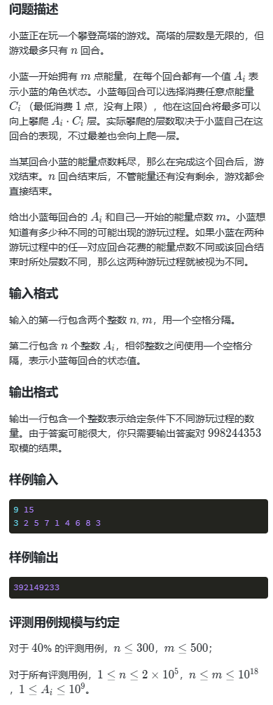
动态规划
8/20
```java
import java.util.Scanner;

  

public class Main {

  

    static final int MOD = 998244353;

  

    public static void main(String[] args) {

        Scanner scanner = new Scanner(System.in);

        int n = scanner.nextInt(); // n回合

        int m = scanner.nextInt(); // 初始有m点能量

        int[] A = new int[n + 1]; // 每回合角色状态

        for(int i = 1;i <= n;i++){

            A[i] = scanner.nextInt();

        }

        // 状态为ai，消耗能量k点，是"最多"可以向上爬 ai * k层，也可以不爬这么多在中间停下

        // 所以可能的情况是爬了 1, 2, 3, ..., ai * k 层

  

        // dp[i][j] 表示第 i 回合结束，共消耗了 j 点能量的方案数

        // dp[i][j] = dp[i - 1][k] * (j - k) * Ai  k -> [i - 1, j - 1]

        long[][] dp = new long[n + 1][m + 1];

        dp[0][0] = 1;

        // 每次爬的层数倒是比较不重要(上回合可能爬到的层数也不重要),因为能量消耗总是不同的

        // 直接乘起来就好

        long res = 0;

        // 回合

        for(int i = 1;i <= n;i++){

            // 到本层为止消耗的总能量数

            for(int j = i;j <= m;j++){

                // 到上一层为止消耗的总能量数

                for(int k = i - 1;k < j;k++){

                    dp[i][j] += (dp[i - 1][k] * ((j - k) % MOD) * (A[i] % MOD)) % MOD;

                }

                if(j == m || i == n) res += dp[i][j] % MOD;

            }

        }

        System.out.println(res % MOD);

        scanner.close();

    }

  

}
```
#### ★★★10.反异或01串
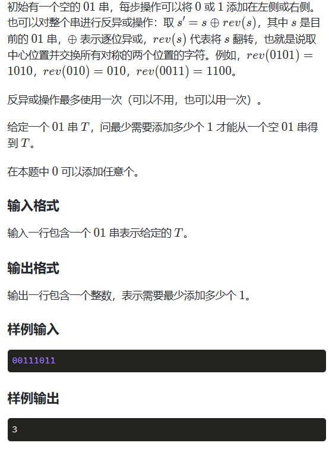
20/20
```java
import java.util.Scanner;

// 1:无需package

// 2: 类名必须Main, 不可修改

  

public class Main {

    public static void main(String[] args) {

        Scanner scan = new Scanner(System.in);

        // 反异或操作有一个特点，那就是产生的一定是回文串

        // 它是s和翻转的s做异或嘛 生成的第i个位置是 s i ^ s n - 1 - i

        // 对称的第n - 1 - i个位置是 s n - 1 - i ^ s i 是相同的

        // 这有什么意义呢， 假如一个字符串是回文串，它是偶数长度

        // 那么通过一个s，再相应的对称的两个位置中的1一个地方放一个1

        // 操作完就可以产生2个1

        // 如果它是奇数长度 中心如果是1是无法产生的，这时候看两边有多少个1

        // 中间是1加个1就好了

  

        // 那么我们先找含最多1的回文串，再进行操作就好了

  

        String num = scan.nextLine();

        char[] numArray = num.toCharArray();

        int n = numArray.length;

        int[] oneCount = new int[n + 1]; // 统计第i个位置1的个数，后面好算1的个数

        for(int i = 0;i < n;i++){

            if(numArray[i] == '1') oneCount[i + 1] = oneCount[i] + 1;

            else oneCount[i + 1] = oneCount[i];

        }

  

        // 找到能省最多1的子串 把省的1记录下来

        int maxSaved = 0;

        for(int i = 0;i < 2 * n;i++){

            int left = i / 2;

            int right = left + i % 2;

            while(left >= 0 && right < n && numArray[left] == numArray[right]){

                left--;

                right++;

            }

            left++;

            right--;

            if(right < left) continue;

            int haveOne = left == right ? numArray[left] - '0' : oneCount[right + 1] - oneCount[left];

            maxSaved = Math.max(maxSaved, haveOne / 2);

        }

  

        System.out.println(oneCount[n] -  maxSaved);

        scan.close();

    }

}
```
### 第十五届省赛真题
#### 1.劲舞团
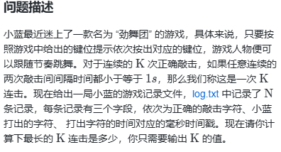
```java
import java.util.Scanner;  
// 1:无需package  
// 2: 类名必须Main, 不可修改  
  
public class Main {  
    public static void main(String[] args) {  
        Scanner scan = new Scanner(System.in);  
        // 每一回合对比 正确的与按下的按钮  
        // 错误 连击 -> 0  正确但超时 连击 -> 1  正确且未超时 -> +1        // 输入样例 h h 1709446139591  正确 按下 时间戳  
        String now =  scan.nextLine();  
        String[] tokens = now.split(" ");  
        int curr = tokens[0].equals(tokens[1]) ? 1:0; // 当前连击数  
        int max = curr; // 最大连击数  
        String preTime = tokens[2];  
        while (true) {  
            now = scan.nextLine();  
            if(now.equals("exit")) break;  
            tokens = now.split(" ");  
            if(tokens[0].equals(tokens[1])) {  
                if((Long.parseLong(tokens[2]) - Long.parseLong(preTime)) <= 1000) {  
                    curr++;  
                    max = Math.max(curr, max);  
                } else curr = 1;  
            } else curr = 0;  
            preTime = tokens[2];  
        }  
        System.out.println(max);  
        scan.close();  
    }  
}
```
#### ★★★2.召唤数学精灵
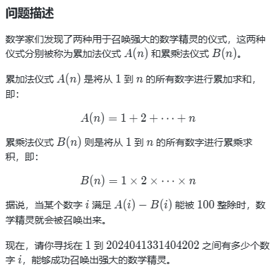
这个数字是非常大的，试了一下电脑是算不完的，那么这时候可以打印一些出来看看有没有规律，没有的话可能就得从数学上去解析了。
打印前100个
```java
public class Main {  
    public static void main(String[] args) {  
        int sum = 0;  
        int product = 1;  
        for(int i = 1;i <= 1000;i++){  
            sum = (sum + i) % 100;  
            product = (product * i) % 100;  
            if((sum - product) % 100 == 0){  
                System.out.println(i);  
            }  
        }  
    }  
}
```
这里要注意乘积可能会爆，多取模一下或者换long，一定要注意溢出问题。
输出为：1、3、24、175、199、200、224、375、399、400、424、575、599、600、624、775、799、800、824、975、999、1000
规律还是比较明显的，除了最开始的1,3，后面每200个数，就会有4个以24、75、99、00的数，
所以总数 / 200 \* 4 + 2 就是最后的答案了。
```java
System.out.println(2024041331404202L / 200 * 4 + 2);
```
#### 3.封闭图形个数
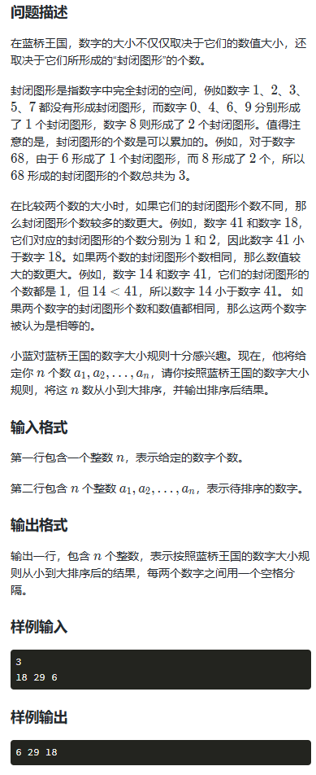
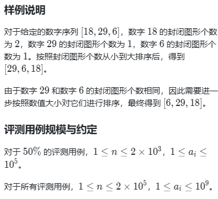
暴力，自定义比较器，先比较封闭图像个数，一样时再比较数值
10/10
注意输出格式，这题要求各个数字之间以空格分隔，之前还是一个换一行打印的出问题
然后注意一下接收整数的数组用了Integer\[ ]。这是因为在 Java 中，Arrays.sort(T\[ ] a, Comparator\<? super T> c) 这个方法要求传入的数组必须是引用类型（Object）的数组。
```java
import java.util.*;

// 1:无需package

// 2: 类名必须Main, 不可修改

  

public class Main {

    public static void main(String[] args) {

        Scanner scan = new Scanner(System.in);

        //在此输入您的代码...

        int n = scan.nextInt();

        Map<Integer, Integer> query = new HashMap<>();

        query.put(0, 1);

        query.put(1, 0);

        query.put(2, 0);

        query.put(3, 0);

        query.put(4, 1);

        query.put(5, 0);

        query.put(6, 1);

        query.put(7, 0);

        query.put(8, 2);

        query.put(9, 1);

        Integer[] nums = new Integer[n];

        for(int i = 0;i < n;i++){

            nums[i] = scan.nextInt();

        }

        Arrays.sort(nums, (num1, num2) -> compare(num1, num2, query));

        for(int i = 0;i < n - 1;i++){

            System.out.print(nums[i] + " ");

        }

        System.out.print(nums[n - 1]);

        scan.close();

    }

  

    private static int compare(int num1, int num2, Map<Integer, Integer> query){

        int curr1 = num1;

        int curr2 = num2;

        int sum1 = 0;

        int sum2 = 0;

        while(curr1 > 0){

            int now = curr1 % 10;

            sum1 += query.get(now);

            curr1 = (curr1 - now) / 10;

        }

        while(curr2 > 0){

            int now = curr2 % 10;

            sum2 += query.get(now);

            curr2 = (curr2 - now) / 10;

        }

        if(sum1 < sum2) return -1;

        else if(sum1 > sum2) return 1;

        else {

            return Integer.compare(num1, num2);

        }

    }

}
```
#### ★★★4.商品库存管理
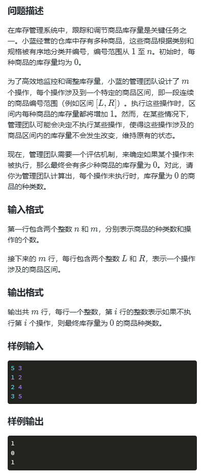
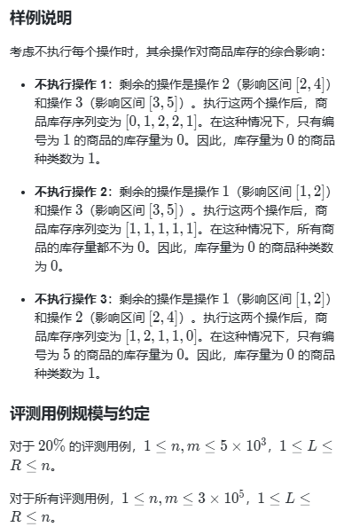
暴力
20/20
```java
import java.util.Scanner;

  

// 1:无需package

// 2: 类名必须Main, 不可修改

  

public class Main {

    public static void main(String[] args) {

        Scanner scan = new Scanner(System.in);

        // 想求如果不做某个操作，最终会有多少个商品的库存为0

        // 一个操作只能使得一个商品 + 1，那么找最后库存为1的商品

        // 再看看是哪个操作让它到1的就好了（库存为1的商品有几个在区间内）

        // 然后还要注意有一些一直没被操作，一直为0的，每次也都要加上

        int n = scan.nextInt();

        int m = scan.nextInt();

        int[] storage = new int[n];

        int[][] operations = new int[m][2];

        for (int i = 0; i < m; i++) {

            operations[i][0] =  scan.nextInt();

            operations[i][1] =  scan.nextInt();

            for (int j = operations[i][0] - 1; j < operations[i][1]; j++) {

                storage[j]++;

            }

        }

        int countZero = 0;

        for (int i = 0; i < n; i++) {

            if (storage[i] == 0) {

                countZero++;

            }

        }

        for (int i = 0; i < m; i++) {

            int sum = countZero;

            for (int j = operations[i][0] - 1; j < operations[i][1]; j++) {

                if (storage[j] == 1) {

                    sum++;

                }

            }

            System.out.println(sum);

        }

        scan.close();

    }

}
```

差分 + 前缀和优化
20/20
```java
import java.util.Scanner;

  

// 1:无需package

// 2: 类名必须Main, 不可修改

  

public class Main {

    public static void main(String[] args) {

        Scanner scan = new Scanner(System.in);

        // 想求如果不做某个操作，最终会有多少个商品的库存为0

        // 一个操作只能使得一个商品 + 1，那么找最后库存为1的商品

        // 再看看是哪个操作让它到1的就好了（库存为1的商品有几个在区间内）

        // 然后还要注意有一些一直没被操作，一直为0的，每次也都要加上

        int n = scan.nextInt();

        int m = scan.nextInt();

        // 差分优化统计最终库存

        // 定义最终库存为A[i] ，定义差分数据D[i] = A[i] - A[i - 1];

        // 那么A[i] = D[1] + D[2] + ... + D[i] (- A[0])

        // 这里定义 i [0, n] 位置0没用恒为0就是，可以把上面末尾的A[0]搞了

        // 那么你要让A[i] [L, R]范围内 + 1 让D[L]++ D[R + 1]--就可以了，复杂度降了一些

        int[] D = new int[n + 1];

        int[][] operations = new int[m + 1][2];

        for(int i = 1;i <= m;i++){

            operations[i][0] = scan.nextInt();

            operations[i][1] = scan.nextInt();

            D[operations[i][0]]++;

            if(operations[i][1] + 1 <= n)D[operations[i][1] + 1]--;

        }

  

        int[] storage = new int[n + 1];

        for(int i = 1;i <= n;i++){

            storage[i] = storage[i - 1] + D[i];

        }

  

        int countZero = 0;

        for (int i = 1; i <= n; i++) {

            if (storage[i] == 0) {

                countZero++;

            }

        }

  

        // 然后用一个统计到位置i的1的个数，可以简化后面操作区间内找1的速度(前缀和)

        int[] pathSum = new int[n + 1];

        for(int i = 1;i <= n;i++){

            if(storage[i] == 1) pathSum[i] = pathSum[i - 1] + 1;

            else pathSum[i] = pathSum[i - 1];

        }

        for (int i = 1; i <= m; i++) {

            System.out.println(countZero + pathSum[operations[i][1]] - pathSum[operations[i][0] - 1]);

        }

        scan.close();

    }

}
```
#### ★★★5.砍柴
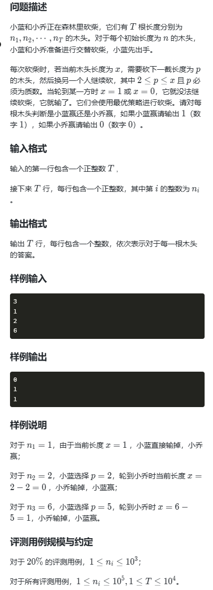
核心思路：动态规划。当前长度为1 or 0的时候就输了，所以如果能先手一刀劈到只剩1 or 0，那么就赢了。不过随着数大起来，可能没有这么刚好的质数，那么它的输赢该怎么判断呢？我们一刀一刀砍着会使长度减短，而短的时候输赢是比较好判断的，比如0,1,2，这里就引出了递推，如果我们砍到一个比较短的长度，这个长度是对面赢，那我们就输，但是如果我们能找到一个长度，砍完对面是输的，那么就是我们赢。所以对于一个长度，我们可以遍历所有能砍的，只要有一种情况砍完之后对面是输的，那么我们就赢了，否则记为我们输。
20/20
```java
import java.util.Scanner;

// 1:无需package

// 2: 类名必须Main, 不可修改

  

public class Main {

    public static void main(String[] args) {

        Scanner scan = new Scanner(System.in);

        int t = scan.nextInt();

        int[] nums = new int[t];

        int max = 0;

        for(int i = 0;i < t;i++){

            nums[i] = scan.nextInt();

            max = Math.max(max, nums[i]);

        }

        // 存放2-max中的所有质数

        int[] tool = new int[max + 1];

        int length = fillTool(max, tool); // tool的实际长度

        boolean[] dp = new boolean[max + 1]; // 标识当前长度为i时先手是输还是赢

        for(int i = 2;i <= max;i++){

            for(int j = 0;j < length;j++){

                if(tool[j] > i) break;

                if(!dp[i - tool[j]]){

                    dp[i] = true;

                    break;

                }

            }

        }

        for(int i = 0;i < t;i++){

            if(dp[nums[i]]) System.out.println(1);

            else System.out.println(0);

        }

        scan.close();

    }

  

    private static boolean judge(int num){

        for(int i = 2;i * i <= num;i++){

            if(num % i == 0) return false;

        }

        return true;

    }

  

    private static int fillTool(int max, int[] tool){

        int length = 0;

        for(int i = 2;i <= max;i++){

            if(judge(i)){

                tool[length] = i;

                length++;

            }

        }

        return length;

    }

}
```
#### ★★★6.回文字符串
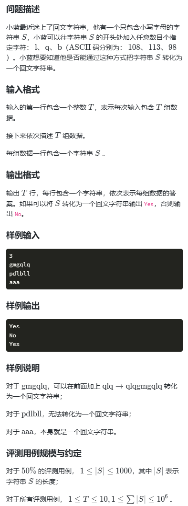
题解中看到一个更好的思路：在前面可以补l、q、b，既然目的是为了配成回文字符串，那么前面加的肯定是和后面配对的，那么就相当于可以再字符串的末尾删除l、q、b（配对好了），那么看删完剩下的是不是回文字符串，是的话就可以。如果一直删到非l、q、b字符，还是回文不了，那么就不行。

我的思路比较不好想，因为也是试出来的。既然前面可以加l、q、b，并且要构成回文，那么字符串大概率是\[l、q、b字符]\[非l、q、b字符]\[l、q、b字符]这三部分。
非l、q、b字符是操作不了的，如果不是回文就搞不了。是回文就看前面和后面l、q、b部分了，只要前面的l、q、b字符比较少，并且后面有和前面搭配的部分就好了，这部分也是改变不了的，有就可以，没有也操作不了。之外的情况就可以补l、q、b达到回文。
20/20
```java
import java.util.Scanner;

// 1:无需package

// 2: 类名必须Main, 不可修改

  

public class Main {

    public static void main(String[] args) {

        Scanner scan = new Scanner(System.in);

        int t = scan.nextInt();

        scan.nextLine();

        // 有lqb之外的那个最长的子串必须是回文串，不是就不行

        // 然后判断 这个最长的子串的左边再右边有没有  没有也不行

        for(int i = 0;i < t;i++){

            String s = scan.nextLine();

            char[] sArray = s.toCharArray();

            int begin = -1;

            int end = -1;

            for(int j = 0;j < sArray.length;j++){

                if(sArray[j] == 'l' || sArray[j] == 'q'|| sArray[j] == 'b') continue;

                if (begin == -1) begin = j;

                end = j;

            }

            if(begin == -1 || judge(sArray, begin, end)) System.out.println("Yes");

            else System.out.println("No");

        }

        scan.close();

    }

  

    private static boolean judge(char[] sArray, int begin, int end){

        if(begin > sArray.length - 1 - end) return false; // 子串左边比右边多，怎么也不可能到回文串

  

        int left = begin;

        int right = end;

        while(left <= right){

            if(sArray[left] != sArray[right]) return false;

            left++;

            right--;

        }

        left = begin - 1;

        right = end + 1;

        while(left >= 0){

            if(sArray[left] != sArray[right]) return false;

            left--;

            right++;

        }

        return true;

    }

}
```
#### 7.最大异或节点
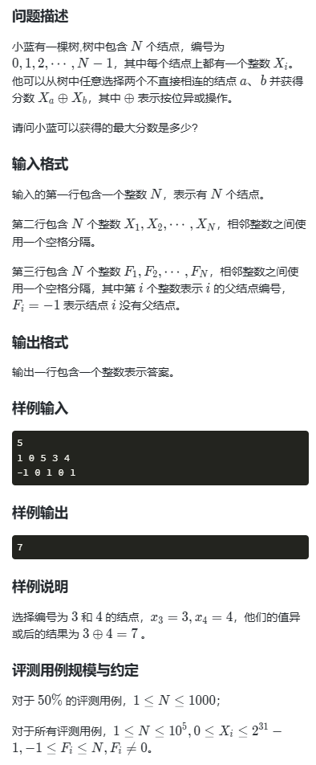
暴力写的，遍历各种节点组合（两两），如果异或值比最大值大的话，看看它们相连不相连，不相连就更新最大值。
15/20
```java
import java.util.Scanner;

// 1:无需package

// 2: 类名必须Main, 不可修改

  

public class Main {

    public static void main(String[] args) {

        Scanner scan = new Scanner(System.in);

        int n = scan.nextInt();

        int[][] points = new int[n][2];

        // 节点值

        for(int i = 0;i < n;i++){

            points[i][0] = scan.nextInt();

        }

        // 节点的父节点

        for(int i = 0;i < n;i++){

            points[i][1] = scan.nextInt();

        }

  

        int max = 0;

        for(int i = 0;i < n - 1;i++){

            for(int j = i + 1;j < n;j++){

                if((points[i][0] ^ points[j][0]) > max){

                    if(!judge(i, j, points[i][1], points[j][1])){

                        max = points[i][0] ^ points[j][0];

                    }

                }

            }

        }

        System.out.println(max);

        scan.close();

    }

  

    private static boolean judge(int i, int j, int iFather, int jFather){

        if(iFather == jFather) return true;

        if(iFather ==  j || jFather ==  i) return true;

        return false;

    }

}
```
#### ★★★8.植物生命力
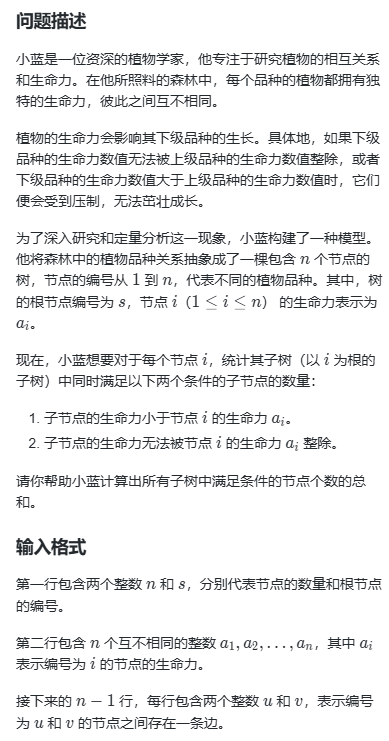
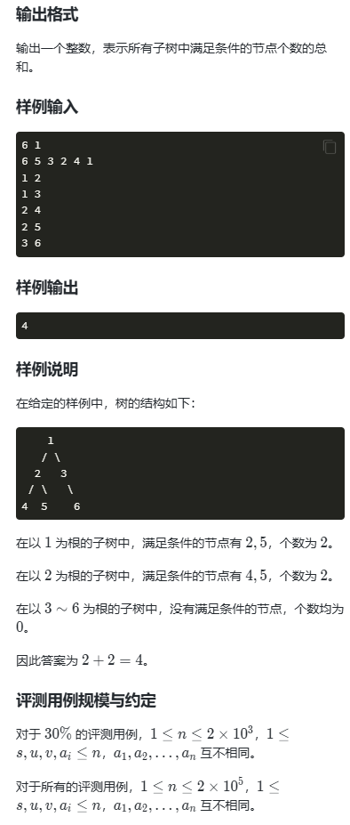
暴力
6/20
```java
import java.util.*;

// 1:无需package

// 2: 类名必须Main, 不可修改

  

public class Main {

  

    // 定义变量的时候好像不加private可以，加了反而会有波浪线

    static int[] a;

    static List<Integer>[] graph; // 无向图，表示第i个节点与哪些节点之间有边

    static List<Integer>[] tree; // 树，存放一个节点的子节点

  

    static int sum = 0; // 答案

  

    public static void main(String[] args) {

        Scanner scan = new Scanner(System.in);

        int n = scan.nextInt(); // 节点数量

        int s = scan.nextInt(); // 根节点编号

        a = new int[n + 1]; // 各节点生命力

        for (int i = 1; i <= n; i++) {

            a[i] = scan.nextInt();

        }

        // 这题比较关键的一点是建树，题目中给的u,v代表u，v直接有一条边，而不是u->v

        // 无法确定节点的父子关系，所以只能建立起一个无向图

        // 然后根据无向图从根节点开始一个个往下走，可以建立起树（有向图）

        graph = new ArrayList[n + 1];

        tree = new ArrayList[n + 1];

        // 初始化

        for (int i = 1; i <= n; i++) {

            graph[i] = new ArrayList<>();

            tree[i] = new ArrayList<>();

        }

        // 建立无向图

        for (int i = 0; i < n - 1; i++) {

            int u = scan.nextInt();

            int v = scan.nextInt();

            graph[u].add(v);

            graph[v].add(u);

        }

  

        // 建树

        buildTree(s, -1);

  

        // 遍历

        for (int i = 1; i <= n; i++) {

            bfs(i);

        }

  

        System.out.println(sum);

        scan.close();

    }

  

    private static void buildTree(int i, int parent){

        for(int child : graph[i]){

            if(child == parent) continue;

            tree[i].add(child);

            buildTree(child, i);

        }

    }

  

    private static void bfs(int i){

        Queue<Integer> queue = new LinkedList<>();

        queue.add(i);

        while (!queue.isEmpty() ){

            int cur = queue.poll();

            for (int child : tree[cur]){

                queue.add(child);

                if(a[child] < a[i] && a[i] % a[child] != 0) sum++;

            }

        }

    }

  

}
```
优化
前置知识：树状数组
树状数组主要用来快速求区间和（a2+a3+a4 这样）
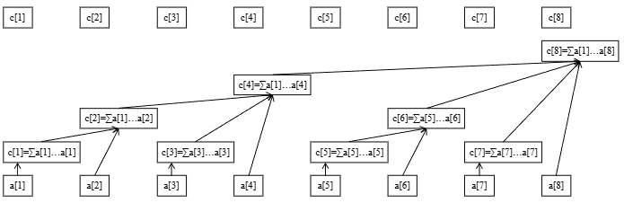
每个位置\[i]管理着\[i - 2<sup>k</sup> + 1, i]区间上2<sup>k</sup>个元素。这个2<sup>k</sup>是二进制中最低位的1及后面的0所构成的十进制数，比如3->11 那么就此时2<sup>k</sup> = 1；6 ->110 那么此时2<sup>k</sup> = 2
一个数2<sup>k</sup>求法
```java
// 计算 lowbit 
private int lowbit(int x) { 
	return x & -x; 
}
```
那么查询前缀和也比较清楚了，传入末尾那个数，找到对应的c\[x]然后再跳到它管的那些元素的之外的下一个c\[x']再加，一直到index = 0为止。
```java
// 查询前缀和 
public int query(int index) { 
	int sum = 0; 
	while (index > 0) { 
		sum += bit[index]; 
		index -= lowbit(index); 
	} 
	return sum; 
}
```
更新操作
```java
// 更新操作 
public void update(int index, int val) { 
	while (index < bit.length) { 
		bit[index] += val; 
		index += lowbit(index); 
	} 
}
```
这里稍微绕了一点，当前位置肯定是管它的那个位置的lowbit，那么加上自己就可以到管自己这个位置的那个地方，更新一下这里。除此之外没有别的位置会包含它（省略证明）。

再回到本题，题目想求的是各个节点a<sub>root</sub>子节点a<sub>i</sub>中满足条件
1.a<sub>root</sub> >  a<sub>i</sub>  2.a<sub>root</sub> % a<sub>i</sub> != 0 的节点。
求一个节点的子节点其实是比较不好求的，整棵树建好才知道，而且建好了之后也要一个个子节点遍历其实。但是求一个节点的父节点是好求的，前面走过的就是其父节点。
那么可以反向思考一下，对于每个子节点，求满足要求的父节点有多少。然后利用树状数组以节点的活力值为索引，每次+1，回溯的时候-1。然后查询大于a<sub>i</sub>范围的区间和再减去是a<sub>i</sub>整数倍的活力值的数量，就可以比较快的算出答案了。

```java
import java.util.*;

  

public class Main {

  

    static final int N = 200001;

    static int[] treeArray = new int[N]; // 树状数组

    static ArrayList<Integer>[] graph; // 无向图

    static long sum = 0; // 答案

    static int[] a;  // 各节点活力值

    static int n;

  

    public static void main(String[] args) throws Exception {

        Scanner scan = new Scanner(System.in);

        n = scan.nextInt(); // 节点数量

        int s = scan.nextInt(); // 根节点编号

  

        // 存储各节点活力值

        a = new int[n + 1];

        for (int i = 1; i <= n; i++) {

            a[i] = scan.nextInt();

        }

  

        // 无向图（连接情况）

        graph = new ArrayList[n + 1];

        for (int i = 1; i <= n; i++) {

            graph[i] = new ArrayList<>();

        }

        for (int i = 0; i < n - 1; i++) {

            int u = scan.nextInt();

            int v = scan.nextInt();

            graph[u].add(v);

            graph[v].add(u);

        }

  

        // 遍历

        dfs(s, -1);

  

        System.out.println(sum);

    }

  

    // lowBit

    private static int calLowBit(int i){

        return i & -i;

    }

  

    // 单点更新

    private static void update(int i, int val){

        int index = i;

        while (index <= n) {

            treeArray[index] += val;

            index += calLowBit(index);

        }

    }

  

    // 查前缀和

    private static int query(int i){

        int sum = 0;

        int index = i;

        while(index > 0){

            sum += treeArray[index];

            index -= calLowBit(index);

        }

        return sum;

    }

  

    // [begin, end]

    private static int queryInInterval(int begin, int end){

        return query(end) - query(begin - 1);

    }

  

    private static void dfs(int i, int parent){

        //加上对应当前节点，符合要求的父节点

        sum += queryInInterval(a[i] + 1, n);

        for(int j = 2 * a[i];j <= n;j += a[i]){

            sum -= queryInInterval(j, j);

        }

        update(a[i], 1);

        for(int child : graph[i]){

            if (child == parent) continue;

            dfs(child, i);

        }

        update(a[i], -1);

    }

  
  

}
```
### 第十六届省赛真题
#### 1.数位倍数
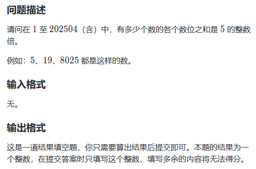
```java
import java.util.Scanner;
//1:无需package
//2: 类名必须Main, 不可修改

public class Main {
 public static void main(String[] args) {
	 int res = 0;
     for(int i = 1;i <= 202504;i++) {
    	 if(judge(i)) res++;
     }
     System.out.println(res);
 }
 
 private static boolean judge (int num) {
	 int sum = 0;
	 while(num > 0) {
		 sum += num % 10;
		 num /= 10;
	 }
	 return sum % 5 == 0;
 }
}
```
#### ★★★2.IPv6
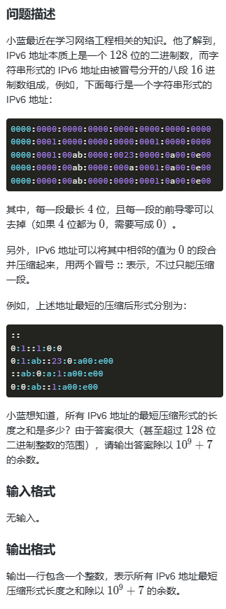
```java
import java.util.*;

//1:无需package

//2: 类名必须Main, 不可修改

  

public class Main {

 static final int N = 1000000007;

 static long total;

 static long canSub;

 static long[] kindForEachLength;

 public static void main(String[] args) {

     Scanner scan = new Scanner(System.in);

     // 题目要求IPv6最短压缩形式长度之和

     // -> 转化为不用::压缩时的长度 - ::压缩能对当前段缩减的最大长度

     // 初始化

     total = 0;

     canSub = 0;

     // 一段可能的长度为0（特指全0）、1、2、3、4

     // 各种长度可能的情况 

     // 0 -> 1

     // 1 -> 15

     // 2 -> 15 * 16 = 240

     // 3 -> 15 * 16 * 16 = 3840

     // 4 -> 15 * 16 * 16 * 16 = 61440

     kindForEachLength = new long[5];

     kindForEachLength[0] = 1;

     kindForEachLength[1] = 15;

     kindForEachLength[2] = 240;

     kindForEachLength[3] = 3840;

     kindForEachLength[4] = 61440;

     calSum(0, 0, 1, 0);

     calSub(0, 1, new int[8]);

     System.out.println((total - canSub + N) % N);

     scan.close(); 

 }

 // 求不用::压缩时的长度之和

 // 每一段尝试可能的长度，然后把其可能数乘上去

 // i 设置好几段了   length 当前长度   kind 这个长度有多少种可能  zeroCount 有多少个全零段

 private static void calSum(int i, int length, long kind, int zeroCount) {

   if (i == 8) {

     total = (total + (length + zeroCount + 7) * kind) % N;

     return;

   }

   // 当前这一段可以选择长度0-4

   for(int j = 0;j <= 4;j++) {

     calSum(i + 1, length + j, (kind * kindForEachLength[j]) % N, j == 0 ? zeroCount + 1 : zeroCount);

   }

 }

 // 为了更好理解这里用两个函数计算，其实可以合并到一起。后面放合并在一起的代码

 // 求用上::能够删除的最大长度之和

 // 设一共用sum段连0，如果这段连0在中间，那么可以减少sum + sum - 1个字符

 // 如果这段连0在两端，那么可以减少sum + sum - 2个字符

 // 全0时减少13个字符

 // i 设置好几段了   kind 这个长度有多少种可能  length 记住各段长度 

 private static void calSub(int i, long kind, int[] length) {

  if (i == 8) {

    // 计算能删除的最大长度

    int begin = -1; // 当前连0起始位置

    long del = 0; // 能删除的最大长度

    int sum = 0; // 连续0的段数

    int zeroCount = 0;

    for(int j = 0;j < 8;j++) {

      if (length[j] == 0) {

        zeroCount++;

        if(j == 0 || length[j - 1] != 0) {

          begin = j;

          sum = 1;

        } else {

          sum++;

        }

        if(begin == 0 || j == 7) {

          // 在边缘如果只有一个0的话是省不了的   0:1  ->x ::1

          if (sum > 1) {

            del = Math.max(del, 2 * sum - 2);

          }

        }

        else del = Math.max(del, 2 * sum - 1);

      }

    }

    if(zeroCount == 8) {

      canSub = (canSub + kind * 13) % N;

    } else {

      canSub = (canSub + kind * del) % N;

    }

    return;

  }

  for(int j = 0;j <= 4;j++) {

    length[i] = j;

    calSub(i + 1, (kind * kindForEachLength[j]) % N, length);

  }

 }

}

  

//import java.util.Scanner;

////1:无需package

////2: 类名必须Main, 不可修改

//

//public class Main {

//  // 定义常量

//  static final int N = 10;

//  static final int MOD = 1_000_000_007;

//

//  // a[i] 表示：第 i 段选择的长度为 a[i]

//  static long[] a = new long[N];

//  // f[i] 表示：每一小段中，长度为 i 时，一共有多少种情况

//  static long[] f = new long[N];

//  static long ret = 0;

//

//  public static void dfs(int id) {

//      // 前面位置的长度已经选好

//      if (id > 8) {

//          long len = 0;

//          long cnt = 1; // 长度为 len，一共有多少个

//          // 0 出现个数，需要删的长度，连续 0 的个数

//          long zero = 0, del = 0, sum = 0;

//

//          for (int i = 1; i <= 8; i++) {

//              len += a[i]; // 统计长度

//              cnt = (cnt * f[(int) a[i]]) % MOD; // 统计出现个数

//

//              // 计算出最长的零

//              if (a[i] == 0) {

//                  zero++;

//                  if (i >= 2 && a[i - 1] == 0) {

//                      sum++;

//                  } else {

//                      sum = 1;

//                  }

//

//                  int prev = i - (int) sum + 1; // 这一段 0 第一次出现的位置

//                  // 计算 : 需要删几个

//                  if (prev == 1 || i == 8) { // 边缘位置

//                      if (sum > 1) {

//                          del = Math.max(del, sum + Math.max(0L, sum - 2));

//                      }

//                  } else { // 中间位置

//                      del = Math.max(del, sum + sum - 1);

//                  }

//              } else {

//                  // 如果当前不是0，重置连续0的计数

//                  sum = 0;

//              }

//          }

//

//          if (zero == 8) {

//              del = 13; // 8 段均为 0，删的长度为 13

//          }

//

//          len = len + zero - del + 7;

//          ret = (ret + (len % MOD) * cnt % MOD) % MOD;

//

//          return;

//      }

//

//      // 递归尝试每个位置的长度（0到4）

//      for (int i = 0; i <= 4; i++) {

//          a[id] = i;

//          dfs(id + 1);

//      }

//  }

//

//  public static void main(String[] args) {

//      // 初始化数组 f

//      f[0] = 1;

//      f[1] = 15;

//      f[2] = 15 * 16;

//      f[3] = f[2] * 16;

//      f[4] = f[3] * 16;

//

//      // 开始搜索

//      dfs(1);

//

//      // 输出结果

//      System.out.println(ret);

//  }

//}
```
#### 3.变换数组
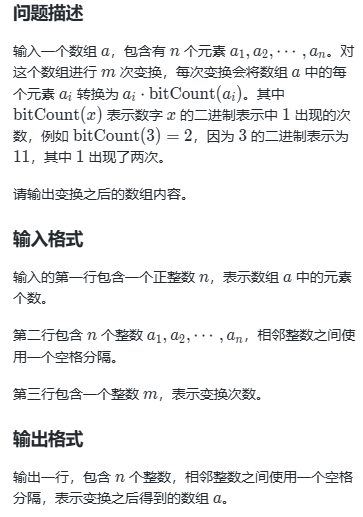
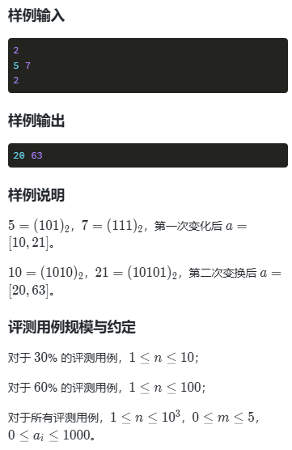
模拟
20/20
```java
import java.util.Scanner;

//1:无需package

//2: 类名必须Main, 不可修改

  

public class Main {

 public static void main(String[] args) {

     Scanner scan = new Scanner(System.in);

     //在此输入您的代码...

     int n = scan.nextInt();

     long[] a = new long[n];

     for(int i = 0;i < n;i++) {

       a[i] = scan.nextInt();

     }

     int m = scan.nextInt();

     for(int i = 0;i < m;i++) {

       for(int j = 0;j < n;j++) {

         a[j] = a[j] * bitCount(a[j]);

       }

     }

     for(int i = 0;i < n - 1;i++) {

       System.out.print(a[i] + " ");

     }

     System.out.print(a[n - 1]);

     scan.close();

 }

 private static int bitCount(long num) {

   int sum = 0;

   while(num > 0) {

     if (num % 2 == 1)sum++;

     num /= 2;

   }

   return sum;

 }

}
```
#### ★★★4.最大数字
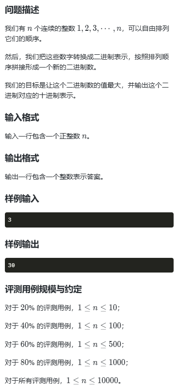
API补充
BigInteger  用来处理超大整数(比long还大)
```java
// 高精度算术运算
add(BigInteger) // +
subtract(BigInteger) // -
multiply(BigInteger) // x
divide(BigInteger) // /
mod(BigInteger) // %
// 位运算
and() // 与
or()  // 或
xor() // 异或
not() // 非
setBit(int n) // 设置某一位的bit为0或1
testBit(int n) // 看某一位的bit是0还是1
bitCount() // 返回二进制中1的个数
// 进制转换
// 2 -> 10
BigInteger result = new BigInteger(sb.toString(), 2); // 2表示输入的是2进制
// 16 -> 32
String hex = "FFFF"; 
BigInteger bi = new BigInteger(hex, 16); 
System.out.println(bi.toString(32)); 
```
其他
```java
// 整数 -> 二进制字符串
Integer.toBinaryString(i); 
// 字符串 在按字典序比大小   从头到尾依次比较字符的Unicode 值  '1' > '0'  'a' > 'b'
// 调用对象的字典序在前（更大）返回正数，否则返回负数
StringA.compareTo(StringB);
```
20/20
```java
import java.util.*;

import java.math.BigInteger;

  

public class Main {

    public static void main(String[] args) {

        Scanner scan = new Scanner(System.in);

        // 先把数 -> 二进制字符串

        // 然后自定义一个比较器 如果 A + B > B + A 那么就让A排前面

        // 然后这个还是有传递性的  如果A放在B前面比B放在A前面好，且B放在C前面比C放在B前面好

        // 那么A放在C前面就比C放在A前面好（实际上比的就是前面谁的1更多）

        // 所以这样排序完之后不会有两两交换使得组成的二进制字符串更大，排完拼一起就是最大的

        int n = scan.nextInt();

        String[] binaryStrings = new String[n];

        for (int i = 1;i <= n;i++) {

          binaryStrings[i - 1] = Integer.toBinaryString(i);

        }

        Arrays.sort(binaryStrings, (a, b) -> (b + a).compareTo(a + b));

        StringBuilder sb = new StringBuilder();

        for (int i = 0;i < n;i++) {

          sb.append(binaryStrings[i]);

        }

        BigInteger res = new BigInteger(sb.toString(), 2);

        System.out.println(res);

    }

}
```
#### ★★★5.小说
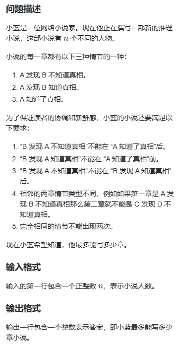
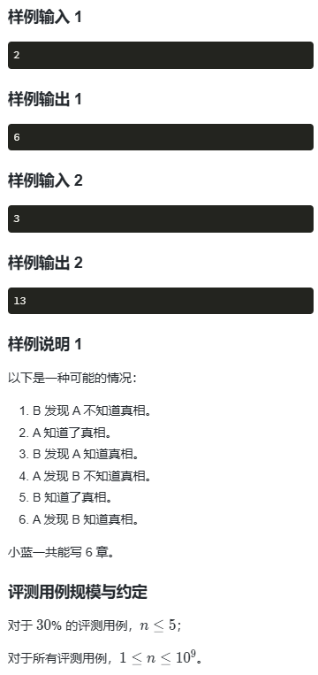
题解
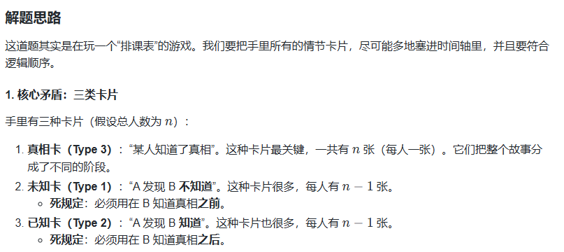
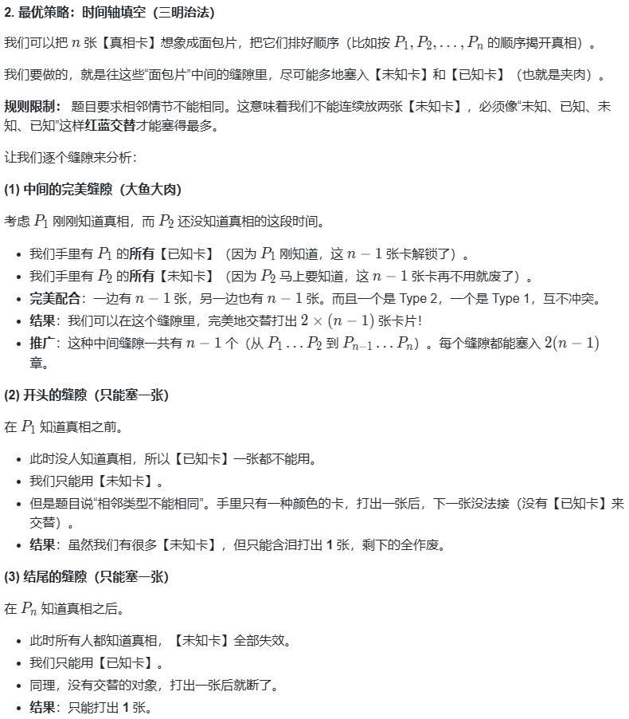
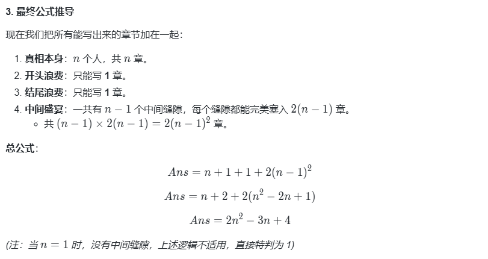
```java
import java.util.Scanner;

// 1:无需package

// 2: 类名必须Main, 不可修改

  

public class Main {

    public static void main(String[] args) {

        Scanner scan = new Scanner(System.in);

        long n = scan.nextInt();

        if(n == 1) System.out.println(1);

        else {

          long res = n + 1 + 1 + 2 * (n - 1) * (n - 1);

          System.out.println(res);

        }

    }

}
```
#### 6.01串
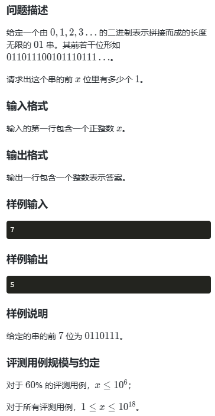
19/20
```java
import java.util.Scanner;

//1:无需package

//2: 类名必须Main, 不可修改

  

public class Main {

 public static void main(String[] args) {

     // 做过一题动态规划是求1-n中的各个数里面有几个1 所以这个我是很会求的

     // 下面是基于这个进行的

     // 每个数对应的二进制位有多长是可以求的，下面是我的做法，边迭代边更新

     // 定义j为当前数二进制长度，那么当i >= Math.pow(2, j), 

     // 也就是遇到100..00 这样的，二进制位多1位的时候，把j + 1

     // 然后遍历的时候也同时算到前一个数的1的总和

     // 然后当二进制总位数大于x时，就终止遍历，

     // 有多少个1 = 到前面一个数为止1的总和 + 当前这个数剩下的位置有几个1，注意要算开头就可以了

     Scanner scan = new Scanner(System.in);

     long x = scan.nextLong();

     scan.close();

     int count = 1; // 到数字i二进制总长度

     int[] dp = new int[40000000]; // 数字i中1的个数

     // dp[0] = 0;

     int oneCount = 0; // 到上一个数字为止1的总数

     long j = 1; // 当前数二进制长度

     int lastNumber = 0;

     for (int i = 1;i < 40000000;i++) {

       if (i >= Math.pow(2, j)) {

         j++;

       }

       if (count + j >= x) {

         // 到当前数，二进制长度已经够了

         lastNumber = i;

         break;

       }

       count += j;

       if (i % 2 == 0) {

         dp[i] = dp[i / 2];

       } else {

         dp[i] = dp[i - 1] + 1;

       }

       oneCount += dp[i];

     }

     // 看看剩下的几位里面有几个1

     long leave = x - count;

     for(long i = 0;i < j;i++) {

       if(j - i <= leave && lastNumber % 2 == 1) {

         oneCount++;

       }

       lastNumber /= 2;

     }

     System.out.println(oneCount);

 }

}
```
#### ★★★7.甘蔗
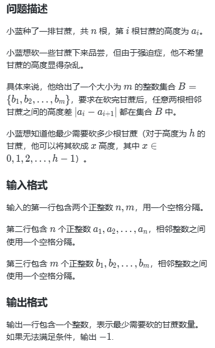
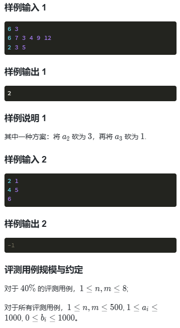
题解
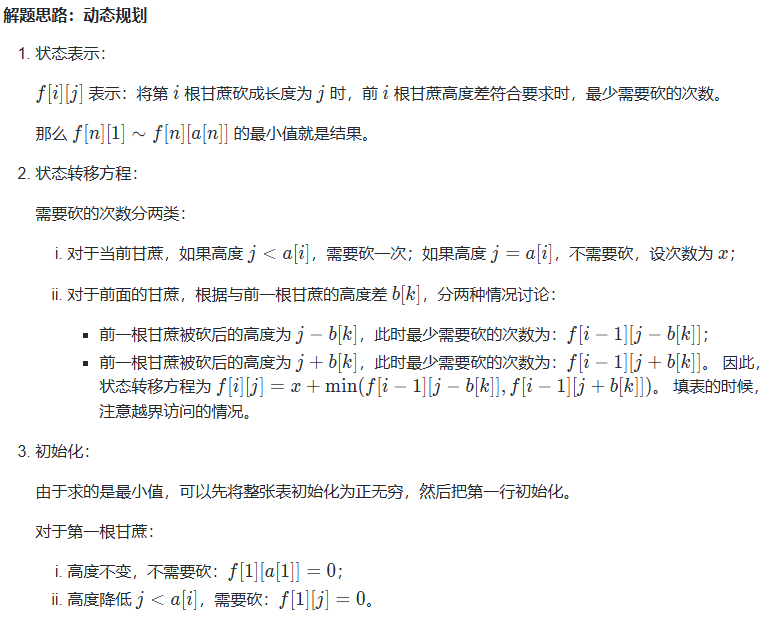
20/20
```java
import java.util.Arrays;

import java.util.Scanner;

//1:无需package

//2: 类名必须Main, 不可修改

  

public class Main {

 public static void main(String[] args) {

     Scanner scan = new Scanner(System.in);

     // 马后炮来说 看当前的甘蔗时需要看前一根

     // 然后一直到当前甘蔗砍的最小值也和前面息息相关

     // 前面是子问题，那么就要想到动态规划

     int n = scan.nextInt(); // 甘蔗数量n根

     int m = scan.nextInt(); // 高度差集合大小

     int[] a = new int[n]; // 甘蔗高度

     int hightMax = 0; // 高度最大值

     for(int i = 0;i < n;i++) {

       a[i] = scan.nextInt();

       hightMax = Math.max(a[i], hightMax);

     }

     int[] b = new int[m]; // 允许高度差集合

     for(int i = 0;i < m;i++) {

       b[i] = scan.nextInt();

     }

     // 定义dp[i][j]表示第i甘蔗砍到高度j时，各个甘蔗高度差都符合要求所要砍的最小数量

     // 那么dp[n - 1][0 - a[i]] 中的最大值就是所求

     int[][] dp = new int[n][hightMax + 1]; 

     //递推关系

     // dp[i][j] = dp[i - 1][j +- 各种b[i]] 中的最小值 + 1 or 0 j < 当前高度就 + 1

     // 先都初始化为一个大值

     for(int i = 0;i < n;i++) {

       for(int j = 0;j <= hightMax;j++) {

         dp[i][j] = n + 1;  // n + 1就是不可能了

       }

     }

     // 第一根甘蔗初始化 

     for(int j = 0;j < a[0];j++) {

       dp[0][j] = 1;

     }

     dp[0][a[0]] = 0;

     for(int i = 1;i < n;i++) {

       for(int j = 0;j <= a[i];j++) {

         dp[i][j] = j == a[i] ? 0:1;  // 先初始化一下当前位置要不要砍，后面加上前面砍的最小次数就行

         int min = n + 1;

         for(int k = 0;k < m;k++) {

           if(j + b[k] <= a[i - 1] && dp[i - 1][j + b[k]] < min) {

             min = dp[i - 1][j + b[k]];

           }

           if(j - b[k] >= 0 && j - b[k] <= a[i] && dp[i - 1][j - b[k]] < min) {

             min = dp[i - 1][j - b[k]];

           }

         }

         dp[i][j] += min;

       }

     }

     int res = n + 1;

     for(int j = 0;j <= a[n - 1];j++) {

       res = Math.min(res, dp[n - 1][j]);

     }

     if (res >= n + 1) System.out.println(-1);

     else System.out.println(res);

     scan.close();

 }

}
```
#### ★★★8.原料采购
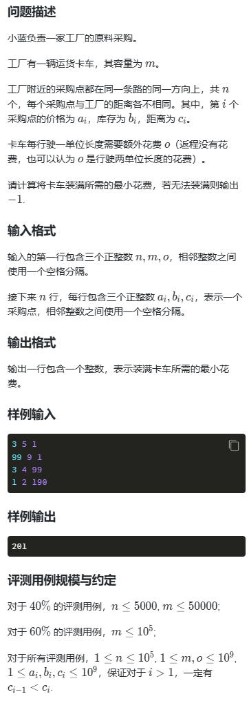
自己写的
也是贪心的思想，不过实现方式上可以改进
10/20
```java
import java.util.*;

//1:无需package

//2: 类名必须Main, 不可修改

  

class ListNode{

   int a; // 价格

   int b; // 库存

   ListNode next;

   public ListNode() {

    // TODO Auto-generated constructor stub

  }

   public ListNode(int a, int b) {

     this.a = a;

     this.b = b;

   }

}

  

public class Main {

 public static void main(String[] args) {

     Scanner scan = new Scanner(System.in);

     //在此输入您的代码...

     int n = scan.nextInt(); // n个站点

     int m = scan.nextInt(); // 卡车容量为m

     int o = scan.nextInt(); // 行驶一单位长度的花费

  

     // 计算到每一个站点，装满车所需花费的最小值

     // 那么其中的最小值就是所求了

     // 每个站点的最小值 = 最便宜的m个货物的价格 + 距离 * o

     long cost = Long.MAX_VALUE; // 当前最小花费

     long storage = 0; // 到当前站点可以买的货物总量

     ListNode dummy = new ListNode();

     for (int i = 0;i < n;i++) {

       int a = scan.nextInt(); // 价格

       int b = scan.nextInt(); // 库存

       int c = scan.nextInt(); // 距离

       storage += b;

       ListNode curr = dummy.next;

       ListNode pre = dummy;

       ListNode now = new ListNode(a, b);

       while(curr != null) {

         // 当前节点的价格更贵，往后挪挪

         if(curr.a >= a) {

           pre.next = now;

           now.next = curr;

           break;

         }

         pre = curr;

         curr = curr.next;

       }

       // 到最后了没找到更贵的，那么它就是最贵的，排最后

       if(curr == null) {

         pre.next = now;

       }

       if(storage >= m) {

         // 可以买满了，记录一下到这个站点的最低价格

         curr = dummy.next;

         long currCost = c * o; // 当前花费

         int buy = 0; // 当前买了多少了

         while (curr != null) {

           if (curr.b < m - buy) {

             buy += curr.b;

             currCost += curr.a * curr.b;

           } else {

             currCost += (m - buy) * curr.a;

             break;

           }

           curr = curr.next;

         }

         cost = Math.min(cost, currCost);

       }

     }

     if(storage >= m)System.out.println(cost);

     else System.out.println(-1);

     scan.close(); 

 }

}
```
参考题解
反悔贪心 + 优先队列
```java
// 优先队列定义，可以用lambda表达式传入自定义比较器
PriorityQueue<T> pq = new PriorityQueue<>();
```
注意
```java
转long的话不要  (long)(a * b) 
这样会先算a * b再转long，算a * b可能就溢出了
 (long) a * b就好，把a转成long，运算的时候b也就转成long了
```
20/20
```java
import java.util.PriorityQueue;

import java.util.Scanner;

//1:无需package

//2: 类名必须Main, 不可修改

  

public class Main {

 public static void main(String[] args) {

   // 贪心：到每个点，买最便宜的货物 + 运价

   // 那么各个点凑到容量m中的最小值，就是所求。

   // 可以借助优先队列用反悔贪心实现

   // 也就是到每个点，算一下运费，然后把当前点的所有货物买入

   // 然后把超过容量m的贵的货物给退了就好

     Scanner scan = new Scanner(System.in);

     int n = scan.nextInt(); // 采购点数量

     int m = scan.nextInt(); // 卡车容量

     int o = scan.nextInt(); // 单位长度油费

     long res = Long.MAX_VALUE; // 当前买够m的最小花费

     long cost = 0; // 当前买货物的最小花费

     int storage = 0; // 买了多少了

     // 优先队列，存放[价格, 买了多少] 按价格降序排序

     PriorityQueue<int[]> pq = new PriorityQueue<>((buy1, buy2) -> Integer.compare(buy2[0], buy1[0])); 

     for (int i = 0;i < n;i++) {

       int a = scan.nextInt(); // 当前站点价格

       int b = scan.nextInt(); // 库存

       int c = scan.nextInt(); // 距离

       cost += (long)a * b; // 到当前站点的油费 + 直接买入当前站点的所有物品

       storage += b;

       pq.add(new int[]{a,b});

       while (!pq.isEmpty() && storage > m) {

         int[] dear = pq.poll();

         if (storage - dear[1] >= m) {

           cost -= (long)dear[0] * dear[1];

           storage -= dear[1];

         } else {

           int back = storage - m; // 这时候退一部分就好了

           cost -= (long)dear[0] * back;

           storage = m;

           pq.add(new int[]{dear[0], dear[1] - back});

         }

       }

       if(storage == m) {

           res = Math.min(res, (long)c * o + cost);

       }

     }

     if(storage == m) System.out.println(res);

     else System.out.println(-1);

     scan.close();

 }

}
```